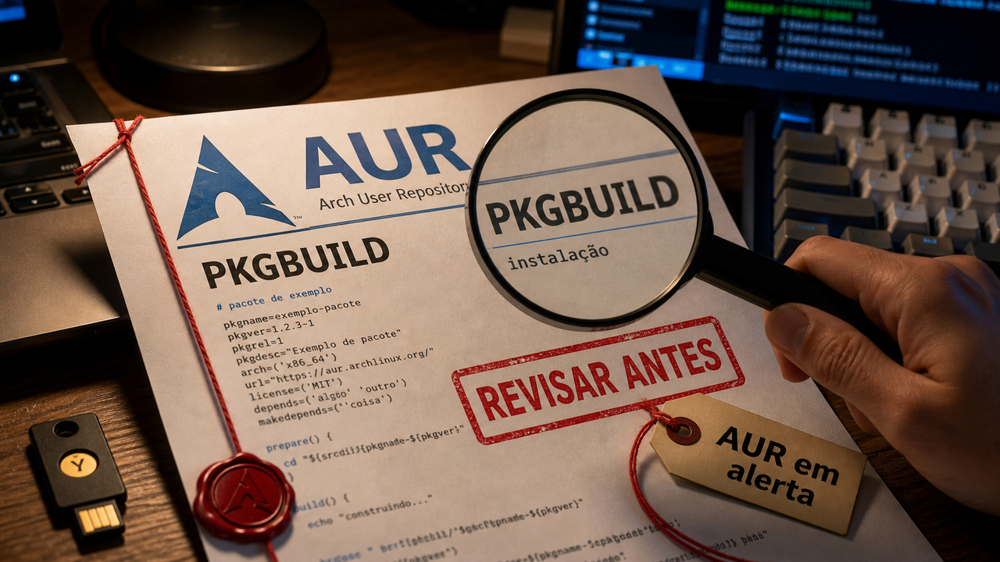

Tem coisa que só parece pequena até rodar no computador de quem desenvolve: instalar pacote, abrir repositório, deixar um modelo fixo no fluxo do produto. O sábado bateu bastante nesse ponto. A gente começa pelo caminho mais direto, o script que roda antes do deploy existir.

## AUR teve adoções maliciosas em massa e levou o risco para a máquina do dev

Quem usa Arch conhece bem o AUR: é útil, enorme e comunitário. Justamente por isso, ele depende de uma camada de confiança que some fácil no dia a dia. Um `PKGBUILD` carrega comandos que podem rodar no build, na instalação ou na atualização do pacote.

Em 12 de junho, o Arch Linux publicou um aviso sobre adoções e atualizações maliciosas em alto volume no AUR. A StepSecurity batizou a campanha de Atomic Arch e diz que mais de 400 pacotes comunitários foram afetados. O caminho é conhecido e continua perigoso: pacote órfão ou confiável muda de dono, ganha dependência maliciosa ou lógica de instalação alterada, e o usuário executa a receita achando que está só atualizando uma ferramenta normal.

O detalhe chato é o que sai da máquina depois disso. A análise fala em roubo de chaves SSH, tokens de GitHub e npm, credenciais de nuvem, sessões de navegador e tokens de comunicação de desenvolvedor. Se isso rodou dentro de WSL, máquina de trabalho ou runner self-hosted, o estrago passa do "meu Arch pessoal" e encosta em repositório, CI e produção. A StepSecurity também cita persistência via eBPF nos cenários com privilégio elevado, então esse ponto depende do ambiente e do nível de permissão usado.

Para quem usa AUR, o caminho defensivo é revisar instalações e atualizações recentes, ler `PKGBUILD` como quem lê script de shell, comparar pacotes suspeitos com os avisos públicos e tratar execução confirmada como possível exposição de segredo. Em máquina com muito acesso, rotação de credenciais e rebuild limpo podem ser mais baratos do que tentar adivinhar até onde o payload chegou.

A lição passa do Arch: a cadeia de pacotes também começa no arquivo que a sua máquina aceita executar.

Fontes: [Arch Linux](https://archlinux.org/news/active-aur-malicious-packages-incident/) e [StepSecurity](https://www.stepsecurity.io/blog/400-aur-packages-hijacked-atomic-arch-campaign).

## Fable 5 e Mythos 5 perderam acesso depois de uma diretiva dos EUA

No dia 9, a gente [falou do lançamento do Claude Fable 5](/2026/claude-fable-5-acima-do-opus-com-coleira-e-prazo/), com salvaguardas, retenção e toda aquela parte que já fez barulho. Agora a novidade é outra: acesso.

A Anthropic publicou que recebeu, em 12 de junho às 17h21 no horário da costa leste dos EUA, uma diretiva de controle de exportação do governo americano envolvendo o acesso de pessoas estrangeiras ao Fable 5 e ao Mythos 5. Segundo a empresa, o efeito prático foi remover o acesso aos dois modelos para todos os clientes. A Anthropic também afirma que os outros modelos continuam sem impacto.

Esse tipo de notícia parece distante até algum serviço depender exatamente daquele identificador de modelo. Se um produto escolheu Fable 5 para um fluxo específico, agora precisa checar fallback, roteamento, teste de regressão e contrato de compliance. Nesse caso, o identificador carrega qualidade de resposta, disponibilidade e regra política no mesmo pacote.

A empresa discorda da base técnica da diretiva. A Anthropic diz que a preocupação envolve um jailbreak estreito, não universal, e que capacidades comparáveis existem em outros modelos públicos. A carta do governo não apareceu nas fontes públicas usadas aqui. Então esse trecho precisa ficar atribuído: é a posição pública da Anthropic, junto com a cobertura secundária, sem a justificativa completa do regulador.

O que dá para afirmar agora: dois modelos saíram do alcance, outros ficaram disponíveis, e plano de contingência deixou de ser detalhe bonito em diagrama. A causa técnica completa ainda depende de documentos públicos mais claros.

Fontes: [Anthropic](https://www.anthropic.com/news/fable-mythos-access) e [The Hacker News](https://thehackernews.com/2026/06/us-orders-anthropic-to-suspend-fable-5.html).

## Depthfirst diz que um agente de segurança encontrou 21 falhas zero-day no FFmpeg

Processar mídia de gente desconhecida parece comum demais para assustar. Só que por baixo de player, pipeline de vídeo, thumbnail, upload e transcodificação existe muito parser antigo lidando com formato esquisito. FFmpeg é uma dessas peças: aparece em todo canto e lê entrada que, por definição, nem sempre merece confiança.

A Depthfirst diz que seu agente autônomo de segurança encontrou 21 vulnerabilidades zero-day no FFmpeg. Oito já tinham identificadores CVE atribuídos no momento da publicação, segundo a empresa. A própria Depthfirst fala em cerca de US$ 1.000 de custo de API para a rodada e descreve o alvo como um projeto com aproximadamente 1,5 milhão de linhas de C.

Melhor segurar a empolgação no tamanho certo. A história envolve um sistema especializado, com validação, geração de entradas reproduzíveis e foco em classes de parser, demuxer e depacketizer. Se esse fluxo ficar barato e repetível, mantenedores vão receber mais achados, com mais triagem, correção e priorização na fila.

Para defesa, o básico é acompanhar correções do FFmpeg pelo upstream ou pela distribuição, isolar processamento de mídia não confiável e evitar rodar esse tipo de conversão com privilégio alto. Mídia é entrada não confiável. E agente de segurança já está produzindo volume de relatório que mantenedor humano precisa encarar.

Fontes: [Depthfirst](https://depthfirst.com/research/21-zero-days-in-ffmpeg) e [The Hacker News](https://thehackernews.com/2026/06/ai-agent-uncovers-21-zero-days-in.html).

## Cohere lançou o North Mini Code para código em ambiente controlado

Do outro lado da mesa, a Cohere lançou o North Mini Code em 9 de junho: um modelo de código voltado a agentes, terminal e fluxos de engenharia.

Pelos dados da empresa, ele é um Mixture of Experts com 30 bilhões de parâmetros totais e 3 bilhões ativos por token. A documentação lista contexto de 256 mil tokens, saída máxima de 64 mil tokens e o identificador `north-mini-code-1-0`. A Cohere também diz que o modelo sai sob Apache 2.0 e aparece em caminhos como Hugging Face, API da Cohere, Model Vault e OpenRouter.

Para times que querem avaliar código com mais controle de dados, custo ou soberania de infraestrutura, isso entra no radar. O hardware mínimo ainda é sério: a própria Cohere lista 1 H100 em FP8. E números de benchmark e throughput continuam sendo números da fornecedora até alguém medir no próprio fluxo.

O melhor uso do North Mini Code é como candidato de avaliação: tarefas de código, agentes de terminal, geração e revisão em ambiente que precisa de fronteira mais clara. Alternativa concreta vale mais do que torcida com README bonito.

Fontes: [Cohere](https://cohere.com/blog/north-mini-code) e [Cohere Docs](https://docs.cohere.com/docs/north-mini-code-1.0).

## Destaques rápidos de hoje

- **Miasma continua vivo em branches e configurações de agente.** No dia 5, a gente [falou do Miasma mirando agentes em repositórios](/2026/miasma-agentes-repo-cisco-sdwan-cve-sem-patch/). A SafeDep diz que a varredura de 11 de junho encontrou 86 de 123 repositórios da lista anterior ainda infectados, com 665 branches em 56 contas. Antes de abrir repo suspeito em VS Code, Cursor, Claude Code ou Gemini, o caminho seguro é varrer sem checkout e olhar arquivos como `.github/setup.js`, `.claude/settings.json`, `.gemini/settings.json`, `.cursor/rules/setup.mdc` e `.vscode/tasks.json`. Fontes: [SafeDep](https://safedep.io/miasma-worm-still-infected-github-repos/) e [StepSecurity](https://www.stepsecurity.io/blog/miasma-worm-hits-microsoft-again-azure-functions-action-and-72-other-repositories-disabled-after-supply-chain-attack-targeting-ai-coding-agents).

- **Homebrew 6.0.0 apertou confiança em taps e sandbox no Linux.** A versão anunciada em 11 de junho introduz `tap trust`, exige confiança explícita para taps de terceiros antes de avaliar ou rodar código, torna a API JSON interna o padrão e adiciona sandbox com Bubblewrap em etapas de build, teste e pós-instalação no Linux. Os taps oficiais continuam confiáveis por padrão; o ganho está em reduzir código rodando fácil demais fora desse caminho. Fonte: [Homebrew](https://brew.sh/2026/06/11/homebrew-6.0.0/).

- **DeltaDB segue como sinal de que o histórico antes do commit virou produto.** Ontem a gente [olhou o DeltaDB](/2026/fable-5-abriu-o-navegador-deltadb-quer-guardar-o-rastro-do-agente/) como tentativa de registrar deltas finos, mensagens de agentes e estado de worktree antes do `git commit`. A ressalva segue a mesma: a Zed fala em acesso inicial nas próximas semanas, e isso complementa Git e CI em vez de aposentar os dois hoje. Fonte: [Zed Blog](https://zed.dev/blog/introducing-deltadb).

- **OpenSSF explicou por que proveniência válida não fecha a conta do Mini Shai-Hulud.** A análise diz que pacotes tinham atestação válida, mas nasceram de um contexto de build comprometido, com `pull_request_target`, cache do pnpm e extração de token OIDC na cadeia. A diferença importante é entre SLSA Build L2, que amarra pacote a fonte e sistema de build, e SLSA Build L3, que exige isolamento mais forte do ambiente. Fonte: [OpenSSF](https://openssf.org/blog/2026/06/10/mini-shai-hulud-where-slsas-boundaries-fall/).

- **Dropbox usou MCP e Dash para trazer threat model para o review de PR.** A empresa descreveu um sistema que busca threat models durante revisão de código e compara implementação com requisitos de segurança documentados. Nos dados internos citados, só 12% dos PRs de implementação linkavam explicitamente a revisão original, enquanto busca semântica encontrou ligação em 80% dos design reviews. O julgamento final continua com humanos. Fonte: [Dropbox Tech](https://dropbox.tech/security/dropbox-mcp-dash-design-code-security).

- **pg_kpart tenta proteger PostgreSQL contra full scan em tabela particionada.** A extensão anunciada pela HexaCluster força uso de chave de partição e traz modo de auditoria, blacklist, whitelist e comportamento via SQLSTATE para consultas que escapam da poda de partição. É ferramenta para testar em ambiente controlado, especialmente onde ORM ou query manual pode esquecer o predicado certo em tabela grande. Fontes: [HexaCluster](https://hexacluster.ai/blog/pg-kpart-postgresql-extension) e [Planet PostgreSQL](https://postgr.es/p/9lO).

## Acompanhamento de tendências do dia

AUR, Miasma, Homebrew e SLSA aparecem por caminhos diferentes. O elo é o lugar onde a confiança falha: antes do código chegar em produção, no momento em que alguém instala, abre, constrói, assina ou revisa.

Esse pedaço do fluxo sempre teve autoridade demais. `PKGBUILD` roda comando. Configuração de editor e agente pode disparar tarefa. Cache de build pode influenciar pacote assinado. Tap de terceiro pode carregar Ruby. A diferença é que agora mais ferramentas estão admitindo isso com controles explícitos: confiança manual, sandbox, isolamento de build e varredura antes de checkout.

Para time pequeno, dá para transformar isso em hábito sem comprar uma plataforma inteira: revisar metadado executável, separar máquina pessoal de segredo de produção, isolar runner, limpar cache de CI quando o contexto muda, rotacionar credencial quando payload rodou e não abrir repositório suspeito como se fosse pasta de foto antiga. Parece cuidado básico porque é. Só que básico, quando finalmente entra no fluxo, costuma resolver mais do que uma sigla nova colada no painel.

Fontes: [StepSecurity](https://www.stepsecurity.io/blog/400-aur-packages-hijacked-atomic-arch-campaign), [SafeDep](https://safedep.io/miasma-worm-still-infected-github-repos/), [Homebrew](https://brew.sh/2026/06/11/homebrew-6.0.0/) e [OpenSSF](https://openssf.org/blog/2026/06/10/mini-shai-hulud-where-slsas-boundaries-fall/).

> Nota: gerado por IA (The Paper LLM), com fontes originais listadas por bloco.

<!--
briefing_slug: 2026-06-13
source_mode: briefing
generated_at: 2026-06-13T05:42:32-03:00
source_urls:
  - https://archlinux.org/news/active-aur-malicious-packages-incident/
  - https://www.stepsecurity.io/blog/400-aur-packages-hijacked-atomic-arch-campaign
  - https://www.anthropic.com/news/fable-mythos-access
  - https://thehackernews.com/2026/06/us-orders-anthropic-to-suspend-fable-5.html
  - https://depthfirst.com/research/21-zero-days-in-ffmpeg
  - https://thehackernews.com/2026/06/ai-agent-uncovers-21-zero-days-in.html
  - https://cohere.com/blog/north-mini-code
  - https://docs.cohere.com/docs/north-mini-code-1.0
  - https://safedep.io/miasma-worm-still-infected-github-repos/
  - https://www.stepsecurity.io/blog/miasma-worm-hits-microsoft-again-azure-functions-action-and-72-other-repositories-disabled-after-supply-chain-attack-targeting-ai-coding-agents
  - https://brew.sh/2026/06/11/homebrew-6.0.0/
  - https://zed.dev/blog/introducing-deltadb
  - https://openssf.org/blog/2026/06/10/mini-shai-hulud-where-slsas-boundaries-fall/
  - https://dropbox.tech/security/dropbox-mcp-dash-design-code-security
  - https://hexacluster.ai/blog/pg-kpart-postgresql-extension
  - https://postgr.es/p/9lO
omitted_briefing_items:
  - "Dynamic Tool Pruning (Adjacency-Agents)": self-reported TabNews/library claim not source-validated deeply enough today.
  - "NPM Registry Metadata Verification / Axios compromise": Reddit-originated and tied to an older compromise; no original source chain completed.
  - "AWS CDK Mixins": official GA source predates the run by months; current coverage lacks a fresh delta.
  - "GLM version five point two open weights": Reddit teaser without official public source confirmation.
  - "Google Chrome Local AI Reclamation": community tip and lower priority on a dense verified-source day.
  - "DiffusionGemma Released": officially verified but not separately promoted to avoid a model-release pileup after recent coverage and the North Mini Code block.
  - "Linux Kernel Garbage Collector Walkthrough": good deep technical source, but the CVE is older and the story would require more space than today's package allows.
  - "Claude Desktop Hyper-V Bug": open GitHub issue labeled invalid; not stable enough for public roundup.
  - "Expert Parallelism Kernel Deep Dive": educational deep dive, not a fresh news item for this edition.
  - "GitHub Copilot CLI selective delegation": official source is valid, but agent-tooling coverage is saturated and stronger stories outrank it.
  - "Splunk Enterprise CVE-2026-20253 via watchTowr/Reddit": potentially important, but not source-validated in this curation pass.
  - "Stop MITM on first SSH connection": useful evergreen hardening, recently surfaced and without a new public delta.
-->
