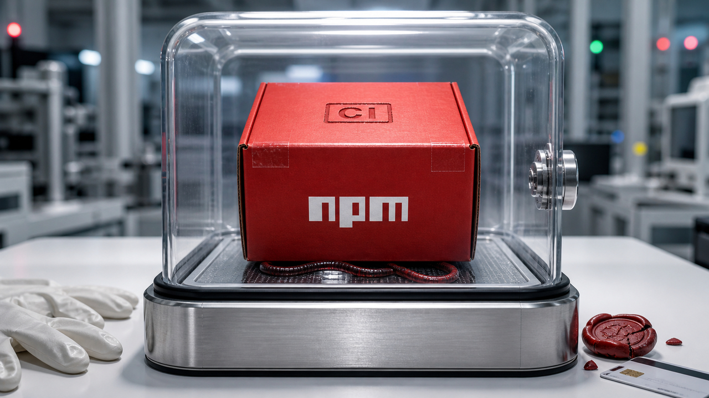

Um pacote malicioso no npm já seria ruim o bastante. O Mini Shai-Hulud conseguiu ser mais chato: ele passou por fluxo de release, apareceu com sinais de provenance válidos e lembrou que CI/CD também é uma superfície de ataque, não só uma esteira obediente apertando botão.

Esse é o centro do dia. Depois dele, vem uma leva bem concreta de infraestrutura para IA: Claude Platform agora tem uma porta oficial pela AWS, a Thinking Machines está tentando treinar o próprio modelo para conversar em áudio, vídeo e texto sem aquele revezamento duro de "agora fala você, agora falo eu", e o Hermes Agent ganhou tutoriais que servem mais como checklist operacional do que como propaganda de agente mágico.

Tem bastante IA hoje, mas o assunto real é menos brilho de demo e mais fronteira de confiança. Quem pode publicar? Quem pode ler segredo? Onde o modelo roda? Quem controla o áudio? Qual helper sai da sandbox? A parte divertida da tecnologia continua existindo. A parte que assina o incidente também.

## Mini Shai-Hulud mostrou o buraco dentro do fluxo confiável do npm

A TanStack publicou um postmortem sobre o comprometimento de pacotes npm em 11 de maio de 2026. Segundo o projeto, entre 19:20 e 19:26 UTC, um atacante publicou 84 versões maliciosas em 42 pacotes `@tanstack/*`.

O detalhe que muda o peso da história é a cadeia usada. A TanStack diz que o incidente não começou com roubo de token npm. O ataque passou por um padrão conhecido em GitHub Actions: um pull request malicioso, `pull_request_target`, cache poisoning e extração em memória de um token OIDC do runner. Com esse token, o atacante conseguiu acionar publicação pelo caminho de release.

Traduzindo para gente que só queria instalar dependência em paz: o pacote podia parecer vindo do workflow esperado. A StepSecurity afirma que os pacotes carregavam attestations válidas de SLSA Build Level 3. Isso não torna SLSA inútil, nem transforma trusted publishing em teatro. Mas coloca a caveat no lugar certo: provenance diz onde e como o artefato foi construído. Se o ambiente confiável rodou código controlado pelo atacante, o selo fica bem menos tranquilizador.

O payload rodava durante a instalação, caçava credenciais de cloud, Kubernetes, Vault, GitHub, npm e SSH, exfiltrava por endpoints ligados a Session/Oxen e tentava se propagar olhando quais pacotes o mantenedor podia publicar. A Aikido também reporta uma lista maior, com 373 entradas de versões maliciosas em 169 nomes de pacotes, incluindo namespaces como `@mistralai`, `@uipath` e outros. Como esse número mais amplo ainda estava se movendo em 12 de maio, vale tratar como relatório da Aikido, não como contagem final gravada em pedra.

Para defesa, a parte útil é bem direta. Se um ambiente instalou versões afetadas, atualize e remova, mas não pare aí. Revise lockfiles, caches e histórico de CI. Procure marcadores citados pela Aikido, como `router_init.js`, `router_runtime.js`, `tanstack_runner.js`, `@tanstack/setup` e a referência `github:tanstack/router#79ac49eedf774dd4b0cfa308722bc463cfe5885c`. Gire credenciais alcançáveis por máquinas e runners que fizeram a instalação.

Também vale olhar permissões de workflow, escrita em cache, escopo de OIDC e publicações npm recentes. O pacote é o sintoma visível. O incidente morou mesmo naquele lugar meio sem glamour onde automação, cache e permissão ficam conversando sozinhos de madrugada.

Fontes: [postmortem da TanStack](https://tanstack.com/blog/npm-supply-chain-compromise-postmortem), [análise da StepSecurity](https://www.stepsecurity.io/blog/mini-shai-hulud-is-back-a-self-spreading-supply-chain-attack-hits-the-npm-ecosystem) e [levantamento da Aikido](https://www.aikido.dev/blog/mini-shai-hulud-is-back-tanstack-compromised).

## Claude Platform na AWS separa conta, controle e processamento

A Anthropic anunciou em 11 de maio que o Claude Platform on AWS está em disponibilidade geral. A ideia é deixar clientes AWS acessarem a plataforma nativa da Claude com autenticação via AWS IAM, logs no CloudTrail, billing em uma única fatura AWS e uso de compromissos comerciais da AWS.

O ponto fino: isso não deve ser lido como "Claude no Bedrock com outro nome". A própria Anthropic separa os caminhos. No Claude Platform on AWS, o cliente ganha a superfície da plataforma Claude, incluindo recursos como Claude Managed Agents, Advisor strategy, web search, web fetch, code execution, Skills e Files API, mas o tráfego de modelo é processado pela Anthropic. Já no Amazon Bedrock, a Anthropic lembra que a AWS é o data processor.

Essa diferença parece detalhe de contrato até alguém de segurança, jurídico ou compras perguntar onde o dado passa, quem registra auditoria, qual compromisso financeiro pode ser usado e qual feature precisa estar disponível no dia um. A nova opção tenta responder ao time que quer IAM e CloudTrail sem abrir mão da API nativa da Anthropic.

Para tech lead, isso vira conversa de arquitetura, não só de vendor. Se o requisito principal é integração com identidade, auditoria e fatura AWS, esse caminho pode reduzir atrito. Se a política exige que a AWS seja a processadora dos dados, Bedrock continua sendo a alternativa mais alinhada. O anúncio não elimina essa escolha. Ele só deixa a bifurcação mais explícita.

A cautela é simples: é anúncio de fornecedor. Não invente promessa de preço, residência de dados ou equivalência total além do que foi publicado. O material diz "AWS como plano de acesso e cobrança" e "Anthropic como plano de processamento do modelo" para essa oferta. Essa frase, sozinha, já deve fazer o diagrama de compliance abrir uma aba nova.

Fonte: [Anthropic, Claude Platform on AWS](https://claude.com/blog/claude-platform-on-aws).

## Thinking Machines quer tirar a conversa do modo ping-pong

A Thinking Machines Lab apresentou em 11 de maio uma prévia de pesquisa sobre interaction models. O nome é meio acadêmico, mas a ambição é fácil de reconhecer para quem já usou voz com IA: parar de tratar conversa como uma fila rígida de fala, silêncio, transcrição, modelo, resposta e áudio.

O TML-Interaction-Small é descrito pela empresa como um modelo MoE de 276 bilhões de parâmetros, com 12 bilhões ativos. Ele recebe áudio, vídeo e texto em fluxo contínuo e trabalha com micro-turnos de 200 ms, alinhando entrada e saída no tempo. Em vez de um módulo separado decidir "o humano parou de falar", a própria arquitetura tenta lidar com escuta, fala, sobreposição, interrupção e pistas visuais.

Isso mexe com uma peça sensível das aplicações de voz. Muita stack atual é uma colagem: speech-to-text, LLM, detecção de atividade de voz, text-to-speech, um monte de fila e alguma cola tentando esconder a latência. Funciona, às vezes muito bem. Mas todo mundo que já conversou com um agente que responde em cima da sua frase sabe que o truque tem costura.

A proposta da Thinking Machines coloca outro desenho na mesa: um interaction model para o loop em tempo real e um background model assíncrono para raciocínio mais longo, ferramentas e trabalho sustentado. Para quem cria produto com voz, atendimento, vídeo ou colaboração ao vivo, a pergunta começa a mudar. O desenvolvedor ainda vai controlar streaming, vocoder, barge-in e TTS externo? Ou o modelo vai engolir cada vez mais esse caminho?

Agora o freio: ainda é prévia de pesquisa. A empresa fala em preview limitado nos próximos meses e release mais amplo mais tarde em 2026. Também lista problemas abertos como sessões longas, conectividade confiável, segurança, deployment e servir modelos maiores. Então é cedo para reescrever produto em cima disso. Mas como direção técnica, é bem mais interessante do que "colocamos uma voz mais bonita no chat".

Fontes: [Thinking Machines Lab](https://thinkingmachines.ai/blog/interaction-models/) e [Latent Space](https://www.latent.space/p/ainews-thinking-machines-native-interaction).

## Hermes Agent virou um bom mapa dos parafusos de produção

A DigitalOcean publicou material sobre rodar o Hermes Agent com Serverless Inference e Inference Router. O valor aqui passa longe de tratar a DigitalOcean como resposta universal para agentes. O bom da história é o formato operacional que aparece no tutorial: endpoint compatível com OpenAI, chave de acesso única, roteamento de modelo, tarefas auxiliares separadas e gateway que precisa continuar vivo depois que o SSH fecha.

No tutorial de 11 de maio, o Hermes aponta para `https://inference.do-ai.run/v1`. O modelo pode ser um nome específico ou algo no formato `router:<router-name>`, usando o DigitalOcean Inference Router. A fonte também diz que as respostas carregam metadados sobre o modelo escolhido e a tarefa detectada, além de sugerir overrides para tarefas auxiliares como `auxiliary.vision`, `auxiliary.compression`, `auxiliary.session_search`, `web_extract`, `skills_hub` e MCP.

Esse tipo de detalhe é o que separa "rodei um agente no terminal" de "isso talvez sobreviva a uma semana de uso". Um agente real pode precisar de modelo caro para raciocínio, modelo barato para compressão, contexto mínimo de 64K, busca em sessão, extração web, gateway de mensagem e backend de terminal. Se tudo isso usa o mesmo modelo, a mesma chave e o mesmo processo solto dentro de uma sessão SSH, a conta e a manutenção aparecem rapidinho.

O repositório do Hermes lista suporte a gateways como Telegram, Discord, Slack, WhatsApp e Signal, além de backends de terminal locais, Docker, SSH, Singularity, Modal, Daytona e Vercel Sandbox. Também fala em skills, memória, MCP, cron e aprovação de comandos. É bastante superfície. Bastante mesmo. Do tipo que pede isolamento, segredo bem guardado, logs e um humano autorizado para as ações perigosas.

Como material de arquitetura, o tutorial serve para uma checklist curta: endpoint estável, troca de modelo sem reescrever o agente, tarefas auxiliares com custo menor, observabilidade do modelo escolhido, serviço gerenciado por `systemd` ou equivalente, e política clara para credenciais. Só não vale ler tutorial de fornecedor como benchmark neutro de custo ou qualidade. A função dele aqui é mostrar os parafusos, não vender que todos eles já estão apertados.

Fontes: [Hermes Agent no DigitalOcean Serverless Inference](https://www.digitalocean.com/community/tutorials/hermes-agent-serverless-inference), [repositório NousResearch/hermes-agent](https://github.com/NousResearch/hermes-agent) e [tutorial de execução do Hermes na DigitalOcean](https://www.digitalocean.com/community/tutorials/how-to-run-hermes-agent).

## Destaques rápidos para hoje.

- O Google Threat Intelligence Group publicou em 11 de maio um relatório dizendo que identificou um exploit de zero-day que, com alta confiança, teria sido desenvolvido com auxílio de IA. O caso envolvia bypass de 2FA em uma ferramenta web open-source de administração, exigia credenciais válidas e tinha sinais curiosos como docstrings educativas e um CVSS alucinado; o Google diz que não acredita que Gemini tenha sido usado. Fonte: [Google Cloud Blog](https://cloud.google.com/blog/topics/threat-intelligence/ai-vulnerability-exploitation-initial-access).

- O Yelp 49.1 corrigiu uma fuga de sandbox envolvendo Flatpak e arquivos de ajuda maliciosos. Segundo Michael Catanzaro, um app sandboxed podia acionar o Yelp pelo portal OpenURI, e o arquivo aberto podia exfiltrar arquivos do host por comportamento de SVG e CSS; a fonte faz questão de dizer que isso não é "Flatpak quebrado", e sim helper fora da sandbox virando parte da fronteira. Fonte: [blog de Michael Catanzaro / GNOME](https://blogs.gnome.org/mcatanzaro/2026/05/11/flatpak-sandbox-escape-via-yelp/).

- `linscope` é um projeto open-source para visualizar comportamento Linux em tempo real com coletor eBPF, backend FastAPI, WebSocket e frontend React. Ele também pode usar Ollama local para explicar incidentes, mas pede root no coletor e dependências de eBPF, então teste em VM ou laboratório antes de colocar algo novo com esse nível de acesso na sua máquina real. Fonte: [repositório ogtamimi/linscope](https://github.com/ogtamimi/linscope).

- A DigitalOcean publicou um texto conceitual sobre o que quebra em 1 milhão de requests de IA por dia. A média dá só 11,6 requests por segundo, mas tráfego real vem em rajadas; por isso fila, espera, TTFT, p95, p99, memória de GPU, tokens por segundo, retry e custo por token contam mais do que uma média bonitinha no dashboard. Fonte: [DigitalOcean Community](https://www.digitalocean.com/community/conceptual-articles/what-breaks-at-1m-ai-requests-per-day).

- O GitLab publicou o plano "Act 2", amarrando reestruturação interna à tese de desenvolvimento agentic. A empresa fala em reduzir presença por países em até 30%, remover até três camadas de gestão em algumas funções, reorganizar P&D em cerca de 60 times menores e trocar valores internos por Speed with Quality, Ownership Mindset e Customer Outcomes; é uma notícia de estratégia, mas também de impacto humano, então cuidado com a leitura de "produtividade" sem pessoas dentro. Fontes: [GitLab](https://about.gitlab.com/blog/gitlab-act-2/) e [Simon Willison](https://simonwillison.net/2026/May/11/gitlab-act-2/#atom-everything).

- Uma dica pequena para quem caiu no Ubuntu 26.04 LTS fresco e achou que as fotos do celular tinham estragado: segundo o OMG! Ubuntu, instalações novas podem mostrar thumbnail de HEIC, mas falhar ao abrir no Image Viewer/Loupe se faltar `libheif-plugin-libde265`. O ajuste sugerido é `sudo apt install libheif-plugin-libde265`; upgrades antigos talvez já tenham o pacote. Fonte: [OMG! Ubuntu](https://www.omgubuntu.co.uk/2026/05/fix-heic-images-not-loading-ubuntu-26-04).

## Acompanhamento de tendências do dia.

O padrão que dá para ligar hoje é modesto, mas importante: a fronteira de segurança está escorrendo para as ferramentas ao redor do app.

No Mini Shai-Hulud, a história passa por cache de CI, OIDC, publicação npm e até arquivos adjacentes a ferramentas de desenvolvimento, como configurações que miravam Claude Code e VS Code. No relatório do Google, a parte relevante é que assistência de IA já aparece, segundo a empresa, em exploração de vulnerabilidade e lógica de 2FA. No caso Yelp/Flatpak, o problema passa por um helper do host aberto via portal, fora do processo sandboxed que o usuário talvez imaginasse como "a aplicação".

Essas histórias não são a mesma campanha e não provam uma tese grandona sobre IA quebrando tudo. Elas só apontam para uma revisão bem menos cinematográfica: quando você audita um sistema, olhe também para o workflow que publica, o runner que guarda segredo, o helper que abre arquivo, o agente que chama ferramenta e o token que parece pequeno até poder publicar pacote.

Segurança em 2026 está ficando com cara de inventário. Meio sem glamour, eu sei. Mas glamour nenhum sobrevive ao `npm install` rodando payload com acesso a chave de cloud.

Fontes: [TanStack](https://tanstack.com/blog/npm-supply-chain-compromise-postmortem), [Google GTIG](https://cloud.google.com/blog/topics/threat-intelligence/ai-vulnerability-exploitation-initial-access) e [GNOME/Yelp](https://blogs.gnome.org/mcatanzaro/2026/05/11/flatpak-sandbox-escape-via-yelp/).

> Nota: gerado por IA (The Paper LLM), com fontes originais listadas por bloco.

<!--
briefing_slug: 2026-05-12
generated_at: 2026-05-12T06:47:15-03:00
source_urls:
  - https://tanstack.com/blog/npm-supply-chain-compromise-postmortem
  - https://www.stepsecurity.io/blog/mini-shai-hulud-is-back-a-self-spreading-supply-chain-attack-hits-the-npm-ecosystem
  - https://www.aikido.dev/blog/mini-shai-hulud-is-back-tanstack-compromised
  - https://claude.com/blog/claude-platform-on-aws
  - https://thinkingmachines.ai/blog/interaction-models/
  - https://www.latent.space/p/ainews-thinking-machines-native-interaction
  - https://www.digitalocean.com/community/tutorials/hermes-agent-serverless-inference
  - https://github.com/NousResearch/hermes-agent
  - https://www.digitalocean.com/community/tutorials/how-to-run-hermes-agent
  - https://cloud.google.com/blog/topics/threat-intelligence/ai-vulnerability-exploitation-initial-access
  - https://blogs.gnome.org/mcatanzaro/2026/05/11/flatpak-sandbox-escape-via-yelp/
  - https://github.com/ogtamimi/linscope
  - https://www.digitalocean.com/community/conceptual-articles/what-breaks-at-1m-ai-requests-per-day
  - https://about.gitlab.com/blog/gitlab-act-2/
  - https://simonwillison.net/2026/May/11/gitlab-act-2/#atom-everything
  - https://www.omgubuntu.co.uk/2026/05/fix-heic-images-not-loading-ubuntu-26-04
omitted_briefing_items:
  - AI tools consistently misconfigure environment variables: Reddit source was removed by moderators during validation, so there was no stable public source for the captured claims.
  - Fake building: Claude wrote three thousand lines instead of importing pywikibot: lower priority and original public page was not successfully validated for this stage.
  - Server side A/B testing inside Nginx itself: confirmed public tutorial exists, but evergreen VPS material was weaker than today's security and AI infrastructure items.
  - If AI writes your code, why use Python?: validated only as context; the main essay is from 2026-04-28 and was not fresh enough for quick hits.
  - Zig versus Rust in 2026: useful context, but the source was not fully validated in this curation.
  - The Cathedral, the Bazaar, and the Kitchen: essay context only, not needed for a post already dense with verified security and infrastructure stories.
  - Mini Shai-Hulud original Reddit report: replaced by stronger public sources from TanStack, StepSecurity and Aikido.
-->
