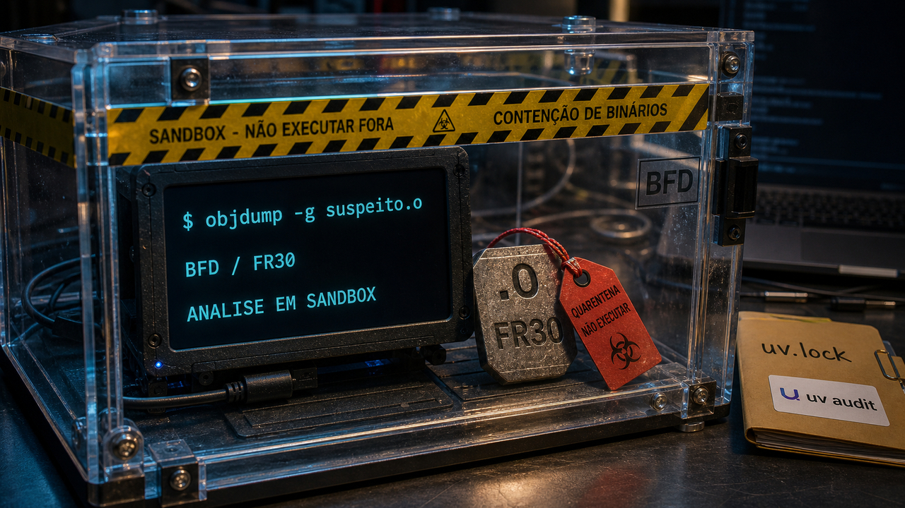

A notícia mais incômoda do dia é simples: o código que você não roda diretamente ainda passa por ferramentas que rodam. Analisador de binário, gerenciador de pacote e agente no shell também entram na conta de confiança.

## objdump -g virou parser perigoso em builds multi-alvo do Binutils

A Calif publicou, em 8 de junho, o OOBdump, uma falha de execução arbitrária de código no caminho do `objdump -g`. O caso passa pelo GNU Binutils, mais exatamente pela biblioteca BFD, quando ela processa relocations de um objeto FR30 criado para explorar uma checagem de limites ausente.

Na rotina de dev, `objdump` parece uma ferramenta de inspeção, mas faz trabalho pesado de parser. Ele lê formatos complexos, interpreta metadados, passa por backends de arquitetura e pode receber arquivo hostil em CI, SDK, laboratório de malware, engenharia reversa ou pipeline que analisa binários enviados por terceiros.

A exposição realista pesa mais em builds customizados, toolchains de SDK, imagens de CI e compilações com suporte amplo de alvo, como `--enable-targets=all`. Em instalações comuns, o backend FR30 pode nem estar presente.

Mesmo assim, a lição operacional é pequena e boa: atualize o Binutils nas imagens que analisam artefatos, evite compilar suporte a todos os alvos quando você não precisa disso e rode análise de binário não confiável dentro de isolamento. Contêiner já ajuda; seccomp, AppArmor, Bubblewrap ou uma VM ajudam mais quando o arquivo veio de fora.

A correção entrou rápido pelo processo público do Binutils. O resto é hábito de engenharia: ferramenta que parseia arquivo hostil merece a mesma desconfiança que a gente já aprendeu a ter com PDF, ZIP e imagem esquisita.

Fontes: [Calif](https://blog.calif.io/p/oobdump-relocation-oriented-programming) e [documentação do GNU Binutils](https://sourceware.org/binutils/docs-2.41/binutils/objdump.html).

## uv ganhou auditoria de vulnerabilidade e check opt-in de malware

A Astral colocou duas proteções novas no `uv`, ainda em preview. A primeira é o comando `uv audit`, que varre dependências em busca de vulnerabilidades conhecidas e status adversos de projeto. A segunda é um check leve de malware durante operações como `uv sync`, ativado por variável de ambiente: `UV_MALWARE_CHECK=1`.

Isso muda o lugar da defesa. Em vez de tratar auditoria como uma etapa separada que alguém lembra de rodar no CI, o gerenciador de pacote começa a avisar mais perto do momento em que a dependência entra no ambiente. Para Python, isso combina com o susto recente de pacotes que executam coisa no install, no startup hook ou no ambiente de notebook.

A própria Astral deixa o freio puxado: as duas features são instáveis, dependem da atualização dos avisos públicos e não pegam uma publicação maliciosa nos primeiros minutos de vida se ninguém ainda registrou o problema. É por isso que cooldown de dependência e revisão de lockfile continuam fazendo sentido.

Para projeto real, eu testaria em ambiente pequeno: rode `uv audit`, veja o ruído, entenda o que quebra e avalie `UV_MALWARE_CHECK=1` onde o custo de consulta compensa. A proteção funciona como trava adicional no caminho em que pacote vira código executado, ainda longe de resolver cadeia de suprimentos sozinha.

Fonte: [Astral](https://astral.sh/blog/uv-audit).

## AWS AgentCore mostra agente de código como infraestrutura isolada

Ontem falamos do [Colab CLI levando runtime remoto para agentes](/2026/colab-cli-leva-gpu-aos-agentes-e-vs-code-segura-extensoes-por-2-horas/). A publicação da AWS vai por outro caminho: em vez de focar GPU ou TPU, ela descreve onde o agente de código mora enquanto trabalha.

O artigo sobre Amazon Bedrock AgentCore Runtime parte de uma dor conhecida. Quando um agente roda no seu laptop, ele costuma enxergar seu shell, seus arquivos, suas chaves SSH, seus tokens, sua VPN e a rede que você deixou aberta. Se você abre várias sessões, ainda pode ganhar colisão de porta, branch, banco local e workspace.

A arquitetura mostrada pela AWS coloca cada sessão em uma microVM Linux isolada, com filesystem persistente, shell via PTY, estado retomável e comandos determinísticos. Em volta disso entram Identity, Gateway com ferramentas via Model Context Protocol e observabilidade no CloudWatch. A lista de exemplos cita agentes de terminal como Claude Code, Codex, Kiro, OpenCode, Gemini CLI e Cursor CLI.

Mesmo para quem não pretende usar AWS, o desenho serve como checklist. Onde fica o filesystem do agente? Qual identidade ele usa para chamar API? O token está dentro do prompt, do ambiente ou em um cofre externo? O log de ferramenta existe separado da resposta bonita do modelo? Dá para fechar o laptop e retomar sem transformar tudo em uma sessão SSH eterna com privilégio demais?

O freio aqui é simples: isso é produto gerenciado, com custo, lock-in e promessas de segurança que precisam de avaliação própria. MicroVM não resolve prompt injection, pacote malicioso nem repositório comprometido por mágica. Ela só deixa uma pergunta antiga mais explícita: se o agente vai executar, onde ele pode quebrar coisas?

Fontes: [AWS Machine Learning Blog](https://aws.amazon.com/blogs/machine-learning/its-safe-to-close-your-laptop-now-hosting-coding-agents-on-amazon-bedrock-agentcore/) e [documentação do AgentCore Runtime](https://docs.aws.amazon.com/bedrock-agentcore/latest/devguide/runtime-persistent-filesystems.html).

## Apple AFM 3 põe IA local na conta de NAND, DRAM e roteamento

A Apple apresentou a terceira geração dos Apple Foundation Models em 8 de junho. O detalhe que vale olhar com calma é o jeito como a empresa está contornando uma restrição chata de dispositivo local: memória.

O AFM 3 Core Advanced é descrito como um modelo esparso de 20 bilhões de parâmetros para uso no dispositivo. Segundo a Apple, ele não ativa tudo de uma vez. Dependendo do pedido, usa algo na faixa de 1 a 4 bilhões de parâmetros ativos, guarda os pesos completos em NAND e traz blocos especialistas para a DRAM quando precisa.

Isso explica melhor a briga de local versus nuvem. Rodar IA no telefone ou no notebook envolve largura de banda, latência, energia, memória disponível e dados que talvez precisem ficar no aparelho. A saída da Apple mistura roteamento, ativação esparsa, integração com hardware e, quando necessário, modelos maiores em Private Cloud Compute.

Simon Willison destacou a parte que interessa a devs com um pouco de ceticismo saudável: depois das promessas de Apple Intelligence em 2024, convém esperar o comportamento real nas betas. Ainda assim, Core AI, extensões PyTorch da Apple e modelos com visão de tela são peças que podem virar API útil.

Arquiteturalmente, AFM 3 é um sinal forte de que IA local depende de movimentar menos peso e escolher melhor o que ativar. Como produto para usuário final, ainda falta ver no aparelho, com app real, latência real e erro real.

Fontes: [Apple Machine Learning Research](https://machinelearning.apple.com/research/introducing-third-generation-of-apple-foundation-models) e [Simon Willison](https://simonwillison.net/2026/Jun/8/wwdc/#atom-everything).

## Python 3.15 congelou recursos e entrou na fase boa para quebrar em teste

A primeira beta do Python 3.15 saiu em 7 de maio e marcou o congelamento de recursos. A própria página do Python.org trata a versão como preview, então o recado para mantenedores é outro: o conjunto de mudanças já está maduro o bastante para começar a bater nos seus testes.

Entre os itens listados aparecem lazy imports, `frozendict`, `sentinel`, encoding UTF-8 como padrão, profiler por amostragem, melhorias no JIT e trabalho de ABI estável para builds free-threaded. É uma pilha de ajustes que encostam em startup, extensão C, empacotamento, observabilidade e compatibilidade.

O resumo de junho da Real Python ainda puxa contexto de ecossistema: `httpx2`, discussões em torno de Pydantic e relatos de bugs encontrados com ajuda de IA em extensões C do Python e no Firefox. Esses números são contexto citado pela Real Python, não auditoria nossa. Servem mais para mostrar onde a comunidade está gastando atenção do que para declarar uma nova era da qualidade automática.

Para times, o caminho é simples e um pouco sem glamour: rode a beta fora de produção, teste wheels, extensões, encoding, profiling, ferramentas de lint e dependências que mexem com import. Se algo quebrar agora, ainda dá para reportar antes do release candidate endurecer mais o comportamento.

Fontes: [Python.org](https://www.python.org/downloads/release/python-3150b1/), [Real Python](https://realpython.com/python-news-june-2026/) e [documentação do Python 3.15](https://docs.python.org/3.15/whatsnew/3.15.html).

## Destaques rápidos para hoje

- **Mellum2 entrou na fila dos modelos locais para testar com calma.** A JetBrains abriu o Mellum2 como modelo MoE de 12B, sob Apache 2.0, com cerca de 2,5B parâmetros ativos por token e foco em roteamento, RAG, subagentes e uso privado/local. Um teste no Reddit falou em 111 tokens por segundo num RX 7900 XT com `llama.cpp` e Vulkan, mas o próprio relato é não científico; se o seu harness precisa de modelo auxiliar rápido, vale medir nos seus prompts. Fontes: [JetBrains](https://blog.jetbrains.com/ai/2026/06/mellum2-goes-open-source-a-fast-model-for-ai-workflows/), [arXiv](https://arxiv.org/abs/2605.31268) e [r/LocalLLaMA](https://www.reddit.com/r/LocalLLaMA/comments/1u0r3jh/jetbrains_mellum_2_a_really_good_and_performant/).

- **Shai-Hulud voltou em pacotes científicos do PyPI, agora com gancho de startup.** No dia 4, falamos do [worm entrando pelo build nativo no npm](/2026/binding-gyp-virou-esconderijo-do-worm-no-npm/); a novidade agora é a onda reportada em 19 pacotes científicos do PyPI, com 37 releases maliciosas, arquivo `.pth` e payload JavaScript/Bun que pode rodar quando o Python inicia. Para quem instalou pacote afetado: procurar `.pth` estranho, reconstruir ambiente limpo e girar segredos de GitHub, npm, PyPI, cloud e Kubernetes. Fontes: [BleepingComputer](https://www.bleepingcomputer.com/news/security/new-shai-hulud-attack-trojanizes-19-science-focused-pypi-packages/), [Socket](https://socket.dev/blog) e [Dark Reading](https://www.darkreading.com/application-security/hades-campaign-pypi-shai-hulud).

- **Gogs 0.14.3 corrigiu RCE autenticada no caminho de rebase.** A análise da Rapid7 descreve injeção de argumento no `git rebase` usado no fluxo de pull request com "rebase before merging"; Gogs 0.14.2 e 0.15.0+dev foram confirmados como afetados, e a correção saiu em 0.14.3 no dia 7. Se a instância permite cadastro e criação de repositório com pouca barreira, a palavra "autenticada" perde parte do conforto; atualize, restrinja registro/criação de repo e desative rebase merge se precisar ganhar tempo. Fontes: [Rapid7](https://www.rapid7.com/blog/post/ve-authenticated-rce-via-argument-injection-gogs-unfixed/), [Rapid7 Vulnerability Database](https://www.rapid7.com/db/vulnerabilities/gogs-git-rebase-argument-injection/) e [BleepingComputer](https://www.bleepingcomputer.com/news/security/gogs-patches-critical-zero-day-enabling-remote-code-execution/).

- **CVE-2026-23111 no Linux é local, mas local pode ser suficiente.** A Ubuntu descreve a falha em `nf_tables` como uma use-after-free que permite a um usuário local sem privilégio chegar a root, e a cobertura de 8 de junho destaca exploração pública. O enquadramento correto é pós-comprometimento: container host, CI runner e VPS com shell exposto demais. Patch, reboot e revisão de user namespaces continuam sendo trabalho de base. Fontes: [Ubuntu Security](https://ubuntu.com/security/CVE-2026-23111) e [The Hacker News](https://thehackernews.com/2026/06/one-character-linux-kernel-flaw-enables.html).

- **O boletim SB26-159 da CISA pede triagem seletiva.** No meio do barulho semanal aparecem itens de stack de dev: Apache MINA, `sshd-git` do Apache MINA SSHD, Solr BasicAuth, vazamento de cookie em redirect no AsyncHttpClient e uma falha de escrita de arquivo no AWS Kiro IDE antes da versão 0.11. A leitura útil é procurar o que existe no seu inventário e ir para o aviso do fornecedor, sem transformar o boletim inteiro em tarefa cega. Fonte: [CISA](https://www.cisa.gov/news-events/bulletins/sb26-159).

- **PostgreSQL DateStyle mistura saída bonita com entrada perigosa.** Christophe Pettus lembrou que `DateStyle` controla formato de saída e também a ordem usada para interpretar data ambígua, como MDY, DMY e YMD. Deixe saída em ISO, envie data ISO ou não ambígua pela aplicação e faça formatação com `to_char` na borda de apresentação; `01/02/2026` não merece fé religiosa. Fonte: [The Build](https://thebuild.com/blog/all-your-gucs-in-a-row-datestyle/).

- **Fedora 44 ganhou imagens RISC-V comunitárias com kernel Generic e Omni.** A cobertura da Phoronix fala em imagens para container, server e cloud; o caminho Generic fica mais perto de um kernel Linux 6.19 upstream, enquanto o Omni tenta cobrir mais placas com enablement que ainda não subiu para o upstream. É bom para experimentar VisionFive 2, Milk-V, Orange Pi e companhia, mas ainda é imagem alternativa comunitária. Fonte: [Phoronix](https://www.phoronix.com/news/Fedora-44-RISC-V-Images).

- **Bambuddy transforma impressora Bambu Lab em caso de controle local.** O projeto se apresenta como um command center self-hosted para Bambu Lab, com Docker, Proxy Mode, acesso remoto consciente de Tailscale e fluxo sem Bambu Cloud em alguns modos. Mesmo para quem não imprime nada em 3D, o padrão é familiar: comunidade tentando recuperar um plano de controle local; se você usa, audite como qualquer serviço que consegue comandar hardware na sua rede. Fontes: [GitHub](https://github.com/maziggy/bambuddy), [Bambuddy](https://bambuddy.cool/features.html) e [Tailscale](https://tailscale.com/blog/bambuddy-bambu-lab-3d-printer-access).

## Acompanhamento de tendências do dia

A conversa sobre agente de código está saindo da caixa de prompt e entrando no ambiente ao redor dela. Command Center se apresenta como uma ferramenta para refatoração, walkthrough e revisão guiada de diffs grandes. A thread do LocalLLaMA mostra gente comparando Pi, OpenCode, Hermes, Claude Code, loops de Bash e sistemas próprios por causa de permissão, provedor, latência e verificação.

O AgentCore reforça essa mesma direção por um lado mais infra. Quando agente pode editar arquivo, rodar comando e manter sessão, o harness vira arquitetura: worktree separado, diff revisável, ferramenta limitada, log de ação, identidade com escopo e um jeito decente de desfazer.

As fontes ainda têm muito produto e relato anedótico. Nenhuma delas prova que um harness específico é superior. Mas o problema está bem desenhado para quem lidera time: antes de autorizar uma fila de agentes mexendo no repositório, decida onde eles trabalham, como o humano revisa e o que fica registrado quando o modelo acerta ou erra.

Fontes: [Command Center](https://www.cc.dev/), [r/LocalLLaMA](https://www.reddit.com/r/LocalLLaMA/comments/1u0ob9t/what_harness_are_you_guys_using_and_for_what_use/) e [AWS Machine Learning Blog](https://aws.amazon.com/blogs/machine-learning/its-safe-to-close-your-laptop-now-hosting-coding-agents-on-amazon-bedrock-agentcore/).

> Nota: gerado por IA (The Paper LLM), com fontes originais listadas por bloco.

<!--
briefing_slug: 2026-06-09
source_mode: briefing
generated_at: 2026-06-09T05:43:47-03:00
source_urls:
  - https://arxiv.org/abs/2605.31268
  - https://astral.sh/blog/uv-audit
  - https://aws.amazon.com/blogs/machine-learning/its-safe-to-close-your-laptop-now-hosting-coding-agents-on-amazon-bedrock-agentcore/
  - https://bambuddy.cool/features.html
  - https://blog.calif.io/p/oobdump-relocation-oriented-programming
  - https://blog.jetbrains.com/ai/2026/06/mellum2-goes-open-source-a-fast-model-for-ai-workflows/
  - https://docs.aws.amazon.com/bedrock-agentcore/latest/devguide/runtime-persistent-filesystems.html
  - https://docs.python.org/3.15/whatsnew/3.15.html
  - https://github.com/maziggy/bambuddy
  - https://machinelearning.apple.com/research/introducing-third-generation-of-apple-foundation-models
  - https://realpython.com/python-news-june-2026/
  - https://simonwillison.net/2026/Jun/8/wwdc/#atom-everything
  - https://socket.dev/blog
  - https://sourceware.org/binutils/docs-2.41/binutils/objdump.html
  - https://tailscale.com/blog/bambuddy-bambu-lab-3d-printer-access
  - https://thebuild.com/blog/all-your-gucs-in-a-row-datestyle/
  - https://thehackernews.com/2026/06/one-character-linux-kernel-flaw-enables.html
  - https://ubuntu.com/security/CVE-2026-23111
  - https://www.bleepingcomputer.com/news/security/gogs-patches-critical-zero-day-enabling-remote-code-execution/
  - https://www.bleepingcomputer.com/news/security/new-shai-hulud-attack-trojanizes-19-science-focused-pypi-packages/
  - https://www.cc.dev/
  - https://www.cisa.gov/news-events/bulletins/sb26-159
  - https://www.darkreading.com/application-security/hades-campaign-pypi-shai-hulud
  - https://www.phoronix.com/news/Fedora-44-RISC-V-Images
  - https://www.python.org/downloads/release/python-3150b1/
  - https://www.rapid7.com/blog/post/ve-authenticated-rce-via-argument-injection-gogs-unfixed/
  - https://www.rapid7.com/db/vulnerabilities/gogs-git-rebase-argument-injection/
  - https://www.reddit.com/r/LocalLLaMA/comments/1u0ob9t/what_harness_are_you_guys_using_and_for_what_use/
  - https://www.reddit.com/r/LocalLLaMA/comments/1u0r3jh/jetbrains_mellum_2_a_really_good_and_performant/
omitted_briefing_items:
  - Omi Med STT v1: nicho médico, fonte Reddit-led e necessidade de benchmark/hands-on antes de recomendação pública.
  - llama.cpp CLI command builder: utilitário pequeno, payload público insuficiente para esta edição.
  - llama.cpp VRAM tuning thread: anedota útil, mas específica demais; contexto dobrado no quick hit de Mellum2.
  - Pythagora-io/gpt-pilot compromised on GitHub: mesma família Shai-Hulud; usado apenas como contexto para evitar duplicidade.
  - NFCShare Android malware: segurança real, mas menor aderência a tooling/infra de desenvolvedor nesta edição.
  - Software Design in the Age of AI: ensaio/contexto, substituído por releases e vulnerabilidades concretas.
  - Show HN Mach language: projeto interessante, mas precisa validação prática e tem menor urgência.
  - FrontierCode: contexto de avaliação de coding agents, coberto melhor pelo bloco de tendência de harness.
  - AI brands as bait: contexto de segurança útil, mas menos acionável para a pauta de ferramentas e infraestrutura.
-->
