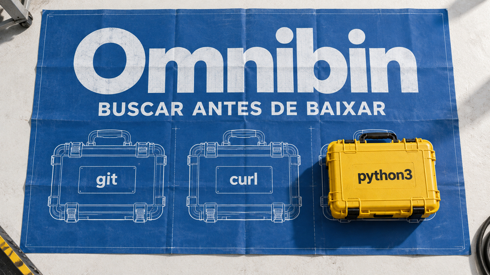

O Omnibin permite encontrar comandos antes de baixar seus pacotes: o conteúdo chega quando é lido. O Samba 4.25, por sua vez, testa uma forma de retomar o acesso a arquivos que estavam abertos antes de uma interrupção do servidor. E o OpenTelemetry mostra por que um catálogo de instrumentação não substitui testes da telemetria emitida. As três novidades ajudam a distinguir o que uma ferramenta oferece das condições necessárias para usá-la.

## Omnibin usa um índice do Nixpkgs para buscar programas sob demanda

Farid Zakaria apresentou em 24 de setembro o **Omnibin**, um sistema de arquivos baseado em FUSE, mecanismo que permite implementar sistemas de arquivos fora do kernel. Ele coloca executáveis do histórico do Nixpkgs, a coleção de pacotes do ecossistema Nix, no caminho em que o terminal procura comandos.

O truque é separar **encontrar um arquivo** de **buscar seu conteúdo**. Um índice descreve o que existe nos arquivos de pacotes do cache do Nix. Assim, listar um diretório pode ser respondido só com metadados; quando um arquivo é lido, o conteúdo necessário é baixado e descompactado. Os programas não estão todos ocupando o disco desde o começo.

Na demonstração do autor, aparecem 51.468 nomes de executáveis. Versões históricas também podem ser acessadas explicitamente: `python3@3.6.2`, por exemplo, resolve uma versão antiga, enquanto o nome simples aponta para a mais recente disponível no índice. Isso torna a escolha de versão relevante: disponibilidade histórica não significa que uma versão antiga seja adequada para produção.

O custo não desaparece; muda de momento. Na demonstração de Zakaria, a primeira execução de Python leva cerca de **2,7 segundos**; outra execução, com os arquivos já presentes, leva **35 milissegundos**. Os comandos usam expressões diferentes. Isso ilustra o custo inicial do download, mas não constitui um teste controlado nem uma garantia para outros programas, redes ou máquinas.

A proposta é interessante para explorar ferramentas e preparar ambientes descartáveis. Mas o exemplo com Docker exige acesso a `/dev/fuse` e a capacidade administrativa `SYS_ADMIN`. Não é uma receita de isolamento seguro para agentes só porque roda em container. Antes de experimentar com código não confiável, avalie essas permissões; antes de depender da ferramenta num fluxo repetível, escolha as versões e meça o primeiro acesso.

Fonte: [Farid Zakaria — apresentação e demonstração do Omnibin](https://fzakaria.com/2026/09/24/every-package-is-already-installed).

## Samba 4.25 testa a retomada de arquivos abertos após interrupções

O Samba, usado para compartilhar arquivos pelo protocolo SMB, lançou a versão 4.25.0 em 24 de setembro. Uma novidade é o suporte experimental a **SMB3 Persistent Handles**. Um *handle* é a referência que o cliente usa para trabalhar com um arquivo aberto. Preservá-la permite que ele se reconecte depois de uma reinicialização ou interrupção do servidor sem precisar reabrir o arquivo.

Para isso, o Samba precisa guardar em armazenamento durável o estado dessas referências. Operações como abrir e fechar arquivos passam a depender da gravação síncrona de metadados, o que aumenta a latência. As notas não recomendam o recurso para servidores de uso geral: ele atende a necessidades específicas de disponibilidade contínua.

Há uma restrição decisiva: os compartilhamentos precisam ser **exclusivos para acesso SMB**. As configurações exigidas desativam a interoperabilidade de bloqueios com acesso POSIX local e clientes NFS. Quem usa vários caminhos para acessar os mesmos arquivos não deve simplesmente ligar a opção.

Em clusters, também é preciso decidir qual falha suportar. O modo `full_outage` mantém uma cópia persistente adicional e permite sobreviver à parada de todos os nós. O modo `partial_outage` evita esse custo, mas só preserva as referências enquanto pelo menos um nó continua funcionando. Se todos pararem, elas se perdem.

Para quem administra Samba, o primeiro passo é testar a reconexão e a latência no cenário real. A versão 4.25.0 é estável, mas isso não torna estável esse recurso experimental.

Fonte: [Samba — notas oficiais da versão 4.25.0](https://www.samba.org/samba/history/samba-4.25.0.html).

## OpenTelemetry separa catálogo de instrumentação e testes do que ela realmente emite

O OpenTelemetry reúne padrões e ferramentas para produzir e transportar telemetria, como métricas e rastros de execução. As convenções definem nomes e significados comuns para esses dados; isso não garante que todas as bibliotecas os emitam da mesma forma.

Num artigo de 25 de setembro, o projeto descreve duas frentes. O **Ecosystem Explorer** já permite consultar componentes do agente Java e do Collector, incluindo informações e comparações entre versões. Separadamente, testes de conformidade executam pequenos cenários e coletam a telemetria. O Weaver é a ferramenta usada nessa etapa para conferir se os dados seguem as convenções e expectativas declaradas.

A diferença importa: consultar o catálogo mostra o comportamento descrito; executar um teste mostra o que apareceu naquela execução. **Conectar os resultados medidos aos componentes e versões do Explorer ainda é trabalho futuro.** Não se trata de uma certificação pronta de todo o ecossistema.

No recorte de clientes HTTP apresentado, os quatro atributos obrigatórios exibidos apareceram em quase todas as instrumentações testadas; os dois recomendados foram menos consistentes. Um campo ausente num cenário não prova que a biblioteca nunca o emita: configuração e caminho de execução também interferem.

Para quem mantém dashboards, a consequência prática é testar os sinais dos quais eles dependem antes de atualizar a instrumentação. Registre versão, configuração, cenário e convenção usada na comparação. “Suporta OpenTelemetry” é um ponto de partida, não a confirmação de que sua consulta continuará encontrando todos os campos.

Fonte: [OpenTelemetry — atualização sobre o ecossistema de instrumentação](https://opentelemetry.io/blog/2026/exploring-instrumentation-ecosystem/).

## Destaques rápidos para hoje.

- **Topcoat 0.9 adiciona atualizações de interface por WebSocket.** O framework para aplicações web em Rust anunciou a versão em 24 de setembro. Ele combina renderização no servidor com expressões de um subconjunto de Rust convertidas em JavaScript para interações locais. Já os componentes chamados *shards* voltam ao servidor quando seus parâmetros mudam e recebem HTML atualizado. O novo envio contínuo pelo servidor serve, por exemplo, para interfaces de chat. A distinção evita uma expectativa errada: escrever a aplicação em Rust não elimina as viagens de rede. Fonte: [Tokio — anúncio do Topcoat](https://tokio.rs/blog/2026-09-24-topcoat-server-applications).

- **GitHub detalha a migração de CSS-in-JS para CSS Modules.** No relato publicado hoje, a equipe explica como tirou a geração de estilos em tempo de execução e passou a entregar folhas CSS, com classes locais por padrão. Na etapa de migração dos componentes Primer, concluída em dezembro de 2024, relata 55% menos tempo de renderização no servidor e 25% menos tempo de inicialização dos componentes. São resultados internos daquela etapa, não ganhos garantidos para qualquer site. A migração completa é descrita como concluída em junho de 2026; a novidade de hoje é o relato, não uma troca feita agora. Feature flags e testes de regressão visual permitiram avançar gradualmente. Fonte: [GitHub — desempenho e migração para CSS Modules](https://github.blog/engineering/architecture-optimization/improving-site-performance-by-shipping-more-css/).

- **José Valim propõe ferramentas que agentes possam consultar, além de ler código.** Num ensaio de 24 de setembro, o criador do Elixir sugere expor símbolos, referências e relações entre funções como uma base consultável. Um agente poderia compor perguntas sobre o programa, em vez de depender só de posições em arquivos. Ele também defende observabilidade acessível programaticamente e garantias por tipos, isolamento e testes. É uma proposta de direção para as ferramentas, não demonstração de superioridade universal de uma linguagem. Fonte: [Dashbit — linguagens de programação na era da IA](https://dashbit.co/blog/evolving-ai-era).

- **CERT/CC divulga três falhas de injeção de scripts no Readwise Reader para Android 8.7.2.** Segundo o aviso de hoje, documentos ou metadados maliciosos podem executar JavaScript na WebView, o componente que renderiza conteúdo dentro do aplicativo, expondo dados do usuário. O CERT informa que a versão 8.10.1 corrige o problema de atributos permissivos no sanitizador, mas isso **não confirma a correção das três falhas**. O órgão não recebeu declaração do fornecedor. Mantenha o aplicativo atualizado e evite importar conteúdo não confiável; o aviso consultado não apresenta confirmação de exploração em ataques. Fonte: [CERT/CC — VU#699627](https://kb.cert.org/vuls/id/699627).

- **curl completa 25 anos nos sistemas da Apple.** Daniel Stenberg relembra que o utilitário de transferência de dados chegou ao OS X 10.1 em 25 de setembro de 2001. No texto de aniversário, ele celebra a adoção e afirma que o projeto nunca recebeu patrocínio da Apple, com comunicação direta rara. É o relato do mantenedor sobre a relação com a empresa: ampla distribuição de software livre não implica, por si só, financiamento de quem o mantém. Fonte: [Daniel Stenberg — 25 anos nos computadores Apple](https://daniel.haxx.se/blog/2026/09/25/25-years-on-apple-computers/).

> Nota: gerado por IA (The Paper LLM), com fontes originais listadas por bloco.

<!--
briefing_id: 27965
source_urls:
  - https://fzakaria.com/2026/09/24/every-package-is-already-installed
  - https://www.samba.org/samba/history/samba-4.25.0.html
  - https://opentelemetry.io/blog/2026/exploring-instrumentation-ecosystem/
  - https://tokio.rs/blog/2026-09-24-topcoat-server-applications
  - https://github.blog/engineering/architecture-optimization/improving-site-performance-by-shipping-more-css/
  - https://dashbit.co/blog/evolving-ai-era
  - https://kb.cert.org/vuls/id/699627
  - https://daniel.haxx.se/blog/2026/09/25/25-years-on-apple-computers/
-->
