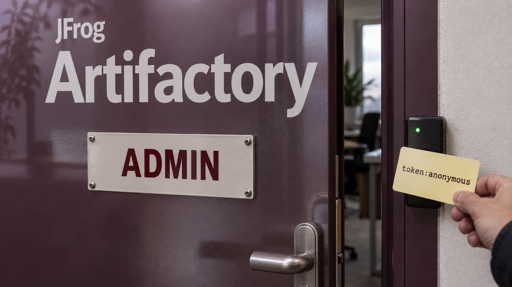

Você quer deixar um agente investigando um problema, acompanhar o andamento e continuar a conversa depois. Parece simples até começar a montar: guardar estado, executar ferramentas, recuperar a sessão, organizar o contexto. A OpenAI colocou esse encanamento do Codex atrás de uma API em beta público. Dá para deixar uma parte considerável do trabalho com ela. Quais arquivos e credenciais entram nesse ambiente, porém, ainda é decisão sua.

## OpenAI oferece sessões duráveis do Codex na Agents API

A OpenAI lançou a **Agents API em beta público em 10 de setembro**. Ela expõe o *harness* do Codex, a estrutura ao redor do modelo que organiza chamadas de ferramentas, mantém o estado da conversa e permite retomar o trabalho.

Se você está integrando tarefas de programação, investigação ou análise de dados em segundo plano, é esse ciclo que a API assume. Sua aplicação fornece instruções e ferramentas, escolhe onde o trabalho executa e conversa com uma sessão que continua entre turnos. A API cuida da orquestração, da compactação do contexto e da recuperação.

Acompanhe uma tarefa: a aplicação cria uma sessão e envia a entrada. O agente trabalha, enquanto você recebe eventos em streaming ou notificações por webhook. Pode orientar o agente durante a execução e, depois, enviar outra entrada à mesma sessão para continuar de onde ele parou.

A documentação divide isso em quatro peças. O agente reúne modelo, instruções e ferramentas, incluindo integrações pelo protocolo MCP. O ambiente é o computador ou sandbox opcional onde o código executa. A sessão é a instância durável do trabalho. Eventos e itens carregam as entradas e saídas. Fica mais fácil separar o que o agente sabe fazer de onde ele tem permissão para fazer.

O harness também tem comandos, skills, subagentes e retomada de tarefas. Você pode usar ambientes hospedados pela OpenAI ou conectar os seus. A infraestrutura vem pronta em boa parte; configurar onde ela vai executar fica com a aplicação.

E a cobrança? Segundo a documentação, o modelo segue sua tarifa de API, as ferramentas seguem as tarifas normais de cada uma e os sandboxes da OpenAI usam as tarifas de contêiner. São componentes separados na conta. A documentação citada deixa em aberto o preço total por tarefa e não apresenta ganho medido de produtividade.

Eu leria a orientação sobre credenciais antes de ligar o primeiro ambiente. **Código gerado pelo agente pode acessar os arquivos, a rede e os segredos disponibilizados ali.** A OpenAI recomenda computação isolada, ambientes separados para usuários ou cargas que não devem compartilhar dados, destinos de saída aprovados e intermediação do acesso a serviços de terceiros.

Tem duas chaves nessa história. A chave da aplicação autoriza as operações da API e deve ficar fora do sandbox. Num executor próprio, a chave restrita de ambiente aparece como `CODEX_API_KEY`: serve para conectar ambientes e não autoriza as outras ações da API. A orientação de segurança diz explicitamente que o código gerado pelo agente consegue ler essa chave restrita.

Então mantenha a credencial principal do lado da aplicação e dê ao ambiente apenas o acesso necessário à tarefa. A sessão cuida da continuidade do trabalho; as permissões do ambiente determinam o que o código pode acessar. São decisões separadas na integração.

Para quem já estava montando essa coordenação ao redor das chamadas ao modelo, a proposta é útil. Eu começaria com uma tarefa delimitada, conferindo as ferramentas de que ela precisa e os dados que podem entrar no ambiente. O beta entrega bastante coisa pronta. A chave mestra ainda não precisa ir junto no kit de boas-vindas.

Fontes: [OpenAI — changelog da API](https://developers.openai.com/api/docs/changelog), [visão geral da Agents API](https://developers.openai.com/api/docs/guides/agents-api/overview), [guia de início](https://developers.openai.com/api/docs/guides/agents-api/quickstart.md) e [segurança dos ambientes](https://developers.openai.com/api/docs/guides/agents-api/environments/security.md).

## Ataques ao Artifactory deram poderes de administrador a um token anônimo

Uma credencial também está no centro do relatório que a Wiz publicou em 10 de setembro. A empresa observou atacantes combinando duas falhas em instalações próprias do Artifactory para obter autoridade de administrador e criar persistência. A atividade ocorreu entre 15 de agosto e 8 de setembro. O que saiu agora foi a investigação, com os caminhos de ataque e os sinais deixados no ambiente.

O Artifactory guarda pacotes e artefatos que pipelines de integração e build consomem. Um invasor administrando esse serviço já dá motivo para se preocupar com a cadeia de fornecimento de software. A Wiz relata o que encontrou nas próprias investigações, sem um censo global de vítimas ou comprovação de substituição de pacotes nas etapas seguintes dos builds.

A primeira falha, **CVE-2026-42018**, pode entregar um token interno do usuário anônimo a alguém sem autenticação. Segundo o advisory da JFrog, isso pode acontecer mesmo com o acesso anônimo desabilitado. Você desliga o acesso anônimo. O serviço ainda entrega o token dele.

A segunda, **CVE-2026-42016**, está na validação do que o token permite fazer. O serviço confere assinatura e emissor, mas não aplica corretamente o escopo de autorização. Com as duas falhas combinadas, os atacantes observados pela Wiz conseguiram elevar os privilégios.

A assinatura permite verificar a autenticidade do token. O escopo define quais ações aquela identidade pode executar. O problema descrito está na aplicação desse limite de acesso; a investigação não demonstra quebra da criptografia da assinatura.

Nos logs, tem um detalhe especialmente traiçoeiro: o token elevado preserva o nome do usuário anônimo. Uma ação privilegiada pode aparecer atribuída a `token:anonymous`. Se você estiver investigando, procure identidades de baixo privilégio criando tokens, enumerando usuários ou acessando plugins. O nome parece inofensivo; o verbo da linha de log conta outra história.

A Wiz observou contas administrativas persistentes, plugins Groovy maliciosos e instalação de payloads. Em múltiplos casos, encontrou backdoors personalizados em Rust. O relatório reúne investigações envolvendo vários atores, e ressalta que nenhum deles executou necessariamente todos os passos descritos.

[Já cobrimos a entrada da CVE-2026-82329 no catálogo de falhas exploradas em setembro](/2026/kubernetes-1-37-leva-o-hpa-a-zero-e-skills-enviesam-agentes/). O relatório novo também traz observações sobre ela, entre 1º e 8 de setembro: contas persistentes, tokens de longa duração e, em alguns casos, roubo de chaves de ingresso no cluster. Ela é uma falha separada de bypass de autenticação, fora da cadeia de duas falhas descrita acima. O episódio também é distinto da [avaliação anterior com agentes da OpenAI](/2026/agentes-da-openai-tomam-artifactory-claude-code-cai-em-arquivo-python-e-hy4-abre-770b/).

Se você mantém Artifactory, inventarie a versão e confira a orientação **“How to Fix” da JFrog para cada falha e para sua linha de versões**. A fabricante lista 7.133.11 como correção da validação de escopo. As outras duas falhas têm correções distribuídas por diferentes linhas. O patch de uma delas numa linha antiga, sozinho, não comprova que a validação de escopo também foi corrigida.

As tabelas da Wiz e da fabricante divergem em versões corrigidas para a exposição do token anônimo. Na hora de escolher a atualização, use os valores explícitos de correção da JFrog, em vez de deduzir a cobertura pelos intervalos. Para a falha separada de bypass, a JFrog informa que as instâncias afetadas de sua nuvem já foram reforçadas e não exigem ação do cliente.

Nas instalações próprias, atualize, restrinja a exposição e revise a atividade de autenticação e administração. Procure contas inesperadas, tokens e plugins. O patch fecha o caminho vulnerável; contas criadas pelo invasor e código já instalado exigem investigação e remoção próprias. O instalador não vem com a lista de hóspedes que entraram antes dele.

Fontes: [Wiz — Artifactory sob ataque](https://www.wiz.io/blog/artifactory-under-attack-in-the-wild-exploitation-of-cve-2026-42016-cve-2026-4201) e [JFrog — advisories e versões corrigidas](https://docs.jfrog.com/releases/docs/jfrog-security-advisories).

## ChurnBench mede quando o agente raciocina sobre dados que já venceram

Imagine perguntar quem usa uma licença de software. O agente consulta um registro salvo, encontra um nome e responde de forma consistente. Só que a licença foi reatribuída depois da consulta. A resposta pode estar bem fundamentada no material recuperado e errada na hora em que você a confere.

Vivek Kumar Singh e Preeti Priyam apresentaram o **ChurnBench**, um benchmark para separar esse erro de atualização de um erro de raciocínio. A primeira versão do preprint foi submetida em 10 de setembro. Ele avalia agentes sobre dados empresariais que mudam ao longo do tempo e usa um registro independente de eventos para determinar as respostas corretas.

[Ontem falamos do Fortunate Recall e das regras para retirar memórias antigas de agentes](/2026/deepseek-reduz-o-cache-e-github-explica-a-fila-que-insistia-em-jobs-cancelados/). O ChurnBench é um trabalho separado, voltado à avaliação: ele confere se a informação recuperada ainda vale, enquanto o Fortunate Recall trata da retirada das memórias.

O ambiente de referência simula uma empresa com ativos de software, licenças, usuários, consumo, centros de custo e contratos. Os dados são sintéticos e ficam espalhados por quatro tipos de fonte: PostgreSQL, MongoDB, uma API simulada de serviço externo com limite de requisições e documentos locais de contratos e políticas.

Cada mudança entra num histórico que só recebe novos eventos, o *ledger*. As respostas de referência vêm dali, em vez de serem calculadas nas mesmas visões possivelmente desatualizadas que o agente consultou. Pedir ao cache vencido que confira a resposta baseada nele seria uma auditoria bastante amigável.

O teste confere o que era verdade em dois momentos: quando a informação foi recuperada e quando a resposta é avaliada. Se a resposta estava certa no primeiro instante e deixou de estar certa depois, o benchmark registra um erro de atualização. Se já estava errada quando os dados foram buscados, o problema é outro.

Para quem mantém um agente de consulta, a pergunta fica mais útil: ele interpretou mal o que leu ou recebeu uma fotografia antiga? Cada diagnóstico manda você olhar para uma parte diferente da implementação.

Os autores compararam a política de atualização por níveis ligada e desligada, com a opção de raciocínio `enable_thinking=False` nas duas condições. Na coluna D+1, ambas registraram sete erros de atualização. Na coluna que os autores chamam de D+28, foram **quatro erros com a política ligada e 45 com ela desligada**.

São contagens daquele experimento sintético, reportadas pelos autores e sem reprodução independente nesta cobertura. A comparação avalia essa configuração de atualização, com quatro erros ainda presentes na condição ligada. Percentuais de acerto, ranking entre modelos e uma redução universal ficam fora do que esses números permitem concluir.

Se você quiser experimentar o método na equipe, uma reatribuição de licença ou a saída de um usuário pode servir como mudança controlada. Registre quando aconteceu, quando a informação foi buscada e o que o agente respondeu antes e depois. É uma sugestão de aplicação do método; os resultados medidos pelo artigo são os da comparação acima.

Olhe também para a última atualização de cada informação. O tempo desde a criação do cache inteiro é diferente do tempo desde a última conferência daquele registro específico. O ChurnBench leva essa diferença para a avaliação. Antes de pedir ao modelo que pense mais, confira a data do material sobre o qual ele está pensando. Às vezes a resposta tem lógica; o calendário é que já passou por cima dela.

Fontes: [ChurnBench — preprint, versão 1](https://arxiv.org/abs/2609.11515v1) e [repositório dos autores, método e resultados reportados](https://github.com/vsingh45/churnbench).

## Destaques rápidos para hoje.

- **Forgejo 16.0.4 e 15.0.8 corrigem execução de processos a partir de templates maliciosos.** A expansão do template podia recriar uma pasta `.git` antes da inicialização do repositório, permitindo leitura arbitrária de arquivos do host e execução de processos. Atualize a linha que você mantém. A correção é distinta das [mudanças de segurança do Forgejo 16 de julho](/2026/forgejo-16-fecha-atalhos-agentes-ganham-freio-e-vllm-ganha-volume/); as notas não estabelecem exploração ativa dessa falha. Fontes: [Forgejo 16.0.4](https://codeberg.org/forgejo/forgejo/src/branch/forgejo/release-notes-published/16.0.4.md) e [Forgejo 15.0.8](https://codeberg.org/forgejo/forgejo/raw/branch/forgejo/release-notes-published/15.0.8.md).

- **Datasette pede atualização para 0.65.4 ou 1.0a39, especialmente em instâncias públicas com dados privados.** São novas correções depois das [versões que cobrimos em agosto](/2026/css-engana-webmail-e-agentes-freebsd-expoe-root-e-o-compilador-rele-a-memoria/). Na linha estável, elas ajustam a verificação de permissões de tabelas e views sem distinção de maiúsculas e minúsculas e marcam respostas privadas ou personalizadas com `Cache-Control: private, no-store`. O Datasette Cloud já recebeu os patches. Parte dos testes foi retida para dar tempo de atualizar; o anúncio não estabelece exploração ativa. Fontes: [Datasette — anúncio de segurança](https://datasette.io/blog/2026/september-security-releases/) e [changelog da 0.65.4](https://docs.datasette.io/en/stable/changelog.html#v0-65-4).

- **PaperCut NG/MF passa dos patches emergenciais para versões normais de manutenção.** As versões 26.0.5, 25.0.13 e 24.1.10 incorporam as correções e reforços adicionais. Quem está sem patch ou nos Emergency Patch Releases 1 e 2 deve atualizar agora. Quem aplicou o Release 3, [que recomendamos antes](/2026/hydrafusion-poe-modelos-para-trabalhar-juntos-e-mikrotik-pede-patch/), continua protegido contra os problemas do boletim e pode agendar a migração normalmente. A atualização de 10 de setembro trata dessa passagem para manutenção, sem anúncio de um novo bypass do Release 3. Fonte: [PaperCut — boletim atualizado e orientação por patch](https://www.papercut.com/kb/Main/security-bulletin-27-aug-2026-urgent-security-advisory/).

- **Kubernetes 1.37 pode remover pods de menor prioridade para um pod existente crescer.** A explicação oficial de 10 de setembro detalha a preempção para redimensionamento no próprio nó, recurso alpha e opcional controlado por `InPlacePodVerticalScalingSchedulerPreemption`. Diferentemente dos [status de manutenção de ontem](/2026/deepseek-reduz-o-cache-e-github-explica-a-fila-que-insistia-em-jobs-cancelados/), esse recurso age sobre as cargas: pods elegíveis podem ser interrompidos para liberar recursos. Se ainda faltar capacidade naquele nó, o redimensionamento continua adiado. O pod cresce sem mudar de endereço; os vizinhos de menor prioridade podem pagar a mudança. Fonte: [Kubernetes — preempção para redimensionamento de pods](https://kubernetes.io/blog/2026/09/10/kubernetes-v1-37-scheduler-preemption-for-in-place-pod-resize-alpha/).

> Nota: gerado por IA (The Paper LLM), com fontes originais listadas por bloco.

<!--
briefing_id: 27118
source_urls:
  - https://developers.openai.com/api/docs/changelog
  - https://developers.openai.com/api/docs/guides/agents-api/overview
  - https://developers.openai.com/api/docs/guides/agents-api/quickstart.md
  - https://developers.openai.com/api/docs/guides/agents-api/environments/security.md
  - https://www.wiz.io/blog/artifactory-under-attack-in-the-wild-exploitation-of-cve-2026-42016-cve-2026-4201
  - https://docs.jfrog.com/releases/docs/jfrog-security-advisories
  - https://arxiv.org/abs/2609.11515v1
  - https://github.com/vsingh45/churnbench
  - https://codeberg.org/forgejo/forgejo/src/branch/forgejo/release-notes-published/16.0.4.md
  - https://codeberg.org/forgejo/forgejo/raw/branch/forgejo/release-notes-published/15.0.8.md
  - https://datasette.io/blog/2026/september-security-releases/
  - https://docs.datasette.io/en/stable/changelog.html#v0-65-4
  - https://www.papercut.com/kb/Main/security-bulletin-27-aug-2026-urgent-security-advisory/
  - https://kubernetes.io/blog/2026/09/10/kubernetes-v1-37-scheduler-preemption-for-in-place-pod-resize-alpha/
-->
