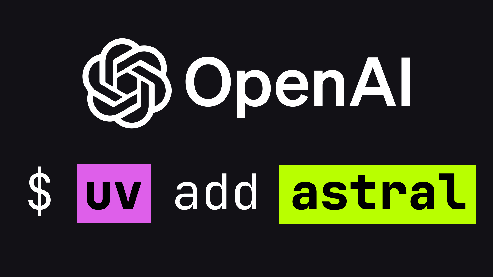

Eu não sou o cara das news, como você já deve ter notado pelo meu conteúdo. Mas
aqui não deu pra pular.

A
[OpenAI acabou de anunciar a compra da Astral](https://openai.com/index/openai-to-acquire-astral/).
Só pra te lembrar: Astral é a empresa por trás do `Ruff`, do `uv` e do `ty`. Ou
seja, o linter mais rápido do ecossistema Python, o gerenciador de pacotes que
tá substituindo pip, poetry, pyenv e companhia, e o type checker novinho que
acabou de sair.

Se você acompanha o canal, sabe que eu uso e recomendo
[bastante o `uv`](https://youtu.be/HuAc85cLRx0?si=E_68NaPogXqY_NE4) e o `ruff`.
Falei disso até no
[meu curso de Python](https://www.udemy.com/course/python-3-do-zero-ao-avancado/?referralCode=5DDCAD01311E2A9599B2).

Fiz aquele
[vídeo de Docker com uv e multistage build](https://youtu.be/IeyO3TnHcaw?si=e1g7YlcquGc8mxby)
que a galera gostou bastante. Então sim, eu tenho skin in the game aqui. Essas
ferramentas fazem parte do meu dia a dia e do que eu ensino. Bora entender o que
tá acontecendo.

---

## A compra

Dia 19 de março de 2026 (também conhecido como poucas horas atrás), a OpenAI
anuncia que vai adquirir a Astral. Ambas as empresas já estão anunciando em
[seus blogs](https://astral.sh/blog/openai).

O time inteiro vai ser absorvido pela divisão do Codex, aquele produto de coding
com IA da OpenAI que já tem mais de 2 milhões de usuários semanais e que uso
constantemente.

O Charlie Marsh, fundador da Astral, disse que vai continuar construindo
abertamente, junto com a comunidade.

A OpenAI prometeu manter os projetos open source.

Valor da aquisição? Não divulgaram. A Astral tinha levantado uns
[4 milhões em seed com Accel e Caffeinated Capital](https://astral.sh/blog/announcing-astral-the-company-behind-ruff),
mais uma Series A e uma Series B, nada absurdo comparado com as outras loucuras
que a OpenAI anda comprando.

A OpenAI já tinha comprado a
[empresa do Jony Ive por 6,4 bilhões de dólares](https://exame.com/inteligencia-artificial/openai-compra-startup-do-criador-do-iphone-por-us-64-bilhoes-e-mira-levar-ia-ao-mundo-fisico/),
tentou comprar a Windsurf por 3 bilhões, mas não deu certo e contratou o
[Dev do OpenClaw](https://steipete.me/posts/2026/openclaw) (não sei dizer se
compraram o OpenClaw por que realmente não verifiquei). Mas, o ponto é que a
Astral deve ter saído barata para eles.

---

## Motivações da OpenAI

E aí a primeira pergunta que vem na cabeça: por que a OpenAI, uma empresa de IA,
quer comprar ferramentas de linting e gerenciamento de pacotes Python?

Três motivos que fazem total sentido pra mim.

**Primeiro: velocidade.** As ferramentas da Astral são escritas em Rust. O Ruff
processa um arquivo em menos de 10 milissegundos. O `uv` resolve dependências
numa fração de segundo. Quando você tem um agente de IA iterando num problema
centenas de vezes, a diferença entre 10 milissegundos e 2 segundos por
verificação é a diferença entre funcionar e não funcionar. Pra agente autônomo,
Python tooling tradicional é lento demais.

**Segundo:** o ciclo completo. O Codex hoje gera código. Mas a OpenAI quer que
ele faça tudo: montar o ambiente com uv, lintar com Ruff, checar tipos com ty,
rodar testes. Um workflow ponta a ponta, autônomo. As peças encaixam
perfeitamente.

**Terceiro:** distribuição. O `uv` já tem centenas de milhões de downloads por
mês. FastAPI, Django, Pandas, Spark, tudo já usa ou tá migrando. A OpenAI compra
acesso direto a milhões de desenvolvedores Python. É um canal de distribuição
absurdo por provavelmente uma fração do preço das outras aquisições deles. Do
ponto de vista de negócio? Brilhante.

---

## Comunidade Dev e Open Source

Agora... a comunidade? Não posso falar por todos e também não tenho nada contra
a OpenAI. Mas, de cara, o que me assustou foi que o `uv` e o `ruff` são
ferramentas que estão no coração de boa parte do que faço com Python
(atualmente, tudo). O problema é que a OpenAI queima dinheiro num ritmo absurdo
e ainda não gera lucro. Então, o meu sentimento é medo. Será que vou ter que
sair mudando base de código antiga? Preciso regravar vídeos? Não sei...

Busquei pela Internet afora e encontrei algumas coisas. O sentimento não está
muito distante do meu.

No Hacker News, as threads explodiram. Chutando por baixo, diria que uns 70 a
75% dos comentários são negativos ou céticos.

A preocupação número um é a mesma que tive: **a saúde financeira da OpenAI**.

E olha, não sou eu falando. A própria
[OpenAI projeta 14 bilhões de dólares em prejuízo pra 2026](https://finance.yahoo.com/news/openais-own-forecast-predicts-14-150445813.html).
Eles gastam dois dólares e cinquenta pra cada dólar que faturam. Não esperam
fluxo de caixa positivo antes de 2029, 2030. Então você pega infraestrutura
Python crítica e coloca debaixo do guarda-chuva de uma empresa que depende de
injeção constante de VC pra sobreviver. Se a bolha de IA esfriar ou se alguém
espirrar na direção errada... JÁ ERA!

Um cara no [HN resumiu bem](https://news.ycombinator.com/item?id=47438723):
"mais funcionalidades essenciais das quais desenvolvedores dependem passam a
depender de um fluxo contínuo de bilhões em financiamento VC. O que poderia dar
errado?"

A segunda preocupação é **enshittification**. Todo mundo já está imaginando:
daqui a pouco você roda `uv add` e o negócio quer te oferecer uma sugestão do
Codex.

Ou o `Ruff` começa a ter features premium integradas. Alguém brincou com um
cenário de `UV_DISABLE_AGENT=1 UV_DISABLE_AI_HINTS=1 uv add`. Engraçado, mas é o
tipo de humor nervoso, né?

E faz sentido. Imagina que você é uma empresa e precisa urgentemente de capital!
A ideia é tentar arrancar grana de onde quer que ela venha.

A terceira é mais filosófica mas importa: **assimetria informacional**. Se os
autores das ferramentas agora são funcionários da OpenAI, o que impede versões
internas de evoluírem mais rápido que as públicas? O Codex teria uma vantagem
sobre Claude Code e Copilot que não é justa.

Ah, e teve o
[comentário que eu achei genial](https://news.ycombinator.com/item?id=47438723):
"Empresa que vive dizendo que desenvolvedores de software vão ser substituídos
por IA... compra mais desenvolvedores em vez de usar a própria IA pra fazer
software." Né?

Pelo jeito, ainda estamos precisando bastante de Devs.

---

## E eu? O que penso?

Beleza, eu já falei algumas vezes no texto, mas deixo minha opinião sincera como
alguém que ensina Python e usa essas ferramentas todo dia?

Olha, eu sou bem pragmático. Vou continuar usando `uv` e `Ruff` amanhã do mesmo
jeito que usei ontem. Nada muda na prática agora. As ferramentas são MIT e
Apache 2.0. Se a OpenAI fizer besteira, dá pra forkar.

Mas tenho que ser honesto: eu não tô confortável. O motivo é simples: não é
sobre a OpenAI especificamente, é sobre o **padrão**.

A Anthropic comprou a Bun em dezembro de 2025. A OpenAI compra a Astral agora. O
Google contratou os fundadores da Windsurf por 2,4 bilhões. A Microsoft já tem o
GitHub e o Copilot. Toda empresa de IA tá engolindo infraestrutura de
desenvolvedor.

OpenAI captura Python. Anthropic captura JavaScript. E os devs ficam onde nessa
história?

O risco real não é agora. É daqui a 2, 3 anos. Quando a pressão por monetização
bater, quando o investidor cobrar retorno, é aí que as promessas de "vamos
manter tudo aberto" começam a ficar... flexíveis.

A história da tecnologia nos ensina isso. Promessa corporativa sobre open source
tem prazo de validade.

---

## O que fazer?

Pra finalizar: o que eu recomendo?

NADA! "Apenas sorria e acene, rapazes! Sorria e acene!" 🐧 👋

Continue usando `uv` e `Ruff`. Não faz sentido trocar agora. São as melhores
ferramentas que o ecossistema Python já teve, e isso não mudou. Pelo menos para
mim não muda nada ainda.

Mas fica de olho. Presta atenção nos releases. Se começar a aparecer integração
forçada com Codex, funcionalidade que só funciona com conta da OpenAI, qualquer
coisa desse tipo, aí a gente reavalia. Talvez troque!

E a comunidade Python tem um dever de casa: garantir que a possibilidade de fork
seja real e não só teórica. Porque um dia a gente pode precisar.

---

## Fim

É isso. Se você trabalha com Python, essa notícia te afeta diretamente. Cola nos
comentários me dizendo o que você acha. Esse tipo de conteúdo é novo pra mim.

Valeu. Até o próximo.

---
