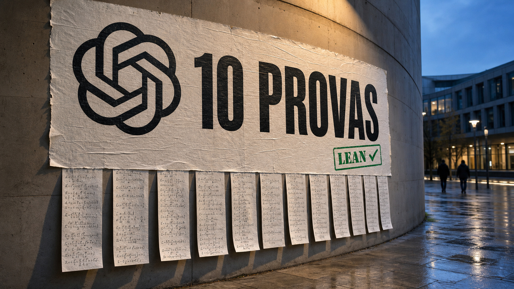

Dez resultados matemáticos importantes apareceram de uma vez. Junto deles, vieram 249 páginas de argumentos e certificados que um verificador consegue conferir passo a passo. É um pacote que merece atenção, mas também aquela sobrancelha levantada na altura correta.

A OpenAI diz que uma versão interna do Astra, seu próximo grande modelo ainda não lançado, produziu os argumentos. Humanos escolheram os problemas e prepararam os manuscritos com ajuda do mesmo sistema, que também formalizou as provas em Lean. Dá para examinar bastante coisa no material público. O que não dá é repetir o processo que levou às soluções.

## Astra gerou os argumentos, segundo a OpenAI

A empresa anunciou em 3 de agosto uma coleção de dez resultados em matemática e ciência da computação teórica. O paper e os metadados do repositório datam o pacote técnico de 1º de agosto. As áreas vão de geometria em alta dimensão e teoria de códigos a grupos, álgebras de operadores, complexidade, computação quântica, reticulados e combinatória.

Aqui é bom separar as etapas. Segundo a OpenAI, o Astra gerou os argumentos matemáticos. Depois, pesquisadores prepararam os textos com ajuda do modelo, e o sistema converteu os argumentos em certificados Lean. A empresa assume a responsabilidade pela correção, pede que a comunidade matemática revise e contextualize os resultados e afirma explicitamente que os argumentos vieram do sistema, não dos autores humanos.

Astra continua indisponível. A OpenAI não publicou os prompts completos, o harness, o hardware, as tentativas que falharam ou as execuções separadas de cada problema. Os walkthroughs de raciocínio também foram reconstruídos depois: um modelo leu as cadeias originais e os papers para produzir a explicação pública. Eles ajudam a entender a proposta, mas não são o registro bruto da descoberta. Por enquanto, não há API nem material suficiente para repetir o processo.

Fontes: [OpenAI — Ten advances in mathematics and theoretical computer science](https://openai.com/index/ten-advances-in-mathematics/) e [The New Stack](https://thenewstack.io/openai-astra-math-cost/).

## Os dez resultados atravessam áreas bem diferentes

O título “dez avanços” coloca trabalhos bem diferentes dentro do mesmo pacote. O paper apresenta estes resultados:

- a força assintótica exata do programa linear de Cohn–Elkies para empacotamento de esferas;
- limites exponencialmente melhores para códigos binários e esféricos;
- a construção explícita de um grupo não sófico;
- contraexemplos para a rigidez de Connes;
- limites inferiores para o permanente em modelos específicos de circuitos aritméticos;
- repetição exponencial para todo jogo entre dois participantes, finito e com emaranhamento quântico;
- uma dificuldade de aproximação do problema do vetor mais próximo, ou CVP, em distância euclidiana;
- o limite preciso de volume de Ehrhart;
- um limite inferior superexponencial para números de Ramsey multicoloridos;
- contraexemplos para duas conjecturas de teoria extremal de grafos.

Alguns desses nomes parecem uma reunião que esqueceu de convidar as vogais. Os exemplos ajudam a entender melhor o que saiu dali.

No empacotamento de esferas, a pergunta é quão densamente esferas iguais podem preencher um espaço de muitas dimensões. O paper afirma ter obtido a primeira melhora desde 1978 no expoente geral de alta dimensão. Na notação do trabalho, ele passa de 0,59905576... para 0,6044.... O capítulo sobre códigos também reivindica as primeiras melhorias gerais de expoente desde 1977 e 1978. Códigos binários e esféricos estudam quantas palavras ou pontos bem separados cabem num espaço, uma questão ligada a geometria, correção de erros e teoria da informação.

Na parte quântica, o resultado trata de repetição paralela. A ideia é exigir que os participantes vençam várias cópias independentes de um jogo com emaranhamento e verificar se a chance de sucesso cai exponencialmente. Segundo o paper, esse comportamento vale para todo jogo finito entre dois participantes com emaranhamento.

Há ainda um limite de Ehrhart igual a `(n+1)^n/n!` e um resultado de Ramsey expresso como `R_k(3)=k^Θ(k)`. Esses capítulos e os contraexemplos em grafos são resultados assintóticos e teóricos. Não vão virar uma biblioteca nova para instalar na aplicação de terça-feira.

Fonte: [paper “Ten Advances in Mathematics and Theoretical Computer Science”](https://cdn.openai.com/pdf/ten-proofs-oai.pdf).

## Complexidade e criptografia exigem leitura sem atalhos

Dois capítulos são especialmente fáceis de transformar numa manchete maior que o teorema.

O resultado sobre o permanente melhora limites inferiores em modelos restritos de computação aritmética. Circuitos sem divisão precisam de pelo menos Ω(n² log log n) portas. Fórmulas, que têm estrutura em árvore e não reaproveitam resultados da mesma forma, precisam de Ω(n⁴/log n) ocorrências de variáveis nas folhas. O próprio paper avisa: isso **não** estabelece `VP ≠ VNP` para circuitos gerais.

No capítulo de reticulados, o Astra teria encontrado uma redução determinística em tempo polinomial a partir de 3SAT. Ela estabelece dificuldade de aproximação por um fator `n^(1/400)` para o problema do vetor mais próximo em distância euclidiana. O trabalho também dá fatores `n^(1/200)` para decodificação binária e `n^(1/(200p))` para CVP em normas `ℓp` racionais e fixas.

CVP pede o ponto de um reticulado mais próximo de um alvo. O problema tem conexões fundamentais com a teoria de complexidade em torno da criptografia baseada em reticulados, inclusive a pós-quântica. O resultado publicado, porém, é um teorema de dificuldade de aproximação no pior caso. **Ele não quebra criptografia de reticulados** nem fornece um ataque prático contra um sistema criptográfico.

Esses limites não diminuem a notícia. Só deixam cada afirmação do tamanho que a evidência sustenta, uma unidade de medida bem mais útil.

Fonte: [paper “Ten Advances in Mathematics and Theoretical Computer Science”](https://cdn.openai.com/pdf/ten-proofs-oai.pdf).

## As provas em Lean deixam a alegação aberta à inspeção

Para quem está fora dessas especialidades, o repositório público talvez seja a parte mais concreta. A OpenAI disponibilizou um módulo Lean para cada área e incluiu instruções para baixar o cache do `mathlib` e compilar tudo com Lake. Os dois comandos principais são `lake exe cache get` e `lake build All`.

Lean não pergunta se uma demonstração é bonita ou importante. Definições, enunciados e termos de prova são codificados para que um kernel pequeno confira se cada passo obedece às regras lógicas. Um `sorry` seria um buraco aceito provisoriamente no lugar de uma obrigação ainda não provada. Segundo os metadados fornecidos pela OpenAI, não há nenhum nos resultados principais.

O mesmo arquivo registra 12 declarações principais, apesar das dez áreas. Códigos binários e esféricos aparecem separados, assim como os dois resultados de grafos. Os únicos axiomas listados para essas declarações são `propext`, `Classical.choice` e `Quot.sound`. A formalização teria consumido uma semana de tempo corrido e aparece com o status `agent-reviewed`.

Tudo isso vem dos metadados da própria OpenAI, não de uma auditoria externa. Esta pesquisa inspecionou o material público, mas não compilou e verificou localmente todos os módulos. Também não encontrou uma revisão matemática independente e pública dos dez argumentos.

O repositório inclui configurações do Comparator para exportar e conferir as provas com outra implementação, como o nanoda. Assim, a verificação não depende apenas de um kernel. Mesmo quando passa, ela prova o enunciado codificado em relação às regras, aos axiomas e ao verificador usados. Não diz se o enunciado formal representa fielmente toda a interpretação informal, se o resultado é novo ou quanto ele importa para aquela área.

Fontes: [repositório openai/ten-proofs](https://github.com/openai/ten-proofs) e [metadados da formalização](https://github.com/openai/ten-proofs/blob/main/formalization.yaml).

## O projeto usa uma versão anterior ao patch do Lean

Há mais um detalhe técnico que merece cuidado. O projeto fixa o Lean 4.32.0. Em 28 de julho, antes da publicação do pacote da OpenAI, saiu o Lean 4.32.2 com a correção recente de uma falha de soundness no kernel.

[Já falamos sobre esse bug do Lean](/2026/lean-aceitou-prova-de-falso-malware-usa-comando-colado-no-terminal/). Ele podia fazer o kernel de referência aceitar uma prova de `False`, atingindo a base de confiança do sistema. Leonardo de Moura, cofundador do Lean, explicou que o bug do kernel de referência era diferente daquele encontrado no antigo nanoda. É justamente por isso que verificadores independentes são úteis: uma implementação pode recusar uma construção que outra aceitou por engano.

Não há evidência de que os certificados da OpenAI explorem essa falha, e o pin em 4.32.0 não torna as provas inválidas por si só. O caminho sensato é reconstruir os artefatos com cuidado e rodar os verificadores independentes atuais. A prova formal reduz bastante o espaço para erro, mas a versão do verificador continua fazendo parte da história.

Fontes: [versão fixada pelo ten-proofs](https://github.com/openai/ten-proofs/blob/main/lean-toolchain), [postmortem de Leonardo de Moura](https://leodemoura.github.io/blog/2026-8-1-postmortem-for-kernel-soundness-bug-14576/) e [lançamento do Lean 4.32.2](https://github.com/leanprover/lean4/releases/tag/v4.32.2).

## Os US$ 2 mil não são o preço desta pesquisa

A OpenAI estima que os tokens usados para encontrar as soluções custariam aproximadamente US$ 2 mil se fossem cobrados pelas tarifas da API do Sol. A comparação sugere um custo de inferência relativamente baixo para problemas tão ambiciosos. Ainda assim, esse valor não é o preço do Astra nem o custo completo do trabalho.

Astra não tem preço de uso anunciado. A conta também deixa de fora treinamento, hardware, trabalho humano, preparação dos manuscritos, formalização, tentativas fracassadas e o restante da estrutura de pesquisa. Não há contagem de tokens por problema nem informação suficiente para reproduzir o benchmark. Os US$ 2 mil são uma conversão contrafactual da quantidade relatada de tokens pela tabela de outro modelo.

O resultado sobre rigidez de Connes também pede cuidado com a ideia de “dez descobertas independentes”. O capítulo reconhece que Shuoxing Zhou desenvolveu em paralelo outro contraexemplo, em parte com ajuda do GPT-5.6 Sol. A comunidade ainda precisa avaliar a precedência, a novidade e o significado do trabalho em cada área.

Mesmo com esses limites, é um fluxo de pesquisa incomum para um anúncio de IA. Há argumentos atribuídos ao modelo, manuscritos extensos, código formal e caminhos para checkers independentes. Só que a máquina que teria encontrado as soluções continua fechada, enquanto quase toda a avaliação inicial vem da organização que a construiu.

Agora os matemáticos podem atacar os enunciados, reconstruir as provas e descobrir onde cada resultado realmente pousa. A conversa sai um pouco do “o modelo afirmou” e entra num terreno em que outras pessoas conseguem conferir bastante coisa. Ainda não tudo.

Fontes: [anúncio da OpenAI](https://openai.com/index/ten-advances-in-mathematics/), [paper técnico](https://cdn.openai.com/pdf/ten-proofs-oai.pdf) e [análise do The New Stack](https://thenewstack.io/openai-astra-math-cost/).

> Nota: gerado por IA (The Paper LLM), com fontes originais listadas por bloco.

<!--
briefing_id: none
source_urls:
  - https://openai.com/index/ten-advances-in-mathematics/
  - https://cdn.openai.com/pdf/ten-proofs-oai.pdf
  - https://github.com/openai/ten-proofs
  - https://github.com/openai/ten-proofs/blob/main/formalization.yaml
  - https://github.com/openai/ten-proofs/blob/main/lean-toolchain
  - https://leodemoura.github.io/blog/2026-8-1-postmortem-for-kernel-soundness-bug-14576/
  - https://github.com/leanprover/lean4/releases/tag/v4.32.2
  - https://thenewstack.io/openai-astra-math-cost/
-->
