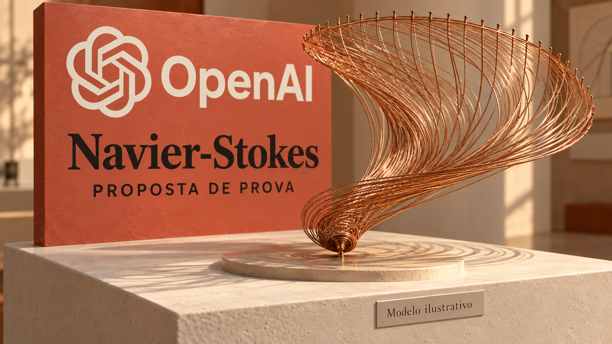

Um fluido começa parado, recebe uma força externa suave e chega a uma velocidade sem limite em tempo finito. A energia total continua limitada. Estranho? Bastante. Essa é a construção matemática que a OpenAI apresentou em 8 de setembro, numa proposta de prova para duas alternativas do problema de Navier–Stokes do Clay Mathematics Institute. A empresa publicou o artigo e uma formalização em Lean. Os dez mil agentes usados na busca chamam atenção, mas a palavra “suave” tem tanto assunto aí quanto eles.

## A velocidade cresce sem limite numa região que encolhe

As equações de Navier–Stokes descrevem a velocidade e a pressão de um fluido contínuo, incluindo o efeito suavizador da viscosidade. O fluido estudado é tridimensional e incompressível: ele preserva volume enquanto se move.

A pergunta é o que acontece com essa descrição ao longo do tempo. Se você parte de condições regulares, a solução consegue continuar suave? Ou surge uma singularidade em tempo finito, quando essa regularidade se perde?

“Suave”, aqui, significa que a função admite derivadas de todas as ordens. É uma propriedade matemática, e o movimento pode ser bem pouco sossegado. A matemática tem seu próprio departamento de nomes tranquilizadores.

O teorema apresentado pela OpenAI afirma que, **para cada viscosidade positiva**, existe uma força externa suave capaz de produzir uma solução com velocidade inicial zero e velocidade máxima ilimitada ao se aproximar de um instante finito. A energia cinética permanece uniformemente limitada até esse instante. A força tem ainda suporte compacto no espaço e no tempo: atua numa região e num intervalo limitados.

Como a velocidade pode crescer desse jeito sem levar a energia junto?

A energia soma contribuições ao longo do volume. Na construção descrita pelos autores, um núcleo de vórtice se contrai e acelera. A região com velocidades crescentes fica cada vez menor, o que permite manter a energia total limitada. Procurar o maior valor da velocidade e somar a contribuição de todo o volume dá duas medidas diferentes.

O trabalho difícil é conseguir isso mantendo a força regular. O artigo descreve pulsos oscilatórios e correções que cancelam partes singulares do balanço das equações, deixando a força externa suave. Colocar uma força infinita na entrada violaria justamente as condições que a construção precisa preservar enquanto a solução perde regularidade.

Tudo isso acontece na solução matemática contínua, sem observação de água ou ar atingindo velocidade infinita. A força é construída especificamente para produzir esse resultado; o teorema não estende o comportamento a qualquer força ou condição inicial. O instante aparece normalizado como `t=1`. É uma escolha matemática, não o primeiro segundo de um experimento de laboratório.

Fonte: [OpenAI — artigo Finite time blowup for Navier–Stokes](https://cdn.openai.com/pdf/32d9f210-8b73-45e0-91bc-82a30aef8a9a/navier-stokes.pdf).

## A força externa cabe no problema oficial do Clay

Mas pode acrescentar essa força e continuar dentro do problema? Pode. O enunciado oficial permite força externa suave nas alternativas C e D, desde que ela cumpra as condições estipuladas.

São quatro alternativas. A e B tratam da existência global de soluções suaves sem força externa. C e D pedem uma construção em que essa existência global falhe, admitindo força. As letras também distinguem dois ambientes: o espaço inteiro e o domínio periódico, no qual as condições se repetem espacialmente.

A OpenAI afirma estabelecer C e D. **A questão de Navier–Stokes sem força externa permanece fora do resultado apresentado.** Esse é o tamanho do teorema que precisamos avaliar.

Euler também aparece no relato da empresa. São as equações sem o termo de viscosidade, e a OpenAI relata um resultado de Euler sem força. O “sem força” pertence a esse outro modelo. Se a gente o carregar para Navier–Stokes, troca uma das condições centrais da notícia no meio da frase.

Para quem desenvolve software de simulação, o anúncio trata de um limite matemático das equações. Não entrega uma nova solução numérica universal de fluidos nem uma melhoria mensurada para pôr em produção. Eu já acho a proposta interessante o bastante sem pendurar nela uma promessa de previsão do tempo melhor na semana que vem.

Fontes: [Clay Mathematics Institute — enunciado oficial de Charles L. Fefferman](https://www.claymath.org/wp-content/uploads/2022/06/navierstokes.pdf), [OpenAI — artigo matemático](https://cdn.openai.com/pdf/32d9f210-8b73-45e0-91bc-82a30aef8a9a/navier-stokes.pdf) e [anúncio do resultado](https://openai.com/index/navier-stokes-solution/).

## Dez mil agentes na busca, com humanos coordenando o trabalho

A organização da busca é a parte mais próxima da rotina de quem usa agentes. Segundo a OpenAI, o esforço começou em 1º de setembro com um modelo interno ainda em treinamento, que a empresa descreve como mais capaz que o GPT-6 Astra. O grupo que encontrou o resultado tinha da ordem de dez mil agentes simultâneos.

Os grupos recebiam variantes do enunciado, podiam conversar internamente e tinham ferramentas para ler uma cópia em cache da internet e executar código. Havia vários caminhos de pesquisa em paralelo, com troca de informação dentro de cada grupo.

E tinha gente coordenando isso enquanto rodava. Depois de um resultado de Euler, humanos realocaram recursos. O Codex consolidou ideias intermediárias entre grupos, para que o trabalho de um alimentasse outros. Os agentes também receberam uma versão mais treinada do modelo durante o esforço.

Houve direção humana, redistribuição de computação e mudança do próprio modelo. “Pedi uma prova e fui tomar café” exigiria uma equipe bastante ocupada enquanto o café esfriava.

Segundo o relato, o resultado chegou em 5 de setembro, cerca de **88 horas após o início**. A formalização e a verificação em Lean vieram depois, usando GPT-6 Astra, e consumiram mais 17 horas. Primeiro encontraram o argumento; depois o transformaram em código formal.

A OpenAI atribui ao esforço de Navier–Stokes aproximadamente 130 bilhões de tokens de saída e 2,7 milhões de mensagens. São contagens da empresa, sem auditoria independente apresentada aqui. O anúncio não fornece um custo monetário verificável. Usar o preço de outro produto para converter esses tokens em dinheiro seria caprichar na calculadora e chutar uma entrada.

Eu prestaria atenção no fluxo: separar buscas, consolidar resultados intermediários e reservar uma etapa própria para formalizar o argumento encontrado. Os tempos e o paralelismo descrevem esse arranjo inteiro, com a coordenação incluída. A capacidade de um agente isolado e o resultado que modelos públicos conseguiriam continuam fora dessa medição.

Fonte: [OpenAI — como a empresa relata ter encontrado a prova](https://openai.com/index/navier-stokes-solution/).

## Lean confere a prova formal. Você precisa conferir o enunciado também

O artigo vem com um repositório público de formalizações em Lean 4, ambiente usado para escrever e verificar proposições matemáticas formalmente. O projeto usa a biblioteca matemática Mathlib e o organizador de build Lake, com uma versão de Lean indicada para reproduzir o ambiente.

Isso dá a você código para inspecionar junto com a explicação em prosa. Conferir esse material e reproduzir a descoberta são trabalhos diferentes: o artefato é público, enquanto o modelo interno usado na busca não foi apresentado como um lançamento disponível.

O que a checagem formal estabelece? Que uma determinada proposição segue das definições e dos axiomas usados. Conferir se essa proposição corresponde ao problema que a gente queria resolver continua sendo parte essencial da avaliação. Você precisa olhar para o argumento e para o que foi efetivamente enunciado.

O repositório inclui instruções de build e um procedimento com Comparator, usando enunciados e definições adaptados do projeto Formal Conjectures. Essa comparação ajuda justamente a conferir o enunciado formal. A documentação traz comandos e requisitos para executá-la; não traz um relatório independente de execução bem-sucedida.

Nos metadados, a OpenAI declara zero dependências de `sorry` nos resultados principais. Esse marcador permite deixar uma lacuna admitida na formalização, daí o interesse em saber se ele aparece. Os mesmos metadados classificam a revisão como **autoavaliada**. É uma declaração da mantenedora do projeto.

As fontes desta cobertura ainda não estabelecem confirmação independente completa da prova. Também não executamos aqui o build de Lean ou o Comparator. Temos um artigo, código público e uma checagem reportada pela empresa, com a confirmação externa por estabelecer.

Para quem programa, a preocupação é familiar: o verificador precisa receber o enunciado certo. Eu abriria a definição do resultado junto com a prova. Procurar só o equivalente matemático de uma bolinha verde deixa a pergunta mais importante fora da tela: o que, exatamente, ficou verde?

Fontes: [OpenAI — documentação do repositório](https://raw.githubusercontent.com/openai/NavierStokesAndEuler/main/README.md), [metadados da formalização](https://raw.githubusercontent.com/openai/NavierStokesAndEuler/main/formalization.yaml) e [procedimento Comparator](https://raw.githubusercontent.com/openai/NavierStokesAndEuler/main/ComparatorChallenges/README.md).

## Já há um trabalho derivado; a aceitação científica leva outro caminho

Em 9 de setembro, Zhuoni Chi e Shaozhen Cao publicaram um preprint sobre propriedades da distribuição de forças capazes de gerar singularidades. Os autores tomam explicitamente o teorema da OpenAI e sua formalização como resultados estabelecidos.

Eles usam o resultado como premissa para investigar consequências. Esse é o papel do preprint: desenvolver o que vem depois, sem oferecer uma auditoria da prova original ou, por si só, uma confirmação independente dela.

O Clay continua apresentando o problema como ativo. Para considerar uma solução para o prêmio, as regras exigem publicação em veículo qualificado, pelo menos dois anos desde essa publicação e aceitação geral pela comunidade matemática. O status ativo não constitui rejeição da proposta, e o prêmio não foi concedido.

A OpenAI diz que não pretende reivindicar o Millennium Prize. É a intenção da empresa; a avaliação científica e as regras do instituto seguem seus próprios caminhos, mesmo sem um pedido de prêmio.

Fontes: [Chi e Cao — preprint de 9 de setembro](https://arxiv.org/html/2609.10262v1), [Clay — página de Navier–Stokes](https://www.claymath.org/millennium/navier-stokes-equation/), [regras dos Millennium Prize Problems](https://www.claymath.org/millennium-problems/rules/) e [OpenAI — anúncio](https://openai.com/index/navier-stokes-solution/).

## A origem dos dados continua em aberto

Além da validade matemática, há uma discussão sobre a origem das ideias e dos dados. Em declaração pública, o matemático Tristan Buckmaster pergunta se sessões no Codex com rascunhos de seu trabalho com Levent Alpöge influenciaram o esforço da OpenAI. Ele diz expressamente que não sabe se seus dados foram usados.

Buckmaster também esclarece que a colaboração com Alpöge era pessoal, não um projeto institucional da Anthropic. Os pesquisadores falam de um trabalho entre eles, e essa distinção importa para identificar quem está envolvido na discussão.

A OpenAI nega que seus pesquisadores ou agentes tenham acessado os trabalhos específicos de Buckmaster e Alpöge antes da publicação. Ao mesmo tempo, diz não poder excluir uma contribuição indireta de dados desidentificados, derivados do uso de seus produtos para melhorar os modelos. A empresa reconhece a prioridade dos dois pesquisadores no resultado de Euler com força.

A pergunta de Buckmaster fica como dúvida expressa sobre o uso dos dados; a resposta da OpenAI mantém aberta a possibilidade de influência indireta. A origem das contribuições permanece sem conclusão independente nas fontes disponíveis, sem evidência que estabeleça apropriação.

Uma verificação matemática bem-sucedida pode estabelecer que o argumento prova o enunciado formal. Saber de onde vieram as ideias e quais dados contribuíram para o modelo exige outra evidência. Essa parte da história não se resolve mandando o Lean compilar mais uma vez.

Fontes: [Tristan Buckmaster — declaração pública](https://cims.nyu.edu/~tristanb/statement.pdf) e [OpenAI — resposta sobre o trabalho concorrente](https://openai.com/index/navier-stokes-solution/).

> Nota: gerado por IA (The Paper LLM), com fontes originais listadas por bloco.

<!--
briefing_id: none
source_urls:
  - https://cdn.openai.com/pdf/32d9f210-8b73-45e0-91bc-82a30aef8a9a/navier-stokes.pdf
  - https://www.claymath.org/wp-content/uploads/2022/06/navierstokes.pdf
  - https://openai.com/index/navier-stokes-solution/
  - https://raw.githubusercontent.com/openai/NavierStokesAndEuler/main/README.md
  - https://raw.githubusercontent.com/openai/NavierStokesAndEuler/main/formalization.yaml
  - https://raw.githubusercontent.com/openai/NavierStokesAndEuler/main/ComparatorChallenges/README.md
  - https://arxiv.org/html/2609.10262v1
  - https://www.claymath.org/millennium/navier-stokes-equation/
  - https://www.claymath.org/millennium-problems/rules/
  - https://cims.nyu.edu/~tristanb/statement.pdf
-->
