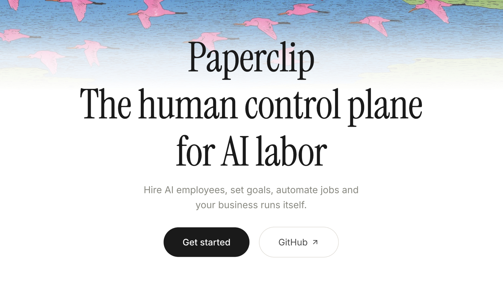

Subi o Paperclip no VPS com Gemini, Codex e Claude, testei hand off, gastei com
heartbeat, falei de budgets e segurança. Entenda como funciona e se é para você.



Algo engraçado só pra constar: antes do hype no **Paperclip** eu torci o nariz
para a ferramenta. E ainda penso que estava com razão. Já apareceu ferramenta
demais prometendo organizar caos, entregando só mais uma camada de caos que gera
ainda mais caos. Sempre é um wrapper em cima do que já existe que é complexo
para entender, cheio de bugs e que vai desaparecer logo.

Nessa situação: ou você perde tempo com a ferramenta, ou você perde tempo com a
ferramenta (isso não foi um erro). É bem provável que as próprias empresas
(Anthropic, OpenAI, Google e outras...), vão criar ferramentas que fazem
exatamente o que o novo salvador **do hype** faz.

Porém, o irônico é que eu sempre penso assim na minha vida pessoal: "_você não
sabe o que você não sabe_". Então, prefiro ficar quieto do que falar mal de algo
que não está na minha bolha de uso.

O Paperclip veio com uma proposta que eu já bati o olho e pensei: **marketing**.
E realmente, veja:

```
Paperclip - The human control plane for AI labor.
Hire AI employees, set goals, automate jobs and
your business runs itself.

Tradução:
Paperclip - o plano de controle humano para o trabalho de IAs.
Contrate funcionários de IA, defina objetivos, automatize
tarefas e deixe sua empresa rodando sozinha.
```

Qual empresa do planeta vai rodar sozinha? Então você monta a sua empresa e
deixa LLMs tomando conta de tudo? Tem certeza?

No entanto, bastou eu ter um problema que o **Paperclip** resolvia pra eu
entender o que ele realmente faz.

**Apoio - Hostinger**

Quer testar o Paperclip no seu próprio servidor? Vá de Hostinger.

Acesse: [www.hostg.xyz/SHJHL](https://www.hostg.xyz/SHJHL)  
Cupom: `OTAVIOMIRANDA` (10% de desconto)

Obrigado Hostinger por acreditar no meu conteúdo 💜.

## Em vídeo

Aqui está tudo o que fiz com o **Paperclip**, você pode tirar suas conclusões:

[](http://youtu.be/Mcp3fXfFV5A)

- Vídeo: [youtu.be/Mcp3fXfFV5A](http://youtu.be/Mcp3fXfFV5A)
- Arquivo
  [Gist](https://gist.github.com/luizomf/502c3d6a6ae8548273aa6cc02411d78c) usado
  no vídeo

Quer continuar a ler? Bora então!

## Vibe Coding (pera, deixa eu explicar primeiro)

No meu dia a dia eu não fico brincando de _vibe coding_ o tempo todo. Sou do
tipo que fala: **escreva um teste antes de tocar no código que tenha X
comportamento. Abra o arquivo Y, na linha 80 e edite a função Z. Faça o teste
passar**. E depois ainda reviso linha a linha o que foi feito.

Mas é bom acompanhar as tendências e ver para qual rumo o nosso ramo está
migrando.

Fazia bastante tempo que eu queria criar um agregador de notícias (um feed RSS)
com LLM. Eu já tinha a ideia inteira desenhada na cabeça: buscar as notícias,
injetar dados no modelo de forma dinâmica de acordo com o feedback das próprias
notícias, e gerar interesses bem específicos sobre o que eu gosto e o que eu não
gosto.

Como eu queria validar a ideia primeiro antes de me comprometer a desenvolver
isso, decidi fazer por **Vibe Coding**. Usei o **Codex**, **Claude** e o
**Gemini** em várias ocasiões.

O projeto foi crescendo com um "adiciona isso", outro "adiciona aquilo", outro
"e se a gente colocasse isso?", e assim foi. Hoje ele até lê as notícias em voz
alta e já saiu totalmente do meu controle. O último recurso que usei nele foi o
"Claude Design". O negócio ficou **MARAVILHOSO**.

Enfim, um belo dia eu precisava mexer em várias partes do programa. Ajustar
interface, corrigir um bug no TTS, ajustar o daemon e algumas outras coisas.
Como iniciei este projeto bem estruturado (quer dizer, eu disse para os modelos
trabalharem com testes e boa arquitetura), percebi que nenhuma das tarefas em
que eu precisava mexer tinha overlap. Cada parte do software estava separada na
sua própria camada e ninguém precisaria mexer no mesmo arquivo do coleguinha.

Abri 5 agentes. Quatro ficaram codando, e um deles ficou comigo só ajudando a
verificar se ninguém estava fazendo nada errado. Claude Opus, Claude Sonnet,
Codex App com GPT 5.4, outro Codex App com GPT 5.4 e o Gemini 3.1 Pro no
Antigravity.

Se você já fez isso, vai entender perfeitamente o que vou falar agora: às vezes
eu precisava falar com um agente para testar algum recurso. Nesse tempo, os
outros todos terminavam o serviço e eu não via. Isso era perda de tempo, já que
eu mesmo não estava revisando código, só testando a implementação.

Então lembrei do **Paperclip**. E a ideia dele começou a fazer mais sentido pra
mim. Como ele mostra todos os agentes em uma única interface, fica bem mais
fácil gerenciar tudo. De fato, você consegue manter todos trabalhando usando
dois recursos que ele tem: **hand off por menção** e **heartbeat**.

O Hand Off é igual você marcar alguém em uma rede social. Um agente pode fazer
`@CTO` (por exemplo) e indicar para o `@CTO` que ele terminou o serviço. O
`@CTO` acorda e vai conferir sem você colocar a mão em nada.

Heartbeat é um loop que fica rodando de tempos em tempos (você escolhe). Assim
que chegar o momento do Heartbeat, o agente é obrigado a acordar, verificar o
que tem pra fazer e agir. Essa função é mais útil pra quem realmente não quer
ficar vigiando os agentes. Um exemplo disso foi quando eu queria testar se eles
fariam um site sozinhos, mas já estava pingando de sono. Simplesmente ativei o
Heartbeat do meu `@CEO`, deixei instruções para ele sobre o que fazer e fui
dormir.

No outro dia eu tava com tudo pronto e funcionando.

## Evite gastar tokens demais

Como o tutorial completo está no vídeo, vou focar mais nas partes importantes
que você precisa ter em mente nesse texto.

Se você montar uma empresa como indicam internet afora, vai gastar tokens como
nunca gastou na vida.

Eu fiz isso e, sem ter feito absolutamente nada além do "Onboarding"
(contratações e configurações), gastei **85 Milhões** de tokens. Claro, isso
conta cache, input e output tudo somado.

Existem várias coisas no **Paperclip** que você deve ficar de olho. Alguns
exemplos:

- Usar os CLIs oficiais (como Claude Code, Codex CLI e Gemini CLI) gasta
  absurdamente mais tokens. Minha teoria é que os CLIs oficiais carregam pelo
  menos 20k tokens a cada wake-up do agente.
- Deixar o Heartbeat ativado sem ter o que fazer faz o agente acordar, gastar
  muitos tokens para ter contexto e perceber que não tem nada pra fazer. Só
  deixe o Heartbeat ativo se realmente tiver algo para fazer.
- Issues muito longas que se arrastam infinitamente. Em vez de ficar insistindo
  na mesma issue, feche-a e abra uma nova para qualquer micro ajuste.

Os agentes do **Paperclip** funcionam com contexto zerado. Isso significa que
toda vez que eles acordam, é necessário injetar todo o contexto para que o
agente possa fazer o serviço.

Agora pense:

- 20k tokens do CLI oficial
- 20k só do skill do Paperclip
- 100k tokens da sua issue gigante

Só aqui, estamos falando de 140k tokens. Se o seu Heartbeat estiver configurado
para 1 hora, em 24 horas você gastaria mais de 3 milhões de tokens sem fazer
absolutamente nada. Só o seu agente acordando e dormindo. Se você fizer a
burrice que eu fiz, colocar 5 agentes, todos com heartbeat de 1 hora,
multiplique o gasto por 5.

O modo econômico é: use o `pi`, deixe o Heartbeat desativado (até entender como
funciona), deixe issues pequenas. Não crie uma hierarquia muito profunda. Se
possível nem crie hierarquia. Vá direto no agente que precisar.

## Quando vale a pena?

Na minha concepção, só vale a pena se você faz vibe coding.

Isso aqui vai multiplicar sua velocidade em 10x (ou na quantidade de agentes que
seu servidor e seu bolso aguentarem).

Faça o teste e me diga. Esse é literalmente o caso de você estar dormindo e seus
agentes trabalhando por você.

## Onde eu não acho que isso vale a pena

Se você é dev, não faz sentido. O motivo é simples: um dev é responsável pelo
seu código. Você vai mandar os agentes fazerem o seu código e assinar embaixo?
Se for, então use.

Estou pensando mais no dev que trabalha para empresas mais sérias. Se você
precisa revisar o código com cuidado, fica bem difícil usar mais de um agente.

Na prática, a quantidade de código pode ficar inviável de revisar direito.

Outro ponto que percebi também. Não acho que o **Paperclip** seja a melhor
ferramenta do mundo pra microajuste fino.

Se eu quero mexer num espaçamento, trocar uma fonte, arrumar um detalhe visual
ou fazer uma mudança pequena e direta, muitas vezes compensa mais usar um fluxo
simples. Só funciona bem para trabalho em larga escala que pode ser feito por
vários agentes ao mesmo tempo.

E faz sentido. Se o agente não tem contexto e recebe isso tudo de volta a cada
wake-up, cada vez que você falar pra ele "aumentar a margem" de uma página, você
multiplica a quantidade de tokens que gastou na última rodada. O pior disso é
que você pode ter mais de um agente por issue. Aí é pedir pra torrar dinheiro.

## O que eu levei dessa experiência

Uma coisa que ficou muito clara pra mim foi o modelo de funcionamento do
Paperclip. A parte do Heartbeat já existia no OpenClaw. Porém, o OpenClaw é um
chat normal.

O Paperclip não tem chat. Você precisa especificar muito bem o que quer na issue
inicial. Isso te força a pensar muito mais antes de enviar um prompt qualquer
para a IA.

Nada de "Oi, tudo bem?", nada de "vou te mandar o contexto". No Paperclip você
precisa injetar tudo o que for necessário para a tarefa na issue inicial. Do
contrário a issue vira chat e você vai pagar bem caro em tokens.

Hand off também achei genial. A ideia de um agente passar o bastão para o outro
é muito interessante. Exemplo: você especializa um agente em fazer o código,
outro em garantir bons testes. Um pode passar para o outro assim que concluir o
serviço. "Pode começar a testar" ou o contrário (TDD), "Testes prontos, pode
montar o código".

Em resumo: estou de olho nos prompts, no Heartbeat, no Hand Off e na interface
maravilhosa que o Paperclip tem. Acho que é isso (no vídeo falo bem mais,
assiste lá).

Valeu, e até o próximo.
