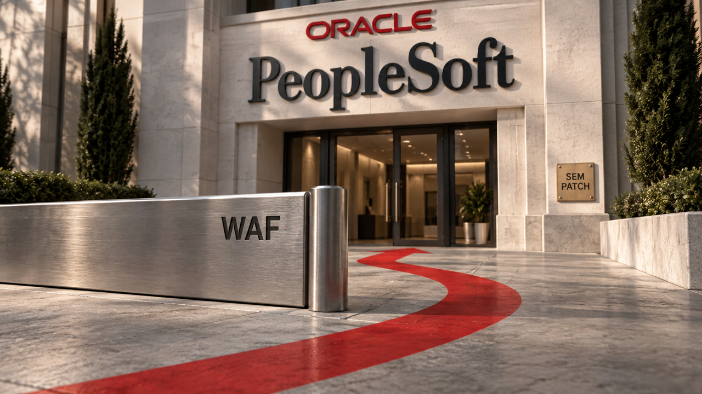

Ataques a instalações sem correção do PeopleSoft estão contornando regras de firewall, segundo a Mandiant. O caso mostra por que filtrar requisições não substitui corrigir a aplicação. Já o llama.cpp incorporou uma otimização para executar modelos de linguagem na CPU: os testes favorecem cargas como o processamento de prompts, mas não medem o ganho de uma conversa inteira. A edição também traz ajustes de segurança no Nginx Proxy Manager, operações na nuvem e ferramentas para Linux.

## PeopleSoft: atacantes contornam bloqueios de caminho em sistemas sem correção

A Mandiant e o Google Threat Intelligence Group publicaram em 25 de setembro uma atualização sobre a exploração da **CVE-2026-35273**, atribuída ao grupo ShinyHunters. Segundo os pesquisadores, a campanha renovada instalou web shells — arquivos que permitem comandar o servidor remotamente — em dezenas de sistemas de setores como educação, tecnologia, saúde e governo.

A falha fica no componente de gerenciamento de ambientes do PeopleSoft, conjunto de aplicações empresariais da Oracle. O alerta da fabricante, publicado em **10 de junho**, lista PeopleTools 8.61 e 8.62 e descreve execução remota de código sem autenticação. Portanto, não é uma vulnerabilidade descoberta ontem: a novidade é a adaptação dos ataques contra instalações que continuaram sem o patch.

O desvio funciona porque duas camadas interpretam o endereço de maneiras diferentes. Algumas regras de WAF, o firewall de aplicações web, comparavam o caminho como texto literal. Os atacantes passaram a representar um caractere por sua codificação de URL. O bloqueio deixava passar essa escrita alternativa, enquanto a aplicação a decodificava e encontrava o mesmo componente vulnerável.

A prioridade é **aplicar a correção da Oracle**, não apenas acrescentar outra variação à lista de bloqueio. A Mandiant também recomenda desabilitar ou remover o componente afetado conforme a configuração da instalação e investigar os acessos. A busca não deve se limitar a arquivos suspeitos: o relatório descreve execução que devolve a saída do comando na resposta HTTP sem gravar uma web shell. Logs, processos e todos os nós atrás do balanceador precisam entrar na análise.

Fontes: [Mandiant — campanha renovada contra PeopleSoft](https://cloud.google.com/blog/topics/threat-intelligence/shinyhunters-renewed-mass-exploitation-campaign-targeting-oracle-peoplesoft/) e [Oracle — alerta da CVE-2026-35273](https://www.oracle.com/security-alerts/alert-cve-2026-35273.html).

## llama.cpp otimiza cálculo na CPU; teste do autor chega a sete vezes em uma operação

O llama.cpp, projeto usado para executar modelos de linguagem localmente, incorporou em 26 de setembro a **PR #27851**, uma contribuição ao código do projeto. A mudança otimiza a multiplicação de matrizes com pesos quantizados — os parâmetros do modelo armazenados em representações numéricas compactas.

O mecanismo reduz trabalho repetido. Em vez de desempacotar os mesmos pesos várias vezes para pequenas operações, o código organiza a computação em blocos e reaproveita esse desempacotamento. Isso favorece matrizes maiores, como as encontradas no **prefill**, a etapa que processa o prompt antes da geração da resposta.

O autor relata ganhos de aproximadamente **três a sete vezes sobre o caminho padrão** em seus testes de multiplicação, usando oito threads num AMD 9950X3D. As tabelas registram o menor tempo de cinco medições. São números de uma operação específica, não de uma conversa inteira. Nos casos menores, o ganho diminui e pode virar perda; a proposta descreve uma seleção de caminho para evitar trabalho desfavorável.

Para avaliar a mudança, meça separadamente o processamento do prompt e a geração dos tokens, os fragmentos de texto que formam a resposta. Compare versões do programa mantendo o mesmo modelo, quantização, contexto e hardware. O resultado apresentado não estabelece um ganho equivalente em Apple Silicon, nem promete respostas sete vezes mais rápidas no seu assistente.

Fonte: [llama.cpp — PR #27851, explicação e benchmarks](https://github.com/ggml-org/llama.cpp/pull/27851).

## Nginx Proxy Manager 2.16 reúne logs na interface e muda tratamento de credenciais

O Nginx Proxy Manager oferece uma interface para administrar o proxy que encaminha requisições aos serviços de um servidor. A versão **2.16.0, lançada em 24 de setembro**, adiciona um visualizador de logs no navegador e listas de acesso por caminho. Isso permite investigar requisições e restringir partes de um serviço com mais precisão.

As notas também registram invalidação de tokens emitidos antes de uma troca de senha, geração local dos QR codes de autenticação em dois fatores e remoção das credenciais do provedor DNS do disco depois da execução do Certbot. Gerar o QR code localmente evita enviar a terceiros o segredo usado na configuração do segundo fator.

A atualização pede teste: os mantenedores alertam que a nova versão do **Certbot**, ferramenta de emissão e renovação de certificados, pode exigir ajustes nas dependências dos plugins DNS. Antes de atualizar o ambiente de produção, valide esses plugins e a renovação dos certificados em um ambiente de teste.

Fonte: [Nginx Proxy Manager — notas da versão 2.16.0](https://github.com/NginxProxyManager/nginx-proxy-manager/releases/tag/v2.16.0).

## Destaques rápidos para hoje.

- **Microsoft detalha destruição de recursos Azure por identidades de serviço comprometidas.** O relatório de 25 de setembro analisa atividade de junho atribuída a Storm-3168, associado ao JADEPUFFER que [já apareceu por aqui](/2026/agentes-invadem-a-hugging-face-e-ransomware-passa-a-cacar-modelos/). A novidade é o caso Azure: a maioria das contas de armazenamento visadas foi apagada, algumas proteções impediram exclusões e todas as tentativas contra bancos SQL falharam por uso de uma versão de API incompatível. Identidades de serviço são contas usadas por aplicações; suas permissões determinaram o alcance das ações. A Microsoft não confirmou a entrada inicial nem exfiltração bem-sucedida. Revise privilégios, rotacione segredos expostos e proteja os recursos de recuperação. Fonte: [Microsoft — investigação de Storm-3168](https://www.microsoft.com/en-us/security/blog/2026/09/25/storm-3168-agentic-driven-cloud-attacks-using-compromised-service-principals/).

- **Malware ligado a pacotes npm usa tailcat para receber comandos.** A Malwarebytes descreveu em 25 de setembro o Kothamine, um trojan de acesso remoto para Windows. Nas amostras recentes analisadas, ele usa o tailcat, ferramenta legítima da Tailscale para conexões temporárias criptografadas, como canal de controle. É abuso da ferramenta, não evidência de invasão da Tailscale. A conclusão defensiva é que bloquear domínios conhecidos não basta: também é preciso investigar os pacotes instalados, os processos iniciados e o uso inesperado de ferramentas de rede. Fonte: [Malwarebytes — análise do Kothamine](https://www.malwarebytes.com/blog/threat-intel/2026/09/kothamine-malware-uses-tailscales-tailcat-to-evade-network-detection).

- **Google anuncia Valkey 9.1 no Memorystore com nova comunicação entre threads.** O serviço gerenciado de dados em memória passa a distribuir trabalho por filas e ajustar dinamicamente as threads de entrada e saída, reduzindo consultas repetidas por tarefas concluídas. No anúncio de 25 de setembro, o Google afirma atingir até três vezes mais consultas por segundo que o Memorystore for Redis Cluster. A comparação é do fornecedor e depende da carga; não significa que uma aplicação inteira ficará três vezes mais rápida. Fonte: [Google Cloud — Memorystore for Valkey 9.1](https://cloud.google.com/blog/products/databases/memorystore-for-valkey-9-1-3x-qps-caching/).

- **Storage Intelligence ganha diagnóstico de custos e simulação de operações em lote.** O Google anunciou em 25 de setembro a disponibilidade geral do advisor, que ajuda a localizar a origem de gastos em buckets (contêineres de objetos), prefixos dos nomes desses objetos e contas de serviço. A análise usa retratos diários do armazenamento, com detecção de picos em até 24 horas, não monitoramento instantâneo. Para clientes do Storage Intelligence, as operações em lote também ganham simulação antes de modificar dados e processamento de até mil buckets por projeto em uma tarefa. A utilidade é ligar uma despesa inesperada ao processo responsável e conferir o alcance de uma alteração antes de executá-la. Fonte: [Google Cloud — advisor e operações em lote](https://cloud.google.com/blog/products/storage-data-transfer/storage-intelligence-advisor-and-batch-operations-updates/).

- **Era chega ao primeiro beta como calendário para o desktop GNOME.** O boletim do projeto de 25 de setembro anuncia o aplicativo em Rust e libadwaita, disponível no Flathub, com sincronização de calendários online e funcionamento offline. O suporte a Android ainda está em desenvolvimento; a disponibilidade de um APK de testes não equivale a uma versão final. Para quem quer experimentar uma alternativa de agenda no Linux, é uma oportunidade de testar e reportar bugs, com a expectativa correta de um beta. Fonte: [This Week in GNOME — anúncio do Era](https://thisweek.gnome.org/posts/2026/09/twig-267/).

- **Um laboratório com NetBSD mostra como interpretar uma tabela de partições nos bytes do disco.** No texto publicado em 25 de setembro, movq compara um disklabel — estrutura que descreve o disco e suas partições — com o arquivo de cabeçalho do sistema, verifica o checksum, valor usado para conferir a integridade dos dados, e altera uma entrada manualmente. O recorte é NetBSD 11 em x86-64, dentro de uma máquina virtual, não uma receita universal para todos os BSDs. É uma leitura prática para entender formatos binários; qualquer reprodução deve ficar em imagem descartável, sem dados importantes. Fonte: [movq — Playing with disklabels](https://movq.de/blog/postings/2026-09-25/0/POSTING-en.html).

> Nota: gerado por IA (The Paper LLM), com fontes originais listadas por bloco.

<!--
briefing_id: 27984
source_urls:
  - https://cloud.google.com/blog/topics/threat-intelligence/shinyhunters-renewed-mass-exploitation-campaign-targeting-oracle-peoplesoft/
  - https://www.oracle.com/security-alerts/alert-cve-2026-35273.html
  - https://github.com/ggml-org/llama.cpp/pull/27851
  - https://github.com/NginxProxyManager/nginx-proxy-manager/releases/tag/v2.16.0
  - https://www.microsoft.com/en-us/security/blog/2026/09/25/storm-3168-agentic-driven-cloud-attacks-using-compromised-service-principals/
  - https://www.malwarebytes.com/blog/threat-intel/2026/09/kothamine-malware-uses-tailscales-tailcat-to-evade-network-detection
  - https://cloud.google.com/blog/products/databases/memorystore-for-valkey-9-1-3x-qps-caching/
  - https://cloud.google.com/blog/products/storage-data-transfer/storage-intelligence-advisor-and-batch-operations-updates/
  - https://thisweek.gnome.org/posts/2026/09/twig-267/
  - https://movq.de/blog/postings/2026-09-25/0/POSTING-en.html
-->
