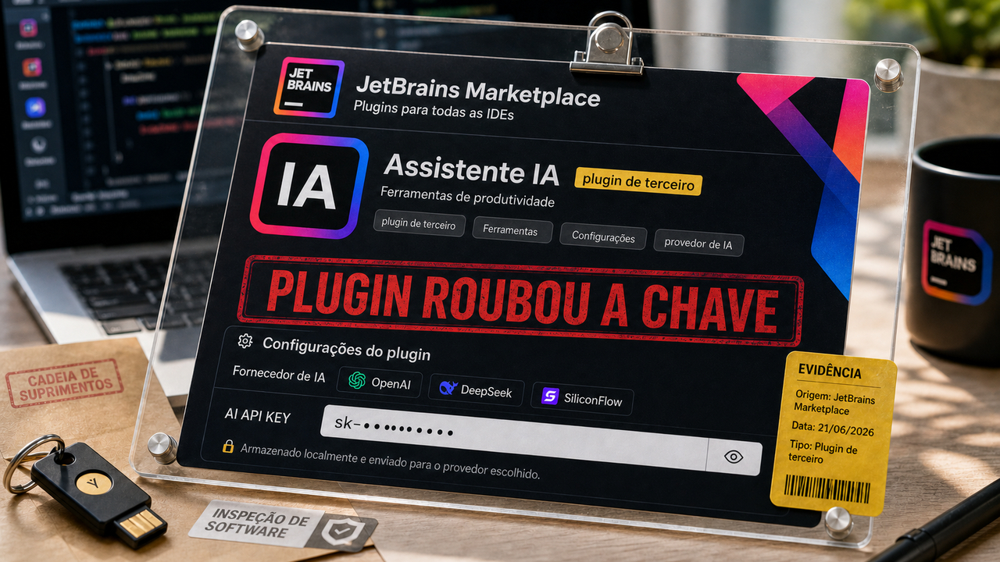

Plugin de IDE virou superfície de vazamento de credencial. Quando ele pede chave de IA e roda dentro do ambiente onde você trabalha, já está perto demais de coisa sensível.

## JetBrains removeu 15 plugins que roubavam chaves de IA

A JetBrains confirmou que recebeu, em 16 de junho, relatos sobre 15 plugins de terceiros no Marketplace feitos para roubar chaves de provedores de IA. Eles se vendiam como assistentes de código, revisão, mensagens de commit, caça a bugs e geração de testes. Exatamente o tipo de plugin que um dev curioso instala achando que está só melhorando o fluxo de trabalho.

A Aikido descreveu plugins capazes de funcionar como prometido e, ao mesmo tempo, exfiltrar a chave quando o usuário salvava as configurações. As chaves citadas envolviam provedores como OpenAI, DeepSeek e SiliconFlow.

A reação da JetBrains foi remover os 15 plugins, bloquear sete contas de publicadores e desabilitar remotamente as extensões afetadas quando a IDE fosse reiniciada. A orientação para quem instalou ou usou esses plugins antes de 17 de junho é tratar as chaves inseridas como expostas: revogar, rotacionar e remover qualquer plugin de origem duvidosa.

O número que circulou é de aproximadamente 70 mil instalações somadas. Ele ajuda a dimensionar o susto, mas não deve ser lido como 70 mil vítimas únicas. Contagem de download e instalação em marketplace pode inflar, repetir máquina, pegar instalação antiga ou medir curiosidade. Ainda assim, para time que deixa plugin de IDE receber chave de produção, a conta operacional é bem real.

Também tem uma lição chata e útil sobre confiança. Selo de vendedor verificado, página bonita e plugin que parece funcionar ajudam na aparência. Eles não auditam código. IDE, extensão e chave de IA agora fazem parte da cadeia de suprimentos do desenvolvimento. Se o plugin recebe segredo, trate como integração sensível.

Fontes: [JetBrains Blog](https://blog.jetbrains.com/platform/2026/06/marketplace-ecosystem-security-update-malicious-ai-plugins/), [Aikido Security](https://www.aikido.dev/blog/multiple-jetbrains-ide-plugins-caught-stealing-ai-keys), [StepSecurity](https://www.stepsecurity.io/blog/jetbrains-malicious-plugins-ai-api-key-theft) e [BleepingComputer](https://www.bleepingcomputer.com/news/security/malicious-jetbrains-marketplace-plugins-steal-ai-keys-from-developers/).

## Claude Opus 4.7 comandou um robodog rápido, com freio humano no caminho

A Anthropic publicou, em 18 de junho, a segunda fase do Project Fetch: um experimento em que Claude Opus 4.7, rodando via Claude Code, controla um robodog comercial em tarefas físicas. A parte chamativa é a velocidade. Nas quatro tarefas concluídas tanto pelos humanos sem Claude quanto pelo time com Claude, a Anthropic reporta 37,7 vezes mais rapidez contra o time sem Claude e 18,9 vezes contra o time com Claude.

O modelo também escreveu bem menos código: cerca de 1.045 linhas, contra 10.309 do time com Claude no experimento anterior. Para quem vive medindo produtividade de agente só por "ele escreveu arquivo e rodou teste", esse número é tentador. Só que o próprio texto da Anthropic segura a empolgação.

Havia uma pessoa no caminho. Um pesquisador conectou o laptop, digitou o prompt, aprovou comandos e liberou a passagem de uma tarefa para outra. E quando a tarefa exigiu controle físico mais fino, como pegar uma bola de praia de forma confiável, o resultado continuou falhando.

O ganho publicado aparece mais na orquestração do que na robótica geral. O modelo monta código, chama ferramenta, ajusta plano e usa componentes existentes com bastante autonomia. Já política de movimento, feedback físico fechado e ação segura no mundo real continuam pedindo outro nível de validação.

Para dev que está colocando agente perto de hardware, infraestrutura ou produção, a imagem é boa: quanto mais rápido o agente fica, mais importantes ficam os pontos de aprovação, logs, limites de comando e rollback. Velocidade sem freio só parece eficiência até encostar em algo caro.

Fonte: [Anthropic Research](https://www.anthropic.com/research/project-fetch-phase-two).

## Bayer PRINCE mostra agente de pesquisa com estado, retries e observabilidade

No site do Martin Fowler, Sarang Kulkarni e a Thoughtworks publicaram um estudo sobre o PRINCE, uma plataforma da Bayer para dados de pesquisa pré-clínica. O caso é interessante porque sai da demo solta e entra no desenho de sistema: pergunta em linguagem natural, relatórios, dados estruturados, PDFs, validação e revisão humana.

O PRINCE combina Agentic RAG e Text-to-SQL. A ideia é responder perguntas sobre estudos pré-clínicos navegando tanto em documentos quanto em bases estruturadas. O backend usa FastAPI, a orquestração passa pelo LangGraph, e o estado do workflow fica persistido em PostgreSQL por meio de um checkpointer do próprio LangGraph.

Esse detalhe do estado importa bastante. Se um agente falha no meio, precisa tentar de novo, trocar modelo, validar dados ou explicar de onde veio uma resposta, alguém precisa conseguir olhar o caminho percorrido. O artigo também cita OpenSearch, Athena e DynamoDB no ecossistema de dados, além de Langfuse, CloudWatch e RAGAS para observabilidade e avaliação.

O workflow descrito tem etapas de clarificação, planejamento e reflexão, pesquisa, validação de dados e síntese final. Parece burocrático quando escrito assim, mas é justamente o tipo de burocracia que separa um chatbot esperto de uma ferramenta que alguém consegue operar numa empresa regulada.

Outro detalhe bom: o texto diz que janelas de contexto maiores não eliminaram a necessidade de disciplina de contexto. Colocar mais texto dentro do modelo ajuda até certo ponto. Depois disso, ainda precisa escolher fonte, cortar ruído, guardar estado, avaliar resposta e deixar pessoa revisar quando o risco pede.

O limite também precisa ficar na mesa. PRINCE é um caso de domínio controlado, com dados e objetivos bem definidos. A leitura mais segura é menor e mais valiosa: em produção, o trabalho aparece no estado, validação, observabilidade e revisão humana.

Fonte: [MartinFowler.com](https://martinfowler.com/articles/reliable-llm-bayer.html).

## Loupe mostra que privacidade no iOS passa por sinais pequenos

A Mysk abriu o código do Loupe, um app para iOS e iPadOS que mostra o que um aplicativo nativo consegue observar no dispositivo. A proposta é jogar luz em sinais que costumam ficar invisíveis quando privacidade vira só uma pergunta: apareceu prompt de permissão ou não apareceu?

O app organiza as leituras em três grupos: Passive, Needs Permission e Advanced. No grupo passivo entram coisas como idioma, fuso horário, tela e bateria. São informações que parecem pequenas demais para preocupar sozinhas. O problema aparece quando elas se acumulam.

Na parte avançada, o repositório cita sondagem de esquemas de URL com `canOpenURL` e persistência no Keychain atravessando reinstalações. Isso ajuda a explicar por que fingerprinting não depende só de um identificador óbvio. Vários valores pouco únicos, quando combinados, podem aproximar bastante a identidade de um dispositivo.

O README diz que as leituras ficam no próprio aparelho, a menos que a pessoa exporte explicitamente. O código-fonte está sob licença MIT, mas nome, logo e assets de design não entram nessa licença. Também há uma observação de que a versão para Mac está quase completa, mas ainda não está polida, e não há release publicada no GitHub.

Para quem desenvolve app, Loupe serve como material de aula e revisão. É uma ferramenta de demonstração, não uma divulgação de falha nova. A revisão passa pelo modal de permissão, pela necessidade real de cada sinal coletado e pelo que a combinação deles pode contar sobre alguém.

Fonte: [GitHub / mysk-research/loupe](https://github.com/mysk-research/loupe).

## Destaques rápidos para hoje

- **lcamtuf mostrou o efeito "100.000 porquês" dos prompts parecidos.** Michał Zalewski publicou um ensaio usando cerca de 150 capas de livros da Amazon encontradas numa busca por "100000 whys" para mostrar como saídas de IA podem convergir em títulos, layouts e manias parecidas quando muita gente usa prompts semelhantes. A leitura boa para devs e criadores é tratar prompt padrão como risco de qualidade e distribuição, com cuidado para não transformar sinais nebulosos em acusação. Fonte: [lcamtuf's thing / Substack](https://lcamtuf.substack.com/p/the-100000-whys-of-ai).

- **Linux removeu `strncpy` do kernel depois de seis anos de limpeza.** Linus Torvalds mergeou, em 19 de junho, a remoção da API `strncpy` para o ciclo do Linux 7.2. O registro fala em seis anos de trabalho, 362 commits e 70 contribuidores, incluindo remoção de implementações por arquitetura em alpha, m68k, powerpc, x86 e xtensa. A história vale para quem escreve C e acompanha kernel: a semântica de terminação NUL e preenchimento com zero era fonte de confusão, e as substituições dependem do caso, como `strscpy`, `strscpy_pad`, `strtomem_pad`, `memcpy_and_pad` ou `memcpy`. Isso é limpeza interna do kernel, sem mudança direta no `strncpy` da libc de aplicações comuns. Fontes: [Linux kernel Git mirror](https://kernel.googlesource.com/pub/scm/linux/kernel/git/torvalds/linux/+/1a3746ccbb0a97bed3c06ccde6b880013b1dddc1) e [Phoronix](https://www.phoronix.com/news/Linux-7.2-Drops-strncpy).

## Acompanhamento de tendências do dia

Os itens de agente de hoje ficam mais interessantes quando a gente olha para a camada em volta do modelo. No Project Fetch, a Anthropic mostra um agente mais rápido controlando ferramenta física, mas ainda com aprovação humana e limites claros de controle. No PRINCE, a Bayer e a Thoughtworks mostram estado, validação, retries e observabilidade como parte do produto desde o desenho.

O Hermes Agent entrou nessa mesma linha com a versão 0.17.0. As notas oficiais falam em subagentes assíncronos: `delegate_task(background=true)` despacha trabalho em segundo plano e devolve um handle imediatamente. A release também cita janelas para acompanhar subagentes ao vivo. É o tipo de recurso que parece pequeno até você imaginar uma ferramenta de código com várias tarefas longas acontecendo ao mesmo tempo.

O desenho que aparece é parecido com sistema distribuído pequeno: estado, logs, fronteira de ferramenta, aprovação, observabilidade e trabalho delegado. Modelo melhor ajuda. Mas quando ele começa a mexer em IDE, API, banco, hardware ou shell, a engenharia em volta deixa de ser acabamento e vira superfície principal.

Fontes: [Anthropic Research](https://www.anthropic.com/research/project-fetch-phase-two), [MartinFowler.com](https://martinfowler.com/articles/reliable-llm-bayer.html) e [GitHub / NousResearch Hermes Agent](https://github.com/NousResearch/hermes-agent/releases).

> Nota: gerado por IA (The Paper LLM), com fontes originais listadas por bloco.

<!--
briefing_slug: 2026-06-21
source_mode: briefing
generated_at: 2026-06-21T05:37:19-03:00
source_urls:
  - https://blog.jetbrains.com/platform/2026/06/marketplace-ecosystem-security-update-malicious-ai-plugins/
  - https://www.aikido.dev/blog/multiple-jetbrains-ide-plugins-caught-stealing-ai-keys
  - https://www.stepsecurity.io/blog/jetbrains-malicious-plugins-ai-api-key-theft
  - https://www.bleepingcomputer.com/news/security/malicious-jetbrains-marketplace-plugins-steal-ai-keys-from-developers/
  - https://www.anthropic.com/research/project-fetch-phase-two
  - https://martinfowler.com/articles/reliable-llm-bayer.html
  - https://github.com/mysk-research/loupe
  - https://lcamtuf.substack.com/p/the-100000-whys-of-ai
  - https://kernel.googlesource.com/pub/scm/linux/kernel/git/torvalds/linux/+/1a3746ccbb0a97bed3c06ccde6b880013b1dddc1
  - https://www.phoronix.com/news/Linux-7.2-Drops-strncpy
  - https://github.com/NousResearch/hermes-agent/releases
omitted_briefing_items:
  - Systemd 261 Released: repeat without new public delta after 2026-06-20 main coverage.
  - Why Queues Don’t Fix Overload: evergreen architecture item, source not validated, lower urgency than selected stories.
  - Epoll vs. Io_uring in Linux: useful technical article, but lower freshness than the Linux strncpy removal.
  - GitHub Alternative Discussions on Hacker News: HN discussion was not enough original evidence for publication.
  - You Don't Love systemd Timers Enough: evergreen systemd advice and systemd was saturated from yesterday.
  - CLI Authentication, the Right Way: potentially useful but unvalidated and crowded out by stronger verified stories.
  - webernetes: Kubernetes in the Browser: confirmed experiment, lower priority for today's package.
  - Docker Content Trust Retirement: confirmed migration guidance, but older and weaker than selected items.
  - Hermes Agent Adds Asynchronous Subagents: folded into the trend section using official release notes.
  - Microsoft links Mastra AI supply chain attack to North Korean hackers: real continuity delta, but recent Mastra saturation kept it out of public coverage.
  - OCaml 5.5.0 released: valid-looking language release, weaker audience fit than selected stories.
  - Announcing the next generation of Distrobox: useful Linux tooling, crowded out by more actionable current stories.
-->
