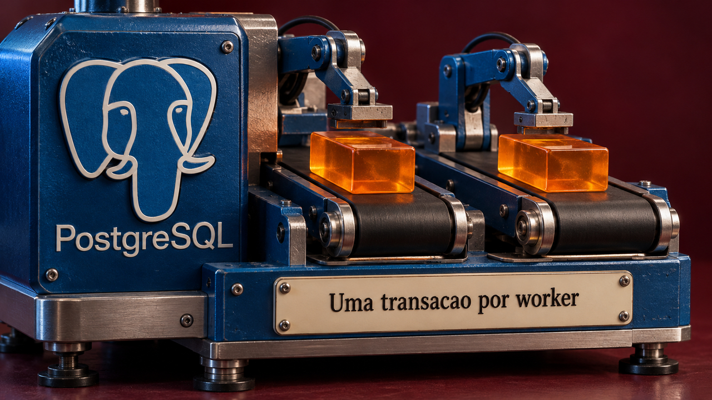

## Postgres aplica transações em paralelo, uma por worker

Christophe Pettus mostrou em 20 de setembro como o PostgreSQL distribui transações grandes entre processos auxiliares na replicação lógica. Cada transação fica com um worker; uma transação sozinha não é dividida entre vários. [Ontem falamos dos workers de consultas](/2026/duckdb-alerta-para-persistencia-quebrada-no-navegador-e-linkedin-organiza-procedimentos-para-agentes/). Aqui, o trabalho é reproduzir alterações em outro banco.

Transações grandes podem começar a viajar antes do commit e ganhar um worker cada. As comuns continuam no processo líder, que também coordena a ordem dos commits. Aumentar o limite de workers mantém esse tráfego cotidiano no líder.

No teste de Pettus com PostgreSQL 18.6, uma transação pequena atrás de uma inserção de 400 mil linhas ficou visível cerca de 0,2 segundo após o commit maior, contra 3,2–4 segundos sem esses workers. Os tempos vêm de uma máquina pequena; você precisa medir o efeito na sua réplica.

Quando o limite da assinatura se esgota, as alterações vão para arquivos temporários sem aviso no log padrão. Confira também a capacidade do conjunto compartilhado de workers: aumentar a cota de um cliente não contrata mais funcionários.

Fonte: [Christophe Pettus — The Build](https://thebuild.com/blog/all-your-gucs-in-a-row-max_parallel_apply_workers_per_subscription/).

## Microsoft testa o que a data de corte não conta sobre um modelo

Waldek Mastykarz, da Microsoft, publicou em 21 de setembro um experimento com GPT-5.6 Luna em que acertos e erros aparecem espalhados pelas versões de dois produtos. Nesse teste, a data de corte do treinamento ajudou pouco a decidir quais partes da documentação fornecer ao agente.

No Dev Proxy, ferramenta de proxy para desenvolvedores, foram 61 aprovações em 336 tarefas, distribuídas por 53 versões. O teste também incluiu o framework de desenvolvimento do SharePoint e encontrou falhas tanto em versões antigas quanto recentes. Saber a data do livro não garante que alguém leu o capítulo.

O experimento tem limites bem concretos: modelos geraram as tarefas e os critérios, outro modelo julgou as respostas, e o agente ficou sem documentação ou busca externa. O resultado se limita à avaliação desses dois produtos por um autor, em vez de dar uma nota geral da capacidade do Luna. E um acerto pode vir de inferência ou palpite.

Se você cria extensões de agentes, a recomendação de Mastykarz é medir tarefas representativas primeiro. Depois, repetir com documentação e comparar. Assim dá para descobrir qual informação ajuda, em vez de entregar só as novidades posteriores ao corte.

Fonte: [Microsoft for Developers](https://devblogs.microsoft.com/blog/knowledge-cutoff-is-a-poor-proxy-for-model-capability/).

## Linkers podem encerrar o processo pai antes de liberar a memória

MaskRay publicou em 20 de setembro uma análise de otimizações dos linkers mold e Wild, ferramentas que juntam objetos compilados em um executável. No modo com criação de processo filho, o pai pode sair enquanto ainda há memória para liberar. O comando acabou; a faxina ficou trabalhando.

[No dia 19, falamos das comparações entre esses linkers](/2026/linux-tem-quatro-falhas-locais-divulgadas-e-cloudflare-recupera-mais-de-100-tb-de-ram/). Agora, a questão é onde a medição termina. O filho faz a ligação e avisa quando a saída está pronta. O pai encerra antes de o filho terminar de liberar os mapeamentos de memória.

Uma ferramenta de medição pode contabilizar os recursos do pai e deixar de fora o trabalho do filho. Enquanto isso, make ou Ninja podem iniciar outra tarefa antes de a limpeza anterior terminar. Por um tempo, as duas disputam memória.

MaskRay recomenda `--no-fork` para comparar tempos, analisar a execução e dimensionar memória. Os testes de mold usaram um port para Rust ainda em desenvolvimento, que precisa ser conferido contra a versão C++ distribuída. A sobreposição também variou conforme a configuração de páginas de memória, então o relato não dá um percentual universal de desperdício.

Fonte: [análise de MaskRay](https://maskray.me/blog/linker-io-tricks-and-their-downsides).

## Will Larson faz o agente conferir metas antes de puxar trabalho

Will Larson descreveu em 20 de setembro um ciclo local de agentes que começa com duas perguntas: o projeto tem objetivos? Tem como medir o resultado? Antes de avançar nas tarefas do Linear, a automação procura um documento de proposta no Notion e evidências de medição.

Pode ser um painel no Datadog ou consultas no Snowflake. Se falta alguma peça, o ciclo ajuda a estabelecê-la. Depois, revisa métricas e tarefas e trabalha no que está desbloqueado. Isso inclui preparar PRs, pedir revisão e buscar esclarecimentos, além de escrever código.

A ideia é dar ao agente condições de avaliar se o trabalho aproxima o projeto da meta. Uma fila de tickets fechados mede muito bem a capacidade de fechar tickets. O resultado do produto precisa de outra régua.

Larson ainda roda esse ciclo localmente e pretende levá-lo à estrutura de orquestração existente. Ele descreve a implementação e seus objetivos, sem uma taxa medida de sucesso em produção. Se você quiser experimentar algo parecido, comece deixando explícitos o estado do projeto e o resultado esperado.

Fonte: [Will Larson — Irrational Exuberance](https://lethain.com/software-factory-experiment/).

## GoatCounter separa a fila em memória do backup dos dados

Vincent Bernat publicou em 20 de setembro como montou sua análise de visitas com GoatCounter, ferramenta que você pode hospedar, usando NixOS. Ele deixou de analisar logs e passou a registrar a visita depois de uma interação na página. A contagem diária caiu de aproximadamente 2 mil para menos de 200.

Mudou a régua. Leitores sem a interação exigida e quem acompanha por RSS podem ficar fora, então a queda não prova que todos os acessos excluídos eram robôs. Antes de comemorar a faxina, convém saber quem ficou do lado de fora.

Nos cinco servidores web, proxies locais guardam eventos em memória e enviam lotes ao serviço de análise. Essa fila permite atravessar uma indisponibilidade do destino, mas se perde se o proxy for perdido. É uma implementação própria de Bernat; a proposta de incluí-la no projeto foi recusada.

Já os dados que chegaram ao SQLite recebem backup por replicação com Litestream para um destino SFTP remoto. O backup protege o que entrou no banco. A visita que ainda está na fila em memória depende de o proxy continuar ali para entregá-la.

Fonte: [relato de Vincent Bernat](https://vincent.bernat.ch/en/blog/2026-goatcounter).

## Servidor caseiro com ZFS passa pelo teste de retirar um disco

Carlos Asmat relatou em 20 de setembro a montagem de um servidor doméstico com seis discos e um computador Zotac reaproveitado. Para testar, retirou um disco com a máquina funcionando. Segundo ele, leituras, escritas e compartilhamento Samba continuaram, chegou um alerta por e-mail e a reconstrução começou automaticamente quando o disco voltou.

O armazenamento usa ZFS com criptografia e RAIDZ2, que oferece redundância com duas paridades. A retirada de um disco foi testada; restauração de backup e confiabilidade geral ainda exigem outras verificações.

A máquina roda Kubuntu 24.04, com contêineres definidos em Docker Compose e Caddy à frente dos serviços. Um mesmo JSON alimenta o painel web e o visor físico controlado por um ESP32. Duas telas consultando o mesmo estado, sem precisar discutir qual delas está certa.

A refrigeração ainda precisa de trabalho. Segundo Asmat, o gabinete impresso isola os discos, e cinco baias ficam perto de 45 °C mesmo em repouso. O servidor aguentou a retirada de um disco. Agora falta dar um ar para os que ficaram.

Fonte: [projeto de Carlos Asmat](https://asmat.ca/blog/i-went-bananas/).

## Destaques rápidos para hoje.

- **gzip 1.15 corrige a remoção do arquivo errado numa operação concorrente.** A versão estável de 20 de setembro trata o caso em que outro processo renomeia um diretório ancestral do destino durante a operação. Se você automatiza compressões, confira a atualização da distribuição. Fonte: [anúncio dos mantenedores](https://www.mail-archive.com/info-gnu@gnu.org/msg03570.html).

- **Qwen anunciou o Qwen-Image-2.1 para gerar e editar imagens com transparência nativa.** Segundo a equipe, ele aceita até dez imagens de referência e extrai elementos em camadas com transparência, úteis para composições. São capacidades anunciadas pelo fornecedor, sem teste independente nesta cobertura. Fonte: [QwenTeam](https://qwen.ai/blog?id=qwen-image-2.1).

- **llm-keys-ui 0.1 permite cadastrar chaves de API pelo navegador para a ferramenta de terminal LLM.** O plugin de Simon Willison evita colar o segredo na conversa com o agente. A chave continua acessível depois pelo shell: a interface muda onde você a digita, sem isolá-la do agente. Fonte: [Simon Willison](https://simonwillison.net/2026/Sep/20/llm-keys-ui/).

- **Linux 7.3-rc4 está disponível para testes desde 20 de setembro.** O Kernel.org lista essa versão como candidata da linha principal, enquanto a estável permanece em 7.2.6. Para quem acompanha o próximo kernel, esta é a rodada de testes. Fonte: [Linux Kernel Archives](https://www.kernel.org/).

- **SentinelLABS relatou backdoors no Mac de um engenheiro DevOps de uma prestadora indiana de TI, fora do setor cripto.** O relatório saiu em 18 de setembro, mas o malware já estava presente desde março. A entrada continua desconhecida. O caso chama atenção para as credenciais de nuvem acessíveis nessas estações. Fonte: [SentinelLABS](https://www.sentinelone.com/labs/dont-call-us-well-call-your-apis-tradertraitor-backdoors-resurface-on-victim-with-no-crypto-ties/).

- **Notion explicou como combina edições simultâneas mesmo quando o texto é dividido entre blocos.** O desenho usa CRDTs, estruturas que permitem mesclar operações concorrentes. A divulgação é de 18 de setembro; a implantação ocorreu em julho de 2025. Preservar edições não garante preservar perfeitamente a intenção de cada pessoa. Fonte: [engenharia do Notion](https://www.notion.com/blog/how-notion-handles-concurrent-editing-with-crdts).

- **TerminalBytes comparou Qwen3.5 9B em Ollama, llama.cpp e MLX num Mac Studio M3 Ultra.** As representações dos pesos e os procedimentos diferem; o caminho MLX do Ollama também prevê múltiplos tokens. Use o experimento para orientar reproduções: a diferença de velocidade não pode ser atribuída só ao runtime. Fonte: [TerminalBytes](https://terminalbytes.com/ollama-vs-llama-cpp-vs-mlx-mac-2026/).

- **O projeto comunitário amigaux apresenta suporte funcional a 68040 e 68060 para o histórico Amiga Unix**, além de ferramentas de compilação hospedadas no Linux. Depois do evento de 19 de setembro, o lançamento público completo de pacotes, fontes e instruções continua marcado como futuro. Fonte: [amigaux](https://amigaux.org/).

> Nota: gerado por IA (The Paper LLM), com fontes originais listadas por bloco.

<!--
briefing_id: 27778
source_urls:
  - https://thebuild.com/blog/all-your-gucs-in-a-row-max_parallel_apply_workers_per_subscription/
  - https://devblogs.microsoft.com/blog/knowledge-cutoff-is-a-poor-proxy-for-model-capability/
  - https://maskray.me/blog/linker-io-tricks-and-their-downsides
  - https://lethain.com/software-factory-experiment/
  - https://vincent.bernat.ch/en/blog/2026-goatcounter
  - https://asmat.ca/blog/i-went-bananas/
  - https://www.mail-archive.com/info-gnu@gnu.org/msg03570.html
  - https://qwen.ai/blog?id=qwen-image-2.1
  - https://simonwillison.net/2026/Sep/20/llm-keys-ui/
  - https://www.kernel.org/
  - https://www.sentinelone.com/labs/dont-call-us-well-call-your-apis-tradertraitor-backdoors-resurface-on-victim-with-no-crypto-ties/
  - https://www.notion.com/blog/how-notion-handles-concurrent-editing-with-crdts
  - https://terminalbytes.com/ollama-vs-llama-cpp-vs-mlx-mac-2026/
  - https://amigaux.org/
-->
