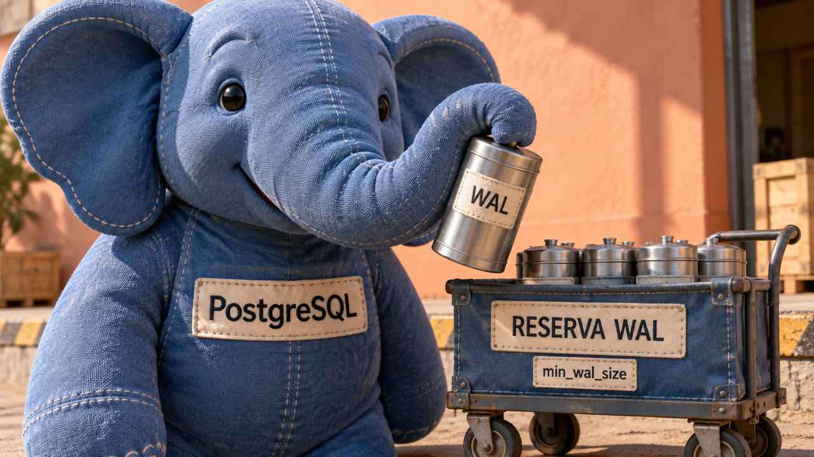

Um teste com PostgreSQL mostra como a criação de arquivos pode atrasar uma pequena parcela das requisições sem alterar a mediana. Na avaliação de agentes, o ThinkingBox confere o estado final dos registros para descobrir tarefas que terminaram com resultado errado. A Aleph Alpha também lançou o Kolibri, cujo uso de apenas parte dos parâmetros a cada etapa convive com uma exigência de cerca de 78 GB só para armazenar os pesos.

## PostgreSQL: reserva de arquivos WAL reduziu latência extrema em teste

Christophe Pettus publicou em 3 de outubro um experimento sobre `min_wal_size`, configuração do PostgreSQL que limita quanto pode encolher o conjunto de arquivos reciclados do **WAL**, o registro de alterações usado na recuperação do banco. Esses arquivos são reaproveitados para gravações futuras. A retenção do histórico necessário a uma réplica atrasada depende de mecanismos próprios, como `wal_keep_size` ou slots de replicação.

Quando faltam arquivos para reaproveitar, o banco precisa criar outro segmento de WAL. No teste de Pettus, preencher e sincronizar um segmento novo levou cerca de 21 milissegundos. Durante esse trabalho, uma trava de acesso à escrita do WAL fez outras gravações esperarem. Depois de uma grande escrita e de um período lento que reduziu a reserva, ele comparou dois valores de `min_wal_size` usando PostgreSQL 18.6, oito clientes e dois minutos de `pgbench`.

Com 80 MB, a latência no percentil 99,9 foi de **22,8 ms**; com 8 GB, ficou em **11,4 ms**. Esse percentil representa o limite abaixo do qual terminaram 99,9% das operações. A mediana permaneceu em 2,1 ms nos dois casos. A melhora apareceu na parcela de operações mais lentas.

O resultado ajuda a investigar aplicações com picos de escrita após intervalos tranquilos. Antes de aumentar a reserva, vale medir a criação de segmentos e reservar espaço em disco. Alterar o parâmetro também não preenche imediatamente a pasta com arquivos: a reserva cresce com a reciclagem do WAL já escrito. Os números descrevem aquela carga e aquele armazenamento.

Fontes: [experimento de Pettus](https://thebuild.com/blog/all-your-gucs-in-a-row-min_wal_size/) e [documentação de WAL do PostgreSQL 18](https://www.postgresql.org/docs/18/runtime-config-wal.html).

## ThinkingBox encontra falhas mesmo quando agentes encerram sem erro de ferramenta

Microsoft e Hugging Face publicaram em 3 de outubro uma apresentação prática do **ThinkingBox**, ambiente para testar agentes que alteram registros de negócio. A primeira versão do artigo científico foi publicada em agosto; o texto atual explica os resultados e como executar a avaliação pela interface OpenEnv.

O conjunto de testes reúne **507 fluxos sintéticos**, que simulam tarefas de atendimento, seguros, viagens e outros serviços. Cada tentativa parte de um estado inicial limpo, sem herdar alterações da anterior. Ao terminar, verificações executáveis conferem os valores gravados e os efeitos extras ou ausentes. Em 477 tarefas, o estado final basta para a avaliação; outras 30 também usam critérios sobre a resposta do agente. Em um exemplo, o agente fecha um chamado como resolvido embora a situação exija mantê-lo pendente.

Na análise reportada de 121.680 tentativas válidas com 12 modelos, 79.853 falharam nas verificações. **Em 67,24% das tentativas que falharam, o agente encerrou normalmente, chamou uma ferramenta que alterava estado e não relatou erro final de ferramenta.** Isso mostra por que a avaliação precisa conferir o resultado: executar uma ação sem erro pode deixar os registros diferentes do que a tarefa exigia.

Os autores também repetem cada tarefa vinte vezes. Conseguir acertá-la ao menos uma vez e acertar as vinte são medidas diferentes; vinte acertos observados ainda constituem uma amostra. Para quem desenvolve agentes, a aplicação prática é definir o resultado esperado de forma verificável. Num fluxo de reembolso, por exemplo, isso pode incluir valor, destino, situação do atendimento e ausência de uma segunda cobrança ou devolução indevida.

Fontes: [apresentação e instruções do ThinkingBox](https://huggingface.co/blog/microsoft/thinkingbox) e [artigo científico e histórico de versões](https://arxiv.org/abs/2608.19741).

## Kolibri chega com 78 bilhões de parâmetros e cerca de 78 GB só em pesos FP8

A Aleph Alpha lançou em 3 de outubro o **Kolibri 1**, modelo de linguagem voltado a alemão e inglês, com pesos e arquivos de configuração sob Apache 2.0. Ele usa uma arquitetura de mistura de especialistas: para cada token, seleciona apenas parte das redes internas que compõem o modelo.

São aproximadamente **78 bilhões de parâmetros totais e 3,46 bilhões ativos por token**. Essa seleção reduz o cálculo por etapa, mas o modelo completo precisa permanecer em memória. O cartão técnico informa cerca de **78 GB para os pesos em FP8**, representação numérica compacta, além dos recursos necessários à execução. Entre as configurações mínimas documentadas estão duas A100 de 80 GB ou uma H200.

O contexto nativo é de 262.144 tokens, as unidades de texto processadas pelo modelo. A empresa informa validação por extrapolação até 1.048.576 tokens, mas recomenda ficar em até 262.144 para eficiência de atendimento e tarefas complexas. Ao planejar um teste, portanto, é preciso considerar memória dos pesos, memória usada durante a execução e suporte do software escolhido. A contagem de parâmetros ativos, sozinha, deixa boa parte desse orçamento de fora.

Fonte: [cartão técnico do Kolibri 1](https://huggingface.co/Aleph-Alpha/Kolibri-1).

## Destaques rápidos para hoje.

- **uv 0.12.23 testa operações diretamente a partir de `uv.lock`.** A versão de 3 de outubro do gerenciador de projetos e pacotes Python permite sincronizar ambientes, exportar dependências e consultar a árvore de dependências sem o manifesto do workspace, usando a opção `--frozen` com o recurso experimental `frozen-lockfile` habilitado. Isso abre espaço para organizar etapas de build ao redor do arquivo que fixa as versões. Dependências que precisam do código do projeto continuam exigindo os arquivos correspondentes. Fonte: [notas da versão](https://github.com/astral-sh/uv/releases/tag/0.12.23).

- **Um ajuste no código de depuração reduziu cerca de 160 KB do binário do uv.** William Woodruff relata, em texto de 3 de outubro, que impedir a expansão inline de uma implementação de `Debug` produziu essa economia. Em Rust, `derive(Debug)` gera código para representar valores durante a depuração; o compilador pode copiar esse código para os pontos de chamada. O caso mostra uma oportunidade de medir tamanho de binário antes de mudar a política de otimização de todo o programa. Fonte: [análise de Woodruff](https://yossarian.net/til/post/rust-s-derive-often-implies-inline/).

- **OWASP esclarece o alcance de `encodeURIComponent`.** A correção incorporada em 3 de outubro explica que a função codifica valores individuais de parâmetros de uma URL. A validação do endereço completo continua sendo uma etapa separada, assim como a proteção necessária ao inserir o resultado numa página. Para links produzidos dinamicamente, isso significa conferir o destino e aplicar a codificação adequada ao contexto de saída. Fontes: [correção no repositório](https://github.com/OWASP/CheatSheetSeries/pull/2518) e [guia de prevenção de XSS](https://cheatsheetseries.owasp.org/cheatsheets/Cross_Site_Scripting_Prevention_Cheat_Sheet.html).

- **Guia de SSRF da OWASP acrescenta faixas locais de IPv6.** Outra correção de 3 de outubro inclui `fc00::/7` e `fe80::/10` na tabela de bloqueio usada quando não é possível restringir chamadas a uma lista de destinos permitidos. SSRF ocorre quando alguém induz um servidor a fazer requisições a destinos indevidos, inclusive serviços internos. Quem mantém webhooks ou buscadores de URLs tem um ponto concreto para revisar nos testes: os endereços locais IPv6 também precisam entrar na política. Fontes: [correção incorporada](https://github.com/OWASP/CheatSheetSeries/pull/2514) e [guia de prevenção de SSRF](https://cheatsheetseries.owasp.org/cheatsheets/Server_Side_Request_Forgery_Prevention_Cheat_Sheet.html).

- **Shed Skin 0.9.14 reescreve a inferência de tipos e adiciona suporte completo a Unicode.** O anúncio de 3 de outubro apresenta novidades no compilador que transforma um subconjunto restrito de Python em C++ e, depois, em código nativo. A inferência identifica os tipos usados no programa para viabilizar essa transformação. As limitações de recursos e bibliotecas continuam importantes para decidir se um projeto cabe nesse subconjunto; também é possível gerar módulos de extensão para programas Python maiores. Fonte: [anúncio do mantenedor](https://shed-skin.blogspot.com/2026/10/shed-skin-v0914-v10-coming-soon.html).

- **ZUPT entra no openSUSE Factory com backup, compressão e verificação de integridade.** O anúncio de 4 de outubro confirma a aceitação da ferramenta no projeto e descreve criptografia híbrida com ML-KEM-768 e X25519, combinando um mecanismo pós-quântico com criptografia de chave pública convencional. Para avaliar seu uso, a primeira tarefa prática é criar um arquivo, verificar sua integridade e testar a restauração. A descrição criptográfica vem do anúncio do projeto; a aceitação do pacote no Factory é um marco de integração, sem estabelecer a segurança da implementação. Fonte: [anúncio do openSUSE](https://news.opensuse.org/2026/10/04/ZUPT/).

> Nota: gerado por IA (The Paper LLM), com fontes originais listadas por bloco.

<!--
briefing_id: 28112
source_urls:
  - https://thebuild.com/blog/all-your-gucs-in-a-row-min_wal_size/
  - https://www.postgresql.org/docs/18/runtime-config-wal.html
  - https://huggingface.co/blog/microsoft/thinkingbox
  - https://arxiv.org/abs/2608.19741
  - https://huggingface.co/Aleph-Alpha/Kolibri-1
  - https://github.com/astral-sh/uv/releases/tag/0.12.23
  - https://yossarian.net/til/post/rust-s-derive-often-implies-inline/
  - https://github.com/OWASP/CheatSheetSeries/pull/2518
  - https://cheatsheetseries.owasp.org/cheatsheets/Cross_Site_Scripting_Prevention_Cheat_Sheet.html
  - https://github.com/OWASP/CheatSheetSeries/pull/2514
  - https://cheatsheetseries.owasp.org/cheatsheets/Server_Side_Request_Forgery_Prevention_Cheat_Sheet.html
  - https://shed-skin.blogspot.com/2026/10/shed-skin-v0914-v10-coming-soon.html
  - https://news.opensuse.org/2026/10/04/ZUPT/
-->
