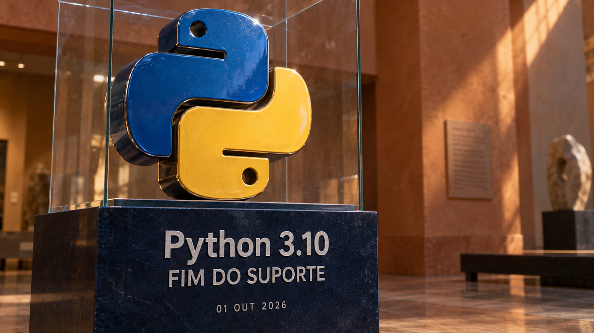

A edição de 1º de outubro começa com duas revisões práticas: quais aplicações ainda dependem de Python 3.10 e como o backend identifica o cliente ao reutilizar uma conexão com o banco. Também há mudanças importantes para quem hospeda Git e uma análise da Atlassian sobre incidentes que o monitoramento deixou passar.

## Python 3.10 recebe sua última versão e encerra o suporte

A equipe do Python publicou hoje as versões **3.10.22, 3.11.17, 3.12.15, 3.13.16 e 3.14.8**, com correções de segurança nas cinco séries. A 3.10.22 encerra o ciclo do Python 3.10: essa linha deixa de receber novas atualizações de segurança.

Entre as correções estão problemas nos filtros de extração de arquivos TAR e no consumo de memória ao descompactar membros de arquivos ZIP. O gerenciador de credenciais de `urllib.request` também passa a separar credenciais pelo esquema da URL, evitando reutilizar credenciais de HTTPS em URLs HTTP correspondentes.

Vale inventariar a versão usada nas imagens de contêiner, nos ambientes de produção e no CI. Para quem está na 3.10, atualizar para a última correção é uma etapa da migração para uma série com suporte. As novas versões de 3.10, 3.11 e 3.12 são distribuídas apenas como código-fonte pelo projeto; a disponibilidade de pacotes depende do distribuidor. A 3.13.16 é a última versão de manutenção completa dessa série, que segue com correções de segurança.

Fonte: [anúncio da equipe do Python](https://blog.python.org/2026/10/python-31022-31117/).

## Uso incorreto de conexões com PgBouncer expõe dados de outro cliente em teste

Um estudo publicado hoje por Chris van Eijk, da Now-Next, mostra como dois erros de aplicação podem comprometer o isolamento por cliente. O teste usa PostgreSQL 17.10 e PgBouncer 1.25.2, um intermediário que reaproveita conexões com o banco, em modo de agrupamento por transação.

A aplicação identifica o cliente — ou *tenant* — em uma variável da conexão. Uma política de segurança por linha, chamada RLS, consulta essa variável para decidir quais faturas podem ser lidas. Nesse desenho, o isolamento depende de a aplicação informar corretamente quem está fazendo a consulta.

O problema começa quando uma requisição usa `SET`, deixando a identificação gravada na sessão. Depois, outra usa `SET LOCAL` fora de uma transação explícita: o PostgreSQL emite um aviso e não altera a configuração. A identificação do cliente anterior continua valendo.

Na conexão contaminada, a segunda requisição acabou lendo as **267.023 faturas do cliente anterior**, segundo o autor. O experimento forçou a reutilização com uma única conexão no pool; em um pool maior, o encontro com uma conexão contaminada depende de qual delas for entregue à requisição. Trata-se de uma reprodução controlada de uso incorreto, sem relato de invasão de um serviço real.

A correção proposta é abrir uma transação, definir o cliente com `SET LOCAL` dentro dela e executar ali as consultas. Antes de consultar dados, uma instrução separada deve reler a identificação e compará-la com o cliente esperado, interrompendo a operação se houver divergência. A documentação do PgBouncer confirma que, na configuração padrão desse modo, a consulta de limpeza da sessão não é executada ao devolver a conexão.

Fontes: [experimento da Now-Next](https://now-next.nl/en/insights/pgbouncer-row-level-security-tenant-context/), [semântica de SET no PostgreSQL](https://www.postgresql.org/docs/17/sql-set.html) e [configuração do PgBouncer](https://www.pgbouncer.org/config.html#server_reset_query).

## Gitea 28 adiciona auditoria e muda padrões que afetam a atualização

O Gitea, plataforma para hospedar repositórios Git e automações, lançou a versão **28.0.0** em 30 de setembro. O projeto abandonou o prefixo `1.`: esta é a versão que antes seria numerada como 1.28.0.

As novidades incluem contas próprias para robôs e tokens de implantação HTTPS restritos a um repositório. A auditoria registra eventos relevantes para segurança, mas vem **desligada por padrão**. Para ativá-la no banco, a configuração indicada é `RECORD_OUTPUT = database` na seção `[audit]`; a retenção padrão desses eventos é de 30 dias.

Há duas mudanças para revisar antes do upgrade. Para webhooks e OAuth2, o modo padrão `lax` permite destinos públicos além dos declarados em `[security] ALLOWED_HOST_LIST`. Quem depende dessa lista como restrição exclusiva precisa configurar `[security] EGRESS_MODE = strict` e revisar os destinos permitidos. Migrações e espelhos de repositórios têm uma política separada: para restringir seus destinos, configure `[migrations] EGRESS_MODE = strict` e revise os hosts permitidos nesse subsistema. Além disso, execuções concluídas do Actions passam a ser apagadas após 400 dias, junto com logs e artefatos; `RUN_RETENTION_DAYS = 0` na seção `[actions]` preserva o histórico indefinidamente.

O anúncio também informa correções de segurança, com detalhes adicionais previstos para depois. Faça backup e ensaie a atualização verificando as regras efetivas de rede, a auditoria e a retenção.

Fonte: [notas oficiais do Gitea 28.0.0](https://blog.gitea.com/release-of-28.0.0/).

## Atlassian acelera a telemetria e mede os incidentes que ficaram fora do radar

Em relato publicado pela CNCF em 30 de setembro, Deepak Biswas, da Atlassian, descreve a reconstrução do sistema de detecção de incidentes com Kafka, Flink e OpenTelemetry. São ferramentas para transportar eventos, processá-los continuamente e observar a execução dos serviços. Segundo a equipe, o tempo entre receber um evento e produzir a métrica caiu de mais de 40 segundos para menos de 10. A decisão de abrir um incidente ainda depende de janelas de observação e regras adicionais.

Para avaliar a cobertura, é preciso olhar também os incidentes fora do alcance desse sistema. No conjunto analisado pela equipe, entre novembro de 2025 e julho de 2026, ocorreram 263 incidentes graves. Apenas 117 atingiram experiências cobertas pela instrumentação, e o sistema detectou 80 deles: **68,4% dentro do escopo monitorado e 30,4% do total**.

Uma falha completa em uma partição do banco podia impedir a página de carregar e, com isso, impedir o envio de eventos pelo navegador. A ausência de erros chegava ao painel como silêncio. O relato aponta verificações de que a telemetria continua chegando, alertas de queda no volume de eventos e sinais independentes, como testes sintéticos, para cobrir esse tipo de lacuna.

Também havia uma dependência regional: o motor de decisão rodava em duas regiões, mas o fluxo que o alimentava continuava em uma só. É uma boa pergunta para revisar no seu monitoramento: quem avisa quando o próprio caminho dos dados para de funcionar?

Fonte: [relato da Atlassian na CNCF](https://www.cncf.io/blog/2026/09/30/from-40-seconds-to-under-10-rebuilding-incident-detection-on-opentelemetry-apache-kafka-and-apache-flink-on-kubernetes/).

## Destaques rápidos para hoje.

- **Google anuncia Gemini 4 Argon com acesso inicial restrito.** O modelo foi apresentado em 30 de setembro e começa a chegar a defensores de segurança selecionados pelo programa Fairwind. Segundo o Google, o limite de saída sobe de 64 mil para 1 milhão de tokens, ampliando o espaço de geração em tarefas longas. A empresa planeja disponibilizá-lo a desenvolvedores, empresas e consumidores após essa fase de testes, ainda sem uma data no anúncio. Fonte: [Google](https://blog.google/innovation-and-ai/models-and-research/gemini-models/gemini-4-argon/).

- **Dogwood ganha um motor local para aplicar permissões baseadas no histórico.** Depois da [linguagem já apresentada por aqui](/2026/css-engana-webmail-e-agentes-freebsd-expoe-root-e-o-compilador-rele-a-memoria/), a AWS lançou em 30 de setembro uma biblioteca incorporável à camada que controla as ferramentas de agentes. Uma regra pode permitir um `git push` somente após testes aprovados nos últimos 15 minutos, sem falha posterior. O motor mantém histórico durável e trata ações concorrentes; cabe à integração bloquear as chamadas negadas e fornecer um registro fiel dos resultados das ações. Fonte: [AWS](https://aws.amazon.com/blogs/opensource/introducing-the-dogwood-local-engine-temporal-governance-for-agent-actions/).

- **Tempo 3.1 permite remover traces por consulta, com um cuidado no upgrade.** O sistema de rastreamento distribuído da Grafana agora aceita uma consulta TraceQL para localizar traces — registros do caminho de uma requisição pelos serviços — a apagar e oferece `--dry-run` para conferir a seleção antes da remoção permanente. Só use limites de tempo com `--start` e `--end` quando todos os componentes que distribuem e executam esse trabalho — schedulers e workers da célula — estiverem na versão 3.1 ou superior: workers antigos ignoram a janela e podem apagar correspondências fora dela, sem emitir erro. Fonte: [Grafana Labs](https://grafana.com/blog/tempo-3-1-release-all-the-latest-features/).

- **Percona ClusterSync 1.0.0 adiciona retomada automática durante a replicação do MongoDB.** Instâncias em espera podem assumir a sincronização quando a ativa falha. A coordenação fica no banco de destino, com uma autorização temporária de liderança e um número de geração que impede a antiga líder de atualizar checkpoints, os registros de progresso, após perder o posto. A proteção cobre a replicação contínua; uma cópia inicial interrompida ainda precisa recomeçar. Estados de replicação da versão 0.9.0 também são incompatíveis com a 1.0.0, exigindo planejamento de migração. Fonte: [Percona](https://www.percona.com/blog/percona-clustersync-for-mongodb-goes-highly-available-active-standby-failover/).

- **Aurora PostgreSQL passa a consultar Iceberg e Parquet com DuckDB integrado.** A novidade permite combinar tabelas operacionais com arquivos do data lake, um repositório de dados, por SQL, usando tabelas externas e a extensão `aurora_analytics`. O suporte começa no Aurora PostgreSQL 17.11 e 18.6. Consultas de leitura podem rodar em réplicas, ajudando a separar as análises da carga de escrita; materializar resultados em tabelas nativas exige o nó escritor. A AWS informa que continuam valendo os custos incrementais de computação e das requisições ao S3. Fonte: [AWS](https://aws.amazon.com/blogs/aws/amazon-aurora-postgresql-now-supports-direct-querying-of-apache-iceberg-and-parquet-data-in-your-data-lake/).

- **Proposta de Rust no CPython começa por um backend opcional de zlib.** O relato do Python Language Summit, publicado em 30 de setembro, apresenta um cronograma proposto: implementação opcional em Rust para o módulo de compressão no Python 3.16, com o código C preservado como alternativa. Rust só poderia virar requisito de compilação a partir do Python 3.18, em 2029. A proposta ainda precisa estabelecer e cumprir critérios de sucesso, incluindo suporte às plataformas e ausência de regressão relevante de desempenho. Fonte: [Python Insider](https://blog.python.org/2026/09/language-summit-2026-rust-for-cpython/).

- **Front-end C++ da EDG abre o código sob a organização The C++ Alliance.** A transição ocorreu em 30 de setembro. O front-end é a parte do compilador que interpreta e verifica o código da linguagem, uma base útil para estudar compiladores e construir ferramentas. O projeto passa a receber contribuições públicas, com manutenção profissional; segundo o plano divulgado, correções e funcionalidades financiadas pela comunidade chegarão ao mesmo repositório, disponíveis a todos. Fonte: [EDG](https://edgcpp.org/).

> Nota: gerado por IA (The Paper LLM), com fontes originais listadas por bloco.

<!--
briefing_id: 28049
source_urls:
  - https://blog.python.org/2026/10/python-31022-31117/
  - https://now-next.nl/en/insights/pgbouncer-row-level-security-tenant-context/
  - https://www.postgresql.org/docs/17/sql-set.html
  - https://www.pgbouncer.org/config.html#server_reset_query
  - https://blog.gitea.com/release-of-28.0.0/
  - https://www.cncf.io/blog/2026/09/30/from-40-seconds-to-under-10-rebuilding-incident-detection-on-opentelemetry-apache-kafka-and-apache-flink-on-kubernetes/
  - https://blog.google/innovation-and-ai/models-and-research/gemini-models/gemini-4-argon/
  - https://aws.amazon.com/blogs/opensource/introducing-the-dogwood-local-engine-temporal-governance-for-agent-actions/
  - https://grafana.com/blog/tempo-3-1-release-all-the-latest-features/
  - https://www.percona.com/blog/percona-clustersync-for-mongodb-goes-highly-available-active-standby-failover/
  - https://aws.amazon.com/blogs/aws/amazon-aurora-postgresql-now-supports-direct-querying-of-apache-iceberg-and-parquet-data-in-your-data-lake/
  - https://blog.python.org/2026/09/language-summit-2026-rust-for-cpython/
  - https://edgcpp.org/
-->
