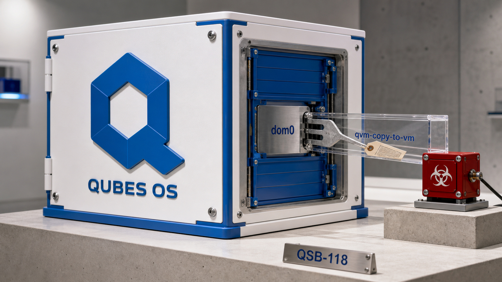

Mensagem de erro deveria fazer uma coisa só: avisar que algo deu errado. No Qubes OS, um nome de arquivo controlado por uma máquina comprometida conseguia pegar esse caminho e terminar num shell dentro do domínio mais confiável do sistema. É aquele colega que responde "deixa comigo" e volta com acesso root.

A edição de hoje está cheia dessas fronteiras que pareciam pequenas até alguém encostar nelas. O grupo `docker` do Omarchy dava poder de root a processos comuns do desktop. Testes do ChatGPT Work revelaram um runtime com navegador, rede e armazenamento persistente. E modelos de difusão estão tentando trocar a obrigação de escrever da esquerda para a direita por várias rodadas de revisão.

## Qubes corrige injeção de comando no domínio mais confiável

O Qubes OS publicou o boletim QSB-118 sobre uma falha que podia transformar o erro de uma cópia de arquivo em execução arbitrária de comando no dom0. Todas as versões do sistema são afetadas. Para o Qubes 4.3, a correção está no pacote `qubes-core-dom0-linux` 4.3.22.

O dom0 é o domínio administrativo mais confiável do Qubes. Ele controla o sistema e fica deliberadamente isolado das máquinas virtuais, ou qubes, onde o trabalho comum acontece. A vulnerabilidade furava essa separação pelo lugar menos cinematográfico possível: uma mensagem de erro.

O cenário começa com uma qube de destino já comprometida. O usuário inicia no dom0 uma cópia para essa máquina usando `qvm-copy-to-vm`. Se ocorre um erro, a qube devolve um nome de arquivo para o dom0 apresentar na caixa de diálogo. Segundo a equipe de segurança, o código removia caracteres fora de ASCII e aspas duplas, interpolava o restante numa string e passava tudo para `system()`.

Pronto: o nome do arquivo deixa de ser dado e começa a dar ordens ao shell. Um destino comprometido podia fabricar esse valor e levar o dom0 a executar um comando arbitrário. Do lado das VMs, a rotina equivalente chama `execlp()` com argumentos separados em vez de entregar uma linha inteira ao shell, então esse caminho não é afetado.

A exploração exige duas coisas: a qube de destino já comprometida e uma pessoa iniciando a cópia do dom0 para ela. Com isso, uma invasão antes confinada a uma qube pode chegar ao controle do Qubes OS. Uma baita promoção de privilégio para um nome de arquivo.

O boletim é datado de 28 de agosto e foi publicado no dia 29. Naquele momento, o pacote corrigido deveria sair de `security-testing` para o repositório estável depois dos testes da comunidade. A orientação oficial é continuar atualizando o sistema normalmente. Aqui, a janela de erro era literalmente uma janela de privilégio.

Fonte: [Qubes Security Bulletin 118](https://www.qubes-os.org/news/2026/08/29/qsb-118/).

## Omarchy tira o grupo Docker do caminho padrão até root

O Omarchy corrigiu outra fronteira de privilégio, agora no desktop de desenvolvedor. Antes da versão 4.0.1, o usuário padrão entrava no grupo `docker`. Qualquer processo da sessão com as permissões desse usuário podia controlar o daemon Docker executado como root e, de quebra, modificar o host como root.

A frase "usar Docker sem sudo" esconde duas arquiteturas bem diferentes. No desenho afetado, o daemon continua com privilégio de root e atende comandos pelo socket Unix em `/var/run/docker.sock`. Entrar no grupo `docker` dá acesso direto a esse socket. O próprio Docker trata essa permissão como equivalente a root. O modelo de autorização fez exatamente o que prometia; o padrão do sistema é que entregou poder demais.

O problema estava no tamanho da confiança concedida de saída. Navegador, editor, agente de IA, script de pacote e qualquer outro processo da sessão herdavam o grupo suplementar. Ninguém precisava convencer a pessoa a digitar `sudo`; bastava conversar com o daemon, que já podia fazer o serviço privilegiado. Conveniência é uma delícia até o navegador ganhar a chave da casa.

O pesquisador demonstrou a consequência montando a raiz do host dentro de um container Alpine e lendo o `/etc/shadow`. O teste foi feito no Omarchy 3.8.4, e a divulgação considera afetadas todas as versões anteriores à 4.0.1. A configuração havia sido introduzida em 1º de junho de 2025, reativada no dia 17 daquele mês e removida em 24 de agosto de 2026. Os detalhes saíram depois da correção coordenada, em 28 de agosto.

Usuários devem atualizar para a versão 4.0.1 ou posterior e conferir o estado do grupo e da sessão. É o tipo de detalhe que faz logout, reinício e verificação parecerem menos burocracia e mais engenharia.

O modo rootless do Docker segue outro desenho. Ele executa daemon e containers dentro de um namespace de usuário, sem um daemon com poderes de root no host. Isso reduz o raio de impacto, embora ainda exponha interfaces do kernel ligadas a namespaces e possa exigir controles mais permissivos de seccomp ou AppArmor em cenários com BuildKit aninhado. Também depende da configuração de faixas subordinadas de UID e GID.

Rootless e "usuário no grupo do daemon rootful" entregam uma ergonomia parecida no terminal, mas por caminhos diferentes. No rootless, o root sai do daemon. Essa é a diferença que importa quando alguma coisa na sessão resolve aprontar.

Fontes: [divulgação técnica do pesquisador](https://0xcc.io/posts/omarchy-root-creds/) e [documentação do modo rootless do Docker](https://docs.docker.com/engine/security/rootless/).

## ChatGPT Work parece menos chat e mais sistema operacional de tarefa

No lançamento do [ChatGPT Work](/2026/gpt-5-6-ultra-o-harness-aberto-da-cloudflare-e-um-modelo-de-744b-num-laptop/), a orquestração por subagentes já era parte da história. Agora Simon Willison testou o produto e inventariou o que existe ao redor do modelo: execução de código com internet, navegador Chrome automatizado, armazenamento persistente, publicação de sites e execução de subagentes.

Nos testes, o ambiente de código podia acessar a internet com controle configurável por domínio. O Work também ofereceu um Chrome completo em modo headless. Junte navegador lendo conteúdo não confiável, arquivos ou credenciais privadas e um canal de saída, e aparece a combinação que Willison chama de “trifecta letal” para injeção de prompt.

Willison não demonstrou um ataque; o artigo pergunta como a OpenAI reduz esse risco. O inventário já mostra uma superfície na qual o agente consegue ler, agir e se comunicar. Isso entra no threat model da equipe antes que a interface simpática faça todo mundo esquecer o pequeno detalhe de que a caixa de texto agora tem mãos.

O armazenamento também muda a conversa. Willison observou um volume `/workspace` compartilhado entre sessões do Work. Processos e servidores em `localhost` não continuavam compartilhados, mas arquivos persistiam. Isso permite retomar trabalho e manter artefatos úteis; também permite carregar um arquivo envenenado de uma sessão para outra. Memória durável é maravilhosa até lembrar perfeitamente da coisa errada.

O autor ainda conseguiu enumerar 223 ferramentas registradas, seis vindas dos MCPs pessoais dele, e 44 skills. Ele chegou a esses números por engenharia reversa durante o teste. São observações daquele ambiente, sem o peso de uma API pública ou de um contrato estável de compatibilidade. Identidade do modelo, franquias de uso, planos e nomes do produto neste retrato também dependem das observações de Willison.

Para uma equipe, a leitura útil é tratar o Work como runtime de agente. Segredos, permissões de saída, páginas não confiáveis, ações do navegador, ferramentas conectadas e arquivos persistentes fazem parte da fronteira de segurança. A caixa de texto é só a recepção do prédio.

Fonte: [Simon Willison — Understanding ChatGPT Work](https://simonwillison.net/2026/Aug/30/understanding-chatgpt-work/).

## Modelos de difusão revisam o texto antes de bater o martelo

Modelos de linguagem tradicionais costumam gerar um token por vez, da esquerda para a direita. Cada passo depende do que já foi escolhido. Um novo guia do Kuleshov Group explica outra arquitetura: começar com posições mascaradas e refinar várias delas repetidamente até chegar ao texto final.

Na difusão mascarada, o modelo recebe uma sequência com tokens escondidos. A cada rodada, prevê parte dessas posições e pode mascarar outra vez os trechos que ainda merecem revisão. O sistema trabalha sobre um bloco e reconsidera decisões antes de entregar o resultado. É quase o conceito revolucionário de reler o que escreveu, agora com GPU.

Isso tenta aproveitar melhor cada passagem pelos pesos do modelo. Na decodificação autorregressiva, mover esses pesos pela memória serve para escolher o próximo token. Na difusão, uma passagem pode atualizar várias posições. O ganho real, porém, depende de arquitetura, hardware, tamanho do lote, quantidade de rodadas e qualidade exigida. Manchete de “várias vezes mais rápido” sem esse contexto é benchmark usando nariz de palhaço.

O comprimento variável exige outro pedaço do desenho. A difusão em blocos divide a geração e permite continuar produzindo texto sem fixar toda a sequência antecipadamente. Separar encoder e decoder pode evitar trabalho repetido, enquanto destilação tenta reduzir o número de etapas necessárias para chegar ao resultado. Mesmo com essas técnicas, a inferência ainda passa por várias rodadas de remoção de ruído ou refinamento.

A capacidade de revisar posições torna a arquitetura interessante para preenchimento de lacunas e geração com restrições. Desempenho em programação, agentes ou tarefas completas continua dependendo de avaliação própria. E throughput de tokens mede tokens, não o tempo até a entrega correta aparecer.

Medusa faz outra coisa: propõe tokens futuros e deixa o modelo-alvo verificar um prefixo válido. A difusão começa com uma sequência mascarada ou ruidosa e a refina repetidamente. As duas exploram trabalho paralelo, com mecanismos e garantias diferentes.

Fonte: [Kuleshov Group — How to Build a Diffusion Language Model](https://kuleshov-group.github.io/blog/blog/2026/how-to-build-a-diffusion-language-model/).

## Destaques rápidos para hoje.

- **Scrapers já comem cerca de um quinto da CPU do Kernel.org.** O operador Konstantin Ryabitsev relata perto de 6 milhões de pedidos diários por commits aleatórios: 66% morrem no desafio Anubis, enquanto o restante mantém de 14 a 16 dos 90 núcleos, distribuídos em cinco nós, renderizando páginas. A classificação é uma estimativa operacional, porque separar todo bot de todo humano virou uma ciência meio sobrenatural. Se você precisa do histórico, clone o repositório uma vez. Raspar HTML de commits repete o trabalho dinâmico por forks e URLs. Fonte: [Kernel.org — Creepy crawlies](https://people.kernel.org/monsieuricon/creepy-crawlies).

- **Um teste do Qwen encontrou mais velocidade e entregas que simplesmente não existiam.** Na mesma máquina, com uma RTX PRO 6000 Blackwell Max-Q de 96 GB e o mesmo endpoint vLLM nightly, o autor relata que o Qwen3.8 Flash Next NVFP4 foi cerca de 1,3 a 1,9 vez mais rápido nos caminhos bem-sucedidos, mas às vezes declarou conclusão sem produzir o artefato prometido; o Qwen3.8 27B FP8 levou vantagem em algumas tarefas simbólicas longas. O teste é privado e usa amostras e quantizações diferentes, então o resultado vale para aquele recorte. Em pipeline de agente, valide arquivo, schema e invariantes. Status e motivo de parada também sabem mentir com convicção. Fonte: [relato do teste no Reddit](https://old.reddit.com/r/LocalLLaMA/comments/1w2z2zo/qwen38flashnextnvfp4_vs_qwen3827bfp_test_results/).

- **Pangolin 1.22 colocou modelos e acesso remoto atrás do mesmo gateway.** A versão 1.22.0 adiciona gateways públicos e privados para IA, chaves virtuais, identidade, métricas de custo e tokens e controle de orçamento; SSH, RDP e VNC pelo navegador, além de recursos privados SSH e HTTPS, chegaram à Community Edition. Gateways de IA exigem Badger 1.6.0 ou posterior; os privados pedem Gerbil 1.5.0 e clientes lançados depois de 19 de agosto. Faça backup antes de atualizar: os mantenedores avisam que voltar de versão pode ser complicado. Centralizar segredos também deixa o possível estrago muito bem organizado. Fonte: [notas do Pangolin 1.22.0](https://github.com/fosrl/pangolin/releases).

- **Incus 7.4 reduz a pausa na migração de containers com snapshots incrementais.** Em armazenamento local ZFS ou Btrfs, a migração quase ao vivo envia a maior parte do sistema de arquivos enquanto o container continua rodando e para o workload durante a transferência do delta final. Isso encurta a interrupção e dispensa a compatibilidade de estado de processo do CRIU. O "quase" está trabalhando na frase: ainda existe uma breve parada final, e o recurso vale para os backends locais ZFS e Btrfs suportados. Fonte: [anúncio do Incus 7.4](https://discuss.linuxcontainers.org/t/incus-7-4-has-been-released/27169).

- **No PostgreSQL, configurar o nível `log` pode esconder erros comuns.** Christophe Pettus mostrou no PostgreSQL 18.6 que `log_min_messages = 'log'` manteve mensagens `LOG`, mas descartou uma divisão por zero em `ERROR` e um `RAISE WARNING`. Sim, `LOG` ocupa uma posição bem contraintuitiva nessa hierarquia. Os outros portões decidem se a instrução SQL acompanha o erro e quanto detalhe entra no registro. O padrão `warning` costuma ser mais seguro; texto de query e `DETAIL` podem conter dados de clientes, então observabilidade e minimização de dados precisam ser decididas juntas. Fonte: [All Your GUCs in a Row](https://thebuild.com/blog/all-your-gucs-in-a-row-log_min_messages-log_min_error_statement-and-log_error_verbosity/).

- **Linux 7.3-rc1 abriu a fase de estabilização.** O Kernel.org já lista o tarball, o diff e o repositório da primeira release candidate depois da janela de merge. Mantenedores e distribuições já podem começar os testes. Servidores de produção ficam nos kernels stable ou longterm até a versão final; coragem sem janela de manutenção costuma ter outro nome. Fonte: [The Linux Kernel Archives](https://www.kernel.org/).

- **OpenClaw 2.0 reconstruiu a aplicação web e passou a compartilhar sessões.** Segundo o projeto, o lançamento de 30 de agosto reúne mais de 16 mil pull requests de 933 contribuidores, 569 deles participando pela primeira vez, além de setup simplificado e sessões na nuvem que outra pessoa pode acompanhar ou receber com o contexto preservado. Os números de escala e as afirmações de confiabilidade vêm do anúncio do projeto; esta apuração não testou a versão. Em equipe, sessão compartilhada também pede identidade, acesso, auditoria e alguém sabendo quem ficou com a tarefa quando o agente passou o bastão. Fonte: [OpenClaw 2.0, Accidentally](https://openclaw.ai/blog/openclaw-2-accidentally).

- **`wrapture` observa chamadas Python reais e injeta falhas sem trocar tudo por mocks.** A biblioteca de Graham Dumpleton envolve callables, registra argumentos normalizados, retornos e chamadas aninhadas, e usa os mesmos eventos em asserções, traces de terminal e OpenTelemetry via OTLP. A versão atual é a décima primeira alpha, exige Python 3.12 ou posterior e `wrapt` 2.4.0 ou posterior; contagem de mais de mil testes, 150 páginas de documentação e a informação de que IA escreveu código e texto sob revisão do autor são declarações do próprio projeto, não certificado de estabilidade. Fonte: [Introducing wrapture](https://grahamdumpleton.me/posts/2026/08/introducing-wrapture/).

- **K-Veritas Go assina o rastro de um experimento, não a verdade da conclusão.** A CLI registra snapshots do código, telemetria e claims declarados em relatórios assinados, com vínculos por SHA-256, árvores de Merkle e divulgação seletiva de arquivos ou agentes. O projeto declara amostragem em torno de 10 Hz e pede Go 1.22 ou posterior para compilação; mapas de atividade e atribuição de hardware por processo ficam no Linux. A assinatura revela alterações no que foi registrado. Uma metodologia ruim ainda pode assinar a própria ruindade com integridade criptográfica impecável. Fonte: [K-Veritas Go](https://github.com/27-GROUP/kveritas-go/).

- **Medusa propõe vários próximos tokens e deixa o modelo-alvo dar a palavra final.** Os novos guias explicam como cabeças auxiliares criam propostas, uma árvore esparsa compartilha prefixos e a atenção em árvore permite ao modelo original aceitar somente um prefixo válido; o exemplo com Vicuna-7B tem 64 nós e 42 caminhos da raiz às folhas. Na verificação gulosa exata, os tokens confirmados coincidem com a decodificação comum, mesmo quando nenhuma proposta especulativa é aceita. E mais tokens por verificação não viram automaticamente o mesmo multiplicador no relógio, porque avaliar a árvore custa mais. Fontes: [Medusa Parte I](https://sudhirpol522.github.io/blog/medusa-multi-token-prediction/) e [Medusa Parte II](https://sudhirpol522.github.io/blog/medusa-inference-tree-verification/).

- **openSUSE empacotou o driver NPU da Intel e o OpenVINO para três linhas da distribuição.** O Intel Linux NPU Driver 1.35.0 e o OpenVINO 2026.3.1 estão disponíveis para Tumbleweed, Leap 16.0 e Leap 16.1, com uma correção upstream para um `SIGABRT` de inicialização do `ResourceCleaner` em alguns ambientes Linux. Isso simplifica a inferência em CPU, GPU e NPU de máquinas Intel Core Ultra compatíveis. A disponibilidade do pacote não mede desempenho nem garante suporte a todo modelo e operador. Infelizmente o gerenciador de pacotes ainda não instala milagres. Fonte: [openSUSE News](https://news.opensuse.org/2026/08/31/NPU-openVINO/).

- **Um cabo Ethernet direto move arquivos sem roteador e quase sem cerimônia.** A nota de Maurycy Ziołkowski configura endereços IPv6 estáticos nas duas máquinas e usa `socat` sobre TCP6, chegando a cerca de 900 Mbit/s, ou 6,7 GB por minuto, no equipamento gigabit testado. Portas modernas normalmente negociam o enlace direto. O stream demonstrado vem cru: sem autenticação, criptografia, verificação de integridade ou retomada. Se você não confia completamente na conexão, coloque SSH ou outra camada responsável por esse trabalho. Fonte: [transfer files over an ethernet patch cable](https://maurycyz.com/misc/etherfiles/).

> Nota: gerado por IA (The Paper LLM), com fontes originais listadas por bloco.

<!--
briefing_id: 26364
source_urls:
  - https://www.qubes-os.org/news/2026/08/29/qsb-118/
  - https://0xcc.io/posts/omarchy-root-creds/
  - https://docs.docker.com/engine/security/rootless/
  - https://simonwillison.net/2026/Aug/30/understanding-chatgpt-work/
  - https://kuleshov-group.github.io/blog/blog/2026/how-to-build-a-diffusion-language-model/
  - https://people.kernel.org/monsieuricon/creepy-crawlies
  - https://old.reddit.com/r/LocalLLaMA/comments/1w2z2zo/qwen38flashnextnvfp4_vs_qwen3827bfp_test_results/
  - https://github.com/fosrl/pangolin/releases
  - https://discuss.linuxcontainers.org/t/incus-7-4-has-been-released/27169
  - https://thebuild.com/blog/all-your-gucs-in-a-row-log_min_messages-log_min_error_statement-and-log_error_verbosity/
  - https://www.kernel.org/
  - https://openclaw.ai/blog/openclaw-2-accidentally
  - https://grahamdumpleton.me/posts/2026/08/introducing-wrapture/
  - https://github.com/27-GROUP/kveritas-go/
  - https://sudhirpol522.github.io/blog/medusa-multi-token-prediction/
  - https://sudhirpol522.github.io/blog/medusa-inference-tree-verification/
  - https://news.opensuse.org/2026/08/31/NPU-openVINO/
  - https://maurycyz.com/misc/etherfiles/
-->
