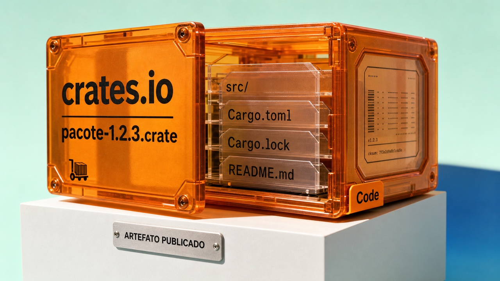

Abra três pontos de uma revisão: o arquivo `.crate` que o Cargo baixa, o YAML em `.github/workflows` que o runner executa e a região gravada no escopo de uma assinatura SigV4. O primeiro pode trazer arquivos diferentes da árvore do repositório. O segundo roda com rede, identidade e, dependendo do job, segredos. O terceiro obrigava uma API multi-região a descobrir onde assinar antes de enviar o primeiro pedido.

Cada caso deixa um objeto para conferir. O crates.io passou a mostrar o pacote publicado; uma alteração de workflow revela o processo que terá acesso às credenciais; o fluxo de assinatura mostra uma consulta regional escondida antes da chamada real. É por esses três rastros que começa a edição de hoje.

## O crates.io deixa você olhar o pacote que será baixado

O time do Rust publicou uma atualização de seis meses do crates.io. A mudança que interessa a quem revisa dependências está na aba Code: agora dá para navegar pelas versões publicadas e ver os arquivos do artefato exato que será baixado. Antes, era preciso presumir que o repositório e o pacote gerado eram idênticos.

Um crate não é simplesmente um link para o GitHub. O Cargo baixa um arquivo `.crate`, com os arquivos e metadados que passaram pelo empacotamento. Segundo o relatório, o serviço passou a criar arquivos ZIP buscáveis e manifests para servir o conteúdo pelo CDN, com requisições de intervalo quando necessário. Versões antigas também foram preenchidas retroativamente.

Isso ajuda na revisão, mas não certifica o pacote. Ainda é preciso ler o código, o histórico e as dependências. A aba permite comparar o que o projeto diz que vai distribuir com o que foi empacotado. Em uma biblioteca com arquivos gerados, scripts de build ou configuração diferente da árvore principal, essa comparação tira a dúvida do campo da suspeita.

A atualização também menciona nomes nativos no crates.io, como passo para ampliar as opções de identidade além do GitHub; avisos para crates sem manutenção no RustSec; sugestões de substituição da biblioteca padrão; a migração para Svelte; e trabalho de CDN, cache e índice Git. São mudanças de operação e produto, não um incidente de segurança. O suporte completo a outros provedores de identidade ainda é trabalho futuro.

Fonte: [atualização de desenvolvimento do crates.io](https://blog.rust-lang.org/2026/07/13/crates-io-development-update/).

## O manual de testes em Rust começa onde a promessa de memory safety termina

A Trail of Bits publicou um novo capítulo de seu handbook de segurança para Rust. O material passa por Miri, testes de propriedade com `proptest`, cobertura, mutation testing, Clippy, Kani, revisão manual, zeroização de segredos e avaliação de dependências. Também discute unwind safety, não determinismo e erros aritméticos. O compilador ajuda com segurança de memória, mas essas categorias continuam existindo.

“Rust é memory safe” descreve as classes de falha que o modelo de ownership ajuda a evitar. A frase não descreve um programa inteiro. Uma aplicação ainda pode calcular o valor errado, aceitar uma transição de estado indevida, expor um segredo depois de seu uso, depender de uma biblioteca abandonada ou falhar numa combinação de threads que nenhum teste cobriu.

O capítulo serve como mapa de revisão. Miri pode encontrar comportamentos indefinidos em certos programas. Property testing procura invariantes em muitas entradas. Mutation testing verifica se a suíte percebe mudanças. Kani ajuda em análises formais de alguns caminhos. Nenhuma dessas ferramentas detecta todos os bugs. A origem também importa: é orientação produzida a partir da prática de auditoria da Trail of Bits, não um benchmark independente comparando métodos.

O material aponta ainda para o plugin `rust-review` para Claude Code. Ele pode ajudar numa revisão, mas o resultado continua precisando de verificação humana. Uma boa ferramenta localiza uma pergunta que alguém pode investigar; não encerra a revisão com um selo verde.

Fonte: [capítulo da Trail of Bits](https://blog.trailofbits.com/2026/07/13/rust-proof-your-code-with-our-new-testing-handbook-chapter/) e [AppSec Guide](https://appsec.guide/).

## Um workflow do GitHub Actions pode virar saída para os segredos

O StepSecurity lançou controles contra exfiltração de segredos em GitHub Actions. O mecanismo é direto: um workflow malicioso pode rodar num runner legítimo, ler os segredos aos quais o processo tem acesso e enviá-los para fora. O atacante não precisa comprometer a aplicação principal. Alterar o YAML executado pelo CI já pode bastar, dependendo da combinação de revisão, permissões e credenciais.

A proposta inclui uma Secret Exfiltration Policy, que busca bloquear o acesso a segredos a partir de mudanças de workflow não revisadas, e detecção de tentativas de exfiltração. O texto descreve as campanhas que a empresa chama de GhostAction, Megalodon, Miasma e Hades. Os números vêm do levantamento do próprio StepSecurity: GhostAction teria alcançado 327 usuários e 817 repositórios, com 3.325 segredos roubados; Megalodon teria injetado workflows em mais de 5.500 repositórios.

Essas contagens são dados da análise e do produto do fornecedor, não um censo independente da ameaça. O padrão de execução é o que merece atenção: a infraestrutura de CI é um computador com identidade, rede e credenciais. Quem revisa apenas o código da aplicação e trata `.github/workflows` como configuração menor deixa uma fronteira poderosa fora da revisão.

Na prática, faz sentido exigir revisão para alterações nos workflows, restringir permissões do `GITHUB_TOKEN`, evitar segredos em jobs que não precisam deles, fixar versões de actions e procurar comportamento estranho nos logs e artefatos. São recomendações gerais de engenharia. O StepSecurity anunciou a proteção em 7 de julho; a página relaciona incidentes recentes, mas não permite ampliar esses casos para outros repositórios.

Fonte: [proteção contra exfiltração de segredos no GitHub Actions](https://www.stepsecurity.io/blog/introducing-secret-exfiltration-protection-for-github-actions).

## A autenticação multi-região da AWS escondia uma ida e volta no primeiro pedido

Uma API Gateway implantada em duas regiões da AWS, atrás de roteamento de latência do Route 53, tinha um problema que não aparecia no diagrama mais otimista. O SigV4 inclui a região no escopo da credencial. Por isso, o cliente não podia escolher uma região pelo roteamento e assinar o pedido de uma vez. Primeiro consultava qual região deveria usar; depois enviava a requisição real com a assinatura correta.

O relato publicado pelo InfoQ descreve uma mudança de desenho que removeu esse endpoint de descoberta. O primeiro pedido deixou de depender da ida e volta extra, e a recuperação melhorou quando uma região estava degradada. O detalhe está na combinação: roteamento global e autenticação regional criavam uma dependência operacional escondida.

Um cache de descoberta pode prolongar a falha. Se conservar a região problemática, continua direcionando clientes para o lugar errado. Se a descoberta depender da própria região indisponível, o bootstrap fica frágil. A escolha de rota, o escopo da assinatura, o bootstrap e o failover precisam ser pensados no mesmo fluxo.

Há um limite para essa conclusão. É um caso de engenharia contado em primeira pessoa sobre um serviço específico. Não é anúncio de produto da AWS nem recomendação universal para substituir a forma como qualquer API usa SigV4. Os incidentes regionais citados no artigo, em dezembro de 2021, junho de 2023 e outubro de 2025, motivaram o autor; eles não medem o ganho obtido pelo padrão.

Fonte: [estudo de caso sobre assinatura multi-região](https://www.infoq.com/articles/aws-multi-region-signing/?utm_campaign=infoq_content&utm_source=infoq&utm_medium=feed&utm_term=global).

## Swival tenta fazer um agente de código local caber na realidade

O Swival é um agente de código em Python, com licença MIT, pensado para modelos pequenos, locais ou hospedados. A documentação lista compactação graduada de contexto, estado persistente, relatórios de revisão e benchmark, opções de sandbox, MCP, modo servidor A2A e criptografia opcional de segredos com `--encrypt-secrets`. O projeto também suporta LM Studio, llama.cpp, Hugging Face, OpenRouter, Google, ChatGPT, Bedrock e servidores compatíveis com a API da OpenAI.

A lista põe na mesa problemas que às vezes ficam escondidos atrás da palavra “agente”. Contexto cresce. Estado precisa sobreviver a mais de uma chamada. O provedor pode mudar de uma máquina para outra. Ferramentas precisam de limites. Uma credencial pode ficar exposta quando o modelo local parecia uma escolha simples no protótipo.

O quickstart oficial instala o programa com `uv tool install swival`. Instalação não é confiança. Um agente que lê o filesystem, acessa a rede e executa comandos continua sendo um processo com poderes concretos, tenha o modelo poucos ou muitos parâmetros. Sandbox, revisão e permissões mínimas servem para limitar o teste. Não tornam o processo automaticamente seguro.

O GitHub do projeto mostrava a versão 1.0.38, lançada em 9 de julho. As funcionalidades foram verificadas na documentação oficial; esta seleção não teve benchmark independente de qualidade, confiabilidade ou segurança. O Swival fica como projeto para inspecionar e experimentar a operação de agentes locais. Conceder acesso irrestrito ao filesystem e à rede exigiria outra avaliação.

Fonte: [site oficial do Swival](https://swival.dev/) e [repositório no GitHub](https://github.com/swival/swival).

## Quatro alertas que pedem ação ou pelo menos atenção

### ShareFile investiga indisponibilidade enquanto clientes recebem ordem de desligamento

A [página pública de status do ShareFile](https://status.sharefile.com/incidents/c59n5343lbkq), publicada em 10 de julho às 12h12 EDT e ainda sem resolução quando consultada em 13 de julho, confirma apenas que clientes com Storage Zone Controllers não estavam operacionais e que o caso seguia em investigação.

As demais afirmações vêm da SecurityWeek. A reportagem descreve um aviso não público enviado pela Progress aos clientes. Segundo esse relato, a empresa falou em “ameaça externa de segurança crível”, desabilitou o acesso das contas afetadas, pediu o desligamento manual dos servidores que hospedam os controllers e disse não ter, naquele momento, indicação de acesso não autorizado a contas ou dados de clientes. O aviso original não estava disponível publicamente nesta apuração.

Causa, atividade de atacante, escopo e prazo de correção continuam sem divulgação. Não há confirmação de vazamento, zero-day ou exploração. Para quem opera esses controllers, porém, a ordem de desligamento exige ação antes que a investigação pública explique o ocorrido.

Fonte: [status oficial do ShareFile](https://status.sharefile.com/incidents/c59n5343lbkq) e [relato da SecurityWeek sobre o aviso aos clientes](https://www.securityweek.com/progress-prompts-sharefile-storage-zone-controller-shutdown-amid-security-concerns/).

### CISA confirma exploração ativa no Balbooa Forms

A versão `2026.07.10` do catálogo KEV da CISA adicionou em 10 de julho a CVE-2026-56291, uma falha de upload irrestrito no Balbooa Forms. O registro emitido pelo Joomla! Project descreve upload não autenticado de arquivos executáveis, com possibilidade de execução remota completa de código. Versões até a 2.4.0 são afetadas, e o pesquisador que publicou a análise identifica a 2.4.1 como corrigida.

A exploração ativa vem da inclusão no KEV, não de uma leitura da pontuação. A CISA definiu 13 de julho de 2026 como prazo federal; o NVD exibe CVSS 4.0 de 10.0 atribuído ao CNA Joomla e CVSS 3.1 de 9.8 atribuído ao NIST. O catálogo registra como desconhecido o uso em ransomware.

Balbooa Forms é uma extensão para Joomla, não o núcleo do Joomla. A falha também não afeta automaticamente toda instalação Joomla. Quem usa a extensão tem uma faixa afetada, uma versão corrigida e um sinal de exploração para orientar a atualização para 2.4.1 e a revisão de incidentes.

Fonte: [catálogo KEV da CISA](https://www.cisa.gov/sites/default/files/feeds/known_exploited_vulnerabilities.json), [registro da CVE-2026-56291](https://nvd.nist.gov/vuln/detail/CVE-2026-56291) e [relato do pesquisador](https://mysites.guru/blog/balbooa-forms-unauthenticated-file-upload-flaw/).

### TRACE transforma falhas recorrentes de agentes em ambientes de treino

O TRACE, da Stanford, analisa trajetórias bem-sucedidas e falhas para encontrar lacunas de capacidade, sintetiza ambientes verificáveis, treina adaptadores LoRA específicos com GRPO e os combina por roteamento em nível de token. A implementação oficial é aberta. O paper é um preprint em revisão. Os ganhos reportados continuam sendo resultados atribuídos ao método, não uma solução geral estabelecida para treinamento de agentes.

Fonte: [projeto TRACE](https://scalingintelligence.stanford.edu/blogs/trace/), [paper](https://arxiv.org/html/2604.05336) e [implementação](https://github.com/ScalingIntelligence/TRACE).

### Cloud Hypervisor 53 melhora snapshot, restore e migração ao vivo

A release 53 do Cloud Hypervisor traz um daemon para descarregar operações de snapshot e restore, melhorias na live migration, suporte a Hyper-V aninhado, `virtio-rtc` e correções do relógio do guest depois de restore ou migração. As notas oficiais não estabelecem números independentes de desempenho, downtime ou throughput. É uma atualização prática para quem opera VMs leves e fluxos de migração.

Fonte: [Cloud Hypervisor 53](https://github.com/cloud-hypervisor/cloud-hypervisor/releases/tag/v53.0).

## Termine a revisão nos mesmos três lugares

Baixe o `.crate` e compare seus arquivos com a árvore do repositório. Em `.github/workflows`, leia o YAML como um programa: confira o evento que dispara o job, as permissões, os segredos disponíveis e os destinos acessíveis pela rede. Na API, siga a primeira requisição e marque onde a região entra no roteamento, no escopo SigV4, no cache de descoberta e no failover.

As demais histórias trazem verificações próprias. O manual da Trail of Bits distribui a revisão de Rust entre ferramentas que procuram classes diferentes de falha. O Swival documenta estado persistente, compactação, provedores, credenciais e sandbox. O TRACE produz ambientes verificáveis a partir de falhas recorrentes. No ShareFile, a página pública sustenta a indisponibilidade, enquanto a ordem de desligamento depende do relato da SecurityWeek. No Balbooa Forms, o KEV sustenta a exploração ativa e o registro da CVE delimita o componente e as versões afetadas.

Os três artefatos permitem uma ação precisa. O `.crate` responde o que será instalado. O YAML responde o que o runner fará com as credenciais. O escopo SigV4 mostra por que o cliente precisava consultar uma região antes da primeira chamada. Abra esses três pontos antes de aprovar a mudança.

> Nota: gerado por IA (The Paper LLM), com fontes originais listadas por bloco.

<!--
briefing_slug: 2026-07-13
briefing_date: 2026-07-13
edition_mode: roundup
mode_selection_origin: automatic
requested_mode: auto-now
main_stories: 5
quick_hits: 4
public_word_count: 2037
role_contract_editorial: /projects/automations/daily-paper/daily-paper-llm-roundup/agents/v2/editorial.md
role_contract_writer: /projects/automations/daily-paper/daily-paper-llm-roundup/agents/v2/writer.md
role_contract_humanizer: /projects/automations/daily-paper/daily-paper-llm-roundup/agents/v2/humanizer.md
skill_humanizer: /projects/automations/daily-paper/daily-paper-llm-roundup/skills/humanizer/SKILL.md
role_contracts_loaded:
- /projects/automations/daily-paper/daily-paper-llm-roundup/agents/v2/editorial.md
- /projects/automations/daily-paper/daily-paper-llm-roundup/agents/v2/writer.md
- /projects/automations/daily-paper/daily-paper-llm-roundup/agents/v2/humanizer.md
- /projects/automations/daily-paper/daily-paper-llm-roundup/skills/humanizer/SKILL.md
source_plan: /projects/code/otaviomiranda.com.br/run_dir/2026-07-13-2026-07-13-2/10-source-plan.md
source_urls:
- https://blog.rust-lang.org/2026/07/13/crates-io-development-update/
- https://blog.trailofbits.com/2026/07/13/rust-proof-your-code-with-our-new-testing-handbook-chapter/
- https://appsec.guide/
- https://www.stepsecurity.io/blog/introducing-secret-exfiltration-protection-for-github-actions
- https://www.infoq.com/articles/aws-multi-region-signing/?utm_campaign=infoq_content&utm_source=infoq&utm_medium=feed&utm_term=global
- https://swival.dev/
- https://github.com/swival/swival
- https://status.sharefile.com/incidents/c59n5343lbkq
- https://www.securityweek.com/progress-prompts-sharefile-storage-zone-controller-shutdown-amid-security-concerns/
- https://www.cisa.gov/sites/default/files/feeds/known_exploited_vulnerabilities.json
- https://nvd.nist.gov/vuln/detail/CVE-2026-56291
- https://mysites.guru/blog/balbooa-forms-unauthenticated-file-upload-flaw/
- https://scalingintelligence.stanford.edu/blogs/trace/
- https://arxiv.org/html/2604.05336
- https://github.com/ScalingIntelligence/TRACE
- https://github.com/cloud-hypervisor/cloud-hypervisor/releases/tag/v53.0
briefing_input: available; used as inventory only; source plan was sole factual input
recent_posts_inspected:
- /projects/code/otaviomiranda.com.br/src/content/posts/2026/o-modelo-e-so-uma-peca-seguranca-cache-e-infraestrutura-no-daily-paper-llm/text.md
- /projects/code/otaviomiranda.com.br/src/content/posts/2026/llms-na-producao-o-modelo-e-a-parte-facil/text.md
- /projects/code/otaviomiranda.com.br/src/content/posts/2026/gitea-docker-virava-admin-e-png-faz-agente-vazar-env/text.md
-->
