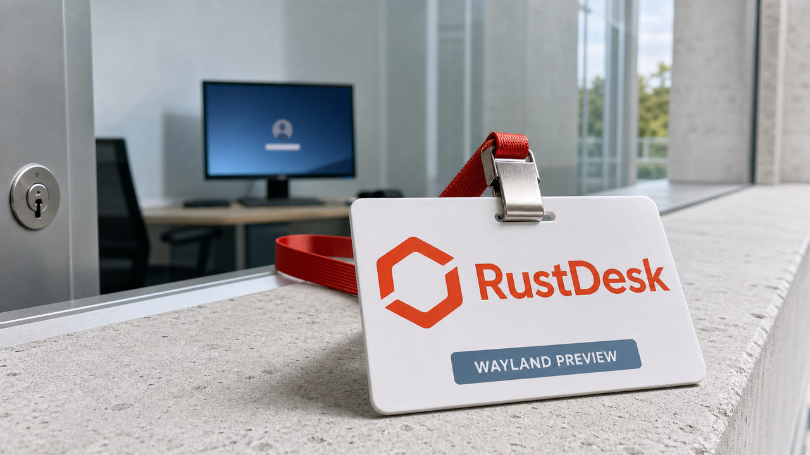

Você reinicia o desktop remoto e ele reaparece sozinho na tela de login. Liga o JIT do banco e nenhuma consulta é compilada. Baixa 27 bilhões de parâmetros e descobre que "aberto" ainda precisa caber em algum hardware.

As notícias de hoje parecem morar em bairros diferentes, mas todas acabam na mesma pergunta chata: o recurso existe no anúncio, na configuração ou no sistema que está rodando de verdade?

O RustDesk abriu um preview importante para Wayland. O PostgreSQL 18 pode responder `on` para uma capacidade que não está lá. A Qwen colocou pesos novos para download. E Matthew Green olha para a caça automatizada de vulnerabilidades e pergunta o que os governos pedirão se o estoque de exploits começar a secar.

O painel está verde. A infraestrutura trouxe os recibos.

## RustDesk testa acesso não assistido no Wayland

O RustDesk publicou em 14 de agosto um build preview que permite entrar remotamente numa sessão Wayland sem deixar alguém diante da máquina só para aprovar cada conexão. O acesso funciona depois de reiniciar, ainda na tela de login, e suporta múltiplos monitores.

Isso separa suporte remoto de administração remota de verdade. Se toda sessão exige uma pessoa clicando em "permitir", você consegue ajudar quem já está usando o desktop. Cuidar de uma máquina vazia depois de um reboot é outra história.

Wayland dificulta esse tipo de acesso por design. Captura de tela e injeção de teclado ou mouse exigem integração explícita, em vez do acesso amplo que ferramentas tradicionais encontravam no X11. Essa dificuldade faz parte do isolamento. O compositor não acordou de mau humor e resolveu implicar com o RustDesk.

O build atual é separado da versão estável e atende x86_64 em Debian ou Ubuntu. Fedora e Arch estão nos planos, assim como a incorporação aos releases normais. Dá para testar agora, sabendo que estabilidade não aparece por osmose só porque o nightly funcionou duas vezes na sua máquina.

Nesse teste, trate o RustDesk como infraestrutura privilegiada. Confira autenticação, firewall, relay próprio, logs, múltiplos monitores e o comportamento após reboot. Acesso não assistido é exatamente a capacidade de entrar quando ninguém está olhando. Ótimo para o administrador. O invasor também acha o nome do recurso bastante simpático.

Fonte: [RustDesk — Unattended Remote Access on Wayland](https://rustdesk.com/blog/unattended-remote-access-wayland/).

## PostgreSQL 18 pode jurar que o JIT está ligado sem conseguir usá-lo

Nos pacotes PGDG do PostgreSQL 18 para Debian e Ubuntu, `jit` pode aparecer como `on` mesmo quando a biblioteca usada para compilar consultas não está instalada. O provider baseado em LLVM fica no pacote `postgresql-18-jit`, recomendado pela instalação, mas não obrigatório.

A pegadinha aparece fácil em imagens mínimas ou instalações com `--no-install-recommends`. A configuração registra sua intenção. O processo ainda precisa ter a ferramenta necessária para cumpri-la.

A pergunta útil para o banco é esta:

```sql
SELECT pg_jit_available();
```

A função só retorna verdadeiro quando o JIT está ligado e o provider pode ser carregado. Se a biblioteca sumiu, o PostgreSQL normalmente não levanta um erro para avisar. Apenas compila zero consultas. Configuração positiva, resultado zen.

Tem um detalhe importante no diagnóstico: `pg_jit_available()` também retorna falso quando `jit` está desligado. Para verificar a presença do provider por esse caminho, primeiro deixe a opção ligada.

JIT tende a fazer diferença em consultas analíticas grandes. Workloads transacionais curtos não ganham automaticamente um foguete porque a sigla apareceu no `SHOW`. O PostgreSQL 19, inclusive, já documenta JIT desabilitado por padrão: o custo usado para decidir sua ativação foi considerado pouco confiável.

Se você opera a versão 18, confira a capacidade em runtime, principalmente em containers enxutos. `SHOW jit` responde o que você pediu. `pg_jit_available()` descobre se o banco levou as ferramentas para o serviço.

Fontes: [análise de Christophe Pettus na The Build](https://thebuild.com/blog/all-your-gucs-in-a-row-jit-and-jit_provider/) e [notas de lançamento do PostgreSQL 19](https://www.postgresql.org/docs/19/release-19.html).

## Qwen publica um modelo multimodal aberto de 27 bilhões de parâmetros

A Qwen publicou em 14 de agosto os pesos FP8 e a configuração do Qwen3.8-27B. É um modelo denso, multimodal e pós-treinado, com 27 bilhões de parâmetros e encoder visual. O repositório usa Apache 2.0 e declara compatibilidade com Transformers, vLLM, SGLang e TokenSpeed.

O artefato traz quantização FP8 em blocos de 128. A janela de contexto nativa declarada é de 262.144 tokens, com extensão até 1 milhão. O model card conta até aí. O pedaço sobre quanta GPU, paciência e energia elétrica sobrevivem ao teste fica por nossa conta.

Ter os pesos para baixar cria uma saída concreta do endpoint fechado. Você pode hospedar a inferência, testar agentes locais e escolher o runtime. Operação local continua cobrando memória, latência, tokens, retries e correção humana. Almoço grátis não veio dentro do arquivo FP8.

Os benchmarks publicados são da própria Qwen. Servem para escolher o que testar, sem demonstrar equivalência geral com modelos fechados ou custo menor em qualquer tarefa. A comparação honesta acontece no seu harness, com seu código, suas ferramentas e o mesmo critério de aceitação. O leaderboard chama o candidato para a entrevista. Seu workload decide se ele fica.

Fonte: [model card oficial do Qwen3.8-27B-FP8](https://huggingface.co/Qwen/Qwen3.8-27B-FP8/raw/main/README.md).

## Menos exploits pode trazer mais pressão por backdoors

Matthew Green publicou em 14 de agosto uma hipótese sobre o efeito político da IA na segurança. O criptógrafo argumenta que ferramentas automatizadas para caçar vulnerabilidades podem reduzir bastante o estoque de bugs remotamente exploráveis em software grande e bem mantido. No cenário mais agressivo proposto por ele, isso poderia acontecer nos próximos dois anos.

Esse prazo é uma previsão do autor, sem medição que o confirme. O ensaio também deixa espaço para bugs em software abandonado e para defeitos novos produzidos com ajuda de IA. A parte defensiva da ideia é direta: encontrar e corrigir uma vulnerabilidade antes do atacante tira aquela peça do estoque disponível.

Green está interessado no que pode vir depois. Se governos e fornecedores de inteligência perderem acesso a exploits comerciais confiáveis, a pressão por acesso excepcional pode voltar com força. O caminho deixaria de depender de um erro acidental numa implementação e passaria a ser construído de propósito na arquitetura.

A diferença prática é enorme. Um exploit direcionado depende de uma implementação vulnerável e pode morrer no patch. Um backdoor permanente vira parte do sistema, disponível para tentativas de abuso por outros adversários. Corrigir bugs melhora a defesa. Uma porta intencional continua sendo uma porta intencional, por mais elegante que fique o nome na apresentação.

A provocação do ensaio mora aí. IA pode acelerar a busca e a correção de falhas enquanto empurra o conflito para produto, lei e criptografia. Green pode errar os dois anos. A tentação de trocar um estoque incerto de exploits por uma entrada construída já merece discussão, de preferência antes que alguém batize a maçaneta de "acesso excepcional".

Fonte: [Matthew Green — Everything is about to “go dark”](https://blog.cryptographyengineering.com/2026/08/14/everything-is-about-to-go-dark/).

## Destaques rápidos para hoje.

- **Modelos futuros do Claude terão uma marca estatística no texto.** A Anthropic diz que os próximos lançamentos escolherão tokens com um viés detectável globalmente para atender ao EU AI Act. Modelos anteriores a 2 de agosto de 2026 entram num período de transição, e haverá uma API de detecção. Edição leve pode preservar o sinal; reescrita completa pode removê-lo. Código recebe menos marca quando a escolha precisa ser exata. O resultado estima participação do Claude, sem provar autoria ou identificar usuário e organização. Fonte: [anúncio da Anthropic](https://www.anthropic.com/news/claude-text-watermark).

- **Novas análises da campanha Team PCP chegaram a contagens diferentes de exposição.** A StepSecurity diz ter encontrado 2.186 organizações e 78.330 segredos distintos no dataset divulgado; a CloudSEK estima mais de 2.500 organizações e 434 mil pipelines potencialmente expostos. São métricas de universos diferentes, atribuídas aos respectivos fornecedores, então somá-las produziria um número bem bonito e completamente inútil. Em abril, [já cobrimos o retorno da campanha](/2026/teampcp-seguranca-llms-vibevoice-git-svg-agentes-ia/); agora chegaram o dataset e as novas estimativas. Equipes afetadas precisam auditar e girar credenciais, porque reinstalar o runner não revoga um segredo já exfiltrado. Fontes: [StepSecurity](https://www.stepsecurity.io/blog/teampcp-supply-chain-attack-cicd-secrets-cloudsek-disclosure) e [CloudSEK](https://www.cloudsek.com/blog/ai-supply-chain-breach-2500-companies-434000-cicd-pipelines).

- **A Amp relata ter passado pelo SOC 2 sem usar pull requests.** Numa equipe de 20 pessoas, o auditor aceitou push restrito no `main`, commits verificados, CI bloqueante e uma trilha entre commit, discussão e deploy. Compliance pede evidência de autorização, teste, aprovação e registro; PR é uma maneira de implementar esses controles. Esse foi o desenho aprovado para a Amp e seus auditores. Outro time ainda precisa avaliar o próprio risco e conseguir o aval do próprio auditor antes de sair apagando reviews em nome da inovação. Fonte: [nota de engenharia da Amp](https://ampcode.com/notes/thats-not-soc-2-compliant).

- **Um blog Hugo passou a gravar comentários no HTML durante o build.** O site de Jake Van Alstyne busca `replies.json` num pequeno servidor Phoenix, renderiza os comentários como conteúdo estático e continua gerando a página se o serviço falhar. O envio ainda exige conta e dispara um rebuild. A atualização leva cerca de um minuto, e páginas sem atividade podem manter estado antigo até outro build. Em troca, a leitura funciona sem JavaScript e sem depender do servidor dinâmico. Fonte: [My comment section is static HTML](https://jva.lol/weblog/my-comment-section-is-static-html/).

- **ThoughtDAG transforma o contexto de um LLM em um grafo editável.** No projeto open source, só os nós ligados por arestas entram na próxima resposta; remover uma aresta muda o que o modelo recebe. Ele roda de fonte, aceita endpoints compatíveis com OpenAI e Ollama e usa licença MIT. O README marca desenvolvimento ativo, e os builds para Windows ainda não são assinados. Para modelos locais, a ideia deixa você inspecionar e podar dependências, em vez de mandar o histórico inteiro por puro apego emocional ao scroll. Fonte: [README do ThoughtDAG](https://raw.githubusercontent.com/chenxiachan/thoughtdag/main/README.md).

> Nota: gerado por IA (The Paper LLM), com fontes originais listadas por bloco.

<!--
briefing_id: 32657
source_urls:
  - https://rustdesk.com/blog/unattended-remote-access-wayland/
  - https://thebuild.com/blog/all-your-gucs-in-a-row-jit-and-jit_provider/
  - https://www.postgresql.org/docs/19/release-19.html
  - https://huggingface.co/Qwen/Qwen3.8-27B-FP8/raw/main/README.md
  - https://blog.cryptographyengineering.com/2026/08/14/everything-is-about-to-go-dark/
  - https://www.anthropic.com/news/claude-text-watermark
  - https://www.stepsecurity.io/blog/teampcp-supply-chain-attack-cicd-secrets-cloudsek-disclosure
  - https://www.cloudsek.com/blog/ai-supply-chain-breach-2500-companies-434000-cicd-pipelines
  - https://ampcode.com/notes/thats-not-soc-2-compliant
  - https://jva.lol/weblog/my-comment-section-is-static-html/
  - https://raw.githubusercontent.com/chenxiachan/thoughtdag/main/README.md
-->
