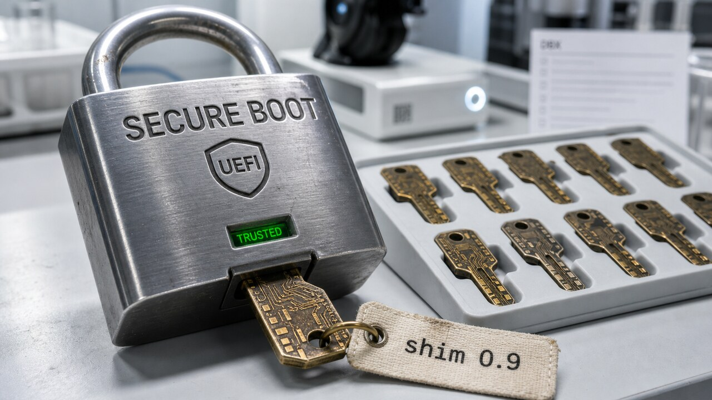

Uma máquina pode mostrar “Secure Boot habilitado” e ainda aceitar uma peça velha o bastante para carregar código antes do sistema operacional. O cadeado estava na porta, mas uma das chaves continuava válida. A ESET encontrou 11 dessas chaves: bootloaders `shim` antigos, assinados pela Microsoft e esquecidos em produtos que nem precisam estar instalados no computador atacado.

## Onze shims antigos abriram um atalho pelo Secure Boot

O `shim` é uma pequena peça da cadeia de inicialização usada por distribuições Linux. O firmware confia na assinatura da Microsoft aplicada a ele. Depois, o `shim` valida o bootloader da distribuição, normalmente o GRUB, e o bootloader valida o kernel. É assim que o Linux participa do Secure Boot sem exigir que cada fabricante de máquina confie diretamente em cada distribuição.

Na investigação publicada em 14 de julho, a ESET identificou 11 shims antigos, em geral baseados na versão 0.9 ou anterior. Eles ainda tinham uma assinatura aceita por máquinas que confiam na Microsoft Corporation UEFI CA 2011, mas também carregavam falhas corrigidas há anos. Um atacante capaz de alterar o processo de boot podia levar uma cópia do binário vulnerável e executar código não confiável antes de o sistema operacional entrar em cena.

Esse detalhe transforma software esquecido em problema de plataforma. A distribuição ou o produto ao qual o `shim` pertencia nem precisa estar instalado. Enquanto a assinatura for aceita, o atacante pode trazer a própria cópia antiga. É como levar uma fechadura aposentada para dentro do prédio porque o crachá dela ainda abre a catraca.

O pré-requisito coloca um limite importante no cenário. Segundo o CERT Coordination Center, essa não é uma exploração remota sem acesso anterior. O invasor precisa de privilégio administrativo ou de outra forma de modificar o caminho de inicialização. Se tiver esse acesso, o código roda cedo o bastante para buscar persistência e escapar de controles que só começam a funcionar depois do sistema operacional.

As falhas receberam os identificadores CVE-2026-8863 e CVE-2026-10797. A ESET reportou o caso ao CERT/CC em 16 de fevereiro de 2026. Em 9 de junho, os 11 binários entraram no update da DBX distribuído no Patch Tuesday. A análise técnica completa saiu em 14 de julho.

A DBX é a lista de assinaturas e hashes proibidos do Secure Boot. Ela complementa a DB, que guarda o que a plataforma permite. Tecnologias como SBAT ajudam a revogar gerações de componentes, mas esses shims antigos podem ser anteriores a essa política ou escapar dela. Para os 11 binários conhecidos, a saída foi revogá-los pela DBX.

Na prática, administradores precisam atualizar o sistema, os componentes de boot e a base de revogação fornecida pelo firmware ou pela plataforma. Em Linux, a ESET indica o `uefi-dbx-audit` para verificar o estado da DBX e o LVFS como possível canal de atualização em equipamentos compatíveis.

Só que a ordem importa. O CERT/CC recomenda instalar versões atuais do software e das aplicações de boot antes da nova DBX, além de testar a inicialização em hardware e máquinas virtuais representativos. Distribuir a revogação para a frota inteira sem esse teste pode trocar uma superfície vulnerável por máquinas que não ligam. Segurança adora cobrar o aluguel em disponibilidade.

Mais cedo, [falamos da expiração da Microsoft UEFI CA 2011](/2026/do-backup-zero-byte-ao-signal-validacao-deixou-de-ser-detalhe/) como um problema geral de manutenção da cadeia de confiança. Agora temos um delta concreto: 11 shims revogados, dois registros CVE e um caminho de auditoria para a DBX. A ESET também diz que não é possível enumerar com segurança todos os shims anteriores a 2017 que continuam assinados. Isso não confirma outros binários vulneráveis. Significa apenas que os 11 encontrados não provam que o inventário histórico acabou.

Os hashes publicados são de software legítimo vulnerável. A própria pesquisa evita tratá-los como indicadores de comprometimento para não produzir falsos positivos. O sinal defensivo aqui está no estado da cadeia de boot, e não na presença isolada de um arquivo que já foi legítimo.

Fontes: [ESET Research](https://www.welivesecurity.com/en/eset-research/forgotten-uefi-shims-undermining-secure-boot/) e [CERT Coordination Center](https://kb.cert.org/vuls/id/616257).

## Dependabot agora deixa a release respirar por três dias

O GitHub mudou um padrão pequeno, mas com uma consequência bem prática para supply chain. Desde 14 de julho, o Dependabot espera uma nova versão ficar pelo menos três dias no registry antes de abrir um pull request de atualização de versão no github.com. O cooldown vem ligado; você não precisa adicionar nenhuma configuração.

A ideia é amortecer os primeiros dias de uma release quebrada ou comprometida. Se os mantenedores removerem o pacote, publicarem um aviso ou soltarem uma correção logo depois, projetos que atualizam por automação ganham algum tempo para não entrar na primeira onda. Quem já recebeu um bump automático minutos após a publicação sabe que “mais recente” e “pronto para produção” não são sinônimos muito confiáveis.

O freio vale para **version updates**, as atualizações periódicas que mantêm dependências em dia. Os **security updates**, criados a partir de alertas de vulnerabilidade, continuam sem essa espera. Nesse caso, “imediato” quer dizer que o Dependabot pode abrir o PR sem aguardar três dias. O patch ainda não será aplicado nem implantado sozinho.

Equipes que precisam adotar releases assim que elas saem podem alterar ou desativar a política no `.github/dependabot.yml`. A opção `cooldown` aceita uma quantidade padrão de dias ou janelas diferentes para atualizações major, minor e patch. Também dá para incluir ou excluir dependências da regra. Como o ajuste fica na entrada de `updates` de cada ecossistema, a política pode acompanhar o risco e a cadência do projeto sem virar uma exceção global improvisada.

O padrão cobre todos os ecossistemas suportados no github.com. Para quem usa a versão instalada do GitHub, ele está previsto para o GitHub Enterprise Server 3.23. Durante a consulta para esta edição, a referência longa das opções ainda mostrava o comportamento anterior quando `cooldown` não era definido. Enquanto a documentação termina de sincronizar, o changelog de 14 de julho é a fonte para essa mudança de padrão.

Três dias não certificam um pacote. Uma versão maliciosa pode ficar disponível por mais tempo, e uma release aparentemente normal ainda pode quebrar alguma combinação rara do seu ambiente. Lockfile, proveniência, testes, revisão e política de execução continuam no emprego. O cooldown reduz a pressa e parte do raio de impacto inicial. Para uma configuração que já chega ligada, está de bom tamanho.

Fontes: [GitHub Changelog](https://github.blog/changelog/2026-07-14-dependabot-version-updates-introduce-default-package-cooldown/) e [GitHub Docs](https://docs.github.com/en/code-security/reference/supply-chain-security/dependabot-options-reference#cooldown-).

## Bonsai comprime 27B parâmetros, mas a RAM não termina no arquivo

A PrismML lançou duas variantes multimodais derivadas do Qwen3.6 27B sob licença Apache 2.0. O Bonsai 27B binário usa pouco mais de um bit efetivo por peso. Já o Ternary Bonsai 27B trabalha com três estados por peso e fica entre a quantização binária e a precisão original. Pesos, documentação e código de demonstração foram publicados em 14 de julho para inferência local com texto e imagem.

Quantização troca precisão numérica por arquivos menores e menos tráfego de memória. No modelo binário, cada peso se aproxima de um valor positivo ou negativo ajustado por uma escala de grupo. No ternário, ele pode assumir algo equivalente a menos um, zero ou mais um, também com escalas. A economia de espaço é enorme, mas algumas distinções que o treinamento guardou nos pesos podem desaparecer no processo.

A PrismML anuncia footprints de cerca de 3,9 GB para o binário e 5,9 GB para o ternário. A tabela de artefatos mostra melhor o que você realmente baixa: o GGUF de 1 bit tem 3,53 GiB, enquanto o MLX equivalente tem 3,92 GiB. No ternário, são 6,66 GiB em GGUF e 7,05 GiB em MLX. Para usar visão, a documentação ainda pede um projetor separado de aproximadamente 0,9 GiB.

O model card detalha cerca de 27,3 bilhões de pesos de linguagem e 460 milhões na torre visual, dentro da classe anunciada de 27B a 27,8B parâmetros. O GGUF binário usa o formato `Q1_0_g128`, com 1,125 bit efetivo por peso. No ternário, a PrismML informa 1,71 bit efetivo. O contexto máximo declarado é de 262.144 tokens.

Isso cabe no arquivo. A aplicação inteira, não necessariamente. O runtime ainda precisa manter ativações, buffers e o KV cache usado pela atenção. Quanto maior for o contexto ocupado de verdade, maior será essa conta. Imagem também acrescenta a torre ou o projetor visual. Portanto, os poucos GiB descrevem principalmente os pesos, não o pico de RAM de uma sessão com contexto enorme.

A perda de qualidade aparece nos números do próprio fornecedor. No agregado publicado no model card, o Qwen3.6-27B em FP16 marcou 85,07. A variante ternária chegou a 80,49; a binária, a 76,11. A queda foi maior na categoria de uso agêntico e chamada de ferramentas: 80,00 no FP16 contra 66,03 no modelo de 1 bit.

Esses benchmarks não foram reproduzidos de forma independente nesta edição. Eles mostram que a compressão cobra preços diferentes em cada tarefa, mas não servem para declarar um vencedor universal. Instruction following, visão e tool calling estão entre os pontos em que a média geral pode esconder perdas importantes. Se um assistente local precisa chamar a ferramenta certa, errar menos vale mais do que poupar alguns GiB no download.

A compatibilidade também pede cuidado. Segundo o README da demonstração, o caminho binário `Q1_0` já tem suporte upstream no llama.cpp em CPU, Metal, CUDA e Vulkan. A variante ternária ainda mistura formatos e backends disponíveis no projeto principal com caminhos mantidos no fork da PrismML. Não conte que qualquer GGUF ternário vai rodar em qualquer build.

A PrismML também informa 11 tokens por segundo em um iPhone 17 Pro com a versão de 1 bit. É uma medição da empresa para uma combinação específica de aparelho, modelo e runtime, não uma promessa para todo telefone. O resultado é menos cinematográfico e mais útil: agora desenvolvedores podem experimentar localmente um modelo multimodal dessa classe em hardware bem menor. Ainda precisam escolher o artefato certo, medir a memória total e validar a qualidade na tarefa real.

Fontes: [documentação do Bonsai 27B](https://docs.prismml.com/models/bonsai-27b), [model card no Hugging Face](https://huggingface.co/prism-ml/Bonsai-27B-gguf), [README do Bonsai-demo](https://raw.githubusercontent.com/PrismML-Eng/Bonsai-demo/main/README.md) e [anúncio da PrismML](https://prismml.com/news/prismml-releases-bonsai-27b).

> Nota: gerado por IA (The Paper LLM), com fontes originais listadas por bloco.

<!--
source_urls:
  - https://www.welivesecurity.com/en/eset-research/forgotten-uefi-shims-undermining-secure-boot/
  - https://kb.cert.org/vuls/id/616257
  - https://github.blog/changelog/2026-07-14-dependabot-version-updates-introduce-default-package-cooldown/
  - https://docs.github.com/en/code-security/reference/supply-chain-security/dependabot-options-reference#cooldown-
  - https://docs.prismml.com/models/bonsai-27b
  - https://huggingface.co/prism-ml/Bonsai-27B-gguf
  - https://raw.githubusercontent.com/PrismML-Eng/Bonsai-demo/main/README.md
  - https://prismml.com/news/prismml-releases-bonsai-27b
-->
