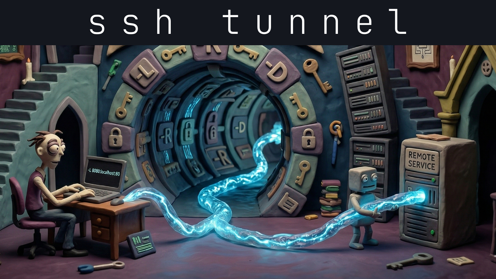
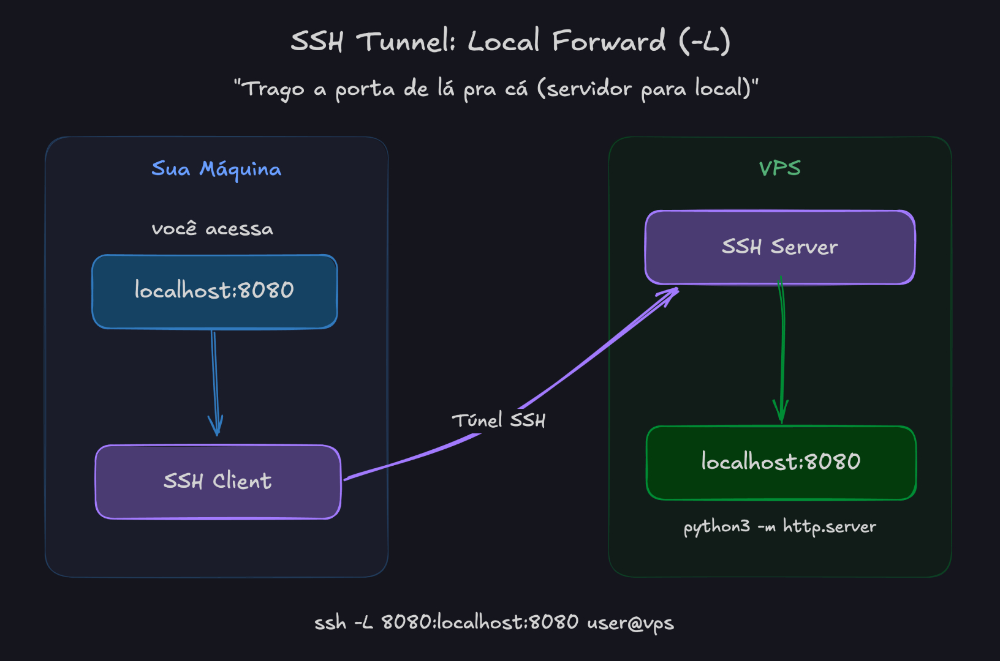
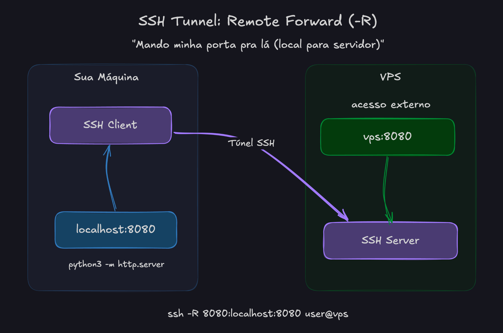
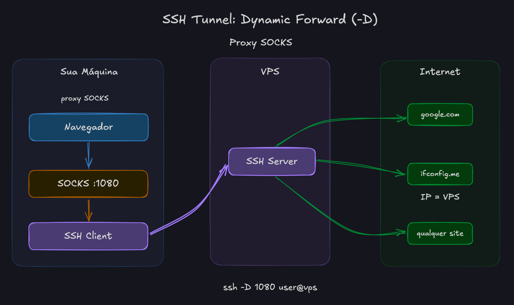

Aproveitando o embalo do meu último conteúdo sobre
[VPN com o WireGuard](/2026/vpn-com-wireguard-o-guia-definitivo/), hoje trago o
seu primo minimalista: SSH Tunnels na prática. Vamos ver um túnel local com -L,
remoto com -R e dinâmico com -D.



Depois dessa, você vai conseguir expor um serviço rodando na sua máquina para
fora (mesmo com NAT ou firewall no meio do caminho), acessar um serviço remoto
como se estivesse sentado de frente para o próprio servidor e, de quebra, ainda
criar um proxy SOCKS. Tudo isso via SSH.

Nesse texto, vou assumir que você já tem uma conexão SSH com um servidor
qualquer. Ele nem precisa ter IP público para os exemplos fazerem sentido, mas
vai ser muito mais legal se tiver 😈.

**Falando em servidores**

Se você estiver precisando de um servidor para hospedar seu site, aplicação ou
projeto, dá uma olhada na **Hostinger**.

Estou deixando meu link com desconto abaixo. Isso pode te garantir até 2 anos de
benefícios.

Acesse: [Hostinger + Otávio Miranda](https://hostinger.com/otaviomiranda)  
Cupom: `OTAVIOMIRANDA`

---

## Em vídeo:

Se quiser assistir ao invés de ler (mas aqui tem muito mais informação):

[](https://youtu.be/s-B2A8A4hHc)

- [https://youtu.be/s-B2A8A4hHc](https://youtu.be/s-B2A8A4hHc)

## O que é um SSH Tunnel?

Todo mundo já sabe que SSH serve para abrir terminal em outra máquina. O que
pouca gente te ensina é que aquele mesmo canal criptografado pode carregar
**outro tipo de tráfego**.

E se você parar para pensar, tudo começa a fazer mais sentido. O túnel já está
aberto e seguro, que tal aproveitar a oportunidade para encaixar uma conexão com
banco de dados, uma requisição HTTP ou qualquer coisa que use TCP?

O SSH suporta três tipos clássicos de _tunnel_:

**Local** `-L` - Abre uma porta na sua máquina e encaminha para um destino visto
do lado do servidor SSH. Com ele você poderia dizer algo como: _"Quando alguém
acessar a porta 4321 na minha máquina, conecte em `localhost:5432` no servidor e
me entregue isso aqui"_. E, magicamente, ao usar `localhost:4321`, você recebe
um PostgreSQL como se estivesse lá no servidor.

**Remote** `-R` - Faz o caminho contrário: abre uma porta no servidor e manda o
que cair nela para um destino visto do lado da sua máquina. É a carta na manga
quando você quer mostrar algo local para fora usando a conexão SSH que já saiu
da sua rede. Alguém acessa a porta 8000 no servidor e o SSH chama a sua máquina
na porta 3000.

**Dynamic** `-D` - Cria um proxy SOCKS na máquina onde você executou o SSH. Tudo
que você apontar para esse proxy passa a sair pelo servidor SSH. Se você
configurar isso no sistema, os apps que respeitam o proxy do sistema entram no
mesmo barco também.

Se quiser usar uma ferramenta automatizada, fiz o
[SSH Toolkit](https://sshtoolkit.otaviomiranda.com.br/), é uma ferramenta de
código aberto que te ajuda a gerar esses túneis de forma visual. Faz mais do que
isso, mas vou te falando ao longo do texto.

Bora destrinchar cada um.

---

## sshd_config

Estou escrevendo isso depois de terminar o artigo inteiro. Eu tinha espalhado
essas configurações pelo texto, mas faz mais sentido deixar tudo junto antes de
você sair abrindo túnel e depois culpar o SSH (client) por algo que foi o `sshd`
(server).

Abra o arquivo de configuração do **servidor SSH**. Em geral ele fica aqui:

```bash
# Linux
/etc/ssh/sshd_config

# Algumas distros também usam includes aqui
/etc/ssh/sshd_config.d/*.conf

# macOS
/etc/ssh/sshd_config
```

No OpenSSH, `AllowTcpForwarding`, `PermitOpen` e `PermitListen` já costumam vir
liberados por padrão. O que costuma pegar a galera de surpresa é o
`GatewayPorts`, porque ele vem de fábrica como `no`.

Se você endureceu a config do `sshd`, garanta pelo menos isso:

```ssh-config
# Necessário para -L, -R e -D
AllowTcpForwarding yes

# Só se você restringiu destinos ou portas remotas
# No final, deixo um aviso sobre isso.
PermitOpen any
PermitListen any

# Necessário para expor um -R para outras máquinas
GatewayPorts clientspecified
```

Resumo rápido do que interessa:

- `AllowTcpForwarding yes` libera os forwards TCP.
- `PermitOpen any` só é necessário se você travou os destinos permitidos para
  `-L`/`-D`.
- `PermitListen any` só é necessário se você travou as portas/endereços
  permitidos para `-R`.
- `GatewayPorts clientspecified` deixa o cliente escolher se o `-R` vai escutar
  só em `localhost` ou em `0.0.0.0`.

Depois de alterar isso, reinicie o serviço SSH.

```bash
# Linux
sudo systemctl restart sshd # ou ssh

# macOS
sudo launchctl kickstart -k system/com.openssh.sshd
```

O [SSH Toolkit](https://sshtoolkit.otaviomiranda.com.br/) também te ajuda nisso.

---

## Local Forward (`-L`): "trago a porta de lá pra cá"

Esse é o mais simples. Você abre uma porta na **sua máquina** e tudo que chegar
nela é encaminhado, pelo túnel SSH, para um destino do outro lado. O resultado é
que, ao acessar essa porta, quem responde é o servidor.



> Todos os diagramas estão
> [aqui \(via excalidraw\)](https://excalidraw.com/#json=pZCWitiR0Byu9xrH4Ct3D,yQJRrX-QjT4rDzTaAs5mBA).

**A sintaxe**

```bash
# Sua porta local encaminha para <host:porta> visto do lado do servidor SSH
ssh -L <porta_local>:<host_remoto>:<porta_remota> <user@servidor>

# Obs.: na maioria das vezes eu uso -N antes de -L para ele só focar no túnel
```

**Fluxo**

```
sua_máquina:porta_local -> túnel SSH -> servidor -> host_remoto:porta_remota
```

**Na prática**

Você tem um VPS e subiu um servidorzinho HTTP nele. Esse servidor escuta em
`localhost:8080`. Você não liberou a porta no firewall, não configurou NGINX,
não fez nada. Exemplo:

```bash
# caminho_qualquer tem um index.html
python3 -m http.server 8080 -d caminho_qualquer
```

Na sua máquina você pode encaminhar a porta local `8080` para `localhost:8080`
do servidor assim:

```bash
# ---> você:vps --->
ssh -L 8080:localhost:8080 user@seu-vps
```

Agora, se você abrir `http://localhost:8080` no navegador, vai ver o conteúdo do
VPS como se estivesse lá. Sem liberar porta, sem configurar nada. Tipo um
_teletransporte_.

O `localhost` ali no meio da sintaxe se refere ao ponto de vista do
**servidor**. Ou seja, "conecte em `localhost:8080` do servidor e traga pra
minha porta `8080`".

### Outro exemplo: banco de dados

Um PostgreSQL rodando no servidor, porta `5432`, escutando só em `localhost`.
Sem acesso externo.

```bash
# Isso é o mais comum, mesma porta
ssh -L 5432:localhost:5432 deploy@servidor
```

Conecte seu cliente local em `localhost:5432`. Pronto, você está no banco
remoto.

Se a porta `5432` já estiver ocupada na sua máquina, sem pânico. É só mudar a
local:

```bash
# Você controla qual a porta quer usar no seu lado
ssh -L 15432:localhost:5432 deploy@servidor
```

Agora use `localhost:15432`. Isso continuará chamando "5432" no lado do
servidor.

---

## Remote Forward (`-R`): "mando minha porta pra lá"

Esse é o inverso. Você abre uma porta **no servidor** e tudo que chegar lá volta
pelo túnel até a sua máquina. O resultado é que, ao acessar essa porta no
servidor, quem responde é sua máquina local.



**A sintaxe**

```bash
# A porta no servidor encaminha para <host:porta> visto do lado da sua máquina
ssh -R <porta_remota>:<destino_local>:<porta_destino> <user@servidor>
```

**O fluxo**

```
servidor:porta_remota → túnel SSH → sua_máquina → destino:porta_destino
```

**Na prática**

Agora vira o jogo. Você tem um servidorzinho rodando **na sua máquina**:

Mesmo exemplo, só que... 😏

```bash
# caminho_qualquer tem index.html
python3 -m http.server 8080 -d caminho_qualquer
```

Quer que alguém acesse isso pelo seu VPS? Faz esse túnel com -R:

```bash
# Cria a porta 8080 no VPS apontando para a sua máquina local
ssh -R 8080:localhost:8080 user@seu-vps
```

Esse comando cria uma porta `8080` **no VPS** apontando para `localhost:8080`
**da sua máquina**. O `localhost` aqui é visto do lado do cliente SSH, ou seja,
do computador onde você executou o comando.

### Wait, what? Não funcionou?

Isso acontece. Por padrão, o `-R` escuta só em `127.0.0.1` no servidor. Ou seja,
um `curl http://localhost:8080` rodando no próprio VPS funciona de boa, mas o
tráfego externo (da Internet) bate de frente numa porta fechada.

Para liberar acesso externo, o servidor SSH precisa ter isso no
`/etc/ssh/sshd_config`:

```ssh-config
GatewayPorts clientspecified
```

Eu prefiro `clientspecified` porque você escolhe no comando se quer deixar isso
privado ou público. Aí sim você especifica o bind:

```bash
ssh -R 0.0.0.0:8080:localhost:8080 user@seu-vps
```

Se você usar `GatewayPorts yes`, o `sshd` força bind no wildcard e você perde um
pouco desse controle fino.

Depois de alterar o `sshd_config`, reinicie o serviço SSH:

```bash
# Linux
sudo systemctl restart sshd

# macOS
sudo launchctl kickstart -k system/com.openssh.sshd
```

E não esqueça do firewall. Se a porta `8080` está bloqueada no firewall do VPS,
o _tunnel_ funciona, mas ninguém de fora chega lá.

---

## Dynamic Forward (`-D`): proxy SOCKS

Os dois anteriores conectam portas específicas. O `-D` é diferente: ele cria um
**proxy SOCKS** na sua máquina. Qualquer aplicação que suporte SOCKS pode mandar
tráfego por ele, e o servidor SSH conecta no destino final.

Você não precisa definir o destino antes. O proxy decide na hora.



**A sintaxe**

```bash
ssh -D <porta_local> <user@servidor>
```

**O fluxo**

```
seu app -> SOCKS proxy (localhost:porta) -> túnel SSH -> servidor -> destino final
```

**Na prática**

Você quer navegar como se estivesse no seu VPS. Não é uma VPN completa do
sistema inteiro, mas para os apps que usam o proxy a sensação é bem parecida.

Talvez para testar um bloqueio de IP, talvez porque você está naquele Wi-Fi
público super duvidoso de aeroporto e não quer ninguém "cheirando" (sniffing)
seus pacotes.

```bash
ssh -D 1080 user@seu-vps
```

Agora configure o proxy SOCKS no sistema ou no navegador.

**No macOS:** vá em Ajustes do Sistema -> Rede -> a interface que está usando
(Wi-Fi, por exemplo) -> Detalhes -> Proxies -> ative **Proxy SOCKS** → coloque
`127.0.0.1` e porta `1080`.

Abra o navegador e acesse `ifconfig.me` ou `ip.me`. O IP que aparece deve ser o
do seu VPS, não o seu.

Só não mistura as coisas: isso vale para o que estiver usando o proxy, não para
todo e qualquer pacote do sistema.

### Um detalhe sobre DNS

Dependendo da aplicação, a resolução DNS pode acontecer **antes** de ir para o
proxy. Isso meio que entrega o jogo.

No Firefox, por exemplo, vá em `about:config` e mude
`network.proxy.socks_remote_dns` para `true`. Assim até as consultas DNS passam
pelo tunnel.

Pra variar, o [SSH Toolkit](https://sshtoolkit.otaviomiranda.com.br/) também faz
isso.

---

## Flags úteis

Na maioria das vezes, você não quer um shell remoto. Quer só o _tunnel_. Essas
flags resolvem:

`-N` - sem comando remoto

Não executa nenhum comando no servidor. Só mantém o tunnel aberto.

```bash
ssh -N -L 8080:localhost:8080 user@servidor
```

`-f` - manda para o background

Joga o processo SSH pro background depois de autenticar.

```bash
ssh -f -N -L 8080:localhost:8080 user@servidor
```

Combinar `-f` com `-N` é o padrão para _tunnels_ em segundo plano. Eu gosto de
somar `-o ExitOnForwardFailure=yes` para o SSH não fingir que deu tudo certo
quando a porta já estava ocupada.

```bash
ssh -f -N -o ExitOnForwardFailure=yes -L 8080:localhost:8080 user@servidor
```

Quando cansar da brincadeira, é só caçar e matar o processo:

```bash
# encontre o PID
ps aux | grep ssh

# ou, se souber a porta
lsof -i :8080

# mate o processo
kill <PID>
```

### Keepalive

_Tunnels_ podem morrer se ficarem tempo demais sem tráfego ou se algum NAT no
meio resolver te abandonar. Para reduzir isso:

```bash
ssh -o ServerAliveInterval=60 -o ServerAliveCountMax=3 -L 8080:localhost:8080 user@servidor
```

Se o servidor ficar sem responder, o SSH detecta isso e encerra a conexão sem te
deixar adivinhando o que aconteceu.

---

## Múltiplos tunnels de uma vez

Pode empilhar quantos quiser:

```bash
ssh -L 5432:localhost:5432 -L 8080:localhost:80 -L 3000:localhost:3000 user@servidor
```

---

## Coloca isso no SSH config

Se você levanta um tunnel com frequência, pelo amor de Deus, pare de digitar
esse textão toda vez. Coloca lá no seu `~/.ssh/config`:

```
Host vps-tunnel
    HostName seu-vps.com
    User deploy
    LocalForward 5432 localhost:5432
    ExitOnForwardFailure yes
    ServerAliveInterval 60
    ServerAliveCountMax 3
```

Agora basta:

```bash
ssh -N vps-tunnel
```

---

## Tunnels persistentes com `autossh`

O SSH não reconecta sozinho. Se a conexão cair, o _tunnel_ morre junto. O
`autossh` resolve isso: ele monitora a conexão e reinicia se precisar.

```bash
autossh -M 0 -f -N -o "ServerAliveInterval=60" -o "ServerAliveCountMax=3" \
  -L 5432:localhost:5432 deploy@servidor
```

O `-M 0` desativa a porta de monitoramento do `autossh` e usa o
`ServerAliveInterval` do próprio SSH, que funciona melhor.

Se quiser algo ainda mais robusto, crie um serviço no systemd e ele reinicia
automaticamente em caso de falha.

---

## Coisas que pegam gente desprevenida

### Só funciona com TCP

SSH Tunnels encaminham **TCP**. Se você precisa de UDP de verdade, vá de
WireGuard. Se precisa de um redirecionamento pontual fora do SSH, `socat` pode
ajudar. Se quer algo mais para o lado de "quase uma VPN por SSH" para TCP/DNS,
dá uma olhada no `sshuttle`.

### Portas privilegiadas

Portas abaixo de 1024 precisam de root no lado que vai abrir a escuta. Se você
tentar isso com `-L`:

```bash
ssh -L 80:localhost:80 user@servidor
```

Vai falhar sem `sudo`. Use uma porta alta:

```bash
ssh -L 8080:localhost:80 user@servidor
```

No `-R`, a ideia é a mesma, mas do lado do servidor.

### Firewall

O tunnel funciona entre as máquinas, mas se o firewall do servidor bloqueia a
porta do `-R`, ninguém de fora chega. Libere a porta:

```bash
# UFW
sudo ufw allow 8080

# firewalld
sudo firewall-cmd --add-port=8080/tcp --permanent
sudo firewall-cmd --reload
```

### Segurança

_Tunnels_ podem furar políticas de rede. Use com responsabilidade.

Se você mandar o bind para `0.0.0.0` no `-L`, `-D` ou `-R`, qualquer máquina que
consiga alcançar essa porta pode usar o forward. Por isso o SSH costuma ficar em
`localhost` por padrão. Se for abrir para fora, saiba exatamente o que está
fazendo.

---

## Referência rápida

- Acessar serviço remoto localmente - `ssh -L 8080:localhost:8080 user@servidor`
- Expor serviço local pelo servidor -
  `ssh -R 0.0.0.0:8080:localhost:3000 user@vps`
- Proxy SOCKS para navegação - `ssh -D 1080 user@servidor`
- Tunnel em background - `ssh -f -N -L 8080:localhost:8080 user@servidor`
- Tunnel persistente - `autossh -M 0 -f -N -L 8080:db:5432 user@vps`
- Múltiplos forwards - `ssh -L 5432:db:5432 -L 8080:web:80 user@srv`

---

## Quando usar cada tipo?

- Precisa acessar algo que está numa rede remota - Local (`-L`)
- Precisa expor algo local para o mundo - Remote (`-R`)
- Precisa acessar vários serviços sem criar um _tunnel_ para cada um - Dynamic
  (`-D`)
- Quer navegar com o IP de outra máquina - Dynamic (`-D`)

---

## Conclusão

SSH Tunnel é uma daquelas ferramentas que resolvem o problema em uma linha e,
mesmo assim, a maioria das pessoas não usa.

`-L` traz, `-R` manda, `-D` faz proxy. Mais do que isso, é saber que você não
precisa liberar porta no firewall, configurar reverse proxy ou instalar nada
extra toda vez que quer acessar algo de outra máquina.

Isso já está instalado no seu sistema. Usa.

PS.: essa é a minha configuração do ssh ao terminar de escrever isso. Tem um
aviso enorme só para me lembrar.

```ssh-config
PubkeyAuthentication yes
PasswordAuthentication no
KbdInteractiveAuthentication no
ChallengeResponseAuthentication no
PermitRootLogin no
PermitEmptyPasswords no
UsePAM yes
AuthenticationMethods publickey
PermitUserEnvironment no
PermitUserRC no
X11Forwarding no
AllowStreamLocalForwarding no
AllowAgentForwarding no
PermitTunnel no
MaxAuthTries 4
LoginGraceTime 30
ClientAliveInterval 300
ClientAliveCountMax 2
PrintMotd no
UseDNS no

# ===================================================================
# 🚨 ATENÇÃO: ZONA DE PERIGO (TÚNEIS ESCANCARADOS) 🚨
# ===================================================================
# O bloco abaixo permite que qualquer túnel (-R) exponha portas
# diretamente para a INTERNET PÚBLICA (0.0.0.0).
# Excelente para o nosso laboratório e testes, mas se for rodar em
# PRODUÇÃO real, mude o GatewayPorts para 'no' ou 'clientspecified'
# para evitar expor serviços internos acidentalmente.
# ===================================================================
AllowTcpForwarding yes
PermitOpen any
PermitListen any
GatewayPorts yes
```

Fui.

Ah, o [SSH Toolkit](https://sshtoolkit.otaviomiranda.com.br/) faz ssh hardening
também.
