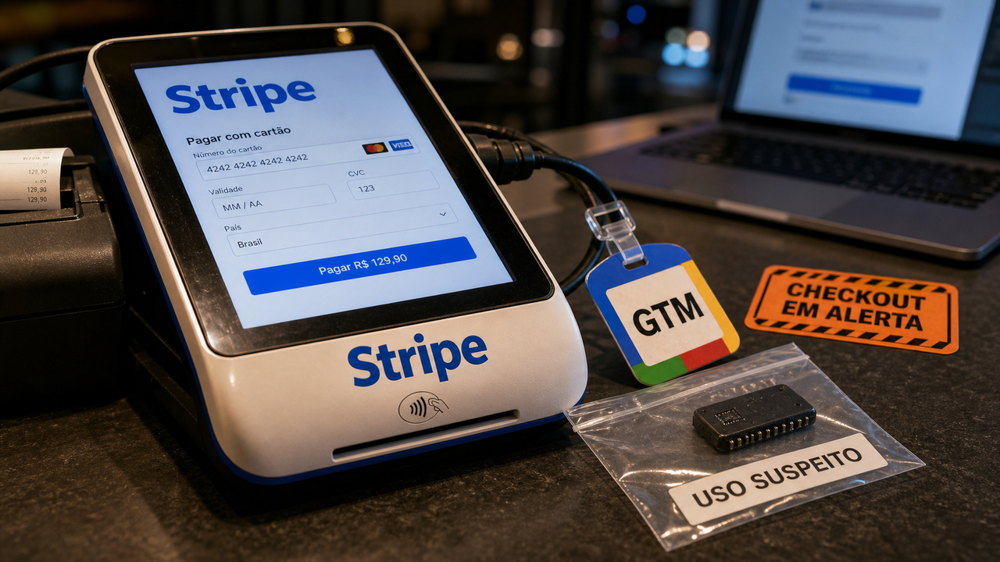

Quando um sistema confia em um caminho só porque ele parece conhecido, a produção ganha um risco discreto. Hoje a notícia começa no checkout, passa pela borda HTTP e volta para uma pergunta que todo agente novo deveria responder: para onde ele pode sair, e onde ele é obrigado a parar?

## Magecart usou Stripe e Google Tag Manager como caminho do skimmer

A Sansec publicou em 4 de junho uma análise de Magecart que serve de alerta até para quem não cuida de e-commerce. Magecart é aquela família de ataques que tenta roubar dados de cartão direto no checkout. Desta vez, o incômodo está no encanamento: o carregador passava por Google Tag Manager e buscava código em metadados de clientes na Stripe.

O alvo descrito pela Sansec era o estilo de checkout usado em Magento e Adobe Commerce. O código rodava no navegador, coletava dados de pagamento e depois gravava as informações roubadas de volta em registros de cliente na conta Stripe controlada pelo atacante.

O problema não é "Stripe maliciosa". É uma integração comprometida usando domínios que muita loja já deixa passar em Content Security Policy, monitoramento e allowlist de rede. Se a defesa só pergunta "esse domínio é conhecido?", ela perde a pergunta melhor: "esse uso faz sentido para esta página?".

Um detalhe deve virar alarme imediato: secret key da Stripe dentro de JavaScript entregue ao navegador não é padrão legítimo de integração. Se isso aparece em produção, trate como evidência de comprometimento ou erro grave, revise o container do GTM, confira scripts de terceiros e olhe o checkout como uma superfície própria da loja.

Fonte: [Sansec](https://sansec.io/research/stripe-api-skimmer-infrastructure).

## HTTP/2 Bomb pode travar servidores ao prender memória na borda

A Calif divulgou o HTTP/2 Bomb no começo de junho. O caso pega uma área que muita gente só lembra quando cai: disponibilidade de servidor web. A cadeia combina comportamento de compressão de headers, via HPACK, com controle de fluxo do HTTP/2 para segurar memória do servidor e atrapalhar tráfego legítimo.

As fontes públicas citam testes ou impacto em stacks importantes: NGINX, Apache HTTPD, Microsoft IIS, Envoy e Cloudflare Pingora. O nome CVE-2026-49975 aparece ligado ao caso nas fontes, com correções ou mitigações citadas para NGINX 1.29.8 e Apache `mod_http2` v2.0.41. Para os outros produtos, o estado público pode mudar rápido, então vale acompanhar advisory do fornecedor em vez de confiar em uma tabela velha.

A Calif diz que OpenAI Codex ajudou a encadear ideias conhecidas até chegar ao ataque. Esse ponto chama atenção, mas a fila de produção continua a mesma: verificar exposição de HTTP/2, aplicar correções, terminar HTTP/2 em uma camada protegida quando fizer sentido e ter controle de camada 7 antes de deixar origem vulnerável na internet.

E o básico: não teste isso em infraestrutura dos outros. Para time que mantém borda pública, o bom fim de semana é aquele em que NGINX, Apache, proxy, WAF e balanceador aparecem na revisão antes da segunda-feira.

Fontes: [Calif](https://blog.calif.io/p/codex-discovered-a-hidden-http2-bomb), [The Hacker News](https://thehackernews.com/2026/06/new-http2-bomb-vulnerability-allows.html), [Imperva](https://www.imperva.com/blog/imperva-customers-protected-against-cve-2026-49975-http-2-bomb-dos/) e [Radware](https://www.radware.com/security/threat-advisories-and-attack-reports/ai-discovered-http-2-bomb-affects-major-web-servers/).

## OpenAI Lockdown Mode reduz caminhos de saída contra prompt injection

A OpenAI documentou o Lockdown Mode como uma configuração opcional de segurança. A ideia é reduzir risco de exfiltração quando um modelo entra em contato com conteúdo não confiável, especialmente prompt injection, limitando capacidades que usam rede para sair, buscar, navegar ou baixar arquivos.

Na documentação oficial, o modo restringe navegação ao vivo, downloads e rede em alguns contextos. Também desativa Deep Research e Agent Mode onde a configuração se aplica. A própria OpenAI delimita o alcance: isso não resolve toda prompt injection, não muda memória, uploads, compartilhamento ou treino, e não afeta o acesso de rede do Codex.

Simon Willison encaixou isso na "Lethal Trifecta": dados privados, conteúdo não confiável e caminho de saída. Se as três peças ficam juntas, o modelo pode ser induzido a vazar algo. Ao cortar saída de rede, você tira uma perna grande do problema.

Para quem cria agente, a consequência é concreta: política de capacidade tem que existir fora do prompt. Ferramenta que lê dado sensível precisa de saída de rede explícita, conector com permissão pequena, log, aprovação quando necessário e um jeito simples de desligar caminhos perigosos. Instrução bonita ajuda. Firewall, sandbox e escopo de ferramenta ajudam mais.

Fontes: [OpenAI Help Center](https://help.openai.com/en/articles/20001061/), [ChatGPT Release Notes](https://help.openai.com/en/articles/6825453-chatgpt-release-notes) e [Simon Willison](https://simonwillison.net/2026/Jun/5/openai-help-lockdown-mode/).

## Miasma voltou com 73 repositórios da Microsoft desabilitados

Ontem falamos do [Miasma usando configs de agente dentro do repo](/2026/miasma-agentes-repo-cisco-sdwan-cve-sem-patch/). A novidade agora é escala: The Hacker News, citando OpenSourceMalware, reportou 73 repositórios ligados à Microsoft, em organizações como Azure, Azure-Samples, Microsoft e MicrosoftDocs, desabilitados pelo GitHub no meio da campanha.

O mecanismo que importa para dev continua sendo o repositório como objeto executável. A SafeDep documentou configurações locais para Claude Code, Gemini CLI, Cursor, VS Code e `npm test`, com runner de cerca de 4,3 MB e cadeia usando Bun. A Semgrep também já tinha contado a onda Phantom Gyp, com 57 pacotes npm e mais de 286 versões maliciosas em outro braço da mesma família.

A prática continua parecida, só com menos margem para adiar. Em projetos herdados, forks, exemplos copiados de issue e repos que chegam pelo chat, olhe arquivos de configuração local, tarefas, scripts do npm, regras de assistente, hooks e qualquer coisa que rode sem você perceber antes de abrir tudo com agente ou editor cheio de automação.

Também vale reduzir o estrago antes do susto: tokens de GitHub, cloud, registry e CI não deveriam ficar soltos em todo ambiente de desenvolvimento. Agente com acesso amplo a repo comprometido é uma combinação que não precisa de criatividade extra para dar errado.

Fontes: [The Hacker News](https://thehackernews.com/2026/06/miasma-worm-hits-73-microsoft-github.html), [SafeDep](https://safedep.io/miasma-worm-ai-coding-agent-config-injection/), [Semgrep](https://semgrep.dev/blog/2026/miasma-v2-self-spreading-npm-worm-now-uses-malicious-bindinggyp-file-and-compromises-57-packages/) e [StepSecurity](https://www.stepsecurity.io/blog/binding-gyp-npm-supply-chain-attack-spreads-like-worm).

## MicroPython em WebAssembly dá uma sala menor para código de agente

Simon Willison publicou hoje um caminho pequeno e interessante para rodar Python em sandbox: `micropython-wasm`. O pacote ainda é alpha, mas a arquitetura conversa com o resto do dia. Em vez de entregar um Python completo com privilégios do host, ele roda MicroPython compilado para WebAssembly usando `wasmtime`.

O desenho permite limites de memória, limite de CPU por "fuel", controle de arquivos, controle de rede e funções de host declaradas. Simon está usando isso em um plugin do Datasette Agent chamado `datasette-agent-micropython`, justamente para dar ao agente uma forma menor de executar código.

O pacote ainda não deve virar recomendação de produção. O autor é explícito: ele é alpha e carrega risco para quem não quer experimentar. Mesmo assim, a direção vale observar. Código gerado ou escolhido por agente precisa de um quarto menor, com porta, janela e chave, não de acesso livre ao apartamento inteiro.

Fonte: [Simon Willison](https://simonwillison.net/2026/Jun/6/micropython-in-a-sandbox/).

## Destaques rápidos de hoje

- **Cloudflare achou um mutex segurando o ClickHouse do billing.** A história principal é de 14 de maio, com correção final em março, então entra como estudo de caso: o gargalo estava em planejamento de query e contenção ao redor da lista de partes, não em métrica óbvia de disco ou memória. Com shared lock, menos cópia de lista e filtragem melhor de partes, a Cloudflare relatou queda de cerca de 50% na duração das queries e fim da correlação direta com a contagem de partes. Fontes: [Cloudflare](https://blog.cloudflare.com/clickhouse-query-plan-contention/) e [InfoQ](https://www.infoq.com/news/2026/06/cloudflare-clickhouse-bottleneck/).

- **O Steering Council do Python pausou trabalho novo no JIT.** A decisão de 5 de junho não cancela o JIT do CPython, mas congela novas features, otimizações e trabalho de performance até existir um Standards Track PEP aceito. Correções de bug e segurança continuam, e a janela de seis meses serve para discutir compromisso de manutenção, compatibilidade com tooling, métricas de sucesso e convivência com outras mudanças como free-threading. Fonte: [Python.org Discussions](https://discuss.python.org/t/an-announcement-from-the-steering-council-regarding-the-jit-project/107638).

- **UUIDv4 como chave primária deixou inserts no SQLite bem mais lentos em um benchmark.** Em tabelas `WITHOUT ROWID`, a chave primária organiza fisicamente o B-tree. No teste de Anders Murphy, UUIDv4 aleatório espalhou escrita e fez lotes de um milhão de linhas saírem de cerca de um segundo para algo na faixa de 10 a 12 segundos; valores no estilo UUIDv7, ordenados por tempo, ficaram bem melhores no mesmo desenho. Fonte: [Anders Murphy](https://andersmurphy.com/2026/06/05/the-perils-of-uuid-primary-keys-in-sqlite.html).

- **PostgreSQL 19 Beta 1 já dá para testar, mas não para colocar em produção.** O anúncio oficial saiu em 4 de junho e chama devs para experimentar recursos como `pg_stat_lock`, `pg_plan_advice`, mudança online de checksums, `WAIT FOR LSN` e JIT desativado por padrão. O walkthrough de Andrew Atkinson mostra um caminho com Docker `buildx`; a recomendação do projeto continua clara: beta fica fora de produção. Fontes: [PostgreSQL](https://www.postgresql.org/about/news/postgresql-19-beta-1-released-3313/) e [Andrew Atkinson / Planet PostgreSQL](https://postgr.es/p/9lr).

- **Cloudflare colocou a VoidZero, Vite e parte grande do tooling frontend dentro de casa.** A Cloudflare anunciou a aquisição da VoidZero, empresa por trás de Vite, Vitest, Rolldown, Oxc e Vite+. Ela promete manter os projetos open source, MIT, vendor-agnostic e comunitários, cita cerca de 129 milhões de downloads semanais do Vite e um fundo de US$ 1 milhão para o ecossistema. A promessa é boa de ouvir; a parte que merece observação é como isso aparece depois em Workers, plugin oficial, ferramentas full-stack e portabilidade real. Fontes: [Cloudflare Blog](https://blog.cloudflare.com/voidzero-joins-cloudflare/), [Cloudflare Investor Relations](https://www.cloudflare.net/news/news-details/2026/Cloudflare-Acquires-VoidZero-to-Build-the-Future-of-the-AI-Native-Web/default.aspx) e [The New Stack](https://thenewstack.io/cloudflare-voidzero-acquisition-vite/).

- **`pg_durable` quer colocar workflows duráveis dentro do PostgreSQL.** O projeto da Microsoft está em preview e descreve execução durável dentro do banco, com workflows em SQL, checkpoints por etapa e retomada depois de crash, restart ou falha. É uma ideia atraente para runbook, pipeline de dados e automação perto do banco, mas preview é preview: teste, leia a documentação e não trate como substituto pronto de um orquestrador inteiro. Fontes: [GitHub / Microsoft](https://github.com/microsoft/pg_durable) e [documentação do pg_durable](https://microsoft.github.io/pg_durable/).

## Acompanhamento de tendências do dia

Checkout, servidor HTTP, agente e repositório ficaram parecidos em um ponto: todos carregam confiança herdada. O domínio conhecido deixa o script passar. O protocolo comum fica habilitado na borda. O arquivo dentro do repo parece parte do projeto. O plugin pequeno ganha o mesmo host que a aplicação principal.

A resposta é bem menos glamourosa que o problema, e isso é bom. Revisar saída de rede, limitar ferramenta, separar segredo, conferir container do GTM, terminar HTTP/2 numa camada controlada, abrir repo suspeito com automação desligada e rodar código de agente em sandbox são controles comuns, pouco vistosos, que seguram a mão do software quando ele tenta fazer coisa demais.

Também aparece uma tensão produtiva em Vite, PostgreSQL e `pg_durable`: ferramentas grandes estão chegando mais perto da plataforma e da automação. Isso traz recursos, integração e manutenção. Também aumenta a necessidade de saber onde termina o projeto aberto, onde começa a plataforma e qual parte do fluxo ainda dá para trocar sem reescrever a casa.

Fontes de contexto: [Sansec](https://sansec.io/research/stripe-api-skimmer-infrastructure), [Calif](https://blog.calif.io/p/codex-discovered-a-hidden-http2-bomb), [OpenAI Help Center](https://help.openai.com/en/articles/20001061/) e [Simon Willison](https://simonwillison.net/2026/Jun/6/micropython-in-a-sandbox/).

> Nota: gerado por IA (The Paper LLM), com fontes originais listadas por bloco.

<!--
briefing_slug: 2026-06-06
source_mode: briefing
generated_at: 2026-06-06T05:39:27-03:00
source_urls:
  - https://sansec.io/research/stripe-api-skimmer-infrastructure
  - https://www.bleepingcomputer.com/
  - https://blog.calif.io/p/codex-discovered-a-hidden-http2-bomb
  - https://thehackernews.com/2026/06/new-http2-bomb-vulnerability-allows.html
  - https://www.radware.com/security/threat-advisories-and-attack-reports/ai-discovered-http-2-bomb-affects-major-web-servers/
  - https://www.imperva.com/blog/imperva-customers-protected-against-cve-2026-49975-http-2-bomb-dos/
  - https://help.openai.com/en/articles/20001061/
  - https://simonwillison.net/2026/Jun/5/openai-help-lockdown-mode/
  - https://help.openai.com/en/articles/6825453-chatgpt-release-notes
  - https://thehackernews.com/2026/06/miasma-worm-hits-73-microsoft-github.html
  - https://safedep.io/miasma-worm-ai-coding-agent-config-injection/
  - https://semgrep.dev/blog/2026/miasma-v2-self-spreading-npm-worm-now-uses-malicious-bindinggyp-file-and-compromises-57-packages/
  - https://www.stepsecurity.io/blog/binding-gyp-npm-supply-chain-attack-spreads-like-worm
  - https://simonwillison.net/2026/Jun/6/micropython-in-a-sandbox/
  - https://blog.cloudflare.com/clickhouse-query-plan-contention/
  - https://www.infoq.com/news/2026/06/cloudflare-clickhouse-bottleneck/
  - https://discuss.python.org/t/an-announcement-from-the-steering-council-regarding-the-jit-project/107638
  - https://andersmurphy.com/2026/06/05/the-perils-of-uuid-primary-keys-in-sqlite.html
  - https://www.postgresql.org/about/news/postgresql-19-beta-1-released-3313/
  - https://postgr.es/p/9lr
  - https://blog.cloudflare.com/voidzero-joins-cloudflare/
  - https://www.cloudflare.net/news/news-details/2026/Cloudflare-Acquires-VoidZero-to-Build-the-Future-of-the-AI-Native-Web/default.aspx
  - https://thenewstack.io/cloudflare-voidzero-acquisition-vite/
  - https://github.com/microsoft/pg_durable
  - https://microsoft.github.io/pg_durable/
coverage:
  - magecart-stripe-command-server: main block; Sansec June 4 research, Stripe customer metadata, GTM loader, Magento/Adobe Commerce checkout, browser-side skimmer, Stripe secret key warning, CSP/allowlist caveat preserved; raw attacker indicators omitted.
  - http2-bomb-ai-discovered-dos: main block; Calif primary source, HTTP/2/HPACK/flow-control memory holding, major server stack names, CVE-2026-49975, NGINX/Apache correction references, OpenAI Codex discovery caveat and no exploit instructions preserved.
  - openai-lockdown-mode-egress: main block; official Lockdown Mode scope, prompt-injection/exfiltration risk reduction, Deep Research/Agent Mode restrictions, Codex caveat, and Lethal Trifecta context preserved.
  - miasma-microsoft-repos-agent-config: main block; continuity link to June 5 post used; 73 Microsoft repositories disabled, SafeDep repo-local agent/editor config mechanics, Semgrep Phantom Gyp context and token/config review guidance preserved.
  - micropython-wasm-sandbox: main block; June 6 Simon Willison source, micropython-wasm alpha, MicroPython/WebAssembly/wasmtime, memory/fuel/file/network/host-function constraints and Datasette Agent context preserved.
  - cloudflare-clickhouse-mutex: quick hit; May 14/March date caveat, ClickHouse query-planning mutex, shared lock, parts-list copying, filtering and 50% query-duration result preserved.
  - python-jit-pep-freeze: quick hit; June 5 Steering Council pause, Standards Track PEP requirement, bug/security exception and six-month process caveat preserved.
  - sqlite-uuid-primary-keys: quick hit; WITHOUT ROWID/B-tree/UUIDv4 scattering, 10-12x insert slowdown and UUIDv7-style caveat preserved.
  - postgresql-19-beta-docker: quick hit; official beta date, production warning, pg_stat_lock, pg_plan_advice, online checksums, WAIT FOR LSN and Docker testing path preserved.
  - cloudflare-voidzero-vite: quick hit; VoidZero acquisition, Vite/Vitest/Rolldown/Oxc/Vite+, vendor-agnostic promise, 129M weekly downloads and $1M fund caveat preserved.
  - pg-durable-postgres-workflows: quick hit; Microsoft preview status, SQL workflows, checkpoints/resume and PostgreSQL durable execution preserved.
  - trusted-infra-egress-sandbox-trend: trend section; Stripe/GTM, HTTP/2, Lockdown Mode, Miasma repo configs, MicroPython/WASM and tooling/platform consolidation synthesized without web-only facts.
omitted_briefing_items:
  - Stop a man-in-the-middle on the very first SSH connection to any VPS: evergreen May 8/May 14 source and already surfaced recently; no fresh delta.
  - Cisco Catalyst SD-WAN Manager flaw under active exploitation, no patch yet: June 5 main block already covered the same advisory and practical guidance; no new patch/exploit/vendor update found.
  - The smallest C binary: good evergreen systems explainer, lower priority than selected security and agent-runtime stories.
  - GitHub Copilot finally supports custom endpoints: Reddit/screenshot-led and not official-source validated.
  - ZML Model to Metal: project page verified but claim-heavy and weaker than selected quick hits.
  - Linux 7.1 disables an AMD DRM ioctl over an unfixable race: confirmed Phoronix/kernel story, but niche ROCm/CRIU impact and crowded out.
  - GNOME 51 drops legacy NVIDIA support by removing EGLStreams: Reddit-originated and lower priority.
  - PostgreSQL's data_directory parameter explained: useful evergreen item, but PostgreSQL 19 and pg_durable were stronger today.
  - Dank Linux pre-configured Hyprland: lower fit and weaker than security/infrastructure package.
  - Nordstjernen browser 1.0.0: verified release, but licensing caveat and lower practical relevance.
  - Trusted infrastructure, egress limits and sandboxes: folded into selected trend and quick hits rather than a separate systems-only section.
-->
