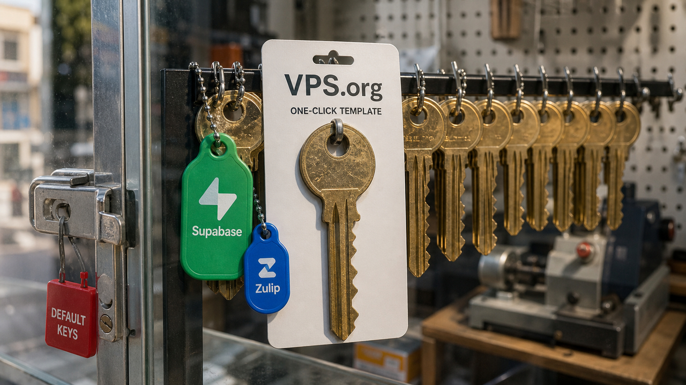

O botão dizia “one-click”. A aplicação era instalada com um clique, mas banco, senha e chave podiam ficar em condições que ninguém escolheria numa configuração manual. Segundo um alerta do CERT/CC, templates do VPS.org para Supabase e Zulip foram distribuídos com valores previsíveis e proteções perigosamente abertas. Ainda não há patch nem resposta do fornecedor.

Quem usou esses templates precisa agir. E esse caso abre uma sequência bem prática: o Rails corrigiu uma falha crítica no processamento de imagens, enquanto Google e Vercel mostraram dois tipos diferentes de limite para automação. Um contém os agentes dentro do sistema. O outro contém a fatura.

## Templates do VPS.org deixam Supabase e Zulip com defaults perigosos

Um template de VPS não é só um instalador simpático. Ele define containers, portas, segredos, regras do host e configurações da aplicação. Se todas as instalações começam com a mesma credencial, o valor pode até se chamar segredo, mas já nasceu público.

Na nota VU#243636, o CERT/CC descreve duas falhas. A CVE-2026-16503 afeta o template de Supabase: o PostgreSQL fica associado a todas as interfaces, em `0.0.0.0:5432`, com o superusuário `postgres` usando uma senha previsível.

Isso não quer dizer que toda instância esteja acessível pela internet. A conexão remota depende de a porta publicada estar alcançável. Nas instalações expostas, porém, essa configuração pode entregar o controle administrativo do banco.

Também há uma pegadinha para quem olhou o UFW, viu uma política restritiva e foi dormir tranquilo. Quando publica portas, o Docker cria suas próprias regras de NAT e iptables. Dependendo da configuração efetiva do host, o tráfego pode ser encaminhado antes do bloqueio esperado no UFW.

Por isso, a revisão precisa incluir os sockets abertos, a publicação do container e as regras reais de iptables ou nftables. Firewall imaginário protege mais ou menos o mesmo que senha imaginária.

A CVE-2026-16504 está no template do Zulip. Segundo o CERT/CC, ele usa `secret_key: changeme`, senha de banco `zulip` e `DISABLE_HTTPS=True`. Se esses defaults continuarem lá, a chave pode permitir falsificação ligada a sessão e autenticação. Com o HTTPS desligado, o tráfego fica sem criptografia.

A nota foi publicada e atualizada em 31 de julho. O CERT/CC havia enviado a notificação em 5 de junho, mas diz que não conseguiu contatar o VPS.org. O estado do fornecedor e das duas CVEs aparece como desconhecido. Não havia patch nem declaração da empresa no momento da publicação. Esses detalhes, portanto, vêm do CERT/CC, não de uma confirmação do VPS.org.

Quem instalou Supabase ou Zulip por esses templates deve considerar que pode ter ocorrido exposição. O trabalho defensivo é verificar quais portas realmente ficaram alcançáveis, restringir o banco e os outros serviços de backend com firewall e segmentação, habilitar HTTPS e trocar senhas e chaves.

Fechar a porta agora não invalida uma credencial que alguém possa ter visto antes. O PostgreSQL também deve ouvir apenas nas interfaces em que for necessário, nunca na internet pública por conveniência.

Fonte: [CERT/CC Vulnerability Note VU#243636](https://kb.cert.org/vuls/id/243636).

## Active Storage com Vips pode ler arquivos do servidor

Um upload de avatar parece uma operação bem limitada: chega uma imagem, o servidor cria uma miniatura e segue a vida. Na CVE-2026-66066, também identificada como GHSA-xr9x-r78c-5hrm, essa transformação atravessa uma fronteira bem mais séria. Aplicações Rails que usam Active Storage com o processador Vips e aceitam imagens não confiáveis podem permitir a leitura de arquivos acessíveis ao processo da aplicação.

O Active Storage delega o processamento ao libvips. Essa biblioteca entende mais formatos e operações do que as imagens comuns da web. Alguns loaders são marcados como “unfuzzed”, ou seja, não são adequados para receber conteúdo hostil sem restrições. O Active Storage não bloqueava essas operações.

A configuração relevante usa `:vips` por padrão. Basta a aplicação produzir variantes para criar a condição; o código não precisa pedir de propósito uma transformação exótica.

O efeito diretamente documentado é a leitura arbitrária de arquivos. A possível execução remota de código, que rendeu ao caso o apelido KindaRails2Shell, depende de combinar essa leitura com os segredos encontrados. Não é RCE automática em toda aplicação afetada.

Mesmo assim, o alcance potencial justifica o rótulo crítico. O processo pode ler variáveis de ambiente e arquivos com `secret_key_base`, master key e credenciais de storage, banco ou serviços externos. Esse material pode abrir caminho para falsificação de sessão, acesso a outros sistemas, movimento lateral e, em alguns ambientes, execução de código.

O advisory saiu em 29 de julho com versões corrigidas do Active Storage: 7.2.3.2, 8.0.5.1 e 8.1.3.1. A análise da Ethiack também exige libvips 8.13 ou superior. Se o libvips continuar abaixo da versão 8.13, atualizar apenas o Rails não protege a instalação desse vetor.

Times com Rails 7 ou 8, upload direto, avatar ou geração de thumbnail precisam conferir três coisas: o gem `activestorage`, o valor de `config.active_storage.variant_processor` e a versão do libvips realmente carregada no ambiente. Segundo a Ethiack, Rails 6.x só entra no alcance com uma configuração não padrão. Essa nuance evita declarar qualquer aplicação antiga como afetada por decreto.

Depois do patch vem a parte desagradável, mas necessária: trocar tudo que o processo conseguia ler e expirar as sessões. Alterar `secret_key_base` invalida cookies assinados ou criptografados, Global IDs assinados e URLs do Active Storage. Não mantenha um segredo possivelmente vazado como fallback de rotação. Isso deixaria viva justamente a chave que precisava morrer.

Como paliativo, `ruby-vips` 2.2.1 ou mais recente permite usar `Vips.block_untrusted(true)`, por meio de `VIPS_BLOCK_UNTRUSTED`, desde que o libvips seja compatível. Abaixo da versão 8.13, esse mecanismo não existe. Se a atualização imediata for impossível, o workaround indicado é remover a dependência.

Os responsáveis retiveram a cadeia técnica e o payload até, no máximo, 28 de agosto, para dar tempo à aplicação dos patches. Não há motivo defensivo para preencher essa janela com uma prova de conceito.

Fontes: [advisory de segurança do Rails](https://github.com/rails/rails/security/advisories/GHSA-xr9x-r78c-5hrm) e [análise KindaRails2Shell da Ethiack](https://ethiack.com/info-hub/research/kindarails2shell-rails-rce-cve-2026-66066).

## Chrome cerca os agentes antes de aceitar suas correções

Mais cedo, mostramos o que aconteceu quando [uma avaliação do Claude manteve a internet real aberta](/2026/claude-publicou-malware-no-pypi-durante-avaliacao-com-internet-aberta/). Agora o Chrome Security Team publicou um contraponto operacional: seus agentes procuram e corrigem vulnerabilidades, mas trabalham com a rede e as capacidades limitadas pelo sistema. A segurança não depende de o modelo interpretar bem uma frase no prompt.

O harness do Chrome entrega ao Gemini o histórico e arquivos `SECURITY.md` como contexto. Como a saída dos modelos não é determinística, ele repete as execuções em vez de confiar numa resposta sortuda. Depois, um agente crítico recebe um contexto separado para contestar os achados. Assim, a mesma linha de raciocínio não cria uma hipótese e a aprova sem resistência.

O isolamento acontece abaixo da conversa. Os modelos analisam código-fonte em repouso, dentro de máquinas sem acesso geral à internet. As requisições de rede são interceptadas e passam por uma allowlist. Subagentes não podem modificar o sistema nem acessar conteúdo fora dos diretórios definidos. Uma frase pode ser mal interpretada. Uma rota ausente continua ausente.

Encontrar a vulnerabilidade é só o começo do pipeline. Outros agentes propõem correções e escrevem testes. Depois, esse material passa pela matriz de plataformas e por revisão antes de chegar ao CI.

Segundo o Google, os milestones 149 e 150 do Chrome corrigiram 1.072 bugs de segurança, mais que os 23 milestones anteriores somados. Em maio, a integração executada a cada 24 horas teria bloqueado mais de 20 vulnerabilidades antes de produção, incluindo uma classificada como S1+.

Os números são do próprio Google. O post não informa o custo, a taxa de falsos positivos nem um denominador completo que permita comparar a eficiência do sistema de forma independente. O time também diz que fuzzing e pesquisadores externos continuam necessários. O modelo entrou como uma nova camada do programa de segurança, não como substituto do programa inteiro.

Há ainda o gargalo de entregar a correção. O chamado patch gap começa quando um fix fica visível na árvore open source e termina quando chega às máquinas. Nesse intervalo, atacantes podem estudar o diff e reconstruir a falha.

O Chrome está testando duas releases de segurança por semana e pesquisando dynamic patching, uma forma de substituir processos filhos, como Renderer e GPU, sem reiniciar o navegador inteiro na maioria dos casos. Os dois trabalhos ainda estão em fase de piloto ou pesquisa; não são promessa de disponibilidade geral.

Para outras equipes, a parte transferível é menos cinematográfica que “IA encontra mil bugs”, mas bem mais útil: documentar fronteiras de confiança, negar internet geral, liberar apenas destinos específicos, repetir runs, separar crítico de gerador, limitar diretórios e testar os patches numa matriz real.

Agente com shell não precisa de fé. Precisa de uma sala que continue trancada quando ele errar.

Fonte: [Google Chrome Security Team — Stronger with every update](https://blog.google/security/chrome-stronger-with-every-update/).

## Vercel coloca um disjuntor financeiro no AI Gateway

Nem todo limite de agente protege arquivos ou rede. Às vezes, ele precisa proteger o cartão.

A Vercel ampliou os budgets do AI Gateway para três escopos: equipe, projeto e chave de API. Uma requisição sujeita a vários limites precisa passar em todos. Se o teto global da equipe ou o teto local do projeto estiver esgotado, a chamada é rejeitada. Com isso, dá para conter o pior caso sem manter um middleware próprio para somar cada uso.

Os budgets podem ser diários, semanais, mensais — a opção padrão — ou cumulativos, sem renovação. Os alertas por e-mail podem ser enviados em 50%, 75% e 100% do valor, mas servem apenas como aviso. Quem bloqueia o tráfego é o budget. Projetos e chaves podem herdar defaults; um limite explícito substitui o default naquele escopo.

O recurso não otimiza prompts, escolhe modelos nem corrige uma tempestade de retries. Ele impede que o gasto medido ultrapasse o limite configurado. Isso também cria um modo de falha: ao atingir o teto, o cliente recebe rejeições e precisa tratá-las sem disparar ainda mais tentativas.

Há outra ressalva. Gastos com BYOK, quando a equipe fornece sua própria chave do provedor, ficam fora da conta por padrão. O painel pode mostrar o limite respeitado enquanto parte da despesa continua em outro lugar. O anúncio descreve um recurso do próprio fornecedor e não traz SLA para a precisão ou a latência da medição.

Para equipes com vários agentes, o budget funciona como um disjuntor financeiro. Ele não torna o consumo eficiente, mas evita que uma automação ruim descubra sozinha qual era o limite do cartão.

Fonte: [Vercel Changelog — AI Gateway spend budgets and alerts](https://vercel.com/changelog/ai-gateway-spend-budgets-and-alerts).

> Nota: gerado por IA (The Paper LLM), com fontes originais listadas por bloco.

<!--
source_urls:
  - https://kb.cert.org/vuls/id/243636
  - https://github.com/rails/rails/security/advisories/GHSA-xr9x-r78c-5hrm
  - https://ethiack.com/info-hub/research/kindarails2shell-rails-rce-cve-2026-66066
  - https://blog.google/security/chrome-stronger-with-every-update/
  - https://vercel.com/changelog/ai-gateway-spend-budgets-and-alerts
-->
