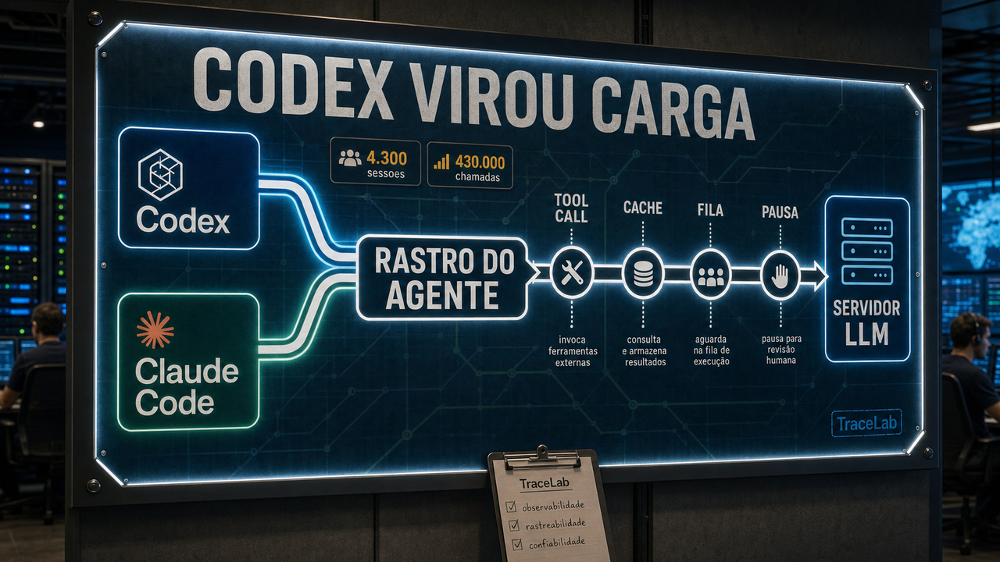

Hoje a conversa sai do botão mágico e vai para a sala de máquinas. Quando agente de código vira rotina, entram custo, espera, ferramenta e estado.

## TraceLab mediu 4.300 sessões de Claude Code e Codex para entender o custo de servir agentes

TraceLab é um daqueles trabalhos que parecem menos chamativos do que um modelo novo, mas encostam direto no problema que aparece quando a brincadeira vira produção. Os autores coletaram cerca de 4.300 sessões de agentes de código, com aproximadamente 350.000 passos de LLM e 430.000 chamadas de ferramenta.

Essas sessões vieram do uso cotidiano de Claude Code e Codex. Isso tira o trabalho da bancada do benchmark inventado só para deixar tabela bonita e coloca a análise mais perto de uma carga real, que até pouco tempo atrás ficava meio invisível.

Servir esse tipo de agente não se parece muito com servir um chat curto. As sessões têm ciclos longos, contexto grande, respostas muitas vezes pequenas e chamadas de ferramenta que chegam em caudas pesadas. Algumas ações são rápidas. Outras esperam arquivo, shell, busca, humano voltando do café ou qualquer outra parte sem glamour do fluxo.

O artigo também fala de prefix cache. Em termos simples: se muita coisa do começo do contexto se repete, o servidor tenta reaproveitar cálculo. Isso ajuda, mas não resolve tudo. O TraceLab cita caminhos como reduzir overhead de chamada de ferramenta, melhorar prefill com atenção ao que entrou no contexto, prever latência de ferramenta com mais semântica e cuidar melhor do KV cache quando há pausa humana no meio do caminho.

Para quem usa agente de código, isso explica por que "tokens por segundo" é uma medida pequena para um produto grande. A sensação de velocidade também depende de ferramenta, cache, fila, pausa, política de servidor e do quanto o sistema sabe continuar sem recalcular o mundo inteiro.

A ressalva é importante: o conjunto é valioso, mas não vira lei universal de toda empresa usando agente. Ele vem do uso dos próprios autores e precisa ser comparado com outros ambientes. Mesmo assim, já melhora a conversa. Pelo menos agora temos rastro público para discutir custo de agente sem ficar só no chute.

Fontes: [arXiv](https://arxiv.org/abs/2606.30560) e [repositório TraceLab](https://github.com/uw-syfi/TraceLab.git).

## Agents-A1 aposta em trajetórias longas antes de pedir modelo maior

Agents-A1 chega por outro caminho. A proposta dos autores é um modelo agentic de 35B em Mixture-of-Experts. Em vez de vender só "mais parâmetros", o trabalho insiste em aumentar o horizonte do agente: agir, observar, buscar conhecimento externo, receber verificação e continuar.

O número que chama atenção é o tamanho médio das trajetórias geradas: cerca de 45.000 tokens. Isso quer dizer que o treino olha para mais do que a resposta final. Ele tenta ensinar o caminho, com ações intermediárias, observações e resultados de verificadores. Para agente que usa ferramenta, esse caminho costuma ser tão importante quanto a resposta bonita no final.

A receita descrita tem três partes. Primeiro, full-domain supervised fine-tuning. Depois, modelos professores por domínio. Por fim, destilação on-policy com múltiplos professores, roteada por domínio, em seis áreas heterogêneas. Traduzindo sem transformar em aula: o modelo aprende com professores diferentes e com trajetórias que lembram melhor o trabalho de agente, em vez de ficar só na pergunta e resposta.

Os autores comparam o Agents-A1 com modelos muito maiores, incluindo Kimi-K2.6 e DeepSeek-V4-pro, e falam em desempenho competitivo com modelos de 1T de parâmetros em alguns benchmarks de longo horizonte. Isso deve ser lido como alegação do artigo, não como veredito independente. Ainda falta ver reprodução externa, custo operacional e comportamento fora da bancada dos autores.

A direção é interessante. Para quem monta agentes locais ou internos, vale observar trajetória, verificador, professor de domínio e feedback de ferramenta com a mesma seriedade que observa o nome do modelo. Rodar um modelo é uma parte. Fazer ele trabalhar direito por muitas etapas é outra conversa.

Fontes: [arXiv](https://arxiv.org/abs/2606.30616), [Hugging Face](https://huggingface.co/collections/InternScience/agents-a1) e [GitHub](https://github.com/InternScience/Agents-A1).

## Outer Shell quer abrir apps gráficos pelo SSH sem expor painel público

Quem já subiu ferramenta em VPS conhece o ritual: a aplicação roda em uma porta, você pensa em proxy reverso, TLS, autenticação, firewall, talvez VPN, talvez um painel que ninguém deveria encontrar no Shodan. Às vezes tudo isso é correto. Às vezes era só um utilitário pequeno que precisava aparecer para você, não para a internet.

Outer Shell propõe uma saída curiosa. A ideia é rodar aplicativos gráficos como pequenos servidores HTTP, geralmente ligados a Unix domain sockets, protegidos por permissões de arquivo. O acesso passa pelo SSH, e o navegador companheiro se chama Outer Loop.

Se a experiência funcionar bem, o ganho operacional é fácil de entender: um app administrativo pode ficar privado no servidor, sem abrir `localhost:3000` para o mundo ou criar uma cerimônia inteira de publicação. A criptografia fica na camada do SSH, e o app aparece como interface gráfica para quem já tem acesso ao servidor.

Isso combina muito com laboratório, VPS e máquina remota de desenvolvimento. Também merece calma. O texto original apresenta um projeto aberto e promissor, mas eu colocaria na bancada de experimento antes de deixar virar porta oficial de administração.

Ainda assim, a pergunta é boa. Nem todo app de servidor precisa nascer como dashboard público. Às vezes a interface gráfica pode morar atrás da mesma porta que a gente já protege com chave SSH, usuário e permissão.

Fonte: [Marcus Lewis](https://probablymarcus.com/blocks/2026/06/28/native-graphical-shell-for-SSH.html).

## PostgreSQL 19 mira a armadilha das sequences em replicação lógica

Banco pode parecer replicado e ainda guardar uma pegadinha. No PostgreSQL, a replicação lógica mantém linhas de tabela em sincronia, mas até o PostgreSQL 18 ela não replicava o estado das sequences. A tabela chega do outro lado. O contador que gera o próximo ID pode ficar para trás.

O problema aparece na hora mais antipática: failover, switchover ou migração. O subscriber começa a receber escrita, chama uma sequence atrasada e tenta gerar um valor que já existe. O resultado pode ser violação de chave duplicada. Em caso pior, se o desenho do sistema deixar passar, vira dano de integridade mais sutil.

O post da Fastware/Fujitsu diz que o PostgreSQL 19 introduz sincronização nativa de sequences na replicação lógica. O fluxo inclui publicar sequences junto com tabelas, atualizar o estado no subscriber e usar um worker de sincronização. O texto também cita peças como `CREATE PUBLICATION ... FOR ALL SEQUENCES, ALL TABLES` e `ALTER SUBSCRIPTION ... REFRESH SEQUENCES`, além do uso de LSN da página da sequence no publisher.

Isso não dispensa ensaio de failover. Ajuda a fechar uma lacuna clássica: dado replicado inclui mais do que linha. Identificador gerado também é estado, e estado esquecido costuma aparecer exatamente quando a equipe está com pressa.

Para quem faz upgrade por replicação lógica, usa `pg_createsubscriber` ou mantém banco em VPS, Kubernetes ou ambiente gerenciado, vale acompanhar a chegada do PostgreSQL 19 com esse detalhe no radar. Repetir failover em ambiente de teste continua sendo a parte menos glamourosa e mais barata da história.

Fonte: [Fastware / Fujitsu](https://www.postgresql.fastware.com/blog/closing-a-critical-gap-in-postgresql-upgrade-workflows-with-sequence-synchronization).

## Destaques rápidos de hoje

- **Apple publicou macOS Tahoe 26.5.2 com créditos de pesquisa assistida por IA.** A página de segurança de 29 de junho lista correções do WebKit, incluindo `CVE-2026-43715`, `CVE-2026-43716` e `CVE-2026-43707`, com créditos a Anthropic Claude e OpenAI Codex Security. Para usuário e admin, a leitura continua simples: atualizar quando aplicável, sem inventar exploração ativa que a Apple não confirmou. Fontes: [Apple Support](https://support.apple.com/en-us/127595) e [The Hacker News](https://thehackernews.com/2026/06/apple-patches-30-ios-macos-safari-flaws.html).

- **Microsoft encontrou uma extensão Chromium falsa com cara de Perplexity.** A extensão abusava de marca ligada à Perplexity AI, interceptava busca e passava tráfego por infraestrutura intermediária; a Microsoft diz que reportou o caso ao Google e que a extensão foi removida. Se aparecer domínio como `perplexity-ai[.]online`, trate como indicador de abuso, não como link para clicar; extensão de navegador também é código privilegiado. Fonte: [Microsoft Security Blog](https://www.microsoft.com/en-us/security/blog/2026/06/29/chromium-extension-uses-airelated-branding-redirect-browser-search/).

- **Git 2.55 melhora manutenção de repositório grande.** A release deixa `git repack` escrever cadeias incrementais de multi-pack-index, combina isso com repacking geométrico, permite hooks configurados em paralelo quando declarados como seguros e leva o fsmonitor embutido ao Linux via `inotify`. Para repo pequeno talvez passe batido; para monorepo, Forgejo/Gitea ou histórico pesado, essas peças podem economizar tempo real. Fonte: [GitHub Blog](https://github.blog/open-source/git/highlights-from-git-2-55/).

- **VS Code 1.126 abre pastas desconhecidas em Restricted Mode primeiro.** No dia 27, falamos que [abrir repo não é passivo](/2026/npm-amazon-q-entrevista-falsa-abrir-repo-nao-e-passivo/). Agora o delta é prático: a release diz que pastas novas abrem em modo restrito com banner de confiança, permitindo inspecionar antes de liberar tarefas, extensões e automações; isso ajuda, mas não substitui VM, container ou sandbox para código realmente suspeito. Fontes: [Visual Studio Code](https://code.visualstudio.com/updates/v1_126) e [InfoWorld](https://www.infoworld.com/article/4190672/visual-studio-code-locks-down-untrusted-code.html).

- **CISA alertou sobre firmware Daktronics em placas e painéis.** O aviso `ICSA-26-176-04` cobre linhas VFC-DMP-5000, DMP-5000 e DMP-8000 em versões antigas, com falhas como path traversal, upload arbitrário de arquivo e credenciais padrão ou embutidas, incluindo `CVE-2026-28701`, `CVE-2026-33560` e `CVE-2026-31928`. Para defesa, o caminho é firmware corrigido, senha padrão trocada e interface de gestão fora da internet pública. Fontes: [CISA](https://www.cisa.gov/news-events/ics-advisories/icsa-26-176-04) e [SecurityWeek](https://www.securityweek.com/new-controller-flaws-expose-highway-signs-and-billboards-to-remote-hacking/).

- **vLLM colocou micro-agentes dentro do roteador de inferência.** O vLLM Semantic Router descreve receitas limitadas, como Confidence, Ratings, ReMoM, Fusion e Workflows, entregando ao cliente uma resposta compatível com a API da OpenAI enquanto o roteador gerencia loops internos. O post reporta 92,6 no LiveCodeBench, 96,0 no GPQA-Diamond e 50,0 no Humanity's Last Exam para VSR Closed; são números do próprio projeto, bons para testar, não para tatuar na arquitetura. Fonte: [vLLM](https://vllm.ai/blog/2026-06-29-micro-agent-frontier-models).

- **Um walkthrough de CUDA mostra a viagem de uma função até o hardware.** O texto acompanha um kernel simples de soma de vetores desde `nvcc`, passa por PTX, SASS, `fatbin`, `cubin`, runtime, driver, `ioctl`, `pushbuffer`, GPFIFO, QMD, doorbell register e warps. É bastante sigla, sim, mas a recompensa é boa: GPU não roda "uma função CUDA" no vácuo; existe compilador, fila, metadado e escalonamento por baixo. Fonte: [Fergus Finn](https://fergusfinn.com/blog/what-happens-when-you-run-a-gpu-kernel/).

## Memória de agente começa a parecer estado de produção

Memória de agente está deixando de ser só "lembrar preferências". Quando um agente acumula estado por dias, projetos e pessoas, esse estado começa a parecer banco de dados, log de auditoria, política de permissão e área de incidente ao mesmo tempo.

O survey Always-On Agents analisou um corpus codificado de 435 trabalhos e organizou o tema em eixos como autoridade, escopo, mutabilidade, proveniência, recuperabilidade e acionabilidade. A leitura incômoda é que muita pesquisa fala mais de acumular e recuperar estado do que de governar, recuperar ou abandonar esse estado quando algo dá errado.

Os trabalhos relacionados deixam o risco menos abstrato. Um artigo trata trajetórias de chamadas de ferramenta como evidência para detectar envenenamento de memória. Outro fala de falha de entity binding, quando o agente liga uma ação ao objeto ou pessoa errada. Um terceiro discute principal loyalty: em uma interação com várias partes, a quem o agente deve servir?

Memória continua útil. Só precisa ser tratada como estado de produção: com auditoria, rollback, esquecimento, permissão, proveniência e regra clara de quem manda. Se o agente guarda tarefa, preferência, credencial, promessa e contexto de cliente, "ficou no histórico" não é plano de governança.

Fontes da tendência: [Always-On Agents](https://arxiv.org/abs/2606.30306), [Forensic Trajectory Signatures](https://arxiv.org/abs/2606.30566), [Entity Binding Failures](https://arxiv.org/abs/2606.30531) e [Principal Loyalty](https://arxiv.org/abs/2606.30383).

> Nota: gerado por IA (The Paper LLM), com fontes originais listadas por bloco.

<!--
briefing_slug: 2026-06-30
source_mode: briefing
generated_at: 2026-06-30T05:42:37-03:00
source_urls:
  - https://arxiv.org/abs/2606.30560
  - https://github.com/uw-syfi/TraceLab.git
  - https://arxiv.org/abs/2606.30616
  - https://huggingface.co/collections/InternScience/agents-a1
  - https://github.com/InternScience/Agents-A1
  - https://probablymarcus.com/blocks/2026/06/28/native-graphical-shell-for-SSH.html
  - https://www.postgresql.fastware.com/blog/closing-a-critical-gap-in-postgresql-upgrade-workflows-with-sequence-synchronization
  - https://support.apple.com/en-us/127595
  - https://thehackernews.com/2026/06/apple-patches-30-ios-macos-safari-flaws.html
  - https://www.microsoft.com/en-us/security/blog/2026/06/29/chromium-extension-uses-airelated-branding-redirect-browser-search/
  - https://github.blog/open-source/git/highlights-from-git-2-55/
  - https://code.visualstudio.com/updates/v1_126
  - https://www.infoworld.com/article/4190672/visual-studio-code-locks-down-untrusted-code.html
  - https://www.cisa.gov/news-events/ics-advisories/icsa-26-176-04
  - https://www.securityweek.com/new-controller-flaws-expose-highway-signs-and-billboards-to-remote-hacking/
  - https://vllm.ai/blog/2026-06-29-micro-agent-frontier-models
  - https://fergusfinn.com/blog/what-happens-when-you-run-a-gpu-kernel/
  - https://arxiv.org/abs/2606.30306
  - https://arxiv.org/abs/2606.30566
  - https://arxiv.org/abs/2606.30531
  - https://arxiv.org/abs/2606.30383
omitted_briefing_items:
  - System Design of a Digital Bank: From Ledger to CAP: confirmed evergreen architecture article, but not fresh enough and better as a standalone series.
  - RAMpocalypse lawsuit coverage: allegation-driven lawsuit, not a verified technical story.
  - You really should not copy-paste errors into Claude Code: repeat of repo-trust risk without enough new delta after June 27.
  - Continuous batching versus static batching in LLM inference: useful background for TraceLab/vLLM, not needed as standalone quick hit.
  - Investigating Linux graphics: excellent source, but original is from 2025.
  - Why Human-Level AI Won't Be Enough: conceptual essay crowded out by stronger primary technical sources.
  - Popping the GPU Bubble: older June 4 source, not fresh as news.
  - DRIFT self-improvement paper: research-watch item crowded out by stronger TraceLab and memory-governance papers.
  - Single-agent versus multi-agent README generation: narrower than selected agent-infrastructure stories.
  - MCP server architecture patterns: useful context but too many agent papers already; omitted from public body.
  - Why intent prediction needs more than an LLM: useful anti-hype source, crowded out by more concrete items.
  - PostgreSQL index-only scans and visibility maps: database slot went to PostgreSQL sequence synchronization.
  - PDP-1 Lisp: charming history, lower priority than operational stories.
  - Memory-safe context switching in Fil-C: deep systems topic, too narrow for today's roundup.
  - Clone this repo and I own your machine: older source and repeat of June 27 repo-trust thread.
  - Linux for the Sega MegaDrive: fun but niche; crowded out.
  - Open Memory Protocol: promising but young; better as context for memory trend, not standalone.
  - GNU extensions to basic regular expressions: useful tiny portability note, lower priority.
  - Latent Space AI News roundup: lead sheet only; not a citation source.
  - The end of the AArch64 desktop experiment: source from June 26 and repeated in recent curated scan; not fresh enough.
  - Unprivileged root via a use-after-free in DRM GEM change_handle: exploit-heavy Linux LPE writeup; omitted from compact public roundup.
  - OpenAI and Anthropic Limit New AI Models to Trump-Approved Customers During Cybersecurity Review: repeat without new public delta after dedicated GPT-5.6 government-gated rollout post.
-->
