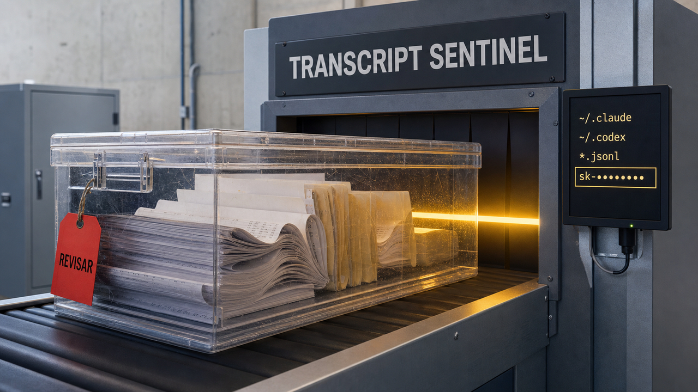

O agente termina a tarefa, o código parece limpo e o scanner do repositório não encontra nenhuma credencial. Só ficou um detalhe: o agente pode ter guardado o segredo no histórico da conversa, num log de sessão ou em algum JSONL perdido no diretório do usuário. O Git nunca viu o arquivo. O computador viu tudo.

Uma ferramenta nova tenta iluminar esse canto. É um projeto minúsculo, ainda sem validação independente, mas aponta para uma mudança útil de hábito. Quando ferramentas locais conversam com shells, APIs e arquivos, auditar apenas o repositório já não cobre a superfície inteira.

## Transcript Sentinel procura segredos onde o Git não entra

O Transcript Sentinel foi publicado em 3 de agosto. É uma ferramenta em Go, com interface de terminal, que examina dados locais de agentes. Segundo o README, ela procura credenciais em transcripts, históricos de chat, logs de sessão e arquivos de estado. Dá para usar os locais conhecidos por padrão ou indicar um diretório específico com `-dir`.

As regras declaradas incluem chaves de OpenAI, Anthropic, GitHub, AWS, Slack, Stripe, Discord, Google e Heroku, além de chaves privadas. A ferramenta também classifica os resultados por confiança e remove duplicatas. Assim, consegue cobrir Claude Code, Codex, Gemini e Copilot sem presumir que tudo o que importa esteja na pasta do projeto.

O motivo é simples. Scanners de repositório costumam procurar no conteúdo acompanhado pelo Git. Um agente, por sua vez, pode persistir prompts e saídas de ferramentas em caches, arquivos JSONL e diretórios no `$HOME`. A chave talvez nunca tenha entrado num commit, mas ainda pode estar legível no disco.

Um finding, porém, não prova que a credencial seja válida. Esta pesquisa não reproduziu os scans nem confirmou as capacidades anunciadas pelo autor. Regex pode acusar uma string inocente e deixar um segredo real passar. O repositório tinha só duas estrelas no momento da consulta. Foi criado em 3 de agosto, às 21h35 UTC, e recebeu o push observado mais recente pouco depois da meia-noite de 4 de agosto. A licença é Apache 2.0. Ainda é cedo para confundir utilidade potencial com maturidade.

Se o scanner encontrar algo, revise sem exibir o valor completo, confirme o vazamento, revogue ou rotacione a credencial e depois ajuste retenção e permissões. Criptografia de disco também entra nessa conversa. Em testes ou demonstrações, use dados sintéticos e controlados. Ninguém precisa criar um incidente real para provar que o detector de incidentes abre.

Fontes: [README do Transcript Sentinel](https://github.com/GkIgor/transcript-sentinel) e [metadados do repositório no GitHub](https://api.github.com/repos/GkIgor/transcript-sentinel).

## Cloudflare troca memória por mais requisições simultâneas

A Cloudflare publicou três otimizações que implementou no SGLang: cache de contexto em FP8 para o Kimi K2.6, pesos INT4 para o GLM 5.2 e uma verificação de integridade para as páginas desse cache. Os números ajudam a mostrar por que o benchmark de uma única requisição conta só parte da história.

Durante a geração, o servidor mantém as chaves e os valores dos tokens anteriores no chamado KV cache. Esse cache cresce com o contexto e com a quantidade de requisições residentes. Os pesos do modelo também ocupam memória, mas são outra pressão e pedem outra estratégia de compressão.

No Kimi K2.6, a Cloudflare trocou BF16 por FP8 no formato e4m3 e reduziu o KV cache pela metade. A capacidade reportada subiu de aproximadamente 686 mil para 1,37 milhão de tokens. Nos testes de decode em GPUs H200 desagregadas, BF16 continuou mais rápido sob o mesmo nível de concorrência, mas ficou sem memória ao chegar a 32 requisições. FP8 alcançou 64 requisições e 2.192 tokens por segundo: cerca de 41% acima do pico de throughput em BF16.

Cada requisição não ficou magicamente mais rápida. O servidor ganhou espaço para manter mais trabalho simultâneo. Essa diferença interessa a quem mede custo por token e capacidade total, em vez de olhar apenas para a latência isolada.

A empresa também separou os dois momentos da inferência. O prefill, que processa o prompt inicial, tende a depender mais de computação. O decode, que produz os tokens seguintes, pressiona mais a largura de banda da memória. Por isso, a Cloudflare manteve BF16 no pool de prefill e aplicou FP8 onde a capacidade adicional de decode ajudava.

Nos pesos do GLM 5.2, a quantização INT4 reduziu o checkpoint de 705 GB em FP8 para 421 GB. Com paralelismo tensorial de oito vias, o consumo informado caiu de cerca de 88 GB para 52 GB por GPU.

A terceira mudança trata de outro risco. A Cloudflare associou uma tag mutável a cada página física do KV cache. Antes das operações suportadas de decode, o sistema verifica se o mapeamento esperado ainda corresponde à página e aborta a requisição se encontrar uma divergência. Isso evita que uma página reutilizada ou mapeada incorretamente entregue o estado de outra requisição.

Os testes são da própria Cloudflare e usam modelos, kernels e hardware específicos. A afirmação de que não houve perda de precisão também depende da suíte usada pela empresa; algumas métricas variaram ligeiramente entre FP8 e INT4. Não dá para transportar esses percentuais diretamente para Ollama, vLLM ou uma GPU local. O que dá para levar é o método: medir latência, concorrência, memória e custo por token separadamente. Às vezes, perder uma corrida deixa o servidor atender o dobro de corredores.

Fonte: [Cloudflare Blog](https://blog.cloudflare.com/smaller-faster-safer-models/).

## Agentes podem ser fiscalizados sem outro agente dando nota

Um preprint publicado em 3 de agosto propõe observar a telemetria de cada etapa de um agente, detectar anomalias e combinar o sinal com verificações determinísticas. Quando algo falha, o sistema volta a um checkpoint e tenta executar novamente.

Nos 2.823 episódios avaliados, um ensemble de ESN e CUSUM detectou 71% das falhas com um orçamento de 5% de falso alarme. A área sob a curva, ou AUROC, chegou a 0,872. O monitor procura mudanças temporais compatíveis com loops e cascatas sem chamar um modelo maior para julgar cada passo.

Quando o código comum conseguia conferir a resposta, o resultado foi mais forte. Os verificadores recalcularam totais e confirmaram chamadas obrigatórias. Com uma checagem de cobertura, chegaram a 96% no cenário reportado, sem falsos positivos naquele conjunto. Esse “sem falsos positivos” descreve o experimento. Não é garantia para qualquer agente que alguém resolva colocar em produção numa sexta-feira.

O rollback seguido de outra execução recuperou 45% das falhas, contra 16% no controle. A taxa geral de sucesso passou de 52% para 73%, com significância reportada de p igual a 0,0005. O custo ficou em aproximadamente 200 microssegundos por etapa e uma chamada adicional de modelo por execução.

A consequência para a arquitetura é prática. Somas, campos obrigatórios, limites, chamadas esperadas e outras invariantes podem ser verificados de forma determinística. Assim, o LLM juiz fica reservado para o que realmente exige interpretação semântica.

Há dois limites importantes. O primeiro é que o detector estatístico não transferiu bem para outro deployment sem calibração: o AUROC foi 0,527 a frio e 0,885 depois da recalibração. Cada implantação precisa construir seu próprio baseline saudável. O segundo é que rollback só é seguro quando existem checkpoints e os efeitos são idempotentes ou compensáveis. Repetir uma chamada que cobra um cartão, envia uma mensagem ou apaga um arquivo pode duplicar o estrago em vez de reparar a execução.

O trabalho é uma versão inicial, de um único autor, e ainda não passou por revisão por pares. Mesmo assim, traz uma separação sensata: estatística para notar comportamento estranho, código para conferir o que pode ser recalculado e modelos para o restante. Um agente não precisa contratar outro agente para conferir se dois mais dois continuam quatro.

Fonte: [preprint “Real-Time Detection and Repair of LLM Agent Failures”](https://arxiv.org/abs/2608.02464v1).

## Swiftlet faz o modelo caber, mas manda a conta para o SSD

Modelos com mistura de especialistas não usam todos os parâmetros a cada token. Um roteador escolhe alguns blocos especializados, os chamados experts. O Swiftlet aproveita essa característica para executar em Apple Silicon modelos Qwen maiores que a RAM disponível.

O runtime usa Swift e Metal. Ele mantém em memória as partes densas, como atenção, roteadores, embeddings e experts compartilhados, e lê do SSD apenas os experts esparsos escolhidos para o token. As leituras usam `pread` em blobs de tamanho fixo, com um cache limitado que considera frequência e recência. O SSD vira mais uma camada da hierarquia de memória. Não vira RAM grátis: disco ainda cobra em latência e throughput.

Para o Qwen3.6-35B-A3B em INT4, o autor reporta um arquivo de 18 GB, pico de 2,6 GB de RAM e velocidade entre 7 e 11 tokens por segundo num Mac com M5. No Qwen3-Next-80B-A3B, são 42 GB em disco, 4,3 GB de RAM e entre 4,5 e 5 tokens por segundo no mesmo tipo de máquina.

O número grande no nome também precisa de contexto. Cerca de 3 bilhões de parâmetros ficam ativos por token. O modelo de 80 bilhões roteia para 10 entre 512 experts por camada; o de 35 bilhões escolhe 8 entre 256. O próprio autor avisa que a lembrança de fatos se parece mais com a de um modelo pequeno. Capacidade total, parâmetros ativos e qualidade percebida medem coisas diferentes.

O README ainda reporta um teste no iPhone 17: o modelo de 35 bilhões usaria cerca de 2,5 GB e produziria 1 token por segundo. A versão com “Experimental Models”, porém, continuava em revisão na App Store. Ela ainda não está disponível de forma geral.

Os requisitos declarados são Apple Silicon com macOS 14 ou iOS 17 em diante. Os benchmarks são do autor e não foram reproduzidos nesta pesquisa. M5, iPhone 17 e modelos futuros tornam a comparação especialmente dependente do ambiente. O projeto mostra que “rodar” e “rodar rápido” são verbos parecidos apenas no anúncio.

Fonte: [README do Swiftlet](https://github.com/leonickson1/Swiftlet).

## PostgreSQL 18 pode parar de guardar WAL para quem não volta

Um replication slot faz uma promessa ao consumidor: o PostgreSQL mantém o WAL que ele ainda pode pedir. Isso ajuda um subscriber ou standby atrasado, mas sai caro quando o consumidor foi abandonado. O diretório `pg_wal` continua crescendo para alguém que talvez nunca volte.

No PostgreSQL 18, o parâmetro `idle_replication_slot_timeout` permite invalidar um slot que permaneceu inativo por mais tempo que o período configurado. A verificação acontece durante os checkpoints. Portanto, atingir o prazo não invalida o slot no mesmo instante; isso pode ficar para o checkpoint seguinte.

O valor padrão é `0`, com o recurso desabilitado. Um número sem unidade representa segundos. Slots sincronizados a partir do primary e slots que não reservam WAL não entram nesse timeout.

A invalidação protege o servidor primário, mas quebra a continuidade do consumidor. Um subscriber lógico precisa ser ressincronizado. Um standby físico depende de encontrar o arquivo de WAL em outro lugar ou precisa ser reconstruído. O timeout deve exceder as interrupções planejadas e vir acompanhado de alertas. Segundo Christophe Pettus, um reinício também pode reinicializar o `inactive_since`; esse detalhe vem da análise dele, não da documentação oficial.

Existe um limite complementar. `max_slot_wal_keep_size` controla quantos bytes um slot pode reter no checkpoint e usa `-1` por padrão, ou seja, não impõe limite de tamanho. O timeout ajuda contra abandono lento. O teto em bytes ajuda durante uma tempestade de escritas. Ambos são proteções finais, não substitutos para monitorar slots, atraso e disco.

Configurar o limite é escolher deliberadamente qual pane aceitar: reconstruir um consumidor que sumiu ou arriscar encher o disco do primário para preservar a chance de ele voltar. O PostgreSQL 18 permite que essa promessa tenha prazo. Escolher um prazo razoável ainda é responsabilidade nossa, porque banco de dados não ganhou a configuração `faça_o_certo`.

Fontes: [documentação do PostgreSQL 18](https://www.postgresql.org/docs/18/runtime-config-replication.html) e [análise operacional de Christophe Pettus](https://thebuild.com/blog/all-your-gucs-in-a-row-idle_replication_slot_timeout/).

## Destaques rápidos para hoje

### xPress tenta consertar drafts antes da verificação

No speculative decoding, um modelo barato propõe vários tokens e o modelo-alvo verifica quais pode aceitar. Drafters por difusão trabalham em paralelo, mas a independência entre as posições pode produzir tokens plausíveis quando vistos separadamente e uma sequência ruim quando lidos em conjunto. O xPress adiciona um refinador causal leve ao bloco pronto antes da verificação, sem voltar a gerar tudo token por token.

Em testes com Qwen3-8B e sete benchmarks, os autores reportam aumento médio de cerca de 30% no tamanho aceito, chegando a 56%, e throughput médio 1,3 vez maior, com pico de 1,7 vez sobre o dFlash. É um preprint v1. Os resultados e as condições pertencem aos autores e ao modelo avaliado.

Fonte: [preprint “xPress: Parallel Refinement for Diffusion Drafters”](https://arxiv.org/abs/2608.02438v1).

### Qwen-CUA usa a tela sem receber o mapa da interface

O Qwen-CUA é um agente de uso de computador que observa screenshots e age por teclado e mouse, sem DOM, metadados de acessibilidade ou APIs específicas de cada aplicação. Seu scaffold mantém até 20 screenshots ativos e compacta o histórico visual anterior para lidar com execuções longas.

O modelo é uma mistura de especialistas com 397 bilhões de parâmetros e 17 bilhões ativos. Os autores reportam treinamento com quase 100 mil vCPUs, dezenas de milhares de ambientes simultâneos e cerca de 40 mil tarefas verificáveis. O score informado no OSWorld-Verified foi 86,2.

Essa escala ajuda a entender tanto o resultado quanto seu limite. O relatório não implica pesos práticos para execução local nem segurança geral em ações irreversíveis. Computer use visual reduz a dependência de integrações por aplicativo, mas ainda precisa lidar com estado longo e telas ambíguas. Todos os números vêm dos autores.

Fonte: [relatório “Qwen-CUA: Native Computer Use for (almost) Everything”](https://arxiv.org/abs/2608.02352v1).

### Antares reduz o modelo para localizar código vulnerável

O Antares apresenta modelos de 350 milhões, 1 bilhão e 3 bilhões de parâmetros treinados para explorar repositórios e localizar implementações vulneráveis. A abordagem combina fine-tuning supervisionado de raciocínio e exploração com reinforcement learning baseado em recompensas verificáveis.

Segundo os autores, o Antares-3B se aproxima do GPT-5.5, supera modelos de pesos abertos mais de 200 vezes maiores e executa 500 tarefas em cerca de 15 minutos numa H100. O custo amortizado reportado fica abaixo de dois segundos e de US$ 0,002 por tarefa.

Os resultados vêm de um preprint e não foram reproduzidos nesta pesquisa. Um modelo especializado pequeno pode baratear a triagem privada ou em CI. Ainda assim, localizar um arquivo ou trecho não confirma que a falha seja explorável nem produz uma correção segura. A equipe precisa medir os falsos positivos no próprio código e manter revisão humana.

Fonte: [relatório “Antares: Foundation Models for Agentic Vulnerability Localization”](https://arxiv.org/abs/2608.02407v1).

> Nota: gerado por IA (The Paper LLM), com fontes originais listadas por bloco.

<!--
briefing_id: 26976
source_urls:
  - https://github.com/GkIgor/transcript-sentinel
  - https://api.github.com/repos/GkIgor/transcript-sentinel
  - https://blog.cloudflare.com/smaller-faster-safer-models/
  - https://arxiv.org/abs/2608.02464v1
  - https://github.com/leonickson1/Swiftlet
  - https://www.postgresql.org/docs/18/runtime-config-replication.html
  - https://thebuild.com/blog/all-your-gucs-in-a-row-idle_replication_slot_timeout/
  - https://arxiv.org/abs/2608.02438v1
  - https://arxiv.org/abs/2608.02352v1
  - https://arxiv.org/abs/2608.02407v1
-->
