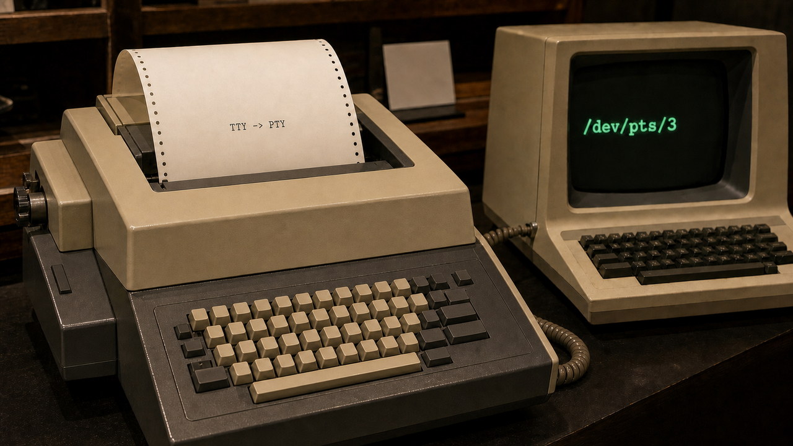

Você abre uma janela preta, digita `ls` e chama aquilo de terminal. Numa conversa normal, tudo certo. A confusão aparece quando “terminal”, “shell”, “console” e “TTY” viram a mesma coisa bem na hora de entender um bug. A janela desenha. O shell interpreta comandos. Entre os dois há uma interface do sistema operacional cheia de decisões tomadas quando a saída do computador ainda era impressa em papel.

Essa história explica várias esquisitices que continuam por aí: `Ctrl+C` interrompendo um processo, `tty` respondendo algo como `/dev/pts/3`, SSH e Docker com uma opção `-t`. O teletipo físico quase desapareceu, mas o contrato que ele deixou continua funcionando.

## Antes da janela, o terminal fazia barulho

Os primeiros teletypes, também chamados de teleprinters, não nasceram como periféricos de computador. Eram máquinas com teclado e mecanismo de impressão, usadas para enviar texto por redes de telecomunicação. Uma pessoa digitava de um lado; a máquina do outro imprimia. O nome TTY vem de “teletype”.

Quando a computação começou a sair do processamento em lote e entrar no *time-sharing*, essas máquinas serviram bem como entrada e saída interativa. Em vez de preparar um lote, esperar a execução e buscar o resultado depois, alguém podia digitar caracteres e receber uma resposta na mesma sessão.

O próprio formato do equipamento deixou marcas. Havia uma linha serial, velocidade limitada, caracteres de controle e uma impressora incapaz de apagar a tinta do papel. Eco, edição da entrada e controle de fluxo não eram opções cosméticas escondidas num menu. Alguém precisava decidir se a máquina mostraria o caractere digitado, quando uma linha estaria pronta e o que fazer se o computador enviasse dados rápido demais.

Esse é o primeiro sentido de TTY: a máquina física. Depois, o nome passou a representar a classe de interface que imitava seu comportamento. A palavra ficou enquanto o objeto mudava embaixo dela. Daí vem boa parte da confusão.

Fonte: [Linus Åkesson — The TTY demystified](https://www.linusakesson.net/programming/tty/).

## Unix transformou o terminal em uma interface do kernel

No Unix do PDP-7, iniciado em 1969, o terminal já aparecia dentro do modelo de arquivos do sistema. Dennis Ritchie conta que havia inicialmente dois processos, um para cada terminal. Cada diretório precisava ter uma entrada especial chamada `tty`, que se referia ao terminal do processo que a abrisse. O nome Unix viria em 1970, sugerido por Brian Kernighan.

Com isso, os programas podiam usar as mesmas operações conhecidas de leitura e escrita para conversar com uma pessoa. Só que um terminal nunca foi apenas um arquivo comum com um teclado na frente. No começo do PDP-7, os terminais operavam efetivamente em modo raw. Apagar caracteres ou cancelar uma linha ficava por conta de alguns poucos programas.

A interface amadureceu. O manual da Sixth Edition descreve um “control typewriter”, o terminal de controle que um processo herdava ao criar filhos. A entrada normal era processada por linhas. O sistema reconhecia caracteres para apagar o último símbolo ou descartar a linha inteira. Em modo raw, por outro lado, a leitura acordava a cada caractere e esse tratamento era desativado.

Hoje chamamos esse processamento de **disciplina de linha**. No modo canônico, ela acumula e edita a entrada até encontrar um delimitador, normalmente o Enter. No modo não canônico, entrega caracteres seguindo regras de quantidade e tempo. As configurações de `termios` também cuidam de eco, conversões e caracteres especiais.

Outra peça dessa história é o terminal controlador. Uma sessão pode ter um terminal associado e um grupo de processos em primeiro plano. O kernel usa essa relação para controlar jobs, decidir quem lê a entrada e tratar processos em segundo plano. É daí que vem a coreografia de `Ctrl+Z`, `fg` e `bg`. Não é um truque particular do Bash.

Por isso `Ctrl+C` normalmente não chega ao programa como a letra C acompanhada de uma conversa educada sobre encerramento. Na configuração usual, a disciplina reconhece o caractere de interrupção, o `VINTR`, e gera `SIGINT` para o grupo de processos em primeiro plano. Essa configuração pode mudar. Programas em modo raw ou interfaces de tela cheia também podem cuidar da entrada de outro jeito.

Fontes: [Dennis M. Ritchie — The Evolution of the Unix Time-sharing System](https://archive.org/details/evolution-of-unix-tss), [manual do UNIX Sixth Edition — tty(IV)](https://man.cat-v.org/unix-6th/4/tty) e [POSIX.1-2024 — General Terminal Interface](https://pubs.opengroup.org/onlinepubs/9799919799/basedefs/V1_chap11.html).

## O papel saiu, mas o protocolo ficou

Trocar a impressora por uma tela não exigiu jogar fora o modelo inteiro. Um terminal de vídeo ainda recebia e enviava bytes. A diferença é que alguns desses bytes podiam instruir o aparelho a mover o cursor, apagar uma região ou mudar atributos da exibição.

O VT100, da Digital Equipment Corporation, é uma ponte bem documentada dessa transição. O manual de sua primeira edição, de agosto de 1978, apresenta um dispositivo de entrada e vídeo. No modo ANSI, ele gerava e respondia a sequências codificadas segundo os padrões ANSI X3.41-1974 e X3.64-1977, além de manter compatibilidade com software do VT52.

O VT100 não foi o primeiro terminal de vídeo e também não tinha tudo que hoje associamos a um terminal. O original, por exemplo, nem era colorido. Ele é útil nesta história porque mostra o contrato se afastando da forma física: o programa escrevia caracteres e sequências de escape, e o terminal interpretava o fluxo para atualizar a tela.

Quando os ambientes gráficos chegaram, outro programa pôde assumir esse trabalho. O xterm se define como um emulador de terminal para o X Window System, com emulação das famílias VT e Tektronix. Sua FAQ encontra indícios de desenvolvimento no X em 1984, mas também alerta que as datas dos arquivos históricos são incertas. Emuladores modernos ainda falam dialetos descendentes desses protocolos, com muitas extensões acumuladas. Eles não são cópias exatas de um VT100 escondidas sob uma fonte bonita.

A variável `$TERM` faz parte desse acordo. Ela descreve a família de capacidades que o software deve esperar, não o nome garantido do aplicativo que desenha a janela. Um valor como `xterm-256color` fala do protocolo esperado. Pode ser que você nem esteja usando o xterm. E, claro, não quer dizer que um VT100 de 1978 ganhou 256 cores numa atualização surpresa.

Fontes: [Digital Equipment Corporation — VT100 User Guide](https://archive.org/details/bitsavers_decterminaT100UserGuideAug78_3198303) e [XTerm FAQ](https://invisible-island.net/xterm/xterm.faq.html).

## O PTY colocou outro programa no lugar do hardware

Ainda faltava encaixar uma peça: se um programa espera conversar com um terminal, como ligá-lo a uma janela gráfica, sessão remota ou multiplexador sem fingir que existe um cabo serial na mesa?

O pseudo-terminal, ou PTY, faz isso com duas pontas conectadas. A documentação atual usa *manager/master* e *subsidiary/slave* para nomeá-las. Na prática, o shell e seus filhos recebem a ponta subordinada como entrada, saída e erro padrão. O emulador fica com a ponta gerenciadora.

Quando você aperta uma tecla, o emulador escreve bytes na ponta gerenciadora. Eles atravessam a disciplina de terminal e chegam ao processo ligado à outra ponta. No caminho inverso, o programa escreve texto e sequências de controle; o emulador lê esses bytes, interpreta o protocolo e desenha o resultado. O teclado e a tela viraram software dos dois lados, enquanto o processo continua enxergando uma interface de terminal.

Se a gente chamar isso só de “um pipe”, perde justamente a parte interessante. O PTY é um canal bidirecional, mas a ponta subordinada também participa de disciplina de linha, `termios`, sessões, grupos de processos, sinais e tamanho de janela. Um pipe transporta bytes. O PTY transporta bytes dentro do contrato histórico de um terminal.

O manual do OpenBSD registra que seu driver PTY apareceu no 4.2BSD. Isso situa o mecanismo nessa geração BSD; não prova que o 4.2BSD inventou universalmente o conceito de pseudo-terminal.

No Linux atual, a interface preferida é a de PTYs UNIX 98. Um programa abre `/dev/ptmx`, prepara e desbloqueia a contraparte, que aparece em `/dev/pts/N`. É por isso que o comando `tty` numa janela local costuma mostrar um caminho nessa árvore, embora esses nomes sejam específicos do Linux e não uma promessa para todo sistema Unix. As antigas APIs de PTY no estilo BSD são consideradas legadas e vêm desabilitadas por padrão desde o Linux 2.6.4.

Fontes: [OpenBSD manual — pty(4)](https://man.openbsd.org/pty.4) e [Linux man-pages — pty(7)](https://man7.org/linux/man-pages/man7/pty.7.html).

## Janela, PTY e shell fazem trabalhos diferentes

Agora dá para separar as três camadas de uma sessão local comum.

O **emulador de terminal** recebe os eventos do teclado, mantém a ponta gerenciadora do PTY, interpreta sequências de controle e desenha os caracteres na janela. O **PTY**, implementado pelo sistema operacional, fornece o canal e a semântica de terminal. Já o **shell** lê a linguagem de comandos, expande expressões e inicia processos.

O emulador não interpreta `ls`. O shell não desenha a letra “l” na tela. E o PTY não decide que `ls` significa listar arquivos. Misturamos os nomes porque as três peças aparecem juntas quase sempre, mas cada uma pode variar sem obrigar as outras a virar a mesma coisa.

Essa separação também explica por que um programa não precisa saber se do outro lado está xterm, outro emulador gráfico, SSH ou tmux. A função `isatty(fd)` testa apenas se um descritor aberto se refere a um terminal. A partir do resultado, cada programa decide se habilita cores, muda o buffering ou mostra outra interface. A função não promete nenhum desses comportamentos.

Ao redirecionar a saída para arquivo ou pipe, `isatty(1)` tende a ser falso. O software pode então remover cores ou mudar o formato da saída. Ele só precisa saber que não está escrevendo num terminal, sem descobrir qual janela estaria do outro lado.

Fontes: [The Linux Field Guide — The terminal, the TTY, and the shell](https://lfg.popovicu.com/series/the-shell-as-a-language/terminal-tty-and-shell/) e [Linux man-pages — isatty(3)](https://man7.org/linux/man-pages/man3/isatty.3.html).

## SSH, tmux e Docker continuam usando o mesmo truque

PTY não serve apenas para janelas gráficas. A documentação do Linux lista entre seus consumidores o `ssh`, xterm, `script`, `screen`, `tmux` e `expect`. Em algum momento, todos eles precisam entregar a um processo uma sessão com comportamento de terminal, mas sem depender de um terminal físico.

No SSH, `-t` força a alocação de um pseudo-terminal, enquanto `-T` a desativa. Um comando remoto executado sem PTY pode observar um ambiente diferente de uma sessão interativa: não há a mesma semântica de terminal, e testes como `isatty()` podem dar outro resultado. Forçar um PTY é útil quando o programa remoto realmente exige interação; não é um tempero obrigatório para todo comando.

O tmux repete o desenho dentro de uma sessão já existente. Cada pane contém seu próprio pseudo-terminal. Assim, vários shells e programas interativos podem manter tamanhos, grupos de processos e fluxos separados, enquanto o tmux reúne a exibição e a entrada numa interface só.

No Docker, `-t` ou `--tty` significa literalmente “allocate a pseudo-TTY”. O `-i` faz outra coisa: mantém a entrada aberta. O conhecido `docker run -it imagem sh` combina as duas opções porque uma sessão interativa costuma precisar de stdin aberto e comportamento de terminal. A dupla parece uma runa de infraestrutura até a gente lembrar que são duas decisões diferentes.

No fim, TTY significa várias coisas dependendo da frase: a máquina histórica, o subsistema do kernel, um arquivo de dispositivo, o terminal controlador de uma sessão ou, por costume, a janela inteira. O contexto resolve o sentido da palavra. Separar as camadas ajuda a resolver o problema.

A máquina que batia tipos em papel foi embora. Ficaram o fluxo de bytes, os caracteres especiais, o controle de jobs e a expectativa de que um programa possa conversar com “um terminal”. O PTY fez uma troca bem ao estilo Unix: colocou outro processo no lugar do hardware e manteve a interface funcionando.

Fontes: [Linux man-pages — pty(7)](https://man7.org/linux/man-pages/man7/pty.7.html), [OpenSSH manual — ssh(1)](https://man.openbsd.org/ssh.1) e [Docker Docs — docker container run](https://docs.docker.com/reference/cli/docker/container/run/).

> Nota: gerado por IA (The Paper LLM), com fontes listadas por bloco.

<!--
briefing_id: none
source_urls:
  - https://www.linusakesson.net/programming/tty/
  - https://archive.org/details/evolution-of-unix-tss
  - https://man.cat-v.org/unix-6th/4/tty
  - https://pubs.opengroup.org/onlinepubs/9799919799/basedefs/V1_chap11.html
  - https://archive.org/details/bitsavers_decterminaT100UserGuideAug78_3198303
  - https://invisible-island.net/xterm/xterm.faq.html
  - https://man.openbsd.org/pty.4
  - https://man7.org/linux/man-pages/man7/pty.7.html
  - https://lfg.popovicu.com/series/the-shell-as-a-language/terminal-tty-and-shell/
  - https://man7.org/linux/man-pages/man3/isatty.3.html
  - https://man.openbsd.org/ssh.1
  - https://docs.docker.com/reference/cli/docker/container/run/
-->
