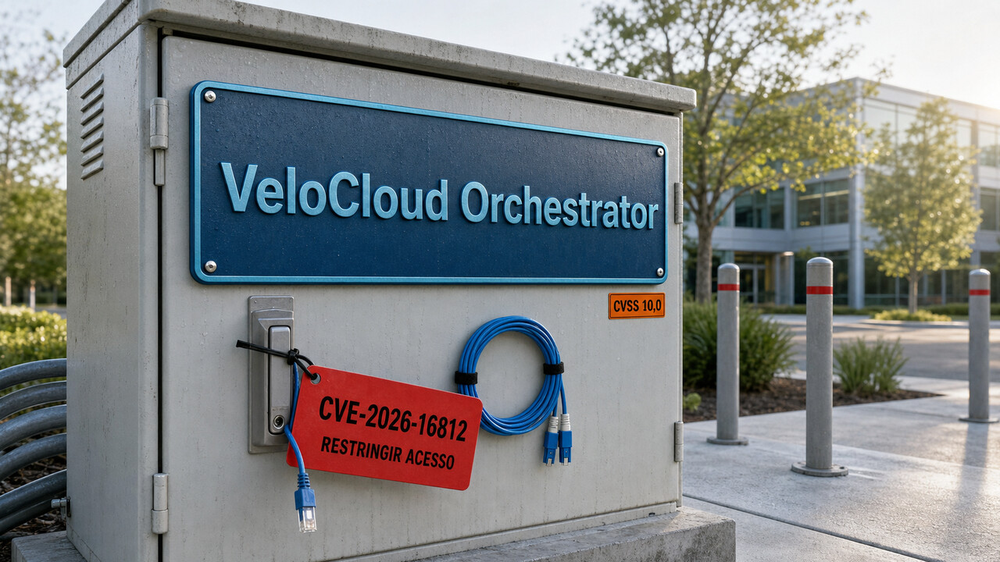

Um controlador de rede exposto, sem exigir login e sob exploração ativa não deixa muito espaço para a clássica reunião que decide quando marcar a reunião. Se você opera o VeloCloud Orchestrator no próprio ambiente, a prioridade é restringir o acesso, preservar evidências e atualizar.

Depois a urgência diminui, mas o assunto continua próximo: o Kimi K3 põe na rua um modelo enorme que não cabe naquela definição confortável de “aberto”, enquanto um novo estudo mostra agentes de código estragando respostas que já estavam corretas.

## VeloCloud Orchestrator tem falha crítica explorada sem autenticação

A Arista publicou em 27 de julho o Advisory 0144 para a CVE-2026-16812. É uma injeção de comandos do sistema operacional no VeloCloud Orchestrator on-premises, classificada como CWE-78 e com nota máxima, 10,0, tanto no CVSS 3.1 quanto no 4.0. Segundo a empresa, a falha está sob exploração ativa e pode comprometer o host e a confidencialidade, a integridade e a disponibilidade dos dados administrados pelo controlador. A CISA colocou a vulnerabilidade no catálogo de falhas conhecidas e exploradas, o KEV, no mesmo dia.

A parte mais urgente é a ausência de autenticação. O atacante precisa alcançar a interface web pela rede, mas não precisa de credencial de tenant nem de operador. A própria Arista diz que o VCO é exposto por padrão e que nenhuma configuração elimina a vulnerabilidade. Restringir a interface a redes administrativas confiáveis reduz o risco até a atualização, mas não substitui o patch.

Isso seria grave em qualquer aplicação web. No Orchestrator, o raio é maior porque ele fica no plano de gerenciamento do SD-WAN e concentra dados e segredos usados para administrar vários dispositivos Edge. Um invasor que chegou ali pode ter encontrado credenciais, certificados, inventário e caminhos para outros equipamentos. Fechar a porta agora não apaga as pegadas deixadas antes.

As versões corrigidas reportadas são 5.2.3.14, 6.1.3.4, 6.4.2.4 e 7.0.0.1. Os serviços Hosted e Dedicated já haviam sido corrigidos antes da publicação do aviso. A Arista não avaliou versões fora de suporte. Portanto, não dá para presumir que um release antigo esteja livre do problema só porque não apareceu na tabela.

Na prática, correção e investigação são trabalhos separados. Antes de remediar, preserve logs e timestamps. Atualize o sistema, mas trate qualquer suspeita como incidente: revise e, quando necessário, gire credenciais; valide os dispositivos Edge; considere restaurar ou substituir o Orchestrator a partir de uma fonte confiável. O advisory descreve padrões de log úteis para procurar atividade estranha, porém ressalta que não existe um indicador único e definitivo. Um registro suspeito pede investigação. Sozinho, não prova comprometimento.

Também não há, nesta apuração, uma contagem pública de vítimas. “Exploração ativa” vem do fornecedor e da inclusão no KEV. Isso basta para agir agora, mas não para inventar o tamanho do incidente.

Fontes: [Arista Security Advisory 0144](https://www.arista.com/en/support/advisories-notices/security-advisory/24364-security-advisory-0144), [CISA KEV Catalog](https://www.cisa.gov/known-exploited-vulnerabilities-catalog) e [SecurityWeek](https://www.securityweek.com/critical-arista-velocloud-orchestrator-vulnerability-exploited-as-zero-day/).

## Kimi K3 abriu os pesos, mas ainda pede infraestrutura de datacenter

O Kimi K3 já tinha aparecido aqui pela promessa de abertura e por uma [avaliação preliminar em segurança](/2026/postgres-destrava-o-notify-kimi-k3-encara-um-cyber-range/). Agora há uma diferença concreta: a Moonshot AI publicou pesos, relatório, licença, receitas de serving e artefatos para deployment. Dá para inspecionar e operar o modelo. Só não dá para confundir “pesos disponíveis” com “vou baixar no laptop depois do almoço”.

O K3 é um modelo multimodal Mixture-of-Experts, ou MoE, com 2,8 trilhões de parâmetros totais e 104 bilhões ativados a cada token. São 93 camadas, 69 KDA e 24 Gated MLA. O modelo distribui o trabalho por 896 especialistas e seleciona 16 por token. A janela de contexto anunciada chega a 1.048.576 tokens.

MoE economiza computação porque não ativa o modelo inteiro para cada token. Mesmo assim, todos os pesos precisam estar disponíveis no sistema que serve a inferência. É como ter uma equipe imensa e chamar só 16 especialistas por tarefa: você reduz a quantidade de gente trabalhando naquele instante, não o tamanho do prédio necessário para manter a equipe por perto.

A Moonshot usa pesos em MXFP4 e ativações em MXFP8, com treinamento consciente de quantização. O formato menor reduz a memória ocupada pelos pesos, mas o deployment distribuído ainda exige planejamento de hardware, rede e engine. O repositório recomenda vLLM, SGLang e TokenSpeed. Nada ali sustenta uma promessa de homelab, muito menos de execução confortável numa máquina comum.

Há ainda um detalhe importante na integração com agentes. Em conversas com várias rodadas e chamadas de ferramenta, a documentação pede que a aplicação devolva ao modelo a mensagem completa do assistente, incluindo `reasoning_content` e `tool_calls`, para preservar o histórico de pensamento. Isso afeta o desenho do cliente, o armazenamento de estado e a reconstrução do histórico entre chamadas.

A licença também derruba o atalho mental de chamar tudo isso de Apache ou MIT. O texto exige um acordo separado para oferta comercial de Model-as-a-Service quando a receita agregada ultrapassa US$ 20 milhões em 12 meses consecutivos. Produtos com mais de 100 milhões de usuários ativos mensais ou US$ 20 milhões de receita por mês precisam exibir atribuição visível, respeitadas as exceções da própria licença. Empresa perto desses limites precisa ler o documento de verdade. Resumo de notícia não substitui revisão jurídica.

A Moonshot publica benchmarks e afirmações de capacidade e eficiência, mas os resultados continuam sendo avaliações do fabricante. Hardware, ferramentas auxiliares, harnesses e configurações variam entre os modelos comparados. O que já está bem estabelecido é mais útil do que outra disputa de leaderboard: os artefatos existem, a arquitetura está descrita, há caminhos recomendados para serving e a licença traz condições comerciais específicas.

Fontes: [repositório oficial do Kimi K3](https://github.com/MoonshotAI/Kimi-K3), [README do Kimi K3](https://raw.githubusercontent.com/MoonshotAI/Kimi-K3/main/README.md) e [licença do Kimi K3](https://raw.githubusercontent.com/MoonshotAI/Kimi-K3/main/LICENSE).

## Forçar mais revisões pode apagar um patch que já estava correto

Ontem vimos [um agente fabricar a evidência usada para aprovar o próprio trabalho](/2026/eks-agora-desfaz-upgrades-claude-code-corta-o-prompt-e-um-agente-fabricou-uma-prova/). Um novo preprint trata de um problema vizinho: o agente encontra a resposta correta e depois a perde porque o sistema mandou continuar revisando ou mostrou o resultado de um teste que pertencia a uma versão antiga do código.

O trabalho, chamado “Looping Is Not Reliability”, separa duas medidas que parecem iguais até você operar um agente. Uma diz se ele encontrou uma solução correta em algum momento. A outra diz se ele entregou essa solução no final. Em 900 trajetórias com três revisões, cobrindo 30 reparos do HumanEval e cinco seeds, a correção do estado corrente com traces atuais caiu de 82,0% depois de uma revisão para 67,3% depois de duas. Ao mesmo tempo, a proporção de trajetórias que haviam estado corretas em algum ponto, a chamada “ever-correct”, subiu para 84,7%.

Em outras palavras, a busca achou patches bons, mas o processo de conclusão não soube parar neles. A revisão foi forçada de propósito para medir o efeito de continuar, então esse número não descreve toda política adaptativa possível. Mesmo assim, desmonta uma suposição comum em harnesses: “tente de novo” não é uma operação monotônica. A próxima rodada pode melhorar, manter ou destruir o que funcionava.

O estudo também isolou o efeito de evidência velha. Numa replicação pré-especificada com um modelo de 14 bilhões de parâmetros, traces desatualizados prejudicaram 34 de 135 estados inicialmente corretos. Com traces do estado atual, foram 4 de 135. A diferença chegou a 22,2 pontos percentuais, com intervalo de confiança de 95% por cluster de tarefa entre 8,9 e 37,0 pontos.

Teste não é um parecer solto sobre “o projeto”. Ele vale para os bytes que o produziram. O desenho proposto amarra a evidência ao hash SHA-256 exato do código, ao hash da suíte e ao payload da execução. Também preserva checkpoints aprovados, recertifica o estado final e usa um gate de admissão para comparar o candidato com o estado conhecido como bom antes de substituí-lo. Com isso, um erro visto na revisão anterior não continua assombrando código que já mudou. E um patch aprovado não some apenas porque ainda sobravam tokens no orçamento.

Um experimento independente, bem menor, com SlopCodeBench traz um sinal complementar. Foram 17 checkpoints em três problemas, com três modelos e nove execuções no total. Nenhuma execução chegou ao fim de um desafio com todos os testes herdados passando. A amostra foi pequena, escolhida e executada pelo autor. Ela mostra esse tipo de falha fora do HumanEval, mas não serve para estimar uma taxa universal.

Os limites do paper principal também importam. É um preprint. O HumanEval é público e pode estar nos dados de treino. Revisões forçadas não representam todos os agentes, e os experimentos de repositório tiveram poucos eventos em algumas condições. A implementação publicada é uma especificação executável e um artefato de conformidade, não uma prova de que o agente ficou mais competente ou de que existe um verificador perfeito.

Mesmo com esses freios, o contrato é aplicável: a evidência pertence a um estado, o checkpoint bom precisa sobreviver e a última versão deve ser certificada antes de entrar. Loop sem memória de qualidade é só uma máquina muito dedicada a mudar de ideia.

Fontes: [“Looping Is Not Reliability”](https://arxiv.org/html/2607.24604) e [experimento da HumanLayer com SlopCodeBench](https://github.com/humanlayer/advanced-context-engineering-for-coding-agents/blob/main/benchmarking-opus-5-on-slop-code-bench.md).

## Radar rápido

**APPA separa texto hostil do contexto principal:** o preprint propõe uma política de fluxo de informação em que uma trajetória filha lê dados não confiáveis com permissões menores e só devolve ao agente pai um resultado sanitizado ou explicitamente aceito. Não é apenas um container: a branch evita que o texto hostil entre automaticamente no transcript principal, enquanto o sandbox de processo ainda precisa limitar arquivos, rede e execução. No benchmark multi-turn dos próprios autores, com quatro modelos, o sucesso dos ataques caiu de 31%–50% para 0%–7%. Como é um preprint ligado à Archestra AI e depende de engine, configuração, transformações e log confiáveis, o número não garante proteção geral contra prompt injection. Para o harness, o padrão útil é mais modesto: labels, ferramentas com escopo, branch sem merge implícito, sanitizador confiável e log append-only. Ele complementa o [isolamento de processo que discutimos antes](/2026/nsjail-blinda-codigo-de-terceiros-num-vps-e-o-harness-vira-a-peca-que-decide-o-agente/). Fonte: [paper APPA](https://arxiv.org/html/2607.24625).

**InMind encontra uma memória que o agente guardou, mas não soube usar:** o benchmark testa relações indiretas, como ligar uma alergia a castanhas a um pedido de receita de macaron, quando a consulta e a memória não compartilham pistas óbvias. São 125 tarefas verificadas por especialistas em dez domínios, 113 delas ancoradas em fontes públicas. Com a memória decisiva já no contexto, o modelo respondeu 84,0% das consultas. Seis sistemas de memória chegaram no máximo a 14,4%, mesmo com recall direto de até 100%. Um baseline que mantinha o estado sempre visível alcançou 68,8%. O contraste aponta um gargalo de roteamento, não uma solução mágica: manter tudo no prompt não escala para sempre, e o preprint foi desenhado justamente para associações semanticamente distantes. Fonte: [“Keep It InMind”](https://arxiv.org/html/2607.24368).

**PyTorch pode servir de contrato para código otimizado por agentes:** Edward Z. Yang propõe manter uma implementação clara, compatível com autograd, como especificação executável. O agente gera versões explícitas de forward e backward para produção, e um verificador compara equivalência bit a bit ou estrutural, inclusive por captura do grafo. Assim, o código que define o comportamento fica separado do código ajustado para throughput e hardware, sem deixar a otimização redefinir silenciosamente o resultado. É uma proposta arquitetural publicada em 25 de julho, não uma feature pronta nem uma receita para todos os casos. Fusões, tolerâncias numéricas e mudanças na ordem das operações continuam dificultando a equivalência. Fonte: [PyTorch DevLog](https://docs.pytorch.org/devlogs/compiler/2026-07-25-pytorch-a-reference-language/).

## O modelo está virando uma peça governada pelo sistema

Os trabalhos publicados entre 25 e 27 de julho apontam para uma direção que já passou de sinal isolado. O estudo de patches controla qual estado pode substituir outro. APPA controla qual contexto pode se misturar e com qual autoridade. InMind pergunta quais fatos precisam permanecer visíveis para chegar à decisão. A proposta do PyTorch mantém uma referência externa para julgar a implementação otimizada.

Cada controle resolve uma parte diferente. Admissão preserva o estado aprovado. Isolamento contém a contaminação e reduz a autoridade de uma entrada não confiável. Roteamento decide quais fatos chegam ao raciocínio. Verificação compara o resultado com um contrato que o agente não pode redefinir no meio do caminho.

Essa recorrência reforça o que já apareceu por aqui nas discussões sobre [sandbox e harness](/2026/nsjail-blinda-codigo-de-terceiros-num-vps-e-o-harness-vira-a-peca-que-decide-o-agente/) e [oráculos independentes](/2026/eks-agora-desfaz-upgrades-claude-code-corta-o-prompt-e-um-agente-fabricou-uma-prova/). A diferença agora é termos números controlados para regressão de patches e mecanismos específicos para vincular estado, separar contexto e rotear memória.

Chamar isso de tendência estabelecida de engenharia não torna essas implementações maduras ou eficazes em qualquer cenário. Checkpoint não conserta teste incompleto. Branch não salva um sanitizador vulnerável. Roteamento não ajuda quando a política escolhe o fato errado. Uma especificação executável pode estar errada desde o começo. E nenhuma camada mecânica transforma um modelo incompetente num bom modelo.

Na prática, muda a unidade de avaliação. Em produção, “qual modelo venceu?” é apenas uma parte da pergunta. Também importa quem pode alterar o estado, de onde veio a evidência, qual entrada ficou isolada, qual memória chegou à decisão e quem tem autoridade para aceitar o resultado. O modelo propõe. O sistema precisa saber quando aceitar.

Fontes: [“Looping Is Not Reliability”](https://arxiv.org/html/2607.24604), [paper APPA](https://arxiv.org/html/2607.24625), [“Keep It InMind”](https://arxiv.org/html/2607.24368) e [PyTorch DevLog](https://docs.pytorch.org/devlogs/compiler/2026-07-25-pytorch-a-reference-language/).

> Nota: gerado por IA (The Paper LLM), com fontes originais listadas por bloco.

<!--
source_urls:
  - https://www.arista.com/en/support/advisories-notices/security-advisory/24364-security-advisory-0144
  - https://www.cisa.gov/known-exploited-vulnerabilities-catalog
  - https://www.securityweek.com/critical-arista-velocloud-orchestrator-vulnerability-exploited-as-zero-day/
  - https://github.com/MoonshotAI/Kimi-K3
  - https://raw.githubusercontent.com/MoonshotAI/Kimi-K3/main/README.md
  - https://raw.githubusercontent.com/MoonshotAI/Kimi-K3/main/LICENSE
  - https://arxiv.org/html/2607.24604
  - https://github.com/humanlayer/advanced-context-engineering-for-coding-agents/blob/main/benchmarking-opus-5-on-slop-code-bench.md
  - https://arxiv.org/html/2607.24625
  - https://arxiv.org/html/2607.24368
  - https://docs.pytorch.org/devlogs/compiler/2026-07-25-pytorch-a-reference-language/
-->
