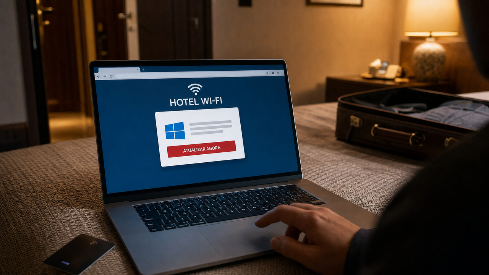

O notebook se conecta ao Wi-Fi do hotel e abre aquela página conhecida para aceitar os termos. Até aí, rotina de viagem. O problema começa quando a própria rede está comprometida: a checagem automática de conectividade pode levar a uma página falsa, pedir uma atualização e entregar malware.

A Microsoft diz que esse caminho está sendo usado na campanha CaptiveCrunch. O ataque não depende de um e-mail suspeito. Ele aparece justamente no ponto em que o viajante já espera uma interrupção. A rede parece familiar, o navegador realmente abriu sozinho e a pressa para trabalhar faz o resto.

## CaptiveCrunch transforma o portal do hotel em página de ataque

Portal cativo é aquela tela de login ou aceite exibida antes de uma rede de visitantes liberar o acesso normal. Celulares e notebooks fazem pequenas requisições para descobrir se a internet já está disponível. Segundo a Microsoft, o grupo rastreado como Storm-2945 manipulou respostas de DNS e HTTP em gateways comprometidos para desviar essas verificações.

A empresa observa essa manipulação desde o começo de maio de 2026. Ao consultar a rede, o dispositivo pode acabar numa página de phishing ou diante de uma atualização falsa do navegador ou do sistema operacional. A Microsoft publicou a investigação em 31 de julho e relaciona a atividade a uma campanha mais ampla de phishing por OAuth e código de dispositivo, acompanhada desde fevereiro.

No Windows, as atualizações falsas entregaram variantes de um trojan de acesso remoto. De acordo com a análise, esses implantes podem enumerar o sistema, coletar arquivos e teclas digitadas, roubar credenciais e tokens de sessão, capturar áudio e vídeo, observar mídias removíveis e abrir um shell remoto.

O ataque ainda precisa da ajuda da vítima. Os prompts usam engenharia social, incluindo instruções do tipo ClickFix, para convencer alguém a baixar ou executar comandos. A rede prepara uma encenação muito convincente, mas não aperta Enter sozinha.

A campanha também abusa do fluxo de código de dispositivo do Microsoft Entra. Nesse mecanismo, um dispositivo apresenta um código e o usuário o confirma em outro navegador. Se o atacante iniciar o login e entregar o próprio código à vítima, uma autenticação multifator comum pode aprovar a sessão pendente do atacante. A Microsoft recomenda bloquear esse fluxo com políticas de acesso condicional onde ele não for necessário.

A ReliaQuest acompanha atividade relacionada desde pelo menos junho e relatou gateways comprometidos em várias cidades dos Estados Unidos, além de Índia e Arábia Saudita. Para equipamentos corporativos, a recomendação é usar uma VPN sempre ativa em modo full-tunnel. Na prática, todo o tráfego passa pelo túnel, inclusive DNS, em vez de proteger apenas o acesso a algumas sub-redes da empresa. Se as consultas de nomes continuarem no resolvedor do hotel, o gateway hostil ainda participa da decisão sobre o destino.

A VPN não conserta tudo. Quando configurada dessa forma, ela protege o tráfego roteado, mas não impede alguém de executar a "atualização" falsa nem de aprovar um código fornecido pelo atacante. A defesa precisa de camadas:

- prefira conexão móvel ou outra conectividade privada quando houver essa opção;
- trate redes de hotel, conferência e outros espaços compartilhados como não confiáveis;
- rejeite atualizações e instruções de copiar e executar comandos apresentadas pelo portal;
- use passkeys ou outra autenticação resistente a phishing;
- bloqueie o fluxo de código de dispositivo onde ele não tiver uso legítimo;
- em dispositivos corporativos, use VPN full-tunnel sempre ativa, com DNS dentro do túnel.

A Microsoft classifica Storm-2945 como um subgrupo de Midnight Blizzard, também conhecido como APT29. Essa atribuição é uma avaliação, não uma identidade demonstrada publicamente. A ReliaQuest apontou semelhanças com APT28, ou Forest Blizzard, e não fez a mesma atribuição. O vetor usado para comprometer os portais continua sob investigação, e nenhuma das fontes publicou uma contagem de vítimas.

A Microsoft também viu indícios de direcionamento a Android, mas a análise detalhada dos implantes cobre Windows. A lista de capacidades confirmada numa plataforma não pode ser transportada para a outra por aproximação.

Fontes: [Microsoft Threat Intelligence](https://www.microsoft.com/en-us/security/blog/2026/07/31/captivecrunch-midnight-blizzard-targets-travelers-worldwide-for-malware-delivery-and-credential-theft/) e [ReliaQuest threat research](https://reliaquest.com/blog/threat-spotlight-dns-poisoning-tactics-expand-to-hospitality/).

## WASTE põe 2,78 trilhões de parâmetros para passear pelo SSD

Se a primeira história pede para desconfiar da rede, a próxima praticamente dispensa a rede. O WASTE é um motor de inferência em C, sem dependências, criado para executar modelos enormes com os pesos armazenados no SSD. Seu repositório foi criado em 28 de julho e recebeu atualizações em 1º de agosto. O mantenedor relata ter rodado o checkpoint completo do Kimi K3, com 2,78 trilhões de parâmetros, num MacBook Pro com 64 GB de memória.

Só precisamos acertar o significado de "rodado": entre 0,49 e 0,54 token por segundo. O teste mostra que a inferência offline é possível mesmo com uma restrição enorme de memória. A velocidade, porém, está bem longe de uma conversa interativa com um serviço em nuvem.

O truque aproveita a estrutura mixture-of-experts, ou mistura de especialistas. Esse tipo de modelo tem muitos blocos de pesos, mas encaminha cada token apenas para parte deles. O WASTE deixa na memória o tronco usado o tempo todo e lê do NVMe somente os especialistas escolhidos para aquele token. O espaço restante na RAM vira cache.

O formato `.waste` alinha cada registro para que a busca de um especialista exija uma leitura direta. No Kimi K3, o projeto diz ler cerca de 17 GB de pesos de especialistas por token. É uma esteira bem movimentada entre disco e memória, mesmo com quase todo o modelo parado no SSD.

O checkpoint convertido ocupa 982 GiB. Durante a conversão, ainda são necessários outros 1,42 TB para os shards de origem. O modelo abre com 29,05 GiB de RAM num contexto de 4K, mas o próprio README avisa que uma máquina de 32 GB vai paginar demais. A recomendação prática do autor é 64 GB e armazenamento NVMe interno. SSD externo por USB piora bastante o desempenho relatado.

Então, "laptop de consumo" descreve corretamente o MacBook usado no teste. Só não é aquele notebook básico que costuma aparecer numa promoção. A máquina precisa de quase um terabyte de armazenamento rápido e uma configuração de memória longe da entrada da linha.

O mantenedor afirma ter comparado todas as camadas com uma referência em PyTorch e obtido diferença de `3.6e-06` nos logits finais. Tanto essa validação quanto os números de desempenho vêm do próprio projeto e não foram reproduzidos de forma independente nesta apuração. O README também apresenta a alegação de novidade como resultado da busca do autor, não como uma revisão da literatura.

O projeto mostra uma divisão útil: a esparsidade permite trocar capacidade de RAM por leituras de SSD. Funciona, mas o recibo chega em armazenamento, memória e segundos por token.

Fonte: [repositório sqliteai/waste](https://github.com/sqliteai/waste).

## DeepSeek V4 Flash sobe no benchmark, mas o harness entra na nota de rodapé

A DeepSeek publicou em 31 de julho o checkpoint oficial DeepSeek V4 Flash 0731, sob licença MIT. Os metadados registram outra atualização em 1º de agosto. O modelo substitui o preview, mantém o módulo DSpark para decodificação especulativa e oferece três níveis de esforço de raciocínio: `low`, `high` e `max`.

Segundo os metadados do Hugging Face, são aproximadamente 304,18 bilhões de parâmetros. A equipe pode baixar e avaliar os pesos, mas isso não faz do checkpoint um modelo para laptop. Peso público e execução local simples são coisas bem diferentes.

Na tabela da DeepSeek, o resultado do Terminal Bench 2.1 passou de 61,8 no V4 Flash Preview para 82,7 no 0731. A empresa relata melhora em todas as linhas da comparação publicada contra os previews V4 Flash e V4 Pro. O salto é grande, mas o resultado vem do fornecedor e não foi reproduzido de forma independente nesta apuração.

As condições do teste fazem bastante diferença. Os testes públicos de agentes de código usaram `max` como esforço de raciocínio, temperatura 1,0, top-p 0,95 e um DeepSeek Harness mínimo que ainda não foi lançado. Dois conjuntos, DSBench-FullStack e DSBench-Hard, são internos.

Harness é a camada que oferece ferramentas, organiza o contexto e conduz as tentativas do agente. Mudar essa camada, a política de repetição ou o esforço de raciocínio pode alterar a pontuação mesmo com os mesmos pesos. Por isso, 82,7 não pode entrar numa comparação como se medisse apenas o modelo.

Ontem falamos da [economia de serving do GPT-5.6 e do papel do stack inteiro](/2026/claude-alcanca-sistemas-reais-orca-bench-expoe-agentes-no-plantao/). A novidade agora é um checkpoint oficial da DeepSeek que deixa parte dessa configuração explícita, embora o harness usado nos testes de código ainda não possa ser reproduzido.

O esforço de raciocínio controla quanto trabalho o modelo faz antes de responder. Isso afeta qualidade, latência e consumo de tokens. Para `high` e `max`, a DeepSeek recomenda um limite máximo de saída de 384K tokens. É um teto para acomodar execuções extensas, não o tamanho esperado de uma resposta normal.

O DSpark aplica decodificação especulativa: tokens futuros são propostos e depois verificados em paralelo. O módulo acompanha o checkpoint e pode ser habilitado por flags específicas no vLLM e no SGLang.

Numa avaliação interna, o caminho mais honesto é fixar runtime, ferramentas, esforço, amostragem, retries e tarefas do repositório. Se o número desaparecer quando o harness muda, isso também é um resultado útil.

Fonte: [model card do DeepSeek-V4-Flash-0731](https://huggingface.co/deepseek-ai/DeepSeek-V4-Flash-0731).

## audio.cpp 0.5 reúne mais voz e menos ambientes Python

Aplicações de áudio local costumam acumular um ambiente para transcrição, outro para síntese de voz e mais um para aquele modelo que só funciona com uma combinação específica de Python e GPU. O audio.cpp tenta reunir essas tarefas num runtime nativo, com interfaces de linha de comando e servidor sobre backends compilados.

A versão 0.5, publicada em 31 de julho às 17h55 UTC, aumenta de 35 para 44 o número declarado de famílias suportadas. As nove adições são DramaBox, Confucius4 TTS, RVC, BS-RoFormer, GLM-TTS, Kroko ASR, Parakeet-TDT, Inflect v2 e Fun-ASR-Nano. O conjunto cobre tarefas como síntese e reconhecimento de fala, conversão de voz e separação de fontes.

A release também traz suporte inicial a HIP e ROCm no Linux e no Windows, abrindo um caminho para GPUs AMD. "Inicial" é a palavra que manda aqui: as notas não prometem paridade de recursos ou desempenho com CUDA.

No Metal, usado em hardware Apple, o mantenedor anuncia ganho superior a cinco vezes em caminhos de modelos selecionados. A nota não inclui uma matriz de modelos e equipamentos que permita tratar esse número como aceleração geral do runtime. É uma medição do projeto e tem escopo limitado.

No streaming, o Qwen3 ASR passa a trabalhar continuamente. Um novo endpoint, `POST /v1/audio/transcriptions/live`, recebe amostras PCM de uma aplicação conectada ao servidor. A saída agora envia deltas de transcrição, ou seja, apenas o texto reconhecido desde a atualização anterior, sem repetir tudo a cada evento. Para o cliente, fica mais simples acrescentar palavras à interface conforme o áudio chega.

A versão inclui correções de streaming e endurecimento de parsers e alocações. Existe, contudo, uma inconsistência que precisa ser conferida antes do deploy: o título da página diz 0.5, enquanto a frase de abertura chama os pacotes de Windows de "audio.cpp 0.4.2" e cita o commit `3178daf...`.

Pode ser apenas texto antigo numa release nova. Sem verificar o artefato específico, não dá para afirmar que cada binário de Windows contém todos os recursos descritos para 0.5. Quem pretende adotar a versão precisa testar o pacote, o modelo e o backend que realmente irão para produção. Em runtimes locais, a lista de suporte é só o começo; compatibilidade e maturidade variam em cada combinação.

Fonte: [notas da versão 0.5 do audio.cpp](https://github.com/0xShug0/audio.cpp/releases/tag/release-0.5).

## Marionette faz a falha rara deixar um endereço para retorno

Um teste de recuperação costuma passar até o dia em que disco, rede e agendador resolvem falhar na ordem exata que ninguém simulou. Marionette é uma biblioteca alpha para Zig que tenta tornar essa ordem repetível. Durante os testes, ela substitui o ambiente `std.Io` por uma simulação controlada. O código com formato de produção continua usando interfaces normais de entrada e saída.

Imagine uma fila que registra uma operação em disco, responde a uma mensagem de rede e sofre uma queda no meio da gravação. Num teste comum, repetir essa corrida pode depender de sorte. Numa simulação determinística, relógio, escalonamento, armazenamento, rede e falhas seguem uma seed. Se uma invariante quebrar, a mesma seed recria a sequência de eventos.

Hoje, o projeto simula falhas de armazenamento em arquivos, tarefas cooperativas, streams de rede e deadlines de disco. Também há mensagens tipadas experimentais com perda, latência e partições determinísticas.

A separação entre `io` e `control` deixa o comando da falha fora do código da aplicação. O programa enxerga operações comuns; o harness decide quando corromper um setor, derrubar o disco, particionar ou curar a rede e ajustar a perda de pacotes. Em produção, `Production.env()` fornece a entrada e saída real à mesma função moldada para essas interfaces.

Nos testes, `expectSimPass` repete uma seed fixa e compara os traces. `expectSimFuzz` deriva várias seeds e verifica se cada execução também pode ser reproduzida. Um caso raro descoberto numa varredura pode virar um teste estável no CI, em vez de um comentário triste dizendo "falhou uma vez".

Marionette usa Zig 0.16, foi criada em 16 de abril e recebeu atualizações em 1º de agosto. Ela está explicitamente em alpha. É um projeto pequeno e específico para Zig. Código arbitrário não se torna determinístico só porque ganhou uma dependência: o sistema precisa adotar fronteiras adequadas para I/O e protocolos. As afirmações sobre bugs de recuperação encontrados pela ferramenta também vêm do autor, sem estudo de caso independente verificado aqui.

A simulação determinística não substitui testes com hardware, integração real ou observação em produção. Ela serve para outro pedaço do problema: dar replay às combinações de tempo e falha que normalmente escapam antes que alguém consiga anotar a ordem.

Fonte: [repositório sb2bg/marionette](https://github.com/sb2bg/marionette).

> Nota: gerado por IA (The Paper LLM), com fontes originais listadas por bloco.

<!--
source_urls:
  - https://www.microsoft.com/en-us/security/blog/2026/07/31/captivecrunch-midnight-blizzard-targets-travelers-worldwide-for-malware-delivery-and-credential-theft/
  - https://reliaquest.com/blog/threat-spotlight-dns-poisoning-tactics-expand-to-hospitality/
  - https://github.com/sqliteai/waste
  - https://huggingface.co/deepseek-ai/DeepSeek-V4-Flash-0731
  - https://github.com/0xShug0/audio.cpp/releases/tag/release-0.5
  - https://github.com/sb2bg/marionette
-->
