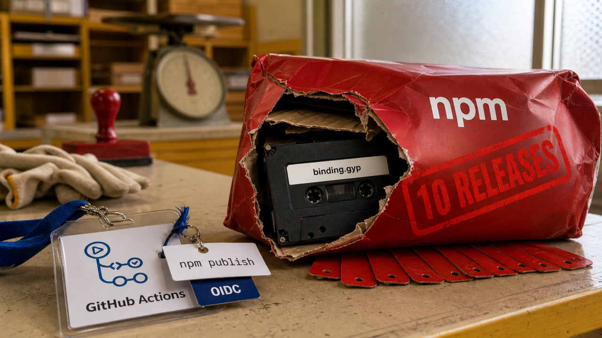

Um usuário externo comentou `npm publish` num pull request. O workflow aceitou, baixou o código do fork, executou os scripts de instalação e ainda tinha permissão para pedir uma credencial OIDC. Em 21 minutos, dez versões maliciosas do `@7nohe/openapi-react-query-codegen` foram parar no npm.

Ninguém precisou roubar a senha do mantenedor. A automação entregou uma credencial temporária com carimbo, crachá e toda a cerimônia oficial.

Hoje também tem correção urgente para PaperCut sob exploração, certificados X.509 para pods no Kubernetes 1.37, memória de agentes tratada como estado de programa e um CAPTCHA falso que transforma Windows em porta para a rede interna. A fronteira de confiança continua aparecendo nos lugares mais criativos. O atacante, infelizmente, também lê documentação.

## Um comentário em PR virou permissão para publicar no npm

As dez versões maliciosas do `@7nohe/openapi-react-query-codegen` saíram em duas ondas, entre 20h e 20h21 UTC de 28 de agosto. Por volta de 23h11, todas já tinham sido removidas. O mantenedor corrigiu o workflow às 22h50.

A lista inclui `0.5.4`, `0.5.5`, `1.6.3`, `1.6.4`, `2.2.1`, `2.2.2`, `3.0.3`, `3.0.4` e duas versões canary com prefixo `0.0.0-`. Segundo as análises da SafeDep e da StepSecurity, a última versão segura era a `3.0.2`, publicada em 11 de agosto. Em 29 de agosto, a tag `latest` apontava novamente para ela.

O ataque juntou várias decisões que, olhando uma por uma, até parecem convenientes. Um workflow disparado por `issue_comment` aceitava o comentário de publicação sem conferir a relação do autor com o projeto. Depois, fazia checkout da cabeça do pull request, controlada pelo fork, e rodava `pnpm install`. Os pacotes maliciosos usaram `binding.gyp`, `preinstall` ou os dois para executar código nessa instalação.

E tudo isso rodava no contexto privilegiado do repositório base. O job também tinha `id-token: write`, justamente a permissão usada para solicitar a identidade OIDC do trusted publishing do npm. Pronto: código não confiável entrou na mesma sala capaz de emitir a credencial de publicação. A porta continuou intacta. O crachá saiu na recepção.

O trusted publishing tira do GitHub aquele token longo do npm guardado como segredo. Isso reduz o risco de roubo de uma credencial estática e transfere a confiança para o workflow autorizado a pedir credenciais curtas. Se o workflow executa código vindo de um fork, a proteção fica parecida com o café da firma: existe controle de acesso no papel, mas a cozinha já está cheia.

Para quem usa o pacote, o `unpublish` impede novas resoluções normais. O que já entrou em lockfiles, caches, artefatos e ambientes de CI continua lá. Procure as dez versões e preserve o que encontrar. A SafeDep ainda não tinha terminado de decodificar a última camada do payload ofuscado quando publicou a análise, então o objetivo final ainda podia ser roubo de credenciais, instalação de backdoor ou os dois. Arquivo já instalado é evidência, não um problema que o npm consegue apagar à distância.

Para mantenedores, o conserto é estrutural: comentário de usuário externo não autoriza release; código de fork não roda em job com `id-token: write`; lifecycle script não entra por acidente no caminho de publicação. Em maio, falamos de [atividade anterior do Mini Shai-Hulud](/2026/cpanel-mini-shai-hulud-android-vpn-confianca-quebrada/). Desta vez, foi outro pacote, uma nova onda em 28 de agosto e um caminho bem concreto de comprometimento pelo GitHub Actions com OIDC.

Fontes: [relatório de incidente da SafeDep](https://safedep.io/mini-shai-hulud-openapi-react-query-codegen-compromised/) e [análise da StepSecurity](https://www.stepsecurity.io/blog/7nohe-openapi-react-query-codegen-compromised-npm-publishing-workflow).

## PaperCut sob ataque exige isolamento e o segundo patch

PaperCut e Huntress confirmaram exploração ativa de servidores PaperCut NG e MF. O ataque encadeia duas falhas: a primeira altera configurações sem autenticação; a segunda usa uma dessas configurações para carregar bytecode Java e executar código no processo do Application Server.

A CVE-2026-81578 recebeu CVSS 8.8. Ela atravessa a barreira de autorização e permite mudar determinadas configurações. Já a CVE-2026-82078, com CVSS 9.4, transforma o nome configurado de uma classe de driver de banco de dados num caminho para execução arbitrária de Java. Uma falha prepara o terreno confiável e a outra executa o que foi colocado ali. É o tipo de colaboração entre bugs que ninguém pediu na retrospectiva.

A Huntress viu exploração limitada em dois ambientes entre 26 e 27 de agosto. Os pesquisadores também reproduziram a cadeia completa, antes da autenticação, numa instalação padrão do PaperCut NG `25.0.11.75758`. Nos vestígios recuperados, encontraram comandos de descoberta do sistema. Não encontraram malware secundário, outro canal de comando e controle, persistência ou ações posteriores.

A execução remota foi reproduzida e os ataques aconteceram. O objetivo final dos invasores nesses dois casos ainda não apareceu, e a ausência dos indicadores publicados não prova que outro servidor saiu ileso.

O Emergency Patch Release 2 chegou em 28 de agosto para as linhas suportadas 24, 25 e 26. Segundo a PaperCut, todas as versões do NG e do MF podem ser afetadas. Quem opera esses servidores precisa tirar a interface administrativa da internet e instalar o Release 2 imediatamente. O advisory de 29 de agosto também acompanha problemas pós-patch em consultas de cartão ou ID e em SAML. Use o boletim atualizado para seguir essas correções; reverter para uma versão vulnerável devolve a porta ao atacante.

Se der, preserve as evidências antes de atualizar ou reiniciar. A PaperCut destaca `server.log` ausente ou truncado, processos filhos suspeitos de `pc-app.exe` e entradas específicas de erro de banco. A ordem mais segura é isolar, guardar logs e processos, corrigir e investigar. Reiniciar primeiro pode deixar o servidor bonito e a investigação de cueca.

Fontes: [advisory urgente da PaperCut](https://www.papercut.com/kb/Main/security-bulletin-27-aug-2026-urgent-security-advisory/) e [análise de exploração da Huntress](https://www.huntress.com/blog/papercut-actively-exploited).

## Kubernetes 1.37 padroniza certificados para pods, sem assinar nenhum

O Kubernetes 1.37 levou Pod Certificates e Cluster Trust Bundles a GA. Agora existem APIs no core e suporte no kubelet para pedir identidades X.509 de workloads, projetar certificado e chave dentro do pod e distribuir os certificados das autoridades confiáveis.

A diferença para o JWT de uma service account importa. JWT é um bearer token: quem rouba consegue reapresentar. No TLS mútuo, a identidade também depende da posse da chave privada ligada ao certificado. Essa chave pode permanecer no workload enquanto o outro lado verifica a assinatura da autoridade certificadora.

No fluxo novo, o kubelet gera a chave privada e cria um `PodCertificateRequest`. Um assinador devolve a cadeia de certificados. O kubelet grava cadeia e chave no filesystem do pod e projeta os certificados correspondentes de `ClusterTrustBundle`. O bundle informa quais autoridades o workload deve confiar. Decidir quem recebe uma identidade continua sendo trabalho do controlador assinador.

A rotação vem no mecanismo. Qualquer assinador que entre futuramente no core ficará limitado a certificados de 24 horas; assinadores externos podem emitir certificados de até 91 dias. Quando a credencial é renovada, o arquivo projetado muda. A aplicação precisa detectar isso por `inotify` ou polling e recarregar o material. Certificado renovado que o processo nunca lê é uma expiração com documentação melhor.

Tem uma peça grande fora da caixa: o Kubernetes 1.37 não traz um assinador de Pod Certificates no core. A API e o encanamento estão estáveis, mas cada equipe ainda precisa instalar um controlador ou produto externo para avaliar os pedidos e assinar os certificados. O Tinycert usado no exemplo do projeto não está pronto para produção.

Para times de plataforma, o GA entrega uma base comum para identidade com prova de posse e mTLS. A implantação ainda envolve escolher e operar o assinador, definir a política de emissão, distribuir a confiança certa e testar se cada aplicação sobrevive à rotação. GA estabiliza o contrato. Sua PKI continua acordando você de madrugada por conta própria.

Fonte: [explicação do Kubernetes 1.37 sobre Pod Certificates e Cluster Trust Bundles](https://kubernetes.io/blog/2026/08/28/kubernetes-v1-37-pod-certificates-and-cluster-trust-bundles/).

## Lemmalog transforma memória de agente em estado derivável

O Lemmalog separa duas tarefas que a gente costuma jogar juntas no colo do modelo. Um LLM lê código, saída de debugger e texto para extrair fatos estruturados. Depois, um mecanismo Datalog deriva conclusões, acompanha dependências, registra a procedência e decide quando uma afirmação deixou de valer.

A ideia lembra um compilador. O modelo funciona como front-end probabilístico, traduzindo material bagunçado para uma representação intermediária. O Datalog aplica regras até chegar a um ponto fixo. Quando alguém pergunta por que uma conclusão existe, o sistema mostra os fatos e as regras que a sustentam. É um pouco melhor que apontar para 104 mil tokens de conversa e desejar boa sorte.

Retração é uma das partes mais interessantes. Duas evidências independentes podem sustentar a mesma conclusão; remover uma delas não deve apagar o resultado que a outra ainda prova. O Lemmalog conta essas dependências, invalida conclusões quando o suporte acaba e registra intervalos de validade para fatos que mudam com o tempo.

Nos testes publicados pelo autor Jordy Zomer, o sistema respondeu a uma divisão de 102 perguntas do LongMemEval com F1 de `0.463 ± 0.010` e acurácia de `0.575 ± 0.004`. Ficou atrás do PropMem, com F1 `0.550`, e do SimpleMem, com `0.480`. Ainda ficou acima do resultado publicado para contexto completo, `0.222`, e da execução do próprio autor com GPT-4.1 e contexto completo, `0.197`.

O modelo de resposta recebeu cerca de 2.700 tokens por pergunta, contra aproximadamente 104 mil no contexto completo: uma redução perto de 38 vezes. A extração usou Claude Sonnet 4.6; depois vieram os leitores e juízes padronizados do benchmark.

A conta ficou bem pior nas perguntas que exigiam juntar várias sessões. O Lemmalog marcou F1 `0.211`, enquanto o PropMem chegou a `0.582` e o SimpleMem, a `0.382`. O diagnóstico do autor é simples: muitas vezes, o sistema nem extraiu os fatos relevantes. Datalog organiza, deriva e remove aquilo que recebeu. Um fato ignorado pelo LLM continua ignorado, e duas entidades reconciliadas de forma errada continuam erradas com uma procedência muito bem organizada.

Os resultados são do próprio projeto, ainda sem reprodução independente, e cada categoria tem só 17 perguntas. Mesmo assim, a divisão de trabalho é útil para quem constrói agentes: o modelo interpreta entradas incertas; um sistema determinístico mantém conclusões, tempo, dependências e procedência. Memória auditável não torna a extração verdadeira. Pelo menos cada certeza passa a ter recibo.

Fonte: [relatório técnico do Lemmalog](https://pwning.systems/posts/llm-memory-program-analysis/).

## TerminalFix usa o usuário para abrir um túnel reverso

A campanha TerminalFix começa com uma falsa verificação da Cloudflare em sites comprometidos. A página copia um comando e manda a vítima abrir o Windows Terminal ou o PowerShell para colá-lo. O CAPTCHA não verifica se você é humano. Ele verifica se o atacante conseguiu contratar um humano temporário para executar o instalador.

Segundo a Microsoft, a cadeia baixa um executável legítimo assinado e uma `dui70.dll` maliciosa. Pela ordem de busca de bibliotecas do Windows, o programa legítimo carrega a DLL colocada pelo invasor no mesmo diretório. Esse DLL sideloading inicia as próximas etapas sem depender de um executável principal gritando "sou malware".

O ataque recupera fragmentos escondidos em imagens PNG, cria persistência, faz reconhecimento do domínio do Active Directory e instala um túnel reverso em Python. A máquina comprometida abre uma conexão WebSocket criptografada pela porta TCP 443 e entrega ao atacante um proxy TCP no estilo SOCKS. Como a conexão começa de dentro para fora, o túnel alcança partes da rede que recusariam conexões diretas da internet.

A Microsoft observou o túnel e o reconhecimento. Não observou escalada de privilégio, exfiltração ou ransomware nas ações posteriores. Essas são consequências possíveis daquele acesso, não fatos observados nesta campanha.

A primeira regra de defesa cabe numa linha: verificação legítima não manda você colar comando no terminal. Um dispositivo atingido precisa ser investigado como possível pivô para a rede, além da infecção local. Equipes podem caçar a telemetria publicada pela Microsoft, procurar o endpoint defangado `gitnow[.]dev:443`, revisar persistência, processos e conexões e conferir até onde aquela identidade chegava na rede interna.

Fonte: [análise da campanha TerminalFix pela Microsoft](https://www.microsoft.com/en-us/security/blog/2026/08/28/terminalfix-campaign-deploys-reverse-tunnel-through-multistage-intrusion/).

## Destaques rápidos para hoje.

- **O Debian adotou “Responsible Use of Generative AI” como posição oficial.** A Opção 5 venceu “nenhuma das anteriores” por 281 a 126 e foi a única no conjunto de Schwartz. O projeto não endossa nem proíbe IA generativa: quem contribui continua responsável por qualidade, correção, manutenção, testes e conformidade legal. A divulgação é recomendada, não obrigatória; material não público exige autorização antes de ir para terceiros, e mudanças automatizadas amplas pedem discussão prévia e supervisão humana. Essa é uma política do projeto, não uma decisão jurídica geral sobre copyright ou licenças. Fontes: [resultado da resolução](https://vote.debian.org/~secretary/gr_llm/results.txt) e [texto adotado pelo Debian](https://www.debian.org/vote/2026/vote_002#texte).

- **Ubuntu 26.04.1 LTS já está disponível, mas o upgrade automático do 24.04 vai esperar.** A Canonical pretende oferecer a migração pelo Update Manager algumas semanas depois, quando aplicar os backports planejados para regressões recentes do `rust-coreutils`. A mídia nova já pode ser baixada; o caminho automático de upgrade ainda está fechado. Em produção, leia as notas, valide as aplicações e aguarde o fluxo suportado. Fonte: [anúncio oficial do Ubuntu 26.04.1](https://lists.ubuntu.com/archives/ubuntu-announce/2026-August/000326.html).

- **Uma combinação de parâmetros pode fazer o PostgreSQL reabrir eternamente o mesmo log grande.** `log_rotation_size` escolhe o nome com base no horário atual. Se um `log_filename` diário ainda resolve para o arquivo em uso, o servidor abre o mesmo arquivo em append, que continua acima do limite, e repete a festa. A documentação diz que truncar um nome repetido só acontece na rotação por tempo, não por tamanho ou startup. Para combinar tamanho com rotação horária, dá para incluir `%M` no nome. Retenção é outro trabalho; rotação não apaga arquivo. Fontes: [teste de Christophe Pettus](https://thebuild.com/blog/all-your-gucs-in-a-row-log_rotation_age-log_rotation_size-and-log_truncate_on_rotation/) e [documentação do PostgreSQL](https://www.postgresql.org/docs/current/runtime-config-logging.html).

- **Samsung colocou unidades de multiplicação e acumulação ao lado dos 16 bancos da LPDDR5X.** A arquitetura LPDDR5X-PIM apresentada na Hot Chips entrega 614 GB/s internos, contra 76,8 GB/s pelo acesso convencional, e 2,4 TOPS por pacote com pesos de 4 bits. Linhas reservadas ativam a computação por comandos normais da memória, porém operações, escala e um operando são transmitidos aos bancos num modelo SIMD restrito. Por enquanto, é uma arquitetura apresentada, não um notebook chegando na semana que vem. Software, coerência de cache, mudança de modo e multitarefa ainda dão bastante trabalho. Fonte: [análise da Chips and Cheese sobre o LPDDR5X-PIM](https://chipsandcheese.com/p/hot-chips-2026-samsungs-processing).

- **BOMHort entrou no OpenSSF como projeto Sandbox.** O antigo SeeBOM, sob Apache 2.0, declara ingerir e normalizar SPDX, CycloneDX e envelopes in-toto, correlacionar OSV e CVE, interpretar VEX e rodar por Docker, Kind ou Helm. Isso centraliza consultas como “quais artefatos usam o componente afetado?” sem reescanear cada projeto. As capacidades e o desempenho foram descritos pelos mantenedores. Sandbox significa incubação de governança; ainda não é auditoria de segurança nem selo de produção. Fonte: [anúncio do BOMHort na OpenSSF](https://openssf.org/blog/2026/08/28/introducing-bomhort-kubernetes-native-sbom-visualization-governance-at-scale-joins-the-openssf-sandbox/).

- **Dolphin 26.08 e KIO 6.29 cortaram cópias desnecessárias e memória retida.** O worker local do KIO saiu de um processo para uma thread, mas continuava serializando tudo por socket, pagando pedágio sem atravessar fronteira nenhuma. A nova fila em memória transfere arrays de bytes sem cópia; no benchmark do autor, a cópia de muitos arquivos pequenos ficou mais de duas vezes mais rápida que no KIO 6.25. O cache de diretórios caiu de dez para três entradas, com timeout de três minutos, e reteve de 2,8 a 3,1 vezes menos memória no percurso por 12 diretórios grandes. São medições upstream num harness específico: o ganho cai com arquivos maiores, e `cp` e `rm` continuam fazendo menos trabalho. Fonte: [relatório de desempenho do KDE](https://blogs.kde.org/2026/08/27/dolphin-26.08-and-kio-part-two-what-got-faster-and-smaller/).

> Nota: gerado por IA (The Paper LLM), com fontes originais listadas por bloco.

<!--
briefing_id: 26172
source_urls:
  - https://safedep.io/mini-shai-hulud-openapi-react-query-codegen-compromised/
  - https://www.stepsecurity.io/blog/7nohe-openapi-react-query-codegen-compromised-npm-publishing-workflow
  - https://www.papercut.com/kb/Main/security-bulletin-27-aug-2026-urgent-security-advisory/
  - https://www.huntress.com/blog/papercut-actively-exploited
  - https://kubernetes.io/blog/2026/08/28/kubernetes-v1-37-pod-certificates-and-cluster-trust-bundles/
  - https://pwning.systems/posts/llm-memory-program-analysis/
  - https://www.microsoft.com/en-us/security/blog/2026/08/28/terminalfix-campaign-deploys-reverse-tunnel-through-multistage-intrusion/
  - https://vote.debian.org/~secretary/gr_llm/results.txt
  - https://www.debian.org/vote/2026/vote_002#texte
  - https://lists.ubuntu.com/archives/ubuntu-announce/2026-August/000326.html
  - https://thebuild.com/blog/all-your-gucs-in-a-row-log_rotation_age-log_rotation_size-and-log_truncate_on_rotation/
  - https://www.postgresql.org/docs/current/runtime-config-logging.html
  - https://chipsandcheese.com/p/hot-chips-2026-samsungs-processing
  - https://openssf.org/blog/2026/08/28/introducing-bomhort-kubernetes-native-sbom-visualization-governance-at-scale-joins-the-openssf-sandbox/
  - https://blogs.kde.org/2026/08/27/dolphin-26.08-and-kio-part-two-what-got-faster-and-smaller/
-->
