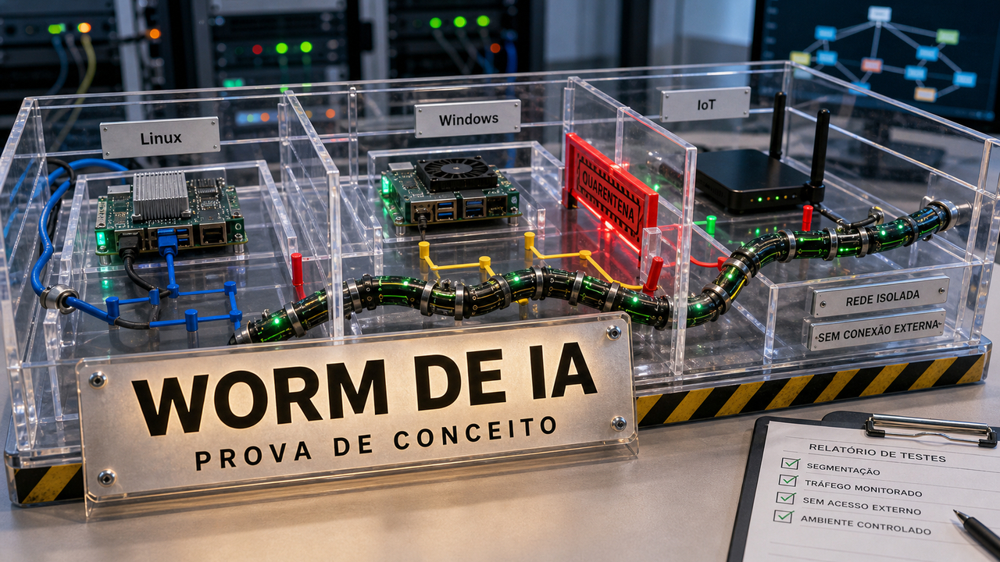

Tem notícia de IA que parece filme ruim, mas começa como pesquisa. Quando um agente observa o ambiente e escolhe o próximo passo, a defesa deixa de morar só no filtro do modelo. Ela volta para rede, identidade, permissão e runtime.

## Pesquisadores mostram worm de IA que adapta o ataque em laboratório

Um paper novo no arXiv, com contexto público da Universidade de Toronto, descreve uma prova de conceito de worm movido por agente de IA. O desenho pesa mais que o susto: em vez de carregar uma lista fixa de ataques, o sistema observa o alvo e monta uma estratégia para aquele ambiente.

Isso muda a conversa de defesa. Um worm tradicional costuma ter caminhos mais previsíveis. A proposta do paper trabalha com raciocínio por alvo, em uma rede de teste com Linux, Windows e dispositivos IoT. Os autores também dizem que máquinas comprometidas podem rodar modelos de pesos abertos localmente, sem depender de uma API comercial.

Essa parte merece café forte. Recusa de modelo, limite de chamada e política de provedor ajudam quando o atacante precisa passar por aquele provedor. Quando o modelo roda localmente, a fronteira volta para o sistema: segmentação de rede, correção de vulnerabilidades, menor privilégio, isolamento de credenciais, controle de saída e monitoramento de comportamento estranho em ferramentas locais.

As fontes usadas aqui não confirmam malware ativo no mundo real. É preprint e laboratório. Também não faz sentido transformar a notícia em receita de ataque. Para dev e ops, o recado é mais sóbrio: se a sua defesa depende de "o modelo não vai aceitar fazer isso", ela está incompleta. Máquina, rede e identidade ainda precisam segurar a bronca.

Fontes: [arXiv:2606.03811](https://arxiv.org/abs/2606.03811) e [University of Toronto News](https://www.utoronto.ca/news/u-t-researchers-demonstrate-ai-worm-could-target-any-online-device).

## Microsoft colocou um agente dentro do Terminal com suporte a ACP

A Microsoft lançou o Intelligent Terminal 0.1, um fork experimental e open source do Windows Terminal com integração nativa de agente. Ele não substitui o Windows Terminal principal. Por enquanto, é uma aplicação separada, versão 0.1 mesmo, com cara de laboratório de produto.

O gancho técnico é o Agent Client Protocol, ou ACP. O agente padrão é o GitHub Copilot CLI, mas a proposta é permitir agentes compatíveis com ACP. Com isso, o terminal deixa de ser só o lugar onde você cola erro para perguntar algo. Ele passa a ser uma superfície que já conhece sessão, comando, falha e contexto do shell.

O pacote inclui barra de status do agente, painel acoplado, detecção automática de erro, gerenciamento de sessões e tarefas de fundo abrindo novas abas. Também há um detalhe de transição: a Microsoft diz que o Terminal Chat no Canary foi depreciado.

O lado bom é óbvio para quem vive entre shell, repo, SSH e log. O lado delicado também. Quando o terminal passa contexto para um agente, a pergunta vira: qual contexto, com qual aprovação, em qual sessão, com que histórico e com qual limite entre "sugira" e "execute"? O ACP pode virar uma peça interessante de portabilidade, mas a maturidade ainda precisa aparecer no uso real, especialmente fora do caminho padrão com Copilot.

Fonte: [Windows Command Line / Microsoft DevBlogs](https://devblogs.microsoft.com/commandline/announcing-intelligent-terminal-version-0-1/).

## Netflix dividiu partições largas no Cassandra sem tratar isso como mágica

A Netflix publicou uma história de banco de dados útil porque ela começa no lugar certo: sintoma de produção. Em cargas de séries temporais usando Cassandra 4.x, algumas chaves válidas acumulavam partições grandes demais. Em português sem carinho excessivo: uma fatia do dado crescia tanto que ler aquilo virava uma tarefa lenta e cara.

O efeito aparecia em leituras de vários segundos, timeouts, pressão de garbage collection, CPU alta e filas de threads. Wide partition é um nome técnico elegante para uma coisa que muita gente já sentiu de outro jeito: uma chave, um cliente, um tenant ou uma dimensão qualquer virou concentrador de dor.

A primeira resposta da Netflix foi menos dramática. Ela ajustou as fatias futuras de tempo, mirou densidade na faixa de 2 MiB a 10 MiB e adicionou retornos parciais para não obrigar uma consulta problemática a derrubar tudo. Depois veio o desenho mais delicado: detectar partições largas no caminho de leitura, emitir eventos no Kafka e dividir partições imutáveis de forma assíncrona.

O pipeline usa planejamento, checkpoint, checksums, metadados e Bloom filters para rotear leituras. A Netflix atribui ao desenho uma queda da latência média de leitura dessas partições de segundos para poucas dezenas de milissegundos, com cauda por volta de 200 ms ou melhor.

Copiar isso como feature universal de Cassandra seria receita ruim. A história é uma arquitetura da Netflix para um problema da Netflix. Mas a ideia envelhece bem: primeiro reduza o estrago, depois migre com validação, rota de volta e métrica. Banco não perdoa heroísmo improvisado por muito tempo.

Fonte: [Netflix Tech Blog](https://netflixtechblog.com/dynamically-splitting-wide-partitions-in-cassandra-for-time-series-workloads-0eded064f456).

## Trellis usa RadixAttention para não recalcular o mesmo prompt

Quando um modelo local responde, uma parte do custo aparece antes da geração visível. Ele precisa processar o prompt de entrada, etapa chamada de prefill. Em chat e agente, esse prompt muitas vezes começa igual: instrução de sistema longa, template, ferramentas, regras e contexto que se repetem em várias sessões.

O post da Trellis fala desse desperdício. A implementação usa RadixAttention para reaproveitar prefixos comuns. A explicação curta é: uma árvore radix organiza pedaços compartilhados do prompt, e um KV cache paginado em blocos permite que sessões diferentes apontem para partes já calculadas, em vez de recomputar e realocar tudo de novo.

Esse tipo de assunto parece detalhe interno, mas vira dinheiro, memória e latência quando agente repete prompt comprido o dia inteiro. Na fonte, aparecem blocos de 32 tokens, cache paginado, contagem de referência e foco na fase de prefill.

A cautela também precisa aparecer. A Trellis diz que, no cenário demonstrado, os nós ficaram 30% a 40% mais rápidos e usaram menos memória. Só que o benchmark é sintético, com TinyLlama 1.1B Q4_0 em um Mac M1, e vem do próprio projeto. A fonte mostra outro movimento: inferência local entrando em engenharia de cache, memória e concorrência.

Fonte: [Trellis / UnfoldML](https://trellis.unfoldml.com/blog/radix-attention-intro).

## Destaques rápidos de hoje

- No dia 1, falamos de [Miasma no npm](/2026/miasma-npm-cisco-odysseus-seguranca-fora-prompt/) como pacote comprometido no caminho de instalação. A novidade agora é a análise mais completa da Microsoft, com a campanha contra `@redhat-cloud-services`, mais de 90 versões comprometidas segundo a empresa, e o lembrete chato de que provenance ajuda, mas não prova que o workflow confiável estava limpo. Revise lockfiles e builds, remova versões ruins, gire segredos alcançáveis e olhe tokens de CI. Fontes: [Microsoft Security Blog](https://www.microsoft.com/en-us/security/blog/2026/06/02/preinstall-persistence-inside-red-hat-npm-miasma-credential-stealing-campaign/) e [RedHatInsights no GitHub](https://github.com/RedHatInsights/javascript-clients/issues/492).

- Um pesquisador publicou uma divulgação sobre um caminho de roubo de token envolvendo `github.dev`, VS Code webviews e token OAuth do GitHub com acesso amplo a repositórios. A leitura defensiva é tratar editor no navegador como superfície privilegiada: cuidado com links não confiáveis de `github.dev`, limpe dados locais do site se estiver preocupado e acompanhe correção ou orientação oficial. Fontes: [Ammar Askar](https://blog.ammaraskar.com/github-token-stealing/) e [Risky Biz News](https://news.risky.biz/risky-bulletin-a-tenth-of-all-new-domains-last-year-were-malicious/).

- O Node.js vai mudar o calendário de releases a partir da linha 27. O anúncio oficial é de 10 de março, então trate como planejamento relembrado em junho: a regra nova é um major por ano, todo release virando LTS, canal alpha para teste antecipado, `27.0.0` em abril de 2027 e LTS em outubro de 2027. Para times JS e TS, isso mexe em Dockerfile, matriz de CI e teste de biblioteca antes da janela estável. Fontes: [Node.js](https://nodejs.org/en/blog/announcements/evolving-the-nodejs-release-schedule) e [InfoQ](https://www.infoq.com/news/2026/06/nodejs-release-changes/).

- O RealClawBench tenta aproximar benchmark de agente do trabalho feio em repositório. O paper transforma sessões reais do OpenClaw em 281 tarefas executáveis, com ambientes reconstruídos e verificadores determinísticos, e relata que o melhor sistema avaliado resolveu 65,8% delas. É preprint, não ranking eterno, mas ajuda a furar demo limpa demais. Fonte: [arXiv:2606.03889](https://arxiv.org/abs/2606.03889).

- A Microsoft mantém um Coreutils for Windows baseado em Rust, juntando `uutils/coreutils`, `findutils` e `grep` em um binário multi-call instalável via WinGet. O projeto está em preview e é honesto sobre atritos: conflito com comandos do PowerShell, CRLF, ACLs, exigência de PowerShell 7.4 e ausência de comandos presos demais a conceitos POSIX. Fonte: [microsoft/coreutils](https://github.com/microsoft/coreutils).

- O `pg_stat_statements` continua sendo uma das primeiras extensões que muita gente ativa no PostgreSQL, mas o post da boringSQL lembra que ele entrega contadores agregados, não uma fotografia completa do workload. Fique de olho em `pg_stat_statements_info.dealloc` e `stats_reset`, porque a tabela pode expulsar entradas; ela também não registra planos, distribuição p99, queries com falha ou visão cluster-wide por mágica. Fonte: [boringSQL / Radim Marek](https://postgr.es/p/9l6).

## Acompanhamento de tendências do dia

O padrão aparece no lugar da autorização: várias histórias perguntam quem deixa o software agir quando ele para de só responder. O worm de laboratório mexe com rede e identidade. O terminal da Microsoft mexe com shell e sessão. O RealClawBench pergunta se o agente consegue terminar tarefa real, em vez de parecer bonito no prompt.

Três preprints ajudam a dar nome para essa direção. O Agent libOS trata agente como `AgentProcess`, com identidade, linhagem, capacidades, checkpoints, fila de aprovação humana, eventos e auditoria. O PROVE usa servidores MCP com estado vivo, 343 ferramentas e recompensas programáticas para treinar uso de ferramenta em várias etapas. O RealClawBench, citado acima, puxa a avaliação para ambiente reconstruído e verificador determinístico.

Tudo isso ainda é paper, protótipo ou experimento. Mesmo assim, a pergunta que fica é bem de engenharia: o que o agente pode ler, executar, lembrar, retomar e provar? Se o seu agente já abre terminal, usa MCP, guarda memória ou roda perto do CI, vale desenhar essa autoridade antes da primeira emergência. Depois da primeira emergência, o desenho costuma sair com caligrafia pior.

Fontes de contexto: [Agent libOS](https://arxiv.org/abs/2606.03895), [PROVE](https://arxiv.org/abs/2606.03892), [RealClawBench](https://arxiv.org/abs/2606.03889), [arXiv:2606.03811](https://arxiv.org/abs/2606.03811) e [Microsoft DevBlogs](https://devblogs.microsoft.com/commandline/announcing-intelligent-terminal-version-0-1/).

> Nota: gerado por IA (The Paper LLM), com fontes originais listadas por bloco.

<!--
briefing_slug: 2026-06-03
source_mode: briefing
generated_at: 2026-06-03T05:45:45-03:00
source_urls:
  - https://arxiv.org/abs/2606.03811
  - https://www.utoronto.ca/news/u-t-researchers-demonstrate-ai-worm-could-target-any-online-device
  - https://devblogs.microsoft.com/commandline/announcing-intelligent-terminal-version-0-1/
  - https://netflixtechblog.com/dynamically-splitting-wide-partitions-in-cassandra-for-time-series-workloads-0eded064f456
  - https://trellis.unfoldml.com/blog/radix-attention-intro
  - https://www.microsoft.com/en-us/security/blog/2026/06/02/preinstall-persistence-inside-red-hat-npm-miasma-credential-stealing-campaign/
  - https://github.com/RedHatInsights/javascript-clients/issues/492
  - https://blog.ammaraskar.com/github-token-stealing/
  - https://news.risky.biz/risky-bulletin-a-tenth-of-all-new-domains-last-year-were-malicious/
  - https://nodejs.org/en/blog/announcements/evolving-the-nodejs-release-schedule
  - https://www.infoq.com/news/2026/06/nodejs-release-changes/
  - https://arxiv.org/abs/2606.03889
  - https://github.com/microsoft/coreutils
  - https://postgr.es/p/9l6
  - https://arxiv.org/abs/2606.03895
  - https://arxiv.org/abs/2606.03892
coverage:
  - ai-agents-adaptive-worms: main block; lab/preprint caveat, adaptive target reasoning, open-weight/local-model angle, Linux/Windows/IoT test network and practical defenses preserved without exploit mechanics.
  - microsoft-intelligent-terminal-acp: main block; Intelligent Terminal 0.1, experimental Windows Terminal fork, ACP support, default GitHub Copilot CLI, agent pane/error detection/session context and product caveat preserved.
  - netflix-cassandra-wide-partitions: main block; wide partition symptoms, TimeSeries on Cassandra 4.x, first-stage retuning/partial returns, dynamic splitting with Kafka/checksums/Bloom filters, latency metrics and immutable-partition caveat preserved.
  - trellis-radixattention-prefix-cache: main block; prefill explained before RadixAttention, common system-prompt prefixes, radix tree, block-paged KV cache, 32-token blocks, Trellis benchmark and caveat preserved.
  - miasma-microsoft-followup: quick hit; continuity link to June 1 post used, Microsoft follow-up framed as update, provenance caveat and short mitigation list preserved without IOCs.
  - vscode-github-token-stealing-webview: quick hit; defensive github.dev/VS Code webview/OAuth-token framing preserved without PoC steps.
  - nodejs-annual-release-schedule: quick hit; March 10 freshness caveat, Node.js 27 schedule, alpha channel, annual major and LTS planning consequences preserved.
  - realclawbench-agent-evals: quick hit; real-session benchmark, 281 executable tasks, deterministic scorers, 65.8% result and preprint caveat preserved.
  - microsoft-coreutils-windows-rust: quick hit; uutils/findutils/grep, WinGet, preview status and Windows caveats preserved.
  - pg-stat-statements-limits: quick hit; dealloc/stats_reset checks and blind spots preserved.
  - agent-runtime-evals-trend: trend section; Agent libOS, PROVE, RealClawBench, AI worm and Intelligent Terminal synthesized as runtime/capability/evaluation signal with prototype caveat.
omitted_briefing_items:
  - Microsoft MAI-Thinking-1 and MAI models: omitted; vendor launch and benchmark claims were lower practical value than Intelligent Terminal and runtime/eval stories.
  - Risky Bulletin one tenth of new domains malicious: context only; useful security statistic but lower developer actionability than selected items.
  - NeuroArmor jailbreak defense: omitted; crowded out by stronger runtime/eval trend sources.
  - MiniMax M3: omitted; covered on 2026-06-01 with no new weights or technical report update verified.
  - AI-SD, LLM black-box essay, synthetic conversations for ASR, threat modeling, rsync and outrage, software reliability without proof, lone lisp heap, search-engine opinion, Hermes Desktop, OmniVoice: omitted as opinion, evergreen, off-core or requiring extra validation.
  - Golang code review notes II: omitted because original source chain was not fully verified from the pointer.
  - Holo 3.1 and local-model follow-ups: omitted because claims need hands-on validation and MiniMax/local-model topic was recently saturated.
  - Stop MITM on first SSH connection: omitted because it was already covered as a main story on 2026-06-01.
  - Copilot model cost analysis and HeyCyan Glasses vulnerabilities: omitted because pricing/vulnerability claims required separate verification.
  - PostgreSQL createrole_self_grant: omitted because pg_stat_statements was the stronger database quick hit.
  - Use NVIDIA VRAM as Linux swap and datasette-agent-micropython: omitted as useful but smaller signals on a dense day.
-->
